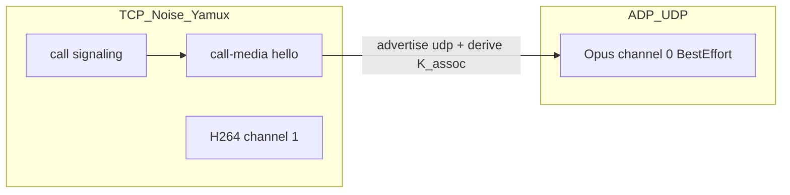

# ADP first slice — Opus over ADP (same branch)

## Locked scope

- **Branch:** continue [`cursor/adp-foundation-42e3`](pp-browser) (no new branch).
- **Consumer:** 1:1 **Opus audio only** (`channel_id == 0`) over ADP **BestEffort**.
- **Stay on TCP:** call signaling, call-media hello/ack, media key/epoch, H264 (`channel == 1`), SoftMigrate / `media_relay`, circuit.
- **Not in this slice:** ADP as libp2p transport, hole punch, dual-NAT peer↔peer, video-over-ADP, replacing Yamux, pp-ledger.

**Why Opus-only:** ADP v1 max payload is **1200 B**; Opus frames fit; H264 AUs often do not without fragmentation.

## Integration seam

Reuse SoftMigrate’s send-swap point in [`CallLibp2pMediaBridge.cpp`](pp-browser/src/feature/messaging/CallLibp2pMediaBridge.cpp): today `StartSfu` sends via `direct_.SendMedia`. Add a third sink for **encrypted Opus bodies** only.

Keep encrypt/decrypt in [`CallMediaFrameCrypto`](pp-browser/src/base/p2p/CallMediaFrameCrypto.h) unchanged — ADP payload = same ciphertext bytes that would have been length-prefixed on the stream (opaque L2).

## Design locks (new ADRs under `projects/adp/`)

- **A008 — First consumer = Opus BestEffort.** Video + control remain TCP.
- **A009 — `K_assoc` from call media key.** HKDF-SHA256 via existing [`SessionKeyDeriver`](pp-browser/src/base/crypto/SessionKeyDeriver.h) / sodium KDF: info `pp-adp-call-media-v1`, context includes `call_id` + epoch; 32-byte output. Never send `K_assoc` on the wire.
- **A010 — Hello extension (TCP).** Additive JSON fields on call-media `hello` / `hello_ack` (ignore if absent = no ADP):
  - `adp_v`: `1`
  - `adp_port`: local UDP listen port
  - `adp_assoc`: 16-byte id as hex (deterministic from call_id + ordered peer ids, or offerer-minted — implement **offerer mints, answerer echoes**)
- **A011 — Fallback.** If peer omits ADP fields, bind/UDP fails, or `!LooksAlive` after grace: Opus stays on existing `SendMedia` stream path. No call failure solely from ADP.

## Code shape

| Piece | Location |
|-------|----------|
| `CallMediaAdpPath` | [`src/base/p2p/CallMediaAdpPath.*`](pp-browser/src/base/p2p/) — owns/uses shared `OsUdpDatagramIo` + `Endpoint` + one `Connection`; `SendOpusCiphertext` / `OnOpusCiphertext`; `Pump`/`Tick` on host tick |
| Hello fields | [`CallMediaSession.cpp`](pp-browser/src/base/p2p/CallMediaSession.cpp) encode/decode; plumb into connect params |
| Bridge wiring | [`CallLibp2pMediaBridge.cpp`](pp-browser/src/feature/messaging/CallLibp2pMediaBridge.cpp) — if ADP ready and `pkt.channel_id==0`, send via ADP; else `direct_.SendMedia`. Inbound ADP → same `on_media` as stream |
| Config flag | e.g. `calls.adp_opus: true` default **off** until dogfood; read near call config |
| Docs | Update [`projects/adp/CURRENT_STATE.md`](pp-browser/projects/adp/CURRENT_STATE.md), PHASES; short note in [`docs/architecture/CALLS.md`](pp-browser/docs/architecture/CALLS.md) |

**Host lifecycle:** bind one UDP socket per process (prefer port `0` ephemeral; advertise bound port in hello). Drive `Pump`/`Tick` from existing libp2p/host periodic tick (same pattern as other p2p services) — still **no Asio inside `pp_base_adp`**.

**NAT:** after hello, first Opus packet from client teaches path (`SetPeerEndpoint` / observed addr). Slice targets **LAN / one-public-side** dogfood; dual-NAT without punch is expected to fall back to TCP.

## Implementation steps

1. ADRs A008–A011 + CURRENT_STATE “slice 1” section.
2. `CallMediaAdpPath` + HKDF helper + unit tests (`MemoryDatagramIo`: open assoc, send/recv ciphertext, path migrate, fallback when peer has no ADP).
3. Hello JSON fields + wire tests / session unit coverage for negotiate vs ignore.
4. Bridge: Opus→ADP when negotiated; video unchanged; fallback path.
5. Config flag + dogfood notes (LAN two devices, wipe not required).
6. Commit/push on same branch; update PR description.

## Test bar

- Unit: HKDF stability; hello negotiate/omit; MemoryDatagramIo Opus round-trip; TCP fallback when ADP disabled.
- No flaky wall-clock sleeps (virtual clock for ADP rtx unused for BestEffort).
- Manual dogfood checklist in CURRENT_STATE (optional): two LAN peers, `calls.adp_opus=true`, confirm audio; disable flag → TCP-only audio.

## Explicit non-goals

Hole punch, MeshHost generic ADP transport, video fragmentation, replacing `DuplexFrameSession`, media_relay-over-ADP.
