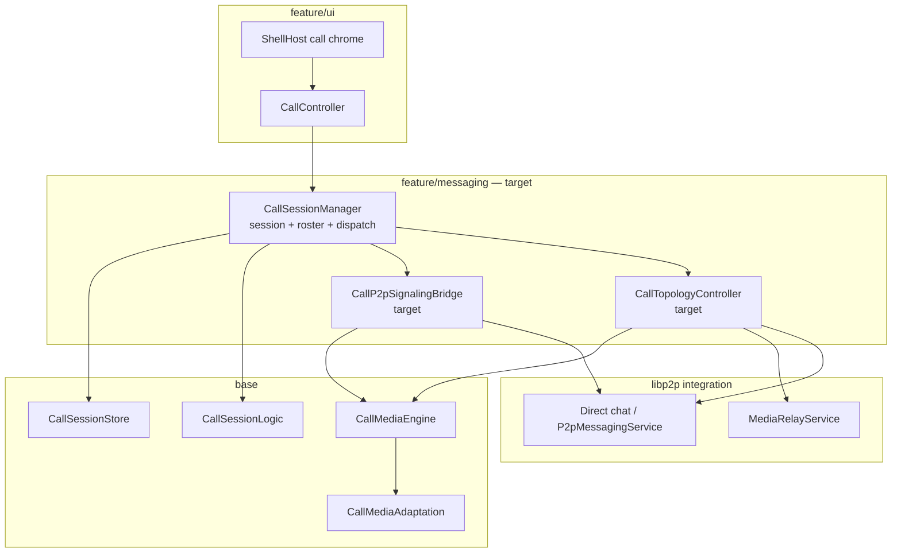

# Call domain architecture

**Tier:** architecture

How voice/video calls are shaped in the codebase: planes, ownership, topology, and the target split of today’s monolithic `CallSessionManager`.

**Product ADRs / phases:** [`projects/p2p-av-calls/`](../../projects/p2p-av-calls/) (DESIGN, DECISIONS V014–V024, CURRENT_STATE).  
**Wire controls:** [`contracts/WIRE_SCHEMAS.md`](../contracts/WIRE_SCHEMAS.md) (call system `control_type`s).  
**Messaging carrier:** [`P2P_MESSAGING.md`](P2P_MESSAGING.md).  
**SFU / mesh hop:** [`projects/p2p-mesh/`](../../projects/p2p-mesh/) (`media_relay`).

This doc is the **code-architecture** map. Normative product rules stay in project DECISIONS; promote wire/disk shapes to `contracts/` when they harden.

---

## Two planes

| Plane | Carrier | Job |
|-------|---------|-----|
| **Signaling** | Direct E2E system `ChatPayload` controls (`call_invite`, `call_accept`, `call_sdp`, `call_ice`, `call_sfu_attach`, …) | Roster, invite/accept/leave, SDP/ICE trickle, media-key epochs, SFU attach hints |
| **Media** | libdatachannel PeerConnection (1:1) or blind `media_relay` (N≥3) | Opus + H264; capture/playback via SDL; platform HW encode/decode |

Signaling rides the same P2P/messaging stack as chat. Media never goes through the chat relay as RTP; the SFU is a **blind forwarder** (no call media keys).



---

## Topology rules (V021)

| Joined N | Media path | Notes |
|----------|------------|-------|
| 1 (ringing / solo) | No media PC yet | Invite outstanding |
| **2** | **1:1 P2P** PeerConnection | Host ICE (+ STUN); no SFU required |
| **≥3** | **SFU** via `media_relay` hop | Soft-migrate same `call_id`; coordinator picks hop |

- Soft-migrate on 2→3: keep session/roster/key epoch; tear down P2P after SFU attach.
- Mid-call guest without a hop: refuse or eject — do **not** leave invitee on Connecting while existing peers stay on P2P.
- ICE-fail → SFU auto-recovery is a **group** path (N≥3). Plain 1:1 must not enter SFU attach-wait or “group needs media_relay” toasts.
- Stale `sfu_hint` on a 1:1 invite must be ignored until N≥3.

`CallMediaTopology` (`base/media/CallMediaAdaptation.*`) encodes the N thresholds; **policy application** should live in one topology owner (target below), not scattered Accept / ICE / UI refresh branches.

---

## Layer ownership

Respect [`SRC_LAYOUT.md`](SRC_LAYOUT.md): `app → feature → base → common`.

| Concern | Layer | Today | Target |
|---------|-------|-------|--------|
| Session rows, invites, participants | `base/messaging` | `CallSessionStore`, `CallTypes`, `CallSessionLogic` | Unchanged |
| Control encode/decode | `base/messaging` | `CallControlCodec` | Unchanged |
| PC / Opus / H264 / SDL / pending remote SDP | `base/media` | `CallMediaEngine` | Keep; pending-buffer stays here |
| Adaptation policy | `base/media` | `CallMediaAdaptation`, `CallMediaTopology` | Unchanged |
| Session lifecycle + inbound dispatch | `feature/messaging` | **`CallSessionManager` (monolith)** | Thin orchestrator |
| P2P offer/answer + SDP/ICE send | `feature/messaging` | Inside `CallSessionManager` | **`CallP2pSignalingBridge`** |
| Soft-migrate / attach-wait / hop pick | `feature/messaging` | Inside `CallSessionManager` | **`CallTopologyController`** |
| Media keys wrap/unwrap | `feature/messaging` | `CallMediaKeyStore` | Unchanged |
| Ring / in-call chrome | `feature/ui` | `CallController`, `CallChromeSync` | Unchanged; talks only to session façade |
| Blind SFU protocol | `libp2p/integration` | `MediaRelayService` | Unchanged |

UI must not choose P2P vs SFU. It observes session + `CallMediaEngine` connection state and calls session APIs (`StartCall`, `AcceptInvite`, `LeaveCall`, …).

---

## Major systems (relationships)

### MessagingHub
Owns `CallSessionManager`, wires `MediaRelayDeps` (relay service, peer sessions, bootstrap seeds), and routes inbound call controls via `RelayReceivePipeline` → `ApplyInboundControl`.

### CallSessionManager (façade)
**Should own:** create/end session, invite/accept/decline/leave, roster fan-out, media-key rotate-on-leave, orphan cleanup after restart, inbound control **dispatch**.

**Should not own long-term:** PeerConnection lifecycle details, SFU quote/attach loops, or duplicated “if N≥3 …” trees in every accept path.

### CallMediaEngine
Single media backend for the process:

- **P2P mode:** libdatachannel + trickle ICE; buffers early `call_sdp` / `call_ice` until `Start()` (fast offerer / slow answerer race — e.g. Linux dial → Mac).
- **SFU mode:** no PC; encode → `SfuSendFn` / inbound `OnSfuPacket`.
- Capture/playback and camera stay off the libp2p IO thread (mic TCC can block).

### CallController / shell
Maps ring + in-call chrome to session APIs; polls attach-wait only as a UI tick hook into the topology owner; must not invent topology.

### media_relay (mesh)
Desktop/org Node capability. Coordinator ranks contact∪seed hops, quotes, attaches, fans out `call_sfu_attach`. Mobile never hosts.

---

## Target internal design

Extract without changing the external façade (`MessagingHub::Calls()`, `CallController`).

### 1. `CallTopologyController` (feature)
Responsibilities:

- `ShouldUseSfu(joined_count)` / soft-migrate triggers
- `MaybeSoftMigrateToSfu`, `AttachLocalToSfu`, hop ranking
- Attach-wait deadline + timeout leave (group only)
- Eject joiner when migrate fails but 1:1 P2P remains
- ICE `failed` recovery **only** when N≥3

State it owns: `sfu_attached_`, attach-wait call id/deadline, `awaiting_sfu_recovery_` (or equivalent).  
Session manager asks: “joined count is now N — what media action?”

### 2. `CallP2pSignalingBridge` (feature)
Responsibilities:

- `StartMediaAsOfferer` / `Answerer` + `Schedule*`
- Bind engine callbacks → encode `call_sdp` / `call_ice` → direct send (deferred off engine lock)
- Offerer local-SDP re-send for answerer race
- Stop media when session leaves P2P path

Does not decide SFU. Topology calls `Stop` / `StartSfu` via session or engine APIs.

### 3. `CallSessionManager` (shrunk)
Keeps store updates + `ApplyInboundControl` switch. Each arm: decode → upsert roster/session → **one** call into topology or P2P bridge.

### 4. Inbound control flow (target)

```text
ApplyInboundControl(type)
  → update CallSessionStore / keys as needed
  → switch type:
       CallAccept / participant join  → Topology.OnRosterChanged(n)
       CallSdp / CallIce              → P2pBridge.OnRemoteSignal(...)
       CallSfuAttach                  → Topology.AttachLocal(...)
       CallLeave / CallEnded          → Topology.Clear + P2pBridge.Stop + EndCallLocal
```

---

## Critical races (keep documented next to code)

These are architectural, not one-off hacks:

| Race | Direction / symptom | Mitigation (home) |
|------|---------------------|-------------------|
| Offer before answerer `Start` | Fast offerer (often Linux) → Mac Connecting… | Buffer remote SDP/ICE in `CallMediaEngine`; flush on `Start`; do not clear buffer on PC rebuild except `Stop` |
| Offer lost (no retransmit) | Same | Offerer re-send once; answerer ignores duplicate offer |
| Signaling under engine mutex | Answer path during flush | Defer `call_sdp` / `call_ice` send to UI task |
| 1:1 enters SFU wait | “group needs media_relay” on P2P call | Topology: SFU paths only for N≥3; ignore stale `sfu_hint` on 1:1 |
| macOS Local Network | Android↔Mac LAN ICE | Packaged `NSLocalNetworkUsageDescription` ([PLATFORMS.md](PLATFORMS.md)) |

---

## Extraction sequence (implementation)

Prefer behavior-preserving moves, tests first where modes already burned dogfood.

1. **PR: Topology extract** — move soft-migrate / attach / wait / eject / hop helpers behind `CallTopologyController`; session manager delegates.
2. **PR: P2P bridge extract** — move schedule/bind/resend/stop-media.
3. **PR: Dispatch cleanup** — thin `ApplyInboundControl`; no duplicated N≥3 branches.
4. **Tests** — stale `sfu_hint` + N=2; buffered offer before answerer Start; duplicate offer; N=3 no hop eject; attach-wait must not kill active 1:1 P2P.

Do **not** combine engine pending-buffer rewrites with topology moves in one PR.

---

## File map (today → target)

| Path | Role |
|------|------|
| `src/feature/messaging/CallSessionManager.*` | Façade (shrink over time) |
| `src/feature/messaging/CallP2pSignalingBridge.*` | **Target** — P2P media signaling |
| `src/feature/messaging/CallTopologyController.*` | **Target** — SFU / soft-migrate |
| `src/feature/messaging/CallMediaKeyStore.*` | Epoch key wrap |
| `src/feature/ui/CallController.*` | Ring + in-call UI |
| `src/base/media/CallMediaEngine.*` | PC + SFU media backend |
| `src/base/media/CallMediaAdaptation.*` | V024 + `CallMediaTopology` |
| `src/base/messaging/CallSessionStore.*` | Persistence |
| `src/base/messaging/CallSessionLogic.*` | Pure transitions / expiry / coordinator pick |
| `src/base/messaging/CallControlCodec.*` | Wire JSON for call controls |
| `src/libp2p/integration/host/MediaRelayService.*` | Blind SFU |

---

## Related docs

| Doc | Use when |
|-----|----------|
| [RUNTIME_COMPOSITION.md](RUNTIME_COMPOSITION.md) | How Hub / shell / threads compose at runtime |
| [P2P_MESSAGING.md](P2P_MESSAGING.md) | Direct/group chat carrier under signaling |
| [PLATFORMS.md](PLATFORMS.md) | Mic/camera/Local Network per OS |
| [projects/p2p-av-calls/DESIGN.md](../../projects/p2p-av-calls/DESIGN.md) | Product design + entity model |
| [projects/p2p-av-calls/DECISIONS.md](../../projects/p2p-av-calls/DECISIONS.md) | V014–V024 ADRs |
