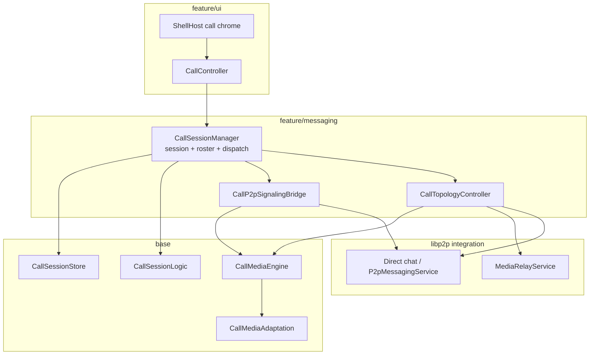
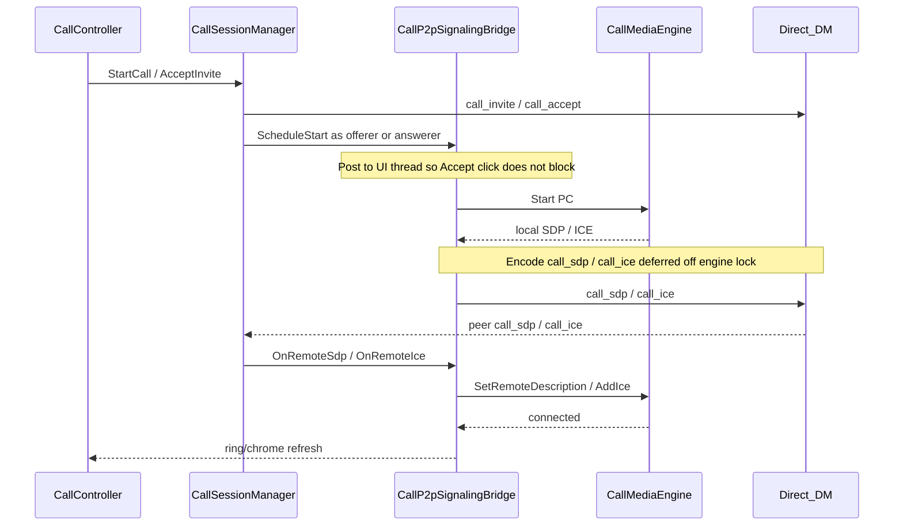
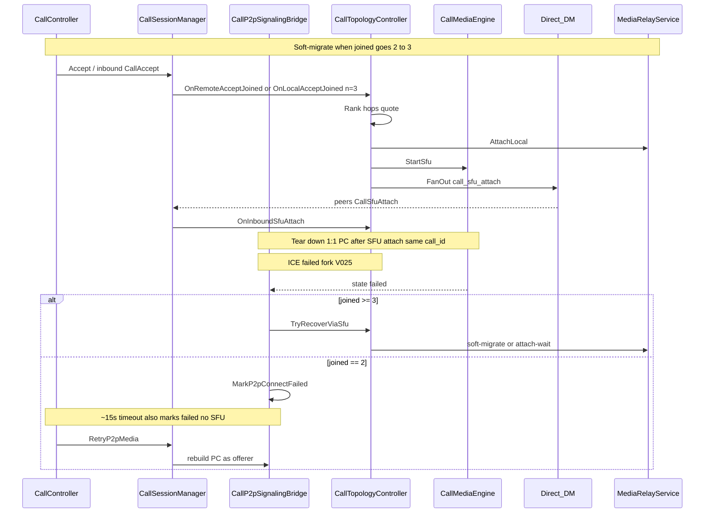

# Call domain architecture

**Tier:** architecture

**Mature code architecture** for voice/video calls — planes, layer ownership, topology rules that the code must honor, and the split of session façade vs `CallTopologyController` / `CallP2pSignalingBridge`. Change rarely; update when structure changes.

**Open delivery work** (phases, dogfood, new ADRs): [`projects/p2p-av-calls/`](../../projects/p2p-av-calls/).  
**Product ADRs:** [DECISIONS.md](../../projects/p2p-av-calls/DECISIONS.md) (V014–V025).  
**Wire controls:** [`contracts/WIRE_SCHEMAS.md`](../contracts/WIRE_SCHEMAS.md) (call system `control_type`s).  
**Messaging carrier:** [`P2P_MESSAGING.md`](P2P_MESSAGING.md).  
**SFU / mesh hop:** [`projects/p2p-mesh/`](../../projects/p2p-mesh/) (`media_relay`).

Do **not** restate the full product decision table here — link DECISIONS. Promote wire/disk shapes to `contracts/` when they harden. Dogfood “what works this week” lives only in project [CURRENT_STATE.md](../../projects/p2p-av-calls/CURRENT_STATE.md).

---

## Two planes

| Plane | Carrier | Job |
|-------|---------|-----|
| **Signaling** | Direct E2E system `ChatPayload` controls (`call_invite`, `call_accept`, `call_sdp`, `call_ice`, `call_sfu_attach`, …) | Roster, invite/accept/leave, SDP/ICE trickle, media-key epochs, SFU attach hints |
| **Media** | libdatachannel PeerConnection (1:1) or blind `media_relay` (N≥3) | Opus + H264; capture/playback via SDL; platform HW encode/decode |

Signaling rides the same P2P/messaging stack as chat. Media never goes through the chat relay as RTP; the SFU is a **blind forwarder** (no call media keys).

**Invite TTL / cancel:** default ring TTL is 60s. Inbox-delivered invites use relay `created_at` + poll `server_time` (age = server_time − created_at); drop when age exceeds TTL + small slack. Without those samples (direct delivery), wire `expires_at` may be re-armed only if still within skew slack of local now — long-backlogged invites are not re-armed. Cancel/end fans out `call_ended` to Joined **and** Ringing/Invited peers so late inbox delivery can clear the ring.



---

## Topology rules (V021 + V025)

| Joined N | Media path | Notes |
|----------|------------|-------|
| 1 (ringing / solo) | No media PC yet | Invite outstanding |
| **2** | **1:1 P2P** PeerConnection | Host ICE (+ STUN); no SFU; fail → timeout + Retry (V025) |
| **≥3** | **SFU** via `media_relay` hop | Soft-migrate same `call_id`; sticky initiator picks hop (re-pick: epoch coordinator) |

- Soft-migrate on 2→3: keep session/roster/key epoch; tear down P2P after SFU attach.
- Mid-call guest without a hop: refuse or eject — do **not** leave invitee on Connecting while existing peers stay on P2P.
- ICE-fail → SFU auto-recovery is a **group** path (N≥3). Plain 1:1 must not enter SFU attach-wait or “group needs media_relay” toasts (V025).
- Stale `sfu_hint` on a 1:1 invite must be ignored until N≥3.

`CallMediaTopology` (`base/media/CallMediaAdaptation.*`) encodes the N thresholds (`ShouldUseMediaRelay` = N≥3 only); **policy application** should live in one topology owner (target below), not scattered Accept / ICE / UI refresh branches.

---

## Lifecycle sequences

Module timing across the two planes. Product invite/roster rules stay in [DESIGN.md](../../projects/p2p-av-calls/DESIGN.md). Race mitigations summarized again under [Critical races](#critical-races-keep-documented-next-to-code).

### 1:1 happy path (N=2)



### Offer before answerer Start (fast offerer race)

Typical Linux dial → Mac: early `call_sdp` must not be dropped. See Critical races “Offer before answerer Start” / “Offer lost”.

```mermaid
sequenceDiagram
  participant Off as Offerer_P2P_Eng
  participant OffDM as Offerer_DM
  participant AnsDM as Answerer_DM
  participant AnsP2P as Answerer_P2pBridge
  participant AnsEng as Answerer_Eng

  Off->>Off: Start offerer
  Off-->>OffDM: call_sdp offer plus ICE
  OffDM->>AnsDM: direct E2E
  AnsDM->>AnsP2P: OnRemoteSdp / OnRemoteIce
  AnsP2P->>AnsEng: buffer remote SDP/ICE
  Note over AnsEng: No Start yet — buffer survives PC rebuild until Stop
  AnsP2P->>AnsEng: Start answerer
  AnsEng->>AnsEng: flush buffer apply offer
  Off->>OffDM: re-send local offer once
  OffDM->>AnsDM: duplicate offer
  AnsEng->>AnsEng: ignore duplicate once applied
  AnsEng-->>Off: answer plus ICE then connected
```

### Soft-migrate 2→3 and ICE-fail fork (V025)



---

## Layer ownership

Respect [`SRC_LAYOUT.md`](SRC_LAYOUT.md): `app → feature → base → common`.

| Concern | Layer | Today | Target |
|---------|-------|-------|--------|
| Session rows, invites, participants | `base/messaging` | `CallSessionStore`, `CallTypes`, `CallSessionLogic` | Unchanged |
| Control encode/decode | `base/messaging` | `CallControlCodec` | Unchanged |
| PC / Opus / H264 / SDL / pending remote SDP | `base/media` | `CallMediaEngine` | Keep; pending-buffer stays here |
| Adaptation policy | `base/media` | `CallMediaAdaptation`, `CallMediaTopology` | Unchanged |
| Session lifecycle + inbound dispatch | `feature/messaging` | **`CallSessionManager`** | Thin orchestrator |
| P2P offer/answer + SDP/ICE send | `feature/messaging` | **`CallP2pSignalingBridge`** | Unchanged |
| Soft-migrate / attach-wait / hop pick | `feature/messaging` | **`CallTopologyController`** | Unchanged |
| Media keys wrap/unwrap | `feature/messaging` | `CallMediaKeyStore` | Unchanged |
| Ring / in-call chrome | `feature/ui` | `CallController`, `CallChromeSync` | Unchanged; talks only to session façade |
| Blind SFU protocol | `libp2p/integration` | `MediaRelayService` | Unchanged |

UI must not choose P2P vs SFU. It observes session + `CallMediaEngine` connection state and calls session APIs (`StartCall`, `AcceptInvite`, `LeaveCall`, …).

---

## Major systems (relationships)

### MessagingHub
Owns `CallSessionManager`, wires `MediaRelayDeps` (relay service, peer sessions, bootstrap seeds), and routes inbound call controls via `RelayReceivePipeline` → `ApplyInboundControl`.

### CallSessionManager (façade)
**Should own:** create/end session, invite/accept/decline/leave, roster fan-out, media-key rotate-on-leave, orphan cleanup after restart, inbound control **dispatch**.

**Should not own long-term:** PeerConnection lifecycle details, SFU quote/attach loops, or duplicated “if N≥3 …” trees in every accept path.

### CallMediaEngine
Single media backend for the process:

- **P2P mode:** libdatachannel + trickle ICE; buffers early `call_sdp` / `call_ice` until `Start()` (fast offerer / slow answerer race — e.g. Linux dial → Mac).
- **SFU mode:** no PC; encode → `SfuSendFn` / inbound `OnSfuPacket`.
- Capture/playback and camera stay off the libp2p IO thread (mic TCC can block).

### CallController / shell
Maps ring + in-call chrome to session APIs; polls attach-wait only as a UI tick hook into the topology owner; must not invent topology.

### media_relay (mesh)
Desktop/org Node capability. Blind hop ranks contact∪seed hops, quotes, attaches, fans out `call_sfu_attach`. Mobile never hosts.

**Who picks (V021 / V022):** first soft-migrate is the sticky **call initiator** (earliest `joined_at` = session payer). Mid-call invite: `CallAccept` reaches only the inviter (WaitForAttach); **CallRoster** drives `JoinedCountObserved` so the initiator SoftMigrates. Joiners without hint WaitForAttach. ICE re-pick is epoch coordinator only. Fan-out clears `quote_id` (peers `RequestQuote` locally).

---

## Target internal design

Extract without changing the external façade (`MessagingHub::Calls()`, `CallController`).

### Pure units (`base/messaging`, gtest — no libp2p)

| Unit | Job |
|------|-----|
| `SoftMigrateLogic` | Who-picks: initiator first hop (V021/V022); `JoinedCountObserved` / `RemoteAcceptObserved`; ICE → coordinator |
| `SfuAttachWaitLogic` | Attach-wait poll; **no TimeoutLeave while migrate in flight** |
| `SfuAttachFanout` | Fan-out detail with empty `quote_id`; publisher stream id |
| `MeshHopPolicy` | Contact∪seed rank; Prefer contacts; `ExcludeSelfHop` |

### 1. `CallTopologyController` (feature adapter)
Responsibilities:

- Apply pure decisions; `MaybeSoftMigrateToSfu(call_id, trigger)`, `AttachLocalToSfu`, hop ranking via `IMediaRelayClient` / `IDialRegistry`
- Attach-wait deadline + timeout leave (group only) via `SfuAttachWaitLogic`
- Eject joiner when migrate fails but 1:1 P2P remains
- ICE `failed` recovery **only** when N≥3

State it owns: `sfu_attached_`, attach-wait call id/deadline, `awaiting_sfu_recovery_`, `soft_migrate_in_flight_`.  
Session manager asks: “joined count is now N — what media action?”

### 2. `CallP2pSignalingBridge` (feature)
Responsibilities:

- `StartMediaAsOfferer` / `Answerer` + `Schedule*`
- Bind engine callbacks → encode `call_sdp` / `call_ice` → direct send (deferred off engine lock)
- Offerer local-SDP re-send for answerer race
- Stop media when session leaves P2P path

Does not decide SFU. Topology calls `Stop` / `StartSfu` via session or engine APIs.

### 3. `CallSessionManager` (shrunk)
Keeps store updates + `ApplyInboundControl` switch. Each arm: decode → upsert roster/session → **one** call into topology or P2P bridge.

### 4. Inbound control flow (target)

```text
ApplyInboundControl(type)
  → update CallSessionStore / keys as needed
  → switch type:
       CallAccept / participant join  → Topology.OnRosterChanged(n)
       CallSdp / CallIce              → P2pBridge.OnRemoteSignal(...)
       CallSfuAttach                  → Topology.AttachLocal(...)
       CallLeave / CallEnded          → Topology.Clear + P2pBridge.Stop + EndCallLocal
```

---

## Critical races (keep documented next to code)

These are architectural, not one-off hacks. Timelines: [Offer before answerer Start](#offer-before-answerer-start-fast-offerer-race), [ICE-fail fork](#soft-migrate-23-and-ice-fail-fork-v025).

| Race | Direction / symptom | Mitigation (home) |
|------|---------------------|-------------------|
| Offer before answerer `Start` | Fast offerer (often Linux) → Mac Connecting… | Buffer remote SDP/ICE in `CallMediaEngine`; flush on `Start`; do not clear buffer on PC rebuild except `Stop` |
| Offer lost (no retransmit) | Same | Offerer re-send once; answerer ignores duplicate offer |
| Signaling under engine mutex | Answer path during flush | Defer `call_sdp` / `call_ice` send to UI task |
| 1:1 enters SFU wait | “group needs media_relay” on P2P call | Topology: SFU paths only for N≥3; ignore stale `sfu_hint` on 1:1 (V025) |
| 1:1 ICE fail / hang | Connecting forever or false leave | Mark connect-failed + ~15s timeout; UI Retry rebuilds offerer; tip via `PlatformUserHints` |
| Mid-call invite from 2nd peer | Chrome gone after 45s | Initiator SoftMigrates on CallRoster (`JoinedCountObserved`); inviter WaitForAttach; attach-wait does not leave while migrate in flight |
| macOS Local Network | Android↔Mac LAN ICE | Packaged `NSLocalNetworkUsageDescription` ([PLATFORMS.md](PLATFORMS.md)); on 1:1 connect fail UI tips Local Network |
| Dogfood from Cursor terminal | LAN ICE can fail while normal terminal works | Prefer OS terminal or packaged `.app` for media dogfood |

---

## Extraction sequence

Landed (behavior-preserving + who-picks fix):

1. **Topology extract** — `CallTopologyController` owns soft-migrate / attach / wait / eject / hop helpers.
2. **P2P bridge extract** — `CallP2pSignalingBridge` owns schedule/bind/resend/stop-media + 1:1 connect-fail / Retry.
3. **Dispatch cleanup** — thin `ApplyInboundControl` arms call topology or P2P bridge.
4. **Pure who-picks / wait / fan-out** — `SoftMigrateLogic`, `SfuAttachWaitLogic`, `SfuAttachFanout` + fakes (`IMediaRelayClient` / `IDialRegistry`).
5. **Tests** — `CallMediaTopology` N≥3-only; SoftMigrate / wait / fan-out / topology controller unit tests; `media_relay_service_test` loopback remains integration.

Do **not** combine engine pending-buffer rewrites with topology moves in one PR.

---

## File map

| Path | Role |
|------|------|
| `src/feature/messaging/CallSessionManager.*` | Façade — session + dispatch |
| `src/feature/messaging/CallP2pSignalingBridge.*` | P2P media signaling + 1:1 connect-fail / Retry |
| `src/feature/messaging/CallTopologyController.*` | SFU / soft-migrate / attach-wait adapter |
| `src/feature/messaging/CallTopologyRelayDeps.h` | `IMediaRelayClient` / `IDialRegistry` + real wrappers |
| `src/feature/messaging/CallMediaKeyStore.*` | Epoch key wrap |
| `src/feature/ui/CallController.*` | Ring + in-call UI |
| `src/base/media/CallMediaEngine.*` | PC + SFU media backend |
| `src/base/media/CallMediaAdaptation.*` | V024 + `CallMediaTopology` |
| `src/base/messaging/CallSessionStore.*` | Persistence |
| `src/base/messaging/CallSessionLogic.*` | Pure transitions / expiry / coordinator pick |
| `src/base/messaging/SoftMigrateLogic.*` | Pure who-picks |
| `src/base/messaging/SfuAttachWaitLogic.*` | Pure attach-wait poll |
| `src/base/messaging/SfuAttachFanout.*` | Fan-out shape + publisher stream id |
| `src/base/messaging/CallControlCodec.*` | Wire JSON for call controls |
| `src/base/people/MeshHopPolicy.*` | Contact∪seed hop rank / ExcludeSelfHop |
| `src/libp2p/integration/host/MediaRelayService.*` | Blind SFU |

---

## Related docs

| Doc | Use when |
|-----|----------|
| [RUNTIME_COMPOSITION.md](RUNTIME_COMPOSITION.md) | How Hub / shell / threads compose at runtime |
| [P2P_MESSAGING.md](P2P_MESSAGING.md) | Direct/group chat carrier under signaling |
| [PLATFORMS.md](PLATFORMS.md) | Mic/camera/Local Network per OS |
| [projects/p2p-av-calls/DESIGN.md](../../projects/p2p-av-calls/DESIGN.md) | Product design + entity model |
| [projects/p2p-av-calls/DECISIONS.md](../../projects/p2p-av-calls/DECISIONS.md) | V014–V025 ADRs |
