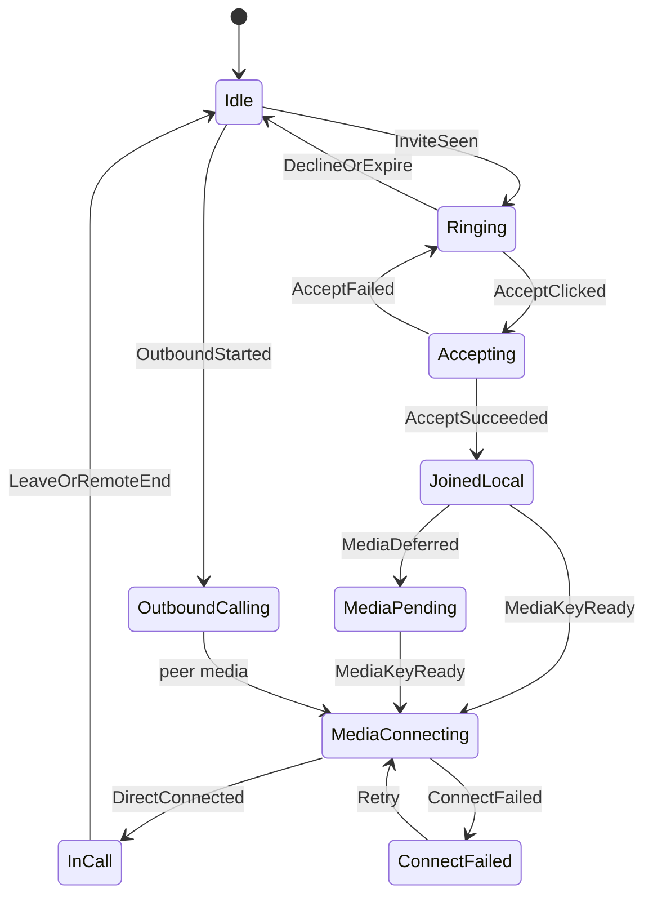
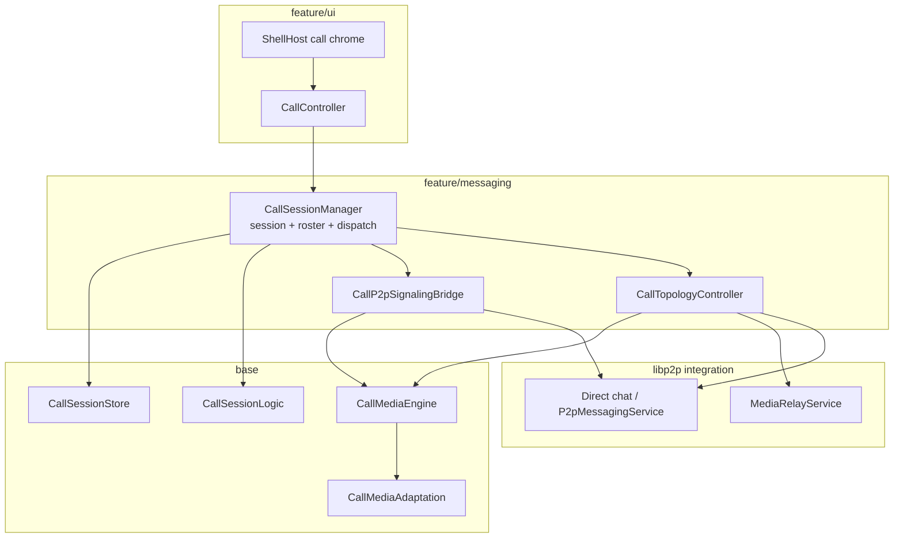
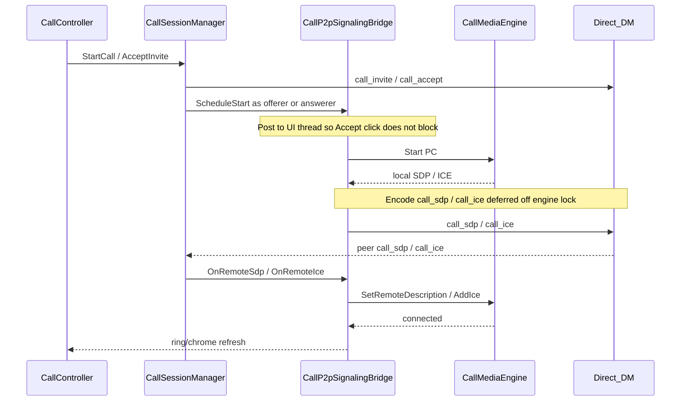

# Call domain architecture

**Tier:** architecture

**Product north star:** [NETWORKING.md](NETWORKING.md) — **HTTP + libp2p only**. Call media → **libp2p** ([V026](../../projects/p2p-av-calls/DECISIONS.md#v026--libp2p-only-call-media-http--libp2p-networking)). WebRTC/libdatachannel/`call_sdp`/`call_ice` = **legacy in tree** (do not extend).

**Mature code map** — planes, layer ownership, topology rules, session façade vs `CallTopologyController` / `CallP2pSignalingBridge` (legacy P2P bridge until teardown).

**Open delivery work:** [`projects/p2p-av-calls/`](../../projects/p2p-av-calls/).  
**Product ADRs:** [DECISIONS.md](../../projects/p2p-av-calls/DECISIONS.md) (through **V026**).  
**Wire controls:** [`contracts/WIRE_SCHEMAS.md`](../contracts/WIRE_SCHEMAS.md).  
**Messaging carrier:** [`P2P_MESSAGING.md`](P2P_MESSAGING.md).  
**SFU / mesh hop:** [`projects/p2p-mesh/`](../../projects/p2p-mesh/) (`media_relay`).  
**Hop dialability:** [`projects/media-hop-reachability/`](../../projects/media-hop-reachability/).

Do **not** restate the full product decision table here — link DECISIONS. Promote wire/disk shapes to `contracts/` when they harden. Dogfood “what works this week” lives only in project [CURRENT_STATE.md](../../projects/p2p-av-calls/CURRENT_STATE.md).

---

## Call lifecycle

1:1 call phases are owned by [`CallLifecycle`](../../src/feature/messaging/CallLifecycle.h) (`Idle` → `Ringing` / `OutboundCalling` → `Accepting` → `JoinedLocal` → `MediaPending` / `MediaConnecting` → `InCall` / `ConnectFailed`). `CallController` only posts clicks and paints chrome; session/media/listen report outcomes into `Apply(event)`.

| Owner | Responsibility |
|-------|----------------|
| **CallLifecycle** | Phase enum, transitions, thread policy, listen desire, `ShouldSuppressRing` |
| **CallController** | Rml clicks → `Apply(event)`; ring / in-call chrome via `RemountCallChrome` (layer) + `DirtyWindow` (labels) |
| **CallSessionManager** | Persist session/invite/roster; encode/send controls; notify lifecycle |
| **CallLibp2pMediaBridge** | Media-key defer, dial/retry; report `MediaDeferred` / `DirectConnected` / `ConnectFailed` |
| **CallMediaDirectService** | 1:1 `/pp-browser/call-media/1.0.0` — hello, AEAD Opus frames; capture enqueues, **host IO thread** owns Yamux R/W |
| **MessagingHub** | N025 listen + mDNS as **lifecycle-driven** commands (`WantEphemeralListen`), not tick side effects |



### Ringing handling

Ring chrome is a **lifecycle phase**, not a free-standing UI poll of `TopPendingInvite`. The controller may observe pending invites to paint labels, but phase / listen / Accept sequencing go through `CallLifecycle`.


| Rule | Why |
|------|-----|
| `InviteSeen` → `Ringing` | Sole entry for inbound ring; arms N025 via `WantEphemeralListen` on IO |
| Chrome layer = `RemountCallChrome` | Mount into `#shell-call-*-mount` only. Full-shell `SyncLayout` breaks Samsung hit-testing. Always-mounted `data-if` + Dirty alone failed to reveal Accept despite idle Present |
| Labels/pulse = `DirtyWindow` | While layer already mounted; does not create the overlay |
| Accept → `Accepting` **before** IO work | Dismiss dialog on the next frame; never run `AcceptInvite` / listen / encrypt on the click thread |
| `ShouldSuppressRing(call_id)` while Accept in flight | `RefreshPendingRing` must not resurrect the dialog for the same invite |
| Accept fail → back to `Ringing` | Restore pending ring if invite still valid; clear `accepting_call_id_` |
| Decline / TTL expire / `call_ended` → `Idle` | Clear ring; stop listen when no other call need |
| Conflict (2nd invite while outbound/in-call) | Conflict copy (`End & Accept` / `Ignore`); Accept implies leave-other-except; single active call |
| Same-call duplicate pending | Keep in-call chrome; do not flip back to ring |

Instrument: WARNING `phase=… event=…` and `WantEphemeralListen=` so “no AcceptIncoming” vs “Accept ok, media stuck” is obvious on Android.

Invite TTL / cancel (wire ageing, `call_ended` to Ringing peers) lives under [Two planes](#two-planes).

### Thread policy

| Work | Thread | Why |
|------|--------|-----|
| Rml click / `DirtyWindow` / `RemountCallChrome` | UI only | Return immediately; **never** full-shell `SyncLayout` for call overlays (Samsung hit-test) |
| `AcceptInvite` / `DeclineInvite` / `LeaveCall` / send prep | Worker Critical/Normal | Posted by lifecycle |
| Prefetch / circuit / dial wait / `Connect` | Worker | Seconds-scale waits |
| N025 `ListenOn` / Wire / mDNS | Worker → asio | Driven by lifecycle `WantEphemeralListen`, not inventing policy from tick alone |
| `CallMediaEngine::StartSfu` / SDL capture | UI | Posted by bridge |
| Chrome refresh (`RefreshPendingRing` / `SyncShellState` / ringtone) | **Always hop to UI** + RemountCallChrome / DirtyWindow + `RequestForceFrame` | Safe from worker **and coordinator**; Present depends on [THREADING.md UI delivery](THREADING.md#ui-delivery-pipeline) (mailbox liveness), not user input |

### Scenario matrix (v1)

| Scenario | Behavior |
|----------|----------|
| Incoming ring | `InviteSeen` → `Ringing`; Dirty-only chrome; listen desire on |
| Accept | Immediate `Accepting` + dismiss ring chrome + Connecting bar; worker AcceptInvite; suppress ring for accepting id |
| Decline / expire | Idle; listen desire off when no call |
| Outbound unanswered | Offerer `OutboundCalling` with no media past invite TTL (`kDefaultCallInviteTtlMs`) → auto-Leave; clears sticky Calling bar |
| Conflict (2nd invite) | Conflict copy; Accept leaves other local call first; single active call |
| Leave / remote end | Idle; stop media via session |
| Answerer before key | `MediaDeferred` → `MediaPending` until `MediaKeyReady` |
| Offerer dial fail | `ConnectFailed`; Retry re-enters `MediaConnecting` |
| Listen fail / no bound port | Surface error; stay `MediaPending` / `ConnectFailed`; Retry re-arms listen |
| Stack rebuild | Bridge recreate only when `CallSessionManager*` changes |

**1:1 libp2p chrome:** connected only when the direct stream is active (not `StartSfu` alone).

---

## Two planes

| Plane | Carrier | Job |
|-------|---------|-----|
| **Signaling** | Direct E2E system `ChatPayload` (`call_invite`, `call_accept`, `call_sfu_attach`, …; legacy `call_sdp` / `call_ice`) | Roster, invite/accept/leave, media-key epochs, SFU attach hints |
| **Media (target)** | libp2p direct and/or blind `media_relay` | Opus voice-first; app E2E under call media key; SDL I/O |
| **Media (legacy)** | libdatachannel PeerConnection | Do not extend; teardown after voice-on-libp2p |

Signaling rides the same P2P/messaging stack as chat. Media never goes through the chat relay as RTP; the SFU is a **blind forwarder** (no call media keys).

**Invite TTL / cancel:** default ring TTL is 60s. Inbox-delivered invites use relay `created_at` + poll `server_time` (age = server_time − created_at); drop when age exceeds TTL + small slack. Without those samples (direct delivery), wire `expires_at` may be re-armed only if still within skew slack of local now — long-backlogged invites are not re-armed. Cancel/end fans out `call_ended` to Joined **and** Ringing/Invited peers so late inbox delivery can clear the ring.



---

## Topology rules (V021 + V026)

| Joined N | Media path (target) | Notes |
|----------|---------------------|-------|
| 1 (ringing / solo) | No media yet | Invite outstanding |
| **2** | **Direct libp2p** when dialable; else mesh hop / circuit | No WebRTC product path (V026); legacy PC may still run until teardown |
| **≥3** | **SFU** via `media_relay` hop | Soft-migrate same `call_id`; sticky initiator picks hop (re-pick: epoch coordinator) |

- Soft-migrate on 2→3: keep session/roster/key epoch; tear down legacy P2P after SFU attach.
- Mid-call guest without a hop: refuse or eject — do **not** leave invitee on Connecting while existing peers stay on direct media.
- Legacy ICE-fail → SFU auto-recovery remains group-only until PC teardown; 1:1 recovery becomes libp2p dial/hop Retry (mesh).
- **Hop dial:** SoftMigrate uses contact/seed multiaddrs today; **target** is stack peerstore dialability — [media-hop-reachability](../../projects/media-hop-reachability/) (in-libp2p, H001/H007).

`CallMediaTopology` (`base/media/CallMediaAdaptation.*`) encodes N thresholds (`ShouldUseMediaRelay` = N≥3 only) until 1:1 hop policy is retargeted under V026.

---

## Lifecycle sequences

Module timing across the two planes. Product invite/roster rules stay in [DESIGN.md](../../projects/p2p-av-calls/DESIGN.md). Race mitigations summarized again under [Critical races](#critical-races-keep-documented-next-to-code).

### 1:1 happy path (N=2)



### Offer before answerer Start (fast offerer race)

Typical Linux dial → Mac: early `call_sdp` must not be dropped. See Critical races “Offer before answerer Start” / “Offer lost”.

```mermaid
sequenceDiagram
  participant Off as Offerer_P2P_Eng
  participant OffDM as Offerer_DM
  participant AnsDM as Answerer_DM
  participant AnsP2P as Answerer_P2pBridge
  participant AnsEng as Answerer_Eng

  Off->>Off: Start offerer
  Off-->>OffDM: call_sdp offer plus ICE
  OffDM->>AnsDM: direct E2E
  AnsDM->>AnsP2P: OnRemoteSdp / OnRemoteIce
  AnsP2P->>AnsEng: buffer remote SDP/ICE
  Note over AnsEng: No Start yet — buffer survives PC rebuild until Stop
  AnsP2P->>AnsEng: Start answerer
  AnsEng->>AnsEng: flush buffer apply offer
  Off->>OffDM: re-send local offer once
  OffDM->>AnsDM: duplicate offer
  AnsEng->>AnsEng: ignore duplicate once applied
  AnsEng-->>Off: answer plus ICE then connected
```

### Soft-migrate 2→3 and ICE-fail fork (V025)

```mermaid
sequenceDiagram
  participant UI as CallController
  participant CSM as CallSessionManager
  participant P2P as CallP2pSignalingBridge
  participant Topo as CallTopologyController
  participant Eng as CallMediaEngine
  participant DM as Direct_DM
  participant SFU as MediaRelayService

  Note over UI,SFU: Soft-migrate when joined goes 2 to 3
  UI->>CSM: Accept / inbound CallAccept
  CSM->>Topo: OnRemoteAcceptJoined or OnLocalAcceptJoined n=3
  Note over Topo,DM: SoftMigrate ranks hops; dial via libp2p peerstore or circuit
  Topo->>Topo: Rank hops quote
  Topo->>SFU: AttachLocal
  Topo->>Eng: StartSfu
  Topo->>DM: FanOut call_sfu_attach
  DM-->>CSM: peers CallSfuAttach
  CSM->>Topo: OnInboundSfuAttach
  Note over P2P,Eng: Tear down 1:1 PC after SFU attach same call_id

  Note over P2P,Topo: ICE failed fork V025
  Eng-->>P2P: state failed
  alt joined >= 3
    P2P->>Topo: TryRecoverViaSfu
    Topo->>SFU: soft-migrate or attach-wait
  else joined == 2
    P2P->>P2P: MarkP2pConnectFailed
    Note over UI,P2P: ~15s timeout also marks failed no SFU
    UI->>CSM: RetryP2pMedia
    CSM->>P2P: rebuild PC as offerer
  end
```

---

## Layer ownership

Respect [`SRC_LAYOUT.md`](SRC_LAYOUT.md): `app → feature → base → common`.

| Concern | Layer | Today | Target |
|---------|-------|-------|--------|
| Session rows, invites, participants | `base/messaging` | `CallSessionStore`, `CallTypes`, `CallSessionLogic` | Unchanged |
| Control encode/decode | `base/messaging` | `CallControlCodec` | Unchanged |
| PC / Opus / H264 / SDL / pending remote SDP | `base/media` | `CallMediaEngine` | Keep; pending-buffer stays here |
| Adaptation policy | `base/media` | `CallMediaAdaptation`, `CallMediaTopology` | Unchanged |
| Session lifecycle + inbound dispatch | `feature/messaging` | **`CallSessionManager`** | Thin orchestrator |
| 1:1 phase / ring / listen desire | `feature/messaging` | **`CallLifecycle`** | Sole phase owner; see [Ringing handling](#ringing-handling) |
| P2P offer/answer + SDP/ICE send | `feature/messaging` | **`CallP2pSignalingBridge`** | Legacy until teardown |
| Soft-migrate / attach-wait / hop pick | `feature/messaging` | **`CallTopologyController`** | Unchanged |
| Media keys wrap/unwrap | `feature/messaging` | `CallMediaKeyStore` | Unchanged |
| Ring / in-call chrome | `feature/ui` | `CallController`, `CallChromeSync`, `ShellHost::RemountCallChrome` | Layer identity → mount remount; labels/pulse → DirtyWindow |
| Blind SFU protocol | `libp2p/integration` | `MediaRelayService` | Unchanged |

UI must not choose P2P vs SFU. It posts clicks to `CallLifecycle` and paints from session + phase; it does not invent listen or media policy.

---

## Major systems (relationships)

### MessagingHub
Owns `CallSessionManager` + `CallLifecycle`, wires `MediaRelayDeps` (relay service, peer sessions, bootstrap seeds), executes N025 listen from lifecycle desire, and routes inbound call controls via `RelayReceivePipeline` → `ApplyInboundControl`.

### CallSessionManager (façade)
**Should own:** create/end session, invite/accept/decline/leave, roster fan-out, media-key rotate-on-leave, orphan cleanup after restart, inbound control **dispatch**.

**Should not own long-term:** PeerConnection lifecycle details, SFU quote/attach loops, or duplicated “if N≥3 …” trees in every accept path.

### CallMediaEngine
Single media backend for the process:

- **P2P mode:** libdatachannel + trickle ICE; buffers early `call_sdp` / `call_ice` until `Start()` (fast offerer / slow answerer race — e.g. Linux dial → Mac).
- **SFU mode:** no PC; encode → `SfuSendFn` / inbound `OnSfuPacket`.
- Capture/playback and camera stay off the libp2p IO thread (mic TCC can block).

### CallController / shell
Maps ring + in-call chrome from lifecycle phase + session snapshot. **Layer appear/disappear** uses `ShellHost::RemountCallChrome` (dedicated mounts only). **Labels / pulse / meters** use `DirtyWindow` while a layer is already mounted. Clicks → `CallLifecycle::Apply`; polls attach-wait only as a UI tick hook into the topology owner; must not invent topology or listen policy.

**Do not** rely on always-mounted `data-if="call_ring_active"` alone to show Accept — dogfood showed C++ `active=true` + Present alive while the overlay stayed `display:none`. **Do not** full-shell `SyncLayout` for call chrome (Samsung Accept hit-test).

### media_relay (mesh)
Desktop/org Node capability. Blind hop ranks contact∪seed hops, quotes, attaches, fans out `call_sfu_attach`. Mobile never hosts.

**Who picks (V021 / V022):** first soft-migrate is the sticky **call initiator** (earliest `joined_at` = session payer). Mid-call invite: `CallAccept` reaches only the inviter (WaitForAttach); **CallRoster** drives `JoinedCountObserved` so the initiator SoftMigrates. Joiners without hint WaitForAttach. ICE re-pick is epoch coordinator only. Fan-out clears `quote_id` (peers `RequestQuote` locally).

---

## Target internal design

Extract without changing the external façade (`MessagingHub::Calls()`, `CallController`).

### Pure units (`base/messaging`, gtest — no libp2p)

| Unit | Job |
|------|-----|
| `SoftMigrateLogic` | Who-picks: initiator first hop (V021/V022); `JoinedCountObserved` / `RemoteAcceptObserved`; ICE → coordinator |
| `SfuAttachWaitLogic` | Attach-wait poll; **no TimeoutLeave while migrate in flight** |
| `SfuAttachFanout` | Fan-out detail with empty `quote_id`; publisher stream id |
| `MeshHopPolicy` | Contact∪seed rank; Prefer contacts; `ExcludeSelfHop` |

### 1. `CallTopologyController` (feature adapter)
Responsibilities:

- Apply pure decisions; `MaybeSoftMigrateToSfu(call_id, trigger)`, `AttachLocalToSfu`, hop ranking via `IMediaRelayClient` / `IDialRegistry`
- Attach-wait deadline + timeout leave (group only) via `SfuAttachWaitLogic`
- Eject joiner when migrate fails but 1:1 P2P remains
- ICE `failed` recovery **only** when N≥3

State it owns: `sfu_attached_`, attach-wait call id/deadline, `awaiting_sfu_recovery_`, `soft_migrate_in_flight_`.  
Session manager asks: “joined count is now N — what media action?”

### 2. `CallP2pSignalingBridge` (feature)
Responsibilities:

- `StartMediaAsOfferer` / `Answerer` + `Schedule*`
- Bind engine callbacks → encode `call_sdp` / `call_ice` → direct send (deferred off engine lock)
- Offerer local-SDP re-send for answerer race
- Stop media when session leaves P2P path

Does not decide SFU. Topology calls `Stop` / `StartSfu` via session or engine APIs.

### 3. `CallSessionManager` (shrunk)
Keeps store updates + `ApplyInboundControl` switch. Each arm: decode → upsert roster/session → **one** call into topology or P2P bridge.

### 4. Inbound control flow (target)

```text
ApplyInboundControl(type)
  → update CallSessionStore / keys as needed
  → switch type:
       CallAccept / participant join  → Topology.OnRosterChanged(n)
       CallSdp / CallIce              → P2pBridge.OnRemoteSignal(...)
       CallSfuAttach                  → Topology.AttachLocal(...)
       CallLeave / CallEnded          → Topology.Clear + P2pBridge.Stop + EndCallLocal
```

---

## Critical races (keep documented next to code)

These are architectural, not one-off hacks. Timelines: [Offer before answerer Start](#offer-before-answerer-start-fast-offerer-race), [ICE-fail fork](#soft-migrate-23-and-ice-fail-fork-v025).

| Race | Direction / symptom | Mitigation (home) |
|------|---------------------|-------------------|
| Offer before answerer `Start` | Fast offerer (often Linux) → Mac Connecting… | Buffer remote SDP/ICE in `CallMediaEngine`; flush on `Start`; do not clear buffer on PC rebuild except `Stop` |
| Offer lost (no retransmit) | Same | Offerer re-send once; answerer ignores duplicate offer |
| Signaling under engine mutex | Answer path during flush | Defer `call_sdp` / `call_ice` send to UI task |
| 1:1 enters SFU wait | “group needs media_relay” on P2P call | Topology: SFU paths only for N≥3; ignore stale `sfu_hint` on 1:1 (V025) |
| 1:1 ICE fail / hang | Connecting forever or false leave | Mark connect-failed + ~15s timeout; UI Retry rebuilds offerer; tip via `PlatformUserHints` |
| Mid-call invite from 2nd peer | Chrome gone after 45s | Initiator SoftMigrates on CallRoster (`JoinedCountObserved`); inviter WaitForAttach; attach-wait does not leave while migrate in flight |
| macOS Local Network | Android↔Mac LAN ICE | Packaged `NSLocalNetworkUsageDescription` ([PLATFORMS.md](PLATFORMS.md)); on 1:1 connect fail UI tips Local Network |
| Dogfood from Cursor terminal | LAN ICE can fail while normal terminal works | Prefer OS terminal or packaged `.app` for media dogfood |
| Accept on UI / ring stuck | Samsung frozen Accept dialog | CallLifecycle AcceptClicked + Dirty-only chrome; see [Ringing handling](#ringing-handling) |
| Answerer media before `CallMediaKey` | Hello rejected / silent call | `MediaDeferred` → key → `MediaConnecting`; offerer dial retry |
| N025 listen on UI tick | UI hitch; `/tcp/0` advertised | Late bind in fork; lifecycle desire; start listen on IO; mDNS after bound port |

---

## Extraction sequence

Landed (behavior-preserving + who-picks fix):

1. **Topology extract** — `CallTopologyController` owns soft-migrate / attach / wait / eject / hop helpers.
2. **P2P bridge extract** — `CallP2pSignalingBridge` owns schedule/bind/resend/stop-media + 1:1 connect-fail / Retry.
3. **Dispatch cleanup** — thin `ApplyInboundControl` arms call topology or P2P bridge.
4. **Pure who-picks / wait / fan-out** — `SoftMigrateLogic`, `SfuAttachWaitLogic`, `SfuAttachFanout` + fakes (`IMediaRelayClient` / `IDialRegistry`).
5. **Tests** — `CallMediaTopology` N≥3-only; SoftMigrate / wait / fan-out / topology controller unit tests; `media_relay_service_test` loopback remains integration.

Do **not** combine engine pending-buffer rewrites with topology moves in one PR.

---

## File map

| Path | Role |
|------|------|
| `src/feature/messaging/CallLifecycle.*` | 1:1 phase machine — ring/accept/listen/media sequencing |
| `src/feature/messaging/CallSessionManager.*` | Façade — session + dispatch |
| `src/feature/messaging/CallLibp2pMediaBridge.*` | libp2p 1:1 media — key defer, dial/retry, phase outcomes |
| `src/libp2p/integration/host/CallMediaDirectService.*` | Direct call-media protocol + IO-thread duplex pump |
| `src/libp2p/integration/host/CallMediaFrameCrypto.*` | AEAD frame wrap under call media key |
| `src/feature/messaging/CallP2pSignalingBridge.*` | Legacy P2P media signaling + 1:1 connect-fail / Retry |
| `src/feature/messaging/CallTopologyController.*` | SFU / soft-migrate / attach-wait / hop-addr cache + gather |
| `src/feature/messaging/CallTopologyRelayDeps.h` | `IMediaRelayClient` / `IDialRegistry` + real wrappers |
| `src/feature/messaging/CallMediaKeyStore.*` | Epoch key wrap |
| `src/feature/ui/CallController.*` | Ring + in-call UI (thin; lifecycle clicks) |
| `src/base/media/CallMediaEngine.*` | PC + SFU media backend |
| `src/base/media/CallMediaAdaptation.*` | V024 + `CallMediaTopology` |
| `src/base/messaging/CallSessionStore.*` | Persistence |
| `src/base/messaging/CallSessionLogic.*` | Pure transitions / expiry / coordinator pick |
| `src/base/messaging/SoftMigrateLogic.*` | Pure who-picks |
| `src/base/messaging/SfuAttachWaitLogic.*` | Pure attach-wait poll |
| `src/base/messaging/SfuAttachFanout.*` | Fan-out shape + publisher stream id |
| `src/base/messaging/CallControlCodec.*` | Wire JSON for call controls |
| `src/base/people/MeshHopPolicy.*` | Contact∪seed hop rank / ExcludeSelfHop |
| `src/libp2p/integration/host/MediaRelayService.*` | Blind SFU |

---

## Related docs

| Doc | Use when |
|-----|----------|
| [RUNTIME_COMPOSITION.md](RUNTIME_COMPOSITION.md) | How Hub / shell / threads compose at runtime |
| [P2P_MESSAGING.md](P2P_MESSAGING.md) | Direct/group chat carrier under signaling |
| [PLATFORMS.md](PLATFORMS.md) | Mic/camera/Local Network per OS |
| [projects/p2p-av-calls/DESIGN.md](../../projects/p2p-av-calls/DESIGN.md) | Product design + entity model |
| [projects/p2p-av-calls/DECISIONS.md](../../projects/p2p-av-calls/DECISIONS.md) | V014–V025 ADRs |
