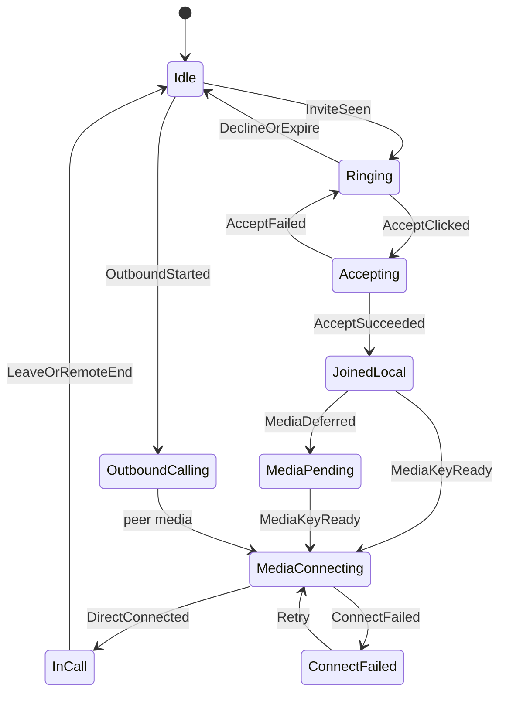
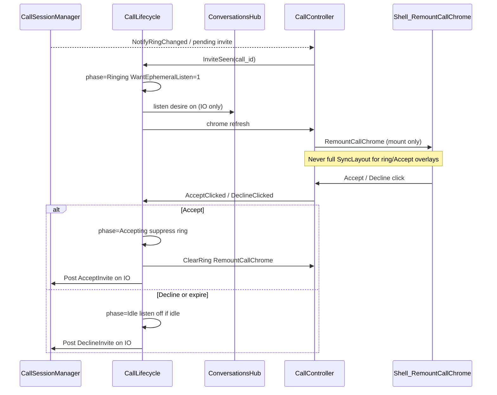
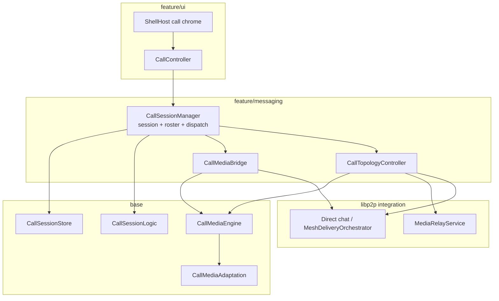
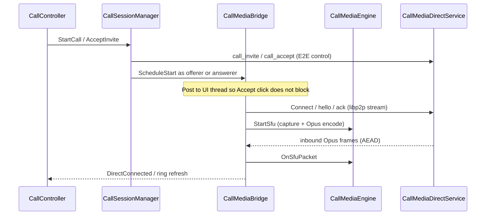

# Call domain architecture

**Tier:** architecture

**Product north star:** [NETWORKING.md](NETWORKING.md) — **HTTP + peer mesh**. Call media → **AMP** ([projects/adp](../../projects/adp/) D10 hard-require); libp2p retained for PeerId/crypto only. Wire-compat `call_sdp` / `call_ice` are ignored inbound; product does not send them.

**Mature code map** — planes, layer ownership, topology rules, session façade vs `CallTopologyController` / `CallMediaBridge`.

**Open delivery work:** [`projects/p2p-av-calls/`](../../projects/p2p-av-calls/).  
**Product ADRs:** [DECISIONS.md](../../projects/p2p-av-calls/DECISIONS.md) (through **V038** — N=2 circuit for NAT; SoftMigrate N≥3 only).  
**Host receive / QoS matrix:** [HOST_RECEIVE_POLICY.md](../../projects/p2p-av-calls/HOST_RECEIVE_POLICY.md) (V032 + V034 video frames / hop audio-priority drop).  
**Transport session machines:** [SESSION_MACHINES.md](../../projects/p2p-av-calls/SESSION_MACHINES.md) (V033 s2a) · [MEDIA_RELAY_ATTACH.md](../../projects/p2p-mesh/MEDIA_RELAY_ATTACH.md) (N026 s3a+s3b) — circuit compose loopbacks green.  
**Rewrite debt:** [PHASES rd](../../projects/p2p-av-calls/PHASES.md#rd--amp-call-media-rewrite-debt-v038) — D0–D4 automated gates (gtest / compose / `B-CALL-*` / `B-HARD-CALL`); OEM dogfood optional — [CURRENT_STATE](../../projects/p2p-av-calls/CURRENT_STATE.md#rd-automated-exit-v038--prefer-over-device-dogfood).  
**Wire controls:** [`contracts/WIRE_SCHEMAS.md`](../contracts/WIRE_SCHEMAS.md).  
**Messaging carrier:** [`P2P_MESSAGING.md`](P2P_MESSAGING.md).  
**SFU / mesh hop:** [`projects/p2p-mesh/`](../../projects/p2p-mesh/) (`media_relay`).  
**Hop dialability:** [`projects/media-hop-reachability/`](../../projects/media-hop-reachability/).

Do **not** restate the full product decision table here — link DECISIONS. Promote wire/disk shapes to `contracts/` when they harden. Dogfood “what works this week” lives only in project [CURRENT_STATE.md](../../projects/p2p-av-calls/CURRENT_STATE.md).

---

## Call lifecycle

1:1 call phases are owned by [`CallLifecycle`](../../src/feature/calls/CallLifecycle.h) (`Idle` → `Ringing` / `OutboundCalling` → `Accepting` → `JoinedLocal` → `MediaPending` / `MediaConnecting` → `InCall` / `ConnectFailed`). **Transitions** are pure [`DecideCallLifecycleTransition`](../../src/domain/messaging/CallLifecycleTransitionLogic.h) (gtest table); `Apply` only executes named actions (`PostAcceptInvite`, chrome, kick). `CallController` posts clicks and paints chrome; session/media/listen report outcomes into `Apply(event)`. Heavy media logic stays in Bridge / Topology planners (V039) — not in phase handlers.

| Owner | Responsibility |
|-------|----------------|
| **CallLifecycle** | Phase/Status enums, execute transition actions, thread policy, listen desire, `ShouldSuppressRing` |
| **CallLifecycleTransitionLogic** | Pure `(phase, status, event) → Outcome` table (no I/O) |
| **CallController** | Rml clicks → `Apply(event)`; ring / in-call chrome via `apply_chrome_update` → ShellHost Remount / DirtyCallChrome |
| **CallSessionManager** | Persist session/invite/roster; encode/send controls; notify lifecycle |
| **CallMediaBridge** | Media-key defer, channel connect/retry; report `MediaDeferred` / `DirectConnected` / `ConnectFailed` |
| **CallMediaConnectCoordinator** | Both directions of the 1:1 bundle. Outbound: per attempt reach a link then open the bundle; watchdog (B42), 5 retries, fresh-link feedback (B39). Inbound: owns the transport handler — accept once the epoch key is available (cancelable wait on the worker hop) via `CallMediaInboundPorts` |
| **PeerReachCoordinator** | Call-agnostic link establishment to one peer (dial → circuit → punch, seed park); `Reach` / `Await` modes |
| **ICallMediaTransport** | 1:1 `/pp-browser/realtime/1.0.0` — Amp `CallMediaAmpTransport` / `CallMediaLegCoordinator` ([A020](../../projects/adp/DECISIONS.md#a020--single-transport-entry-per-protocol) / D10) |
| **ConversationsHub** | N025 listen + mDNS as **lifecycle-driven** commands (`WantEphemeralListen`), not tick side effects |



### Ringing handling

Ring chrome is a **lifecycle phase**, not a free-standing UI poll of `TopPendingInvite`. The controller may observe pending invites to paint labels, but phase / listen / Accept sequencing go through `CallLifecycle`.



| Rule | Why |
|------|-----|
| `InviteSeen` → `Ringing` | Sole entry for inbound ring; arms N025 via `WantEphemeralListen` on IO |
| Chrome layer = `RemountCallChrome` | Mount into `#shell-call-*-mount` only. Full-shell `SyncLayout` breaks Samsung hit-testing. Always-mounted `data-if` + Dirty alone failed to reveal Accept despite idle Present |
| Labels/pulse/icons = `DirtyCallChrome` | Via `apply_chrome_update(DirtyOnly)` while layer already mounted; does not create the overlay |
| Accept → `Accepting` **before** IO work | Dismiss dialog on the next frame; never run `AcceptInvite` / listen / encrypt on the click thread |
| `ShouldSuppressRing(call_id)` while Accept in flight | `RefreshPendingRing` must not resurrect the dialog for the same invite |
| Accept fail → back to `Ringing` | Restore pending ring if invite still valid; clear `accepting_call_id_` |
| Decline / TTL expire / `call_ended` → `Idle` | Clear ring; stop listen when no other call need |
| Conflict (2nd invite while outbound/in-call) | Conflict copy (`End & Accept` / `Ignore`); Accept implies leave-other-except; single active call |
| Same-call duplicate pending | Keep in-call chrome; do not flip back to ring |
| Wire before durable Joined/pending (V045) | `CallInvite` / `CallAccept` / `CallDecline` succeed on the wire before Upsert Joined/Ringing/pending or planner arm; local Decline `EndCallLocal` like expire |

Instrument: INFO `phase=… status=… event=…` and `WantEphemeralListen=` so “no AcceptIncoming” vs “Accept ok, media stuck” is obvious on Android (release emit floor promotes INFO → WARNING for `adb logcat -s pp-browser:W`).

**State + Status ([V037](../../projects/p2p-av-calls/DECISIONS.md#v037--calllifecycle-state--status-one-planner-armed)):** `CallPhase` is the chrome/shell State; `CallMediaStatus` arms exactly one media planner (Bridge vs Topology). JoinedLocal / MediaPending / MediaConnecting are **Calling-like** for arming until a future enum rename. SoftMigrate is Status `Migrating`, not a side flag.

Invite TTL / cancel (wire ageing, `call_ended` to Ringing peers) lives under [Two planes](#two-planes).

### Thread policy

| Work | Thread | Why |
|------|--------|-----|
| Rml click / `DirtyCallChrome` / `RemountCallChrome` | UI only | Return immediately; **never** full-shell `SyncLayout` for call overlays (Samsung hit-test) |
| `AcceptInvite` / `DeclineInvite` / `LeaveCall` / send prep | Worker Critical/Normal | Posted by lifecycle; Leave uses Critical |
| Prefetch / circuit / dial wait / `Connect` | Worker | Seconds-scale waits; aborted via `connect_generation_` on Leave |
| N025 `ListenOn` / Wire / mDNS | Worker → asio | Driven by lifecycle `WantEphemeralListen`, not inventing policy from tick alone |
| `CallMediaEngine::StartSfu` / `Stop` / SDL capture | **UI only** | Bridge posts Stop to UI when LeaveCall runs off-UI; never TearDown SDL on a worker |
| Hub / process shutdown | UI | Stop+join ringtone → Abort circuit → Detach media_relay → `LeaveCall` (CallEnded) → `PrepareForTeardown`; Detach **before** `CallMediaEngine::Stop` so SFU `BlockingWrite` cannot hang quit. Ringtone join must precede `Backend::Shutdown` / `SDL_Quit` (accept-dialog quit hang). |
| Chrome refresh (`RefreshPendingRing` / `SyncShellState` / ringtone) | **Always hop to UI** + `apply_chrome_update` (Remount / DirtyCallChrome) + `RequestForceFrame` | Safe from worker **and coordinator**; Present depends on [THREADING.md UI delivery](THREADING.md#ui-delivery-pipeline) (mailbox liveness), not user input. Ringtone: `CallRingtone` loops `assets/sounds/call_ring.wav` on desktop **and** mobile; UI/Accept `Stop` is async (joinable reaper, never bare `.detach()`); `StopAndJoin` only on app shutdown. |

### Scenario matrix (v1)

| Scenario | Behavior |
|----------|----------|
| Incoming ring | `InviteSeen` → `Ringing`; Dirty-only chrome; listen desire on |
| Accept | Immediate `Accepting` + dismiss ring chrome + Connecting bar; worker AcceptInvite; suppress ring for accepting id |
| Decline / expire | Idle; listen desire off when no call |
| Outbound unanswered | Offerer `OutboundCalling` with no media past invite TTL (`kDefaultCallInviteTtlMs`) → auto-Leave; clears sticky Calling bar |
| Conflict (2nd invite) | Conflict copy; Accept leaves other local call first; single active call |
| Leave / remote end | Idle; `StopCallMedia` (Detach SFU then SDL Stop) on UI; LeaveCall on Critical |
| Answerer before key | `MediaDeferred` → `MediaPending` until `MediaKeyReady` |
| Offerer dial fail | `ConnectFailed`; Retry re-enters `MediaConnecting` |
| Listen fail / no bound port | Surface error; stay `MediaPending` / `ConnectFailed`; Retry re-arms listen |
| Stack rebuild | Bridge recreate only when `CallSessionManager*` changes |

**1:1 libp2p chrome ([V037](../../projects/p2p-av-calls/DECISIONS.md#v037--calllifecycle-state--status-one-planner-armed)):** Connected when `InCall` **and** Status is `DirectLive` or `HopLive` — not `StartSfu` alone, not TX-only (`DegradedTxOnly`), not seat Live alone when Status lags. Bridge / hop CompleteAttach report Live via Lifecycle; seat `NoteLive` remains the bind projection ([V036](../../projects/p2p-av-calls/DECISIONS.md#v036--mediaseat--exclusive-media-epoch)).

---

## Two planes

| Plane | Carrier | Job |
|-------|---------|-----|
| **Signaling** | Direct E2E system `ChatPayload` (`call_invite`, `call_accept`, `call_sfu_attach`, …; wire-compat `call_sdp` / `call_ice` ignored) | Roster, invite/accept/leave, media-key epochs, SFU attach hints |
| **Media** | libp2p direct and/or blind `media_relay` | Opus + H264 **video_lo** (V034); app E2E under **one shared call media key** (V004 — encrypt once, hop fans out); SDL I/O |

Signaling rides the same P2P/messaging stack as chat. Media never goes through the chat relay as RTP; the SFU is a **blind forwarder** (no call media keys). Group video is **not** encrypted per subscriber: the publisher seals each AU once under the epoch key; the hop copies ciphertext.

**Invite TTL / cancel:** default ring TTL is 60s. Inbox-delivered invites use relay `created_at` + poll `server_time` (age = server_time − created_at); drop when age exceeds TTL + small slack. Without those samples (direct delivery), wire `expires_at` may be re-armed only if still within skew slack of local now — long-backlogged invites are not re-armed. Cancel/end fans out `call_ended` to Joined **and** Ringing/Invited peers so late inbox delivery can clear the ring.



---

## Topology rules (V021 + V026 + V038)

| Joined N | Media path (target) | Notes |
|----------|---------------------|-------|
| 1 (ringing / solo) | No media yet | Invite outstanding |
| **2** | **Direct Amp call-media** when dialable; else **punch → circuit** nested Session | [V038](../../projects/p2p-av-calls/DECISIONS.md#v038--n2-circuit-for-nat-softmigrate-reserved-for-n3) — never SoftMigrate for NAT |
| **≥3** | **SFU** via `media_relay` hop | Soft-migrate same `call_id`; sticky initiator picks hop (re-pick: epoch coordinator); circuit may still reach the hop |

- Soft-migrate on 2→3: keep session/roster/key epoch; tear down 1:1 call-media after SFU attach.
- Mid-call guest without a hop: refuse or eject — do **not** leave invitee on Connecting while existing peers stay on direct media.
- Auto `media_relay` attach is **group-only**; 1:1 undialable recovery is Amp dial / punch / circuit (V025/V038).
- **Hop dial:** SoftMigrate needs stack dialability — [media-hop-reachability](../../projects/media-hop-reachability/) (Amp mesh, H001/H007; punch H009).
- **`CallMediaEngine::StartSfu`:** starts capture + duplex send fn for **both** 1:1 Amp and hop SFU — not “join SFU” alone (document-only name; V038).

`CallMediaTopology` (`ShouldUseMediaRelay` = N≥3 only) matches V038.

---

## Lifecycle sequences

Module timing across the two planes. Product invite/roster rules stay in [DESIGN.md](../../projects/p2p-av-calls/DESIGN.md). Race mitigations summarized again under [Critical races](#critical-races-keep-documented-next-to-code).

### 1:1 happy path (N=2)



### Media-key defer (answerer before key)

Answerer may reach `JoinedLocal` before `CallMediaKey` arrives. `CallMediaBridge` reports `MediaDeferred` → `MediaPending` until the key lands, then enters `MediaConnecting`.

### Soft-migrate 2→3 (V025)


---

## Layer ownership

Respect [`SRC_LAYOUT.md`](SRC_LAYOUT.md): `app → feature → base → common`. Object lifetimes follow [OWNERSHIP.md](OWNERSHIP.md) (parent-only destroy; UI affinity for SDL / ringtone teardown).

| Concern | Layer | Today | Target |
|---------|-------|-------|--------|
| Session rows, invites, participants | `base/messaging` | `CallSessionStore`, `CallTypes`, `CallSessionLogic` | Unchanged |
| Control encode/decode | `base/messaging` | `CallControlCodec` | Unchanged |
| PC / Opus / H264 / SDL | `domain/media` | `CallMediaEngine` | libp2p/SFU packet transport only |
| Adaptation policy | `domain/media` | `CallMediaAdaptation`, `CallMediaTopology` | Unchanged |
| Call stack ownership (phase assembly + media plane) | `feature/calls` | **`CallStack`** + **`CallMediaPlane`** | Stack owns stores / CSM / Lifecycle / Seat and phase-orders the plane; plane owns Amp transport + dial/relay/hop + bridge + dial book ([V040](../../projects/p2p-av-calls/DECISIONS.md#v040--callmediaplane--callstack-ownership-collapse)); Hub holds `unique_ptr<CallStack>` and forwards `Calls()`/`Lifecycle()`; `CallUiBackend` binds the stack |
| **Exclusive media bind (epoch)** | `feature/calls` | **`CallMediaSeat`** + **`CallDirectPath` / `CallHopPath`** ([V036](../../projects/p2p-av-calls/DECISIONS.md#v036--mediaseat--exclusive-media-epoch)) | Sole `Acquire`/`Release`/`NoteLive`/`IsBound`; path plugins token-gated (`AllowsPathOp`); SoftMigrate = path replace under same token |
| Session lifecycle + inbound dispatch | `feature/messaging` | **`CallSessionManager`** | Signaling only for duplex start/stop (seat + path façades); mute/camera stay device controls |
| 1:1 phase / ring / listen desire | `feature/messaging` | **`CallLifecycle`** | Sole phase owner; see [Ringing handling](#ringing-handling) |
| 1:1 Amp dial + connect-fail / Retry | `feature/messaging` | **`CallMediaBridge`** (`CallDirectPath`) | Direct path under seat token |
| Soft-migrate / attach-wait / hop pick | `feature/messaging` | **`CallTopologyController`** (`CallHopPath`) | Hop path under seat token |
| N→planner select (pure) | `domain/messaging` | **`CallMediaPlannerSelectLogic`** | Effective N; arm Hop vs Direct; relay-cap SoftMigrate nudge gates |
| Direct planner Apply (V039) | `feature/calls` | **`CallMediaBridge`** + **`CallDirectPlannerLogic`** (`domain/messaging`) | Schedule/Key/Connect/TX-only/Release; health timer |
| Hop planner Apply (V039) | `feature/calls` | **`CallTopologyController`** + **`CallHopPlannerLogic`** (`domain/messaging`) | SoftMigrate/attach-wait/inbound SFU; attach-wait timer |
| Media keys wrap/unwrap | `feature/messaging` | `CallMediaKeyStore` | Unchanged |
| Ring / in-call chrome | `feature/ui` | `CallController`, `CallChromeSync`, `ShellCallChromeGesture`, `ShellHost::ApplyCallChromeUpdate` | Layer identity / control *presence* / **mode** (Expanded/Immersive/Minimized — V031) / status kind → remount; mute/speaker/camera icons → DirtyCallChrome (`data-attr-src` + `data-class-*--on`); meters/pulse/quality chip → DirtyCallChrome; mobile speaker via `CallAudioSession` |
| Call media health | `domain/media` + `feature/ui` | `CallMediaHealth`, `CallMediaEngine::HealthSnapshot`, hop `HealthSnapshot`, `CallController::ApplyMediaHealth` / `ShowCallDetails` | Tier A quality bars always; Call details for everyone; debug subtitle + rich diagnostics behind profile `call_diagnostics` or `--debug`; `media_health` INFO ~2s |
| Blind SFU protocol | `base/p2p` | `MediaRelayService` | Unchanged |

UI must not choose P2P vs SFU. It posts clicks to `CallLifecycle` and paints from session + phase; it does not invent listen or media policy.

---

## Major systems (relationships)

### ConversationsHub / CallStack
`CallStack` (`feature/calls`) is a **phase assembler** ([V040](../../projects/p2p-av-calls/DECISIONS.md#v040--callmediaplane--callstack-ownership-collapse) / [V041](../../projects/p2p-av-calls/DECISIONS.md#v041--calllifecycle-signaling-ports--stack-composition-root)): profile stores (`CallSessionStore`, `CallMediaKeyStore`, `CallMediaEngine`), `CallSessionManager`, `CallLifecycle`, `CallMediaSeat`, and `unique_ptr<CallMediaPlane>`. **`CallMediaPlane`** owns Amp call-media transport, `PeerSessionDialRegistry`, `AmpMediaRelayClient`, `AmpCircuitHopReach`, `CallMediaBridge` (object), the dial book, and mesh `Wire` / reach / warm-bootstrap. Stack **binds** the bridge with stack-owned ingredients (`BindBridge`) and installs relay deps onto CSM — the plane does **not** hold standing live refs to CSM/stores/seat/lifecycle. Lifecycle talks to signaling only via **`CallLifecycleSignalingPorts`** (no `CallSessionManager*`). N025 listen *desire* is sole on `CallLifecycle::WantEphemeralListen` (stack only wakes Hub sync). `ConversationsHub` holds a `unique_ptr<CallStack>`, forwards `Calls()`/`Lifecycle()`, injects mesh/config/mDNS glue via `CallStackDeps`, and still owns mesh admission, LAN mDNS, N025 listen *execution* (Hub `SyncMobileEphemeralListen`), and inbound control routing via `RelayReceivePipeline` → `ApplyInboundControl`. Build/teardown order: Hub `Initialize`/`BuildMessagingStack` → `CallStack::InitializeStores`/`BuildSessions`; mesh up → `OnMeshServicesStarted`; `StopMesh` → `PrepareForMeshStop` (bracketed by mesh circuit aborts) → `mesh_->Stop()` → `FinishMeshStop`. Do **not** recreate dial registry / bridge mid-call on N025 listen sync — rebuild bridge only when the CSM rebuild key changes. Plane `Wire()` is mesh-only; `BindMediaProducts` on the stack follows — keep both thin under the general [function complexity](../../AGENTS.md#conventions) convention.

| Piece | Owns | Standing ptrs to siblings | Bind-only / ports |
|-------|------|---------------------------|-------------------|
| **CallStack** | `unique_ptr`s + deps | all siblings (composition root) | wires everyone |
| **CallLifecycle** | phase / status | none to CSM | `CallLifecycleSignalingPorts` from Stack |
| **CallMediaSeat** | exclusive media epoch | none | teardown hooks from Stack (`BindSeatTeardown`) |
| **CallMediaPlane** | mesh + bridge object + dial book | none to CSM / seat / lifecycle | `BindBridge` args + deps callbacks |
| **CallSessionManager** | signaling façade | stores (ctor); owns Workflow + Topology + Broadcast; Direct/Lifecycle/Seat via ports | `Set*Ports` / `SetTopology*Ports` / `BindWorkflowHostPorts` / `BindTopologyHostPorts` |

### CallSessionManager (façade)
**Should own:** Hub-facing API, Topology/MediaHost, dial-book maps, delivery, port install, device mute/camera. Durable session/roster work lives in owned **`CallSessionWorkflow`** (V044).

**Should not own long-term:** libp2p stream lifecycle details, SFU quote/attach loops, or duplicated “if N≥3 …” trees in every accept path. Pure N→planner policy lives in **`CallMediaPlannerSelectLogic`**; Accept arms Bridge **or** Topology via `OnLocalAcceptJoined` / `ScheduleStartDirectMedia` (V039 Direct/Hop `Apply`). SoftMigrate relay-cap nudge is **`CallTopologyController::OnPeerMediaRelayCapLearned`** (N≥3 / attach-wait only).

### CallSessionWorkflow (V044)
Durable multi-party session/roster executor (store mutations + `CallSessionLogic` transitions + invite/leave/inbound arms). Side effects via clustered **HostPorts** (`wire` / `duplex` / `hop` / `chrome` / `reach`) from CSM — **not** a second chrome `CallPhase` machine.

### CallTopologyController (V046/V047)
Hop planner façade (`Apply` / On*). SoftMigrate + attach completion live in value-owned **`CallHopMigrateWorkflow`**, which **owns** race clusters; Topology holds cluster refs (`flight_` / `sfu_` / …) and projects Host/Arming/Seat into Workflow ports + **TopologyOps**. CSM fills Topology `HostPorts` (`CallTopologyHostPorts`); Stack installs Topology **`CallHopArmingPorts`** / **`CallTopologySeatPorts`**. Clusters: `SoftMigrateFlight`, `AttachWait`, `InboundAttachGate`, `GuestSfuSession`, `PublisherStreams`, `SfuSurface`.

**Vocabulary ([COMPOSITION_VOCABULARY.md](COMPOSITION_VOCABULARY.md), [V048](../../projects/p2p-av-calls/DECISIONS.md#v048--composition-vocabulary-no-upward-concepts)):** repo-wide — lower peers must not speak higher peers’ concepts. Topology embeds **`CallHopArmingPorts`** / **`CallTopologySeatPorts`**; owned Workflow embeds migrate host/arming/seat ports; Bridge embeds **`CallDirectArmingPorts`** / **`CallDirectSeatPorts`**; CSM embeds Direct/Lifecycle/Seat ports. **`CallDirectPath` / `CallHopPath`** take Ops only (no standing `CallMediaBridge*` / `CallMediaSeat*`). Stack / Topology private `Make*` (and CSM `MakeSeatPorts`) close over producers.

### CallMediaSeat (V036)
Process-wide exclusive bind `call_id` ↔ duplex. `Release` = topology Detach then engine Stop; `NoteStart` invalidates in-flight Release; SoftMigrate uses `NotePath(Hop)` without Release. Topology “active call” prefers `seat.IsBound`, not leftover engine `ActiveCallId`. **Phase 2:** `MediaState` (`Idle` / `Connecting` / `Live` / `Failed`) drives chrome Connected; `BeginAttach` serializes hop AcceptAndAttach. **Phase 3:** `CallDirectPath` / `CallHopPath` façades (Ops-only; Stack/CSM project Bridge + seat); path ops require `AllowsPathOp(token)`; CSM schedules Direct start / seat `Release` only (no parallel `StopMeshMedia` when seat wired).

### CallMediaEngine
Single A/V device for the process (owned by the seat’s bound call):

- **Direct 1:1:** `CallMediaBridge` drives `StartSfu` with a send fn wired to Amp call-media transport; inbound frames → `OnSfuPacket`.
- **Group SFU:** encode → `SfuSendFn` / inbound `OnSfuPacket` via `media_relay`.
- Capture/playback and camera stay off the libp2p IO thread (mic TCC can block).

### CallController / shell
Maps ring + in-call chrome from lifecycle phase + session snapshot. **Layer appear/disappear** uses `ShellHost::RemountCallChrome` (dedicated mounts only) via `apply_chrome_update(Remount)`. **Labels / pulse / meters / icon toggles** use `DirtyCallChrome` while a layer is already mounted. Clicks → `CallLifecycle::Apply`; attach-wait / connect health are **planner SM timers** (V039) — CallController must not poll them on UI tick. CallController notifies ShellHost; it does not call grab-bag `DirtyWindow`.

**Do not** rely on always-mounted `data-if="call_ring_active"` alone to show Accept — dogfood showed C++ `active=true` + Present alive while the overlay stayed `display:none`. **Do not** full-shell `SyncLayout` for call chrome (Samsung Accept hit-test).

### media_relay (mesh)
Desktop/org Node capability. Blind hop ranks contact∪seed hops, quotes, attaches, fans out `call_sfu_attach`. Mobile may host ephemerally on Wi‑Fi (V027) with contacts-only *new* sessions.

**Who picks (V021 / V022):** first soft-migrate is the sticky **call initiator** (earliest `joined_at` = session payer). Mid-call invite: `CallAccept` reaches only the inviter (WaitForAttach); **CallRoster** drives `JoinedCountObserved` so the initiator SoftMigrates. Joiners without hint WaitForAttach. ICE re-pick is epoch coordinator only. Fan-out clears `quote_id` (peers `RequestQuote` locally).

**Hop preference (V035):** infer call hop scope from joined peers’ `listen_multiaddrs` (`Link` / `Site` / `Wide`; missing remotes → `Wide`). PreferLocal (`AttachAsLocalHop`) only for **LAN-confirmed Link** (Amp connected / mDNS) — not Site, and not same-/24 alone. On `Wide`/unconfirmed Link, SoftMigrate picks org/directory public seeds first — never fan-out RFC1918 PreferLocal MAs. Guests fail-fast private hop MAs unless LAN-confirmed; ignore attach for non-active calls. Contacts still need `caps.media_relay` (V030). **Do not** PreferInCall phones as SFU host (V029). Guest attach failure → rare hop-hint SoftMigrate under per-call Attached/Attaching FSM (same hop = re-fan-out only; coalesce hints; gen bump on Leave). Owner re-picks or `call_hop_refuse` with friendly copy.

**Call-scoped admission:** the first dialer (or local hop) that opens a `HostSession` for `call_id` must pass contact/scope admission. After that session exists, further dialers for the same `call_id` are admitted even if strangers to the hop (owner-picked hop serves the whole call, including mid-call joiners). Mobile stays non-Public for *new* sessions.

**Guest duplex recovery:** if a phone’s media-relay client duplex dies mid-call (`CloseSession` / hop `CleanupParticipant`), `MediaRelayService` notifies topology; guests re-`AcceptAndAttach` + re-subscribe without restarting capture (keeps publisher `stream_id`). Logs: `DuplexFrameSession CloseSession reason=…`, `client duplex lost`, `Guest SFU duplex lost — reattach`.

**1:1 → SFU track hygiene:** inbound call-media must map `remotePeerId` → that peer’s **Account ID** via in-memory `peer_id_to_relay_` (from Invite/Accept `libp2p_peer_id` and/or listen `/p2p/`), optional contact upsert, and bridge `NotePeerIdRelayMapping` — never `P2pPeerIdentityForCall`, never hash bare PeerId. Works for **non-contact** call mates (map does not require a contact row). `BeginSession` / deferred `on_audio` rebinds when Account identity arrives after hello. After SoftMigrate attach, 1:1 `on_audio` is ignored; `ReleaseDirect` must **not** clear live media_relay tracks. Engine drops `stream_id==1` (empty identity).

**SoftMigrate 1:1 close race:** PreferLocal `ReleaseDirect` closes the call-media stream while capture stays up. Guests must not treat `read_eof` / `stream closed` as `ConnectFailed` when media is still active, SFU attach is expected (`Joined|Ringing|Invited` ≥ 3 / `sfu_hint` / attach-wait), or attach is already live. Hop side delays `ReleaseDirect` (~3.5s) and re-fans `CallSfuAttach` immediately before teardown (PreferLocal hop only — guests must not announce as hop owner).

**PreferLocal hearability dogfood:** guest→guest Fanout is proven (Samsung `OnSfuPacket` Moto `stream=3272724854`); unit test `PreferLocalHopFanoutGuestToLocal` covers guest→local hop owner. Aggregate `streams=2` can hide a stale track — `media_health` now logs per-stream `rx_streams=<id>:n=/age=/lvl=` plus `mic_lvl` / `peer_lvl`. After SoftMigrate, look for a second `OnSfuPacket first stream=3272724854` (first-log set clears on send-swap).

**Speaker vs mute / silent uplink:** `call_speaker` only toggles `CallAudioSession` route (`SetSpeakerphoneOn`); `call_mute` zeros PCM via `SetMuted`. They do not share state. PreferLocal dogfood (`call:72c511c4`): Linux RX of Moto stayed live (`age≈1`) but `lvl≈3e-5` while Moto `mic_lvl` collapsed to ~0 after SoftMigrate / speaker taps even as `tx_frames` rose — encode of silence, not a hop Fanout bug. Fix: Android `setCallSpeakerphoneOn` / `setCallAudioSessionActive` apply `AudioManager` **synchronously** (so SDL reopen sees the route) and re-assert `MODE_IN_COMMUNICATION`; SoftMigrate send-swap and speaker toggle call `RequestAudioDeviceReopen` so the capture worker closes+reopens SDL devices. Log: `ToggleSpeaker` / `reopening audio devices`.

**Moto speaker → "Your mic isn't sending" (`call:fde969b9`, 2026-08-07):** SoftMigrate reopen recovered mic briefly; user tapped speaker → `MotSpeakerHelper` device change → `AAUDIO_ERROR_DISCONNECTED` on playback (SDL auto-Recover) **and** recording (SDL used to return `-1` forever — no Recover). ToggleSpeaker reopen then re-applied `setSpeakerphoneOn(true)` via `ActivateForVoipCall`, racing another OEM route change; capture open produced no `recording=1` log and `tx_frames` froze at 720 (`asymmetry=2`). Fixes: (1) AAudio `RecordDevice` Recover like playback; (2) skip redundant `setSpeakerphoneOn` when already on that route / don't re-apply speaker on every `ActivateForVoipCall` reopen; (3) retry capture open with backoff + short settle delay; (4) if capture starves >500ms, keep encoding silence (so UI doesn't stick on ReceivingOnly) and request reopen.

**Android playout loudness (speaker whisper-quiet):** SDL AAudio defaults to **MEDIA** usage; under `MODE_IN_COMMUNICATION` Android ducks media, so speaker (and some OEM earpiece paths) sound very quiet even when RX/`peer_lvl` is healthy. Call open sets hint `SDL_ANDROID_AAUDIO_VOICE_COMMUNICATION` (vendored `SDL_aaudio.c`) → `AAUDIO_USAGE_VOICE_COMMUNICATION` + speech content + voice input preset. Java side: voice-call audio focus, API 31+ `setCommunicationDevice` for speaker/earpiece, and a floor on `STREAM_VOICE_CALL` if near mute. Expect log `AAudio voice-communication usage enabled`.

**Tablet speaker toggle is a no-op (SM-T380 dogfood):** Galaxy Tab A reports `ro.build.characteristics=tablet`, no `FEATURE_TELEPHONY`, and `STREAM_VOICE_CALL` **Devices: speaker** only (no earpiece index). `setSpeakerphoneOn` still flips `FORCE_SPEAKER` ↔ `FORCE_NONE`, but output stays on the same loudspeaker — little/no loudness change (unlike Moto g7 play, which has distinct `earpiece` vs `speaker` volume indices). `SupportsSpeakerToggle` now requires `TYPE_BUILTIN_EARPIECE` (`hasCallEarpieceRoute`); without it the in-call speaker control is hidden and the session defaults to speakerphone on.

**Tablet whisper-quiet playout (SM-T380, API 27):** AAudio `setUsage(VOICE_COMMUNICATION)` needs API 28+, so the Tab kept default **MEDIA** usage while we forced `MODE_IN_COMMUNICATION` — Android ducks MEDIA under that mode, and `STREAM_VOICE_CALL` was already maxed (5/5) so the Java floor could not help. Fix: speaker-only devices use `MODE_NORMAL` + `STREAM_MUSIC` volume floor + leave the VoIP AAudio hint off (MEDIA unducked). Phones keep `MODE_IN_COMMUNICATION` + voice-communication usage.

---

## Target internal design

Extract without changing the external façade (`ConversationsHub::Calls()`, `CallController`).

### Pure units (`base/messaging`, gtest — no libp2p)

| Unit | Job |
|------|-----|
| `SoftMigrateLogic` | Who-picks: initiator first hop (V021/V022); `JoinedCountObserved` / `RemoteAcceptObserved`; ICE → coordinator |
| `CallHopAttachLogic` | Attach-wait poll (**no TimeoutLeave while migrate in flight**); fan-out detail with empty `quote_id`; publisher stream id; hop-hint owner decision |
| `MeshHopPolicy` | Contact∪seed rank; Prefer contacts; `ExcludeSelfHop`; `PreferLocalMediaHop` / `PreferInCallMediaHops` |

### 1. `CallTopologyController` (feature adapter)
Responsibilities:

- Hop `Apply` / On*; SoftMigrate/attach → owned **`CallHopMigrateWorkflow`** (owns race clusters + ports/Ops; V046/V047)
- Hop ranking via `IMediaRelayClient` / `IDialRegistry`; attach-wait via `CallHopAttachLogic`
- Eject joiner when migrate fails but 1:1 P2P remains
- ICE `failed` recovery **only** when N≥3 (historical group path; no WebRTC PC in product)

State clusters (V047 on Workflow; Topology refs): SoftMigrate flight, attach-wait, inbound attach gate, guest SFU session, publisher streams, SFU surface.  
Session manager asks: “joined count is now N — what media action?”

### 2. `CallMediaBridge` (feature)
Responsibilities:

- `StartMediaAsOfferer` / `Answerer` + `Schedule*`
- Builds the connect request (bundle params + link request) and hands it to the owned [`CallMediaConnectCoordinator`](../../src/feature/calls/CallMediaConnectCoordinator.h), which per attempt asks [`PeerReachCoordinator`](../../src/feature/calls/PeerReachCoordinator.h) for a link and opens the bundle on it (hello/ack, AEAD Opus)
- Call-side hooks only: offerer media-key resend before each attempt, path label, commit Connected / surface ConnectFailed when the sequence finishes; `exclude_direct` after TX-only
- `ReleaseDirectTransport` on soft-migrate (keep engine capture for SFU)

Does not decide SFU. Topology calls `StartSfu` / attach via session or engine APIs.

**Link / channel / call layers.** `CallMediaConnectCoordinator` knows the bundle protocol (params, ConnectAsync, MediaReady) and retry policy but not the call product (no engine, seat, planner, SFU); a give-up is posted and dropped if Abort / Start ran since. Inbound hellos reach the bridge only through `CallMediaInboundPorts` (session open, load / request key, accepted → callbacks) on the worker hop; the bridge maps the dialer's mesh PeerId to the roster identity (mixer stream id) **on the UI thread**, posted ahead of the bundle's own callbacks. `PeerReachCoordinator` takes mesh dial keys (PeerId first, aliases after) and a mode, and returns a Connected link kind (`Direct` / `Punched` / `Relayed`). It knows no call id, media key, roster identity or SFU state. The bridge maps call knowledge onto it: account → PeerId resolution, offerer → `Reach`, answerer → `Await` (invite/accept is the agreement that the peer reaches; the coordinator does not negotiate roles). All reach state lives on the Coordinator strand; the bridge's attempt state is UI-thread only.

### 3. `CallSessionManager` (shrunk)
Keeps thin `ApplyInboundControl` switch → `CallSessionWorkflow::HandleInbound*`. Store mutations and invite/leave arms live on the Workflow (V044).

### 4. Inbound control flow (target)

```text
ApplyInboundControl(type)
  → HandleInbound*(…)
       decode → update CallSessionStore / keys as needed
       CallAccept / participant join  → Topology.OnRemoteAcceptJoined / OnJoinedCountObserved
       CallSdp / CallIce              → ignore (wire compat)
       CallSfuAttach                  → Topology.OnInboundSfuAttach
       CallLeave / CallEnded          → Topology.Clear + EndCallLocal (+ media stop)
```

---

## Critical races (keep documented next to code)

These are architectural, not one-off hacks.

| Race | Direction / symptom | Mitigation (home) |
|------|---------------------|-------------------|
| 1:1 enters SFU wait | “group needs media_relay” on direct call | Topology: SFU paths only for N≥3; ignore stale `sfu_hint` on 1:1 (V025/V038) |
| Direct + Hop both StartSfu | Brief hop audio then chrome “direct” / silence | **V037/V039:** Status arms one planner; Direct/Hop `Apply` + `media_cancel_gen`; inbound CallSfuAttach gated |
| 1:1 connect fail / hang | Connecting forever | Direct planner health timer + ~75s timeout; UI Retry rebuilds offerer dial; tip via `PlatformUserHints` |
| Mid-call invite from 2nd peer | Chrome gone after 45s | Hop `Apply(SoftMigrateRequested)` / `JoinedCountObserved`; WaitForAttach + attach-wait timer (pm3); Status `Migrating` |
| macOS Local Network | Android↔Mac LAN libp2p dial | Packaged `NSLocalNetworkUsageDescription` ([PLATFORMS.md](PLATFORMS.md)); on 1:1 connect fail UI tips Local Network |
| Accept on UI / ring stuck | Samsung frozen Accept dialog | CallLifecycle AcceptClicked + Dirty-only chrome; see [Ringing handling](#ringing-handling) |
| Answerer media before `CallMediaKey` | Hello rejected / silent call | Direct `KeyWait` → `KeyReady` / KeyTimeout; **exhaustion → `ConnectFailed` + `call.error.media_key_timeout`** |
| N025 listen on UI tick | UI hitch; `/tcp/0` advertised | Late bind in fork; lifecycle desire; start listen on IO; mDNS after bound port |
| Dual call-media dial (offerer fallback + late reverse-dial) | Connecting forever; Critical hello/ack deadlock; shutdown segfault | Offerer grace ≥ dial budget; async hello on host io_context; inbound MediaKey fill on worker with **cancelable wait** (`CallMediaConnectCoordinator`; notify on key/teardown — no bare sleep); handshake deadline + `reset()` on timeout/Detach (do not trust peer); one-stream adopt; reject inbound while outbound hello (`offerer_glare` / HelloOutbound); `ClearInboundHandler` on teardown — **home:** call-media session SM ([SESSION_MACHINES.md](../../projects/p2p-av-calls/SESSION_MACHINES.md) / V033 s2a) |
| SoftMigrate ReleaseDirect vs duplex EOF | Local Detach then `on_failed` / ConnectFailed | Intentional Detach sets Detaching/Idle first; late `Fail` ignored when already detaching — bridge still suppresses ConnectFailed when SFU expected |
| Seat Live vs TX-only | Connected chrome with no RX | Direct `DegradedTxOnly` / `TxOnlyGraceExpired` + circuit escalate; health NoAudio overrides Connected (V037/V039) |

### Transport + planner machines (V033 / V039 / N026)

Product phases stay in `CallLifecycle`. Planners and host sessions use flat enum + phase logs:

| Concern | Home | Status |
|---------|------|--------|
| Direct planner (N=2 Schedule/Connect/TX-only) | [SESSION_MACHINES.md](../../projects/p2p-av-calls/SESSION_MACHINES.md#planner-machines-v039) · `CallMediaBridge` | **V039 pm1** |
| Hop planner (SoftMigrate / attach) | same · `CallTopologyController` | **V039 pm2** |
| 1:1 call-media session (glare, adopt, Detach, timeout) | [SESSION_MACHINES.md](../../projects/p2p-av-calls/SESSION_MACHINES.md) · `CallMediaDirectService` | **s2a** + circuit compose |
| `media_relay` inbound quote/accept/attach | [MEDIA_RELAY_ATTACH.md](../../projects/p2p-mesh/MEDIA_RELAY_ATTACH.md) · `MediaRelayAttachPhase` | **s3a** |
| `media_relay` client `AcceptAndAttach` | same · `MediaRelayClientPhase` | **s3b** + circuit compose |

Do **not** introduce a host-wide inbound-request SM; leave chat/history/dial-back as procedures.

---

## Extraction sequence

Landed (behavior-preserving + who-picks fix):

1. **Topology extract** — `CallTopologyController` owns soft-migrate / attach / wait / eject / hop helpers.
2. **Libp2p media bridge** — `CallMediaBridge` owns schedule/dial/retry/stop-media + 1:1 connect-fail / Retry.
3. **Dispatch cleanup** — thin `ApplyInboundControl` → `CallSessionWorkflow::HandleInbound*`.
4. **Pure who-picks / wait / fan-out** — `SoftMigrateLogic`, `CallHopAttachLogic` + fakes (`IMediaRelayClient` / `IDialRegistry`).
5. **Tests** — `CallMediaTopology` N≥3-only; SoftMigrate / wait / fan-out / topology controller unit tests; `media_relay_service_test` loopback remains integration.
6. **m2 teardown** — removed `CallP2pSignalingBridge` + libdatachannel from build; wire-compat ignore for `call_sdp` / `call_ice`.

---

## File map

| Path | Role |
|------|------|
| `src/feature/calls/CallStack.*` | Phase assembler — stores / CSM / Lifecycle / Seat + owns `CallMediaPlane` |
| `src/feature/calls/CallMediaPlane.*` | Mesh-media plane — Amp transport, dial/relay/hop, bridge, dial book, Wire |
| `src/feature/calls/CallLifecycle.*` | 1:1 phase machine — embeds `CallLifecycleSignalingPorts` (V041) |
| `src/feature/calls/CallSessionManager.h` | Port structs for CSM: `CallDirectMediaPorts` / `CallSessionLifecyclePorts` / `CallMediaSeatPorts` (V042/V043); `MakeSeatPorts` private on CSM |
| `src/feature/calls/CallSessionWorkflow.*` | Durable session/roster workflow (V044/V045) — HostPorts clustered wire/duplex/hop/chrome/reach (V048) |
| `src/feature/calls/CallSessionManager.*` | Façade — thin Start/Accept/Leave/inbound → Workflow |
| `src/feature/calls/CallMediaHost.h` | Narrow host façade for mesh media side effects |
| `src/feature/calls/CallMediaBridge.*` | Amp 1:1 media — key defer, dial/retry, connect-fail; embeds `CallDirectArmingPorts` / `CallDirectSeatPorts` (V048) |
| `src/domain/mesh/l4/call_media/CallMediaAmpTransport.*` | Amp call-media transport |
| `src/domain/mesh/CallMediaFrameCrypto.*` | AEAD frame wrap under call media key |
| `src/feature/calls/CallTopologyController.*` | Hop planner façade; embeds `CallHopArmingPorts` / `CallTopologySeatPorts`; projects into owned Workflow (V046/V048) |
| `src/feature/calls/CallHopMigrateWorkflow.*` | SoftMigrate + SFU attach; embeds `CallHopMigrateHostPorts` / arming / seat ports (V047/V048) |
| `src/feature/calls/CallTopologyHostPorts.h` | CSM→Topology HostPorts (V046); Topology projects migrate subset to Workflow |
| `src/feature/calls/CallStack.*` | Private `Make*Ports` adapters close over Lifecycle / Bridge / Seat |
| `src/feature/calls/CallTopologyRelayDeps.h` | `IMediaRelayClient` / `IDialRegistry` + `PeerSessionDialRegistry` |
| `src/domain/messaging/CallMediaKeyStore.*` | Epoch key wrap |
| `src/gui/CallController.*` | Ring + in-call UI (thin; lifecycle clicks) |
| `src/domain/media/CallMediaEngine.*` | Opus/H264/SDL capture; libp2p/SFU packet transport |
| `src/domain/media/CallMediaAdaptation.*` | V024 + `CallMediaTopology` |
| `src/base/messaging/CallSessionStore.*` | Persistence |
| `src/base/messaging/CallSessionLogic.*` | Pure transitions / expiry / coordinator pick |
| `src/base/messaging/SoftMigrateLogic.*` | Pure who-picks |
| `src/domain/messaging/CallHopAttachLogic.*` | Pure attach-wait / fan-out / hop-hint |
| `src/base/messaging/CallControlCodec.*` | Wire JSON for call controls |
| `src/base/people/MeshHopPolicy.*` | Contact∪seed hop rank / ExcludeSelfHop |
| `src/domain/mesh/MediaRelayService.*` | Blind SFU |

---

## Related docs

| Doc | Use when |
|-----|----------|
| [RUNTIME_COMPOSITION.md](RUNTIME_COMPOSITION.md) | How Hub / shell / threads compose at runtime |
| [P2P_MESSAGING.md](P2P_MESSAGING.md) | Direct/group chat carrier under signaling |
| [PLATFORMS.md](PLATFORMS.md) | Mic/camera/Local Network per OS |
| [projects/p2p-av-calls/DESIGN.md](../../projects/p2p-av-calls/DESIGN.md) | Product design + entity model |
| [projects/p2p-av-calls/DECISIONS.md](../../projects/p2p-av-calls/DECISIONS.md) | V014–V033 ADRs |
| [projects/p2p-av-calls/SESSION_MACHINES.md](../../projects/p2p-av-calls/SESSION_MACHINES.md) | Transport session SM design (call-media; V033) |
| [projects/p2p-mesh/MEDIA_RELAY_ATTACH.md](../../projects/p2p-mesh/MEDIA_RELAY_ATTACH.md) | media-relay attach SM design (N026) |
