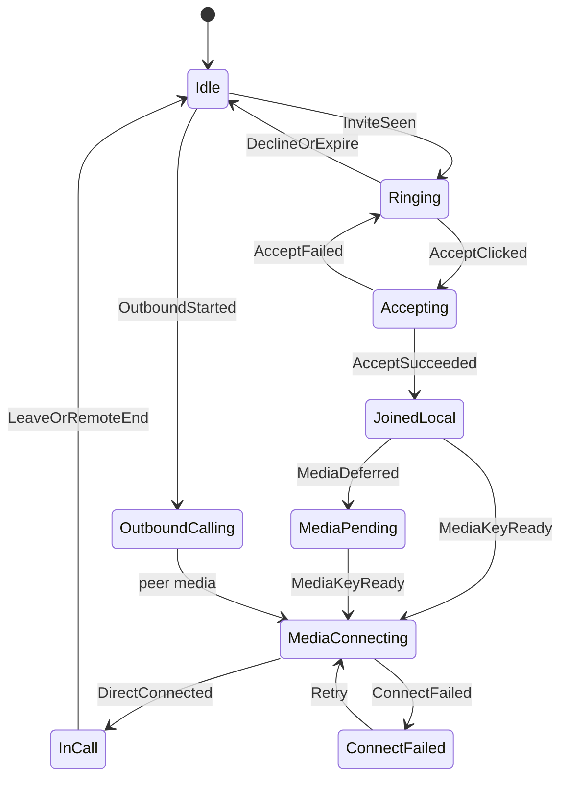
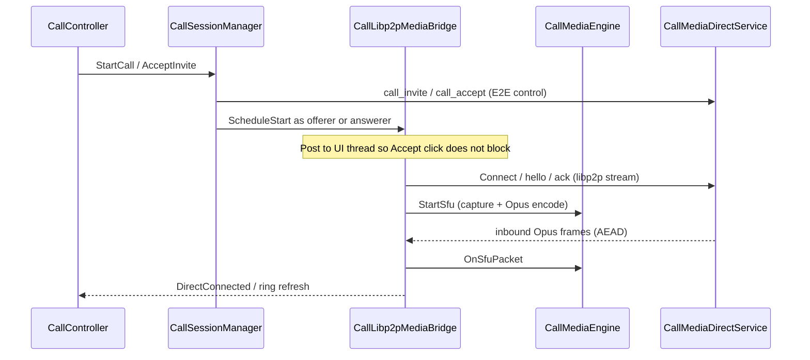
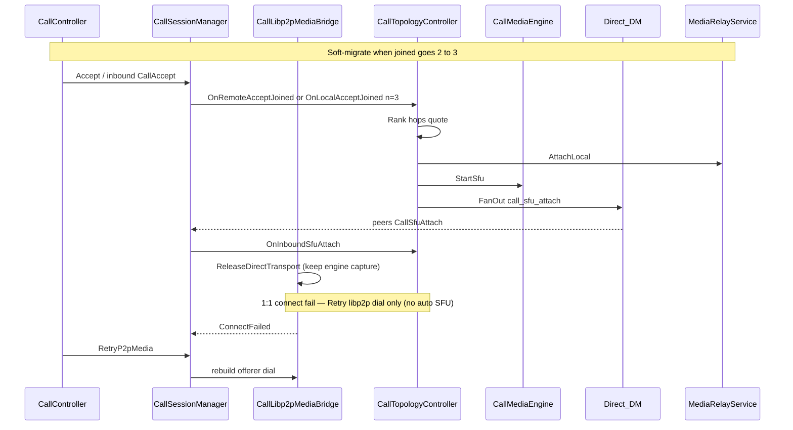

# Call domain architecture

**Tier:** architecture

**Product north star:** [NETWORKING.md](NETWORKING.md) — **HTTP + libp2p only**. Call media → **libp2p** ([V026](../../projects/p2p-av-calls/DECISIONS.md#v026--libp2p-only-call-media-http--libp2p-networking)). Wire-compat `call_sdp` / `call_ice` are ignored inbound; product does not send them.

**Mature code map** — planes, layer ownership, topology rules, session façade vs `CallTopologyController` / `CallLibp2pMediaBridge`.

**Open delivery work:** [`projects/p2p-av-calls/`](../../projects/p2p-av-calls/).  
**Product ADRs:** [DECISIONS.md](../../projects/p2p-av-calls/DECISIONS.md) (through **V032**).  
**Host receive / QoS matrix:** [HOST_RECEIVE_POLICY.md](../../projects/p2p-av-calls/HOST_RECEIVE_POLICY.md) (V032).  
**Transport session machines:** [SESSION_MACHINES.md](../../projects/p2p-av-calls/SESSION_MACHINES.md) (V033 s2a) · [MEDIA_RELAY_ATTACH.md](../../projects/p2p-mesh/MEDIA_RELAY_ATTACH.md) (N026 s3a+s3b) — dogfood gates open.  
**Wire controls:** [`contracts/WIRE_SCHEMAS.md`](../contracts/WIRE_SCHEMAS.md).  
**Messaging carrier:** [`P2P_MESSAGING.md`](P2P_MESSAGING.md).  
**SFU / mesh hop:** [`projects/p2p-mesh/`](../../projects/p2p-mesh/) (`media_relay`).  
**Hop dialability:** [`projects/media-hop-reachability/`](../../projects/media-hop-reachability/).

Do **not** restate the full product decision table here — link DECISIONS. Promote wire/disk shapes to `contracts/` when they harden. Dogfood “what works this week” lives only in project [CURRENT_STATE.md](../../projects/p2p-av-calls/CURRENT_STATE.md).

---

## Call lifecycle

1:1 call phases are owned by [`CallLifecycle`](../../src/feature/messaging/CallLifecycle.h) (`Idle` → `Ringing` / `OutboundCalling` → `Accepting` → `JoinedLocal` → `MediaPending` / `MediaConnecting` → `InCall` / `ConnectFailed`). `CallController` only posts clicks and paints chrome; session/media/listen report outcomes into `Apply(event)`.

| Owner | Responsibility |
|-------|----------------|
| **CallLifecycle** | Phase enum, transitions, thread policy, listen desire, `ShouldSuppressRing` |
| **CallController** | Rml clicks → `Apply(event)`; ring / in-call chrome via `apply_chrome_update` → ShellHost Remount / DirtyCallChrome |
| **CallSessionManager** | Persist session/invite/roster; encode/send controls; notify lifecycle |
| **CallLibp2pMediaBridge** | Media-key defer, dial/retry; report `MediaDeferred` / `DirectConnected` / `ConnectFailed` |
| **CallMediaDirectService** | 1:1 `/pp-browser/call-media/1.0.0` — hello, AEAD Opus frames; capture enqueues, **host IO thread** owns Yamux R/W |
| **MessagingHub** | N025 listen + mDNS as **lifecycle-driven** commands (`WantEphemeralListen`), not tick side effects |



### Ringing handling

Ring chrome is a **lifecycle phase**, not a free-standing UI poll of `TopPendingInvite`. The controller may observe pending invites to paint labels, but phase / listen / Accept sequencing go through `CallLifecycle`.


| Rule | Why |
|------|-----|
| `InviteSeen` → `Ringing` | Sole entry for inbound ring; arms N025 via `WantEphemeralListen` on IO |
| Chrome layer = `RemountCallChrome` | Mount into `#shell-call-*-mount` only. Full-shell `SyncLayout` breaks Samsung hit-testing. Always-mounted `data-if` + Dirty alone failed to reveal Accept despite idle Present |
| Labels/pulse/icons = `DirtyCallChrome` | Via `apply_chrome_update(DirtyOnly)` while layer already mounted; does not create the overlay |
| Accept → `Accepting` **before** IO work | Dismiss dialog on the next frame; never run `AcceptInvite` / listen / encrypt on the click thread |
| `ShouldSuppressRing(call_id)` while Accept in flight | `RefreshPendingRing` must not resurrect the dialog for the same invite |
| Accept fail → back to `Ringing` | Restore pending ring if invite still valid; clear `accepting_call_id_` |
| Decline / TTL expire / `call_ended` → `Idle` | Clear ring; stop listen when no other call need |
| Conflict (2nd invite while outbound/in-call) | Conflict copy (`End & Accept` / `Ignore`); Accept implies leave-other-except; single active call |
| Same-call duplicate pending | Keep in-call chrome; do not flip back to ring |

Instrument: INFO `phase=… event=…` and `WantEphemeralListen=` so “no AcceptIncoming” vs “Accept ok, media stuck” is obvious on Android (release emit floor promotes INFO → WARNING for `adb logcat -s pp-browser:W`).

Invite TTL / cancel (wire ageing, `call_ended` to Ringing peers) lives under [Two planes](#two-planes).

### Thread policy

| Work | Thread | Why |
|------|--------|-----|
| Rml click / `DirtyCallChrome` / `RemountCallChrome` | UI only | Return immediately; **never** full-shell `SyncLayout` for call overlays (Samsung hit-test) |
| `AcceptInvite` / `DeclineInvite` / `LeaveCall` / send prep | Worker Critical/Normal | Posted by lifecycle; Leave uses Critical |
| Prefetch / circuit / dial wait / `Connect` | Worker | Seconds-scale waits; aborted via `connect_generation_` on Leave |
| N025 `ListenOn` / Wire / mDNS | Worker → asio | Driven by lifecycle `WantEphemeralListen`, not inventing policy from tick alone |
| `CallMediaEngine::StartSfu` / `Stop` / SDL capture | **UI only** | Bridge posts Stop to UI when LeaveCall runs off-UI; never TearDown SDL on a worker |
| Hub / process shutdown | UI | Abort circuit → Detach media_relay → `LeaveCall` (CallEnded) → `PrepareForTeardown`; Detach **before** `CallMediaEngine::Stop` so SFU `BlockingWrite` cannot hang quit |
| Chrome refresh (`RefreshPendingRing` / `SyncShellState` / ringtone) | **Always hop to UI** + `apply_chrome_update` (Remount / DirtyCallChrome) + `RequestForceFrame` | Safe from worker **and coordinator**; Present depends on [THREADING.md UI delivery](THREADING.md#ui-delivery-pipeline) (mailbox liveness), not user input |

### Scenario matrix (v1)

| Scenario | Behavior |
|----------|----------|
| Incoming ring | `InviteSeen` → `Ringing`; Dirty-only chrome; listen desire on |
| Accept | Immediate `Accepting` + dismiss ring chrome + Connecting bar; worker AcceptInvite; suppress ring for accepting id |
| Decline / expire | Idle; listen desire off when no call |
| Outbound unanswered | Offerer `OutboundCalling` with no media past invite TTL (`kDefaultCallInviteTtlMs`) → auto-Leave; clears sticky Calling bar |
| Conflict (2nd invite) | Conflict copy; Accept leaves other local call first; single active call |
| Leave / remote end | Idle; `StopCallMedia` (Detach SFU then SDL Stop) on UI; LeaveCall on Critical |
| Answerer before key | `MediaDeferred` → `MediaPending` until `MediaKeyReady` |
| Offerer dial fail | `ConnectFailed`; Retry re-enters `MediaConnecting` |
| Listen fail / no bound port | Surface error; stay `MediaPending` / `ConnectFailed`; Retry re-arms listen |
| Stack rebuild | Bridge recreate only when `CallSessionManager*` changes |

**1:1 libp2p chrome:** connected when lifecycle is `InCall` (after `DirectConnected`) and media capture is active — not `StartSfu` alone. Bridge `CommitDirectConnected` sets engine `connected` whenever the direct stream is up.

---

## Two planes

| Plane | Carrier | Job |
|-------|---------|-----|
| **Signaling** | Direct E2E system `ChatPayload` (`call_invite`, `call_accept`, `call_sfu_attach`, …; wire-compat `call_sdp` / `call_ice` ignored) | Roster, invite/accept/leave, media-key epochs, SFU attach hints |
| **Media** | libp2p direct and/or blind `media_relay` | Opus voice-first; app E2E under call media key; SDL I/O |

Signaling rides the same P2P/messaging stack as chat. Media never goes through the chat relay as RTP; the SFU is a **blind forwarder** (no call media keys).

**Invite TTL / cancel:** default ring TTL is 60s. Inbox-delivered invites use relay `created_at` + poll `server_time` (age = server_time − created_at); drop when age exceeds TTL + small slack. Without those samples (direct delivery), wire `expires_at` may be re-armed only if still within skew slack of local now — long-backlogged invites are not re-armed. Cancel/end fans out `call_ended` to Joined **and** Ringing/Invited peers so late inbox delivery can clear the ring.


---

## Topology rules (V021 + V026)

| Joined N | Media path (target) | Notes |
|----------|---------------------|-------|
| 1 (ringing / solo) | No media yet | Invite outstanding |
| **2** | **Direct libp2p** when dialable; else mesh hop / circuit | V026 libp2p-only product path |
| **≥3** | **SFU** via `media_relay` hop | Soft-migrate same `call_id`; sticky initiator picks hop (re-pick: epoch coordinator) |

- Soft-migrate on 2→3: keep session/roster/key epoch; tear down 1:1 libp2p direct after SFU attach.
- Mid-call guest without a hop: refuse or eject — do **not** leave invitee on Connecting while existing peers stay on direct media.
- Legacy ICE-fail → SFU auto-recovery remains group-only; 1:1 recovery is libp2p dial/hop Retry (mesh).
- **Hop dial:** SoftMigrate uses contact/seed multiaddrs today; **target** is stack peerstore dialability — [media-hop-reachability](../../projects/media-hop-reachability/) (in-libp2p, H001/H007).

`CallMediaTopology` (`base/media/CallMediaAdaptation.*`) encodes N thresholds (`ShouldUseMediaRelay` = N≥3 only) until 1:1 hop policy is retargeted under V026.

---

## Lifecycle sequences

Module timing across the two planes. Product invite/roster rules stay in [DESIGN.md](../../projects/p2p-av-calls/DESIGN.md). Race mitigations summarized again under [Critical races](#critical-races-keep-documented-next-to-code).

### 1:1 happy path (N=2)



### Media-key defer (answerer before key)

Answerer may reach `JoinedLocal` before `CallMediaKey` arrives. `CallLibp2pMediaBridge` reports `MediaDeferred` → `MediaPending` until the key lands, then enters `MediaConnecting`.

### Soft-migrate 2→3 (V025)



---

## Layer ownership

Respect [`SRC_LAYOUT.md`](SRC_LAYOUT.md): `app → feature → base → common`.

| Concern | Layer | Today | Target |
|---------|-------|-------|--------|
| Session rows, invites, participants | `base/messaging` | `CallSessionStore`, `CallTypes`, `CallSessionLogic` | Unchanged |
| Control encode/decode | `base/messaging` | `CallControlCodec` | Unchanged |
| PC / Opus / H264 / SDL | `base/media` | `CallMediaEngine` | libp2p/SFU packet transport only |
| Adaptation policy | `base/media` | `CallMediaAdaptation`, `CallMediaTopology` | Unchanged |
| Session lifecycle + inbound dispatch | `feature/messaging` | **`CallSessionManager`** | Thin orchestrator |
| 1:1 phase / ring / listen desire | `feature/messaging` | **`CallLifecycle`** | Sole phase owner; see [Ringing handling](#ringing-handling) |
| 1:1 libp2p dial + connect-fail / Retry | `feature/messaging` | **`CallLibp2pMediaBridge`** | Primary 1:1 media path |
| Soft-migrate / attach-wait / hop pick | `feature/messaging` | **`CallTopologyController`** | Unchanged |
| Media keys wrap/unwrap | `feature/messaging` | `CallMediaKeyStore` | Unchanged |
| Ring / in-call chrome | `feature/ui` | `CallController`, `CallChromeSync`, `ShellCallChromeGesture`, `ShellHost::ApplyCallChromeUpdate` | Layer identity / control *presence* / **mode** (Expanded/Immersive/Minimized — V031) / status kind → remount; mute/speaker/camera icons → DirtyCallChrome (`data-attr-src` + `data-class-*--on`); meters/pulse/quality chip → DirtyCallChrome; mobile speaker via `CallAudioSession` |
| Call media health | `base/media` + `feature/ui` | `CallMediaHealth`, `CallMediaEngine::HealthSnapshot`, hop `HealthSnapshot`, `CallController::ApplyMediaHealth` / `ShowCallDetails` | Tier A quality bars always; Call details for everyone; debug subtitle + rich diagnostics behind profile `call_diagnostics` or `--debug`; `media_health` INFO ~2s |
| Blind SFU protocol | `libp2p/integration` | `MediaRelayService` | Unchanged |

UI must not choose P2P vs SFU. It posts clicks to `CallLifecycle` and paints from session + phase; it does not invent listen or media policy.

---

## Major systems (relationships)

### MessagingHub
Owns `CallSessionManager` + `CallLifecycle`, wires `MediaRelayDeps` (relay service, peer sessions, bootstrap seeds), executes N025 listen from lifecycle desire, and routes inbound call controls via `RelayReceivePipeline` → `ApplyInboundControl`.

### CallSessionManager (façade)
**Should own:** create/end session, invite/accept/decline/leave, roster fan-out, media-key rotate-on-leave, orphan cleanup after restart, inbound control **dispatch**.

**Should not own long-term:** libp2p stream lifecycle details, SFU quote/attach loops, or duplicated “if N≥3 …” trees in every accept path.

### CallMediaEngine
Single media backend for the process:

- **Direct 1:1:** `CallLibp2pMediaBridge` drives `StartSfu` with a send fn wired to `CallMediaDirectService`; inbound frames → `OnSfuPacket`.
- **Group SFU:** encode → `SfuSendFn` / inbound `OnSfuPacket` via `MediaRelayService`.
- Capture/playback and camera stay off the libp2p IO thread (mic TCC can block).

### CallController / shell
Maps ring + in-call chrome from lifecycle phase + session snapshot. **Layer appear/disappear** uses `ShellHost::RemountCallChrome` (dedicated mounts only) via `apply_chrome_update(Remount)`. **Labels / pulse / meters / icon toggles** use `DirtyCallChrome` while a layer is already mounted. Clicks → `CallLifecycle::Apply`; polls attach-wait only as a UI tick hook into the topology owner; must not invent topology or listen policy. CallController notifies ShellHost; it does not call grab-bag `DirtyWindow`.

**Do not** rely on always-mounted `data-if="call_ring_active"` alone to show Accept — dogfood showed C++ `active=true` + Present alive while the overlay stayed `display:none`. **Do not** full-shell `SyncLayout` for call chrome (Samsung Accept hit-test).

### media_relay (mesh)
Desktop/org Node capability. Blind hop ranks contact∪seed hops, quotes, attaches, fans out `call_sfu_attach`. Mobile may host ephemerally on Wi‑Fi (V027) with contacts-only *new* sessions.

**Who picks (V021 / V022):** first soft-migrate is the sticky **call initiator** (earliest `joined_at` = session payer). Mid-call invite: `CallAccept` reaches only the inviter (WaitForAttach); **CallRoster** drives `JoinedCountObserved` so the initiator SoftMigrates. Joiners without hint WaitForAttach. ICE re-pick is epoch coordinator only. Fan-out clears `quote_id` (peers `RequestQuote` locally).

**Hop preference:** durable Node PreferLocal (`AttachAsLocalHop`) when `prefer_local_as_hop`; then org seeds + contacts that advertised `caps.media_relay` on invite/accept (V030 — fail closed if missing). **Do not** PreferInCall phones as SFU host (V029). Guest attach failure → `call_sfu_attach_failed` with hop prefs; owner re-picks or `call_hop_refuse` with friendly copy.

**Call-scoped admission:** the first dialer (or local hop) that opens a `HostSession` for `call_id` must pass contact/scope admission. After that session exists, further dialers for the same `call_id` are admitted even if strangers to the hop (owner-picked hop serves the whole call, including mid-call joiners). Mobile stays non-Public for *new* sessions.

**Guest duplex recovery:** if a phone’s media-relay client duplex dies mid-call (`CloseSession` / hop `CleanupParticipant`), `MediaRelayService` notifies topology; guests re-`AcceptAndAttach` + re-subscribe without restarting capture (keeps publisher `stream_id`). Logs: `DuplexFrameSession CloseSession reason=…`, `client duplex lost`, `Guest SFU duplex lost — reattach`.

**1:1 → SFU track hygiene:** inbound call-media must map `remotePeerId` → that peer’s `relay:` via in-memory `peer_id_to_relay_` (from Invite/Accept `libp2p_peer_id` and/or listen `/p2p/`), optional contact upsert, and bridge `NotePeerIdRelayMapping` — never `P2pPeerIdentityForCall`, never hash bare PeerId. Works for **non-contact** call mates (map does not require a contact row). `BeginSession` / deferred `on_audio` rebinds when relay identity arrives after hello. After SoftMigrate attach, 1:1 `on_audio` is ignored; `ReleaseDirect` must **not** clear live media_relay tracks. Engine drops `stream_id==1` (empty identity).

**SoftMigrate 1:1 close race:** PreferLocal `ReleaseDirect` closes the call-media stream while capture stays up. Guests must not treat `read_eof` / `stream closed` as `ConnectFailed` when media is still active, SFU attach is expected (`Joined|Ringing|Invited` ≥ 3 / `sfu_hint` / attach-wait), or attach is already live. Hop side delays `ReleaseDirect` (~3.5s) and re-fans `CallSfuAttach` immediately before teardown (PreferLocal hop only — guests must not announce as hop owner).

**PreferLocal hearability dogfood:** guest→guest Fanout is proven (Samsung `OnSfuPacket` Moto `stream=3272724854`); unit test `PreferLocalHopFanoutGuestToLocal` covers guest→local hop owner. Aggregate `streams=2` can hide a stale track — `media_health` now logs per-stream `rx_streams=<id>:n=/age=/lvl=` plus `mic_lvl` / `peer_lvl`. After SoftMigrate, look for a second `OnSfuPacket first stream=3272724854` (first-log set clears on send-swap).

**Speaker vs mute / silent uplink:** `call_speaker` only toggles `CallAudioSession` route (`SetSpeakerphoneOn`); `call_mute` zeros PCM via `SetMuted`. They do not share state. PreferLocal dogfood (`call:72c511c4`): Linux RX of Moto stayed live (`age≈1`) but `lvl≈3e-5` while Moto `mic_lvl` collapsed to ~0 after SoftMigrate / speaker taps even as `tx_frames` rose — encode of silence, not a hop Fanout bug. Fix: Android `setCallSpeakerphoneOn` / `setCallAudioSessionActive` apply `AudioManager` **synchronously** (so SDL reopen sees the route) and re-assert `MODE_IN_COMMUNICATION`; SoftMigrate send-swap and speaker toggle call `RequestAudioDeviceReopen` so the capture worker closes+reopens SDL devices. Log: `ToggleSpeaker` / `reopening audio devices`.

**Android playout loudness (speaker whisper-quiet):** SDL AAudio defaults to **MEDIA** usage; under `MODE_IN_COMMUNICATION` Android ducks media, so speaker (and some OEM earpiece paths) sound very quiet even when RX/`peer_lvl` is healthy. Call open sets hint `SDL_ANDROID_AAUDIO_VOICE_COMMUNICATION` (vendored `SDL_aaudio.c`) → `AAUDIO_USAGE_VOICE_COMMUNICATION` + speech content + voice input preset. Java side: voice-call audio focus, API 31+ `setCommunicationDevice` for speaker/earpiece, and a floor on `STREAM_VOICE_CALL` if near mute. Expect log `AAudio voice-communication usage enabled`.

---

## Target internal design

Extract without changing the external façade (`MessagingHub::Calls()`, `CallController`).

### Pure units (`base/messaging`, gtest — no libp2p)

| Unit | Job |
|------|-----|
| `SoftMigrateLogic` | Who-picks: initiator first hop (V021/V022); `JoinedCountObserved` / `RemoteAcceptObserved`; ICE → coordinator |
| `SfuAttachWaitLogic` | Attach-wait poll; **no TimeoutLeave while migrate in flight** |
| `SfuAttachFanout` | Fan-out detail with empty `quote_id`; publisher stream id |
| `MeshHopPolicy` | Contact∪seed rank; Prefer contacts; `ExcludeSelfHop`; `PreferLocalMediaHop` / `PreferInCallMediaHops` |

### 1. `CallTopologyController` (feature adapter)
Responsibilities:

- Apply pure decisions; `MaybeSoftMigrateToSfu(call_id, trigger)`, `AttachLocalToSfu`, hop ranking via `IMediaRelayClient` / `IDialRegistry`
- Attach-wait deadline + timeout leave (group only) via `SfuAttachWaitLogic`
- Eject joiner when migrate fails but 1:1 P2P remains
- ICE `failed` recovery **only** when N≥3 (historical group path; no WebRTC PC in product)

State it owns: `sfu_attached_`, attach-wait call id/deadline, `awaiting_sfu_recovery_`, `soft_migrate_in_flight_`.  
Session manager asks: “joined count is now N — what media action?”

### 2. `CallLibp2pMediaBridge` (feature)
Responsibilities:

- `StartMediaAsOfferer` / `Answerer` + `Schedule*`
- Reachability (dial registry / circuit hop), hello/ack, AEAD Opus over direct stream
- Connect-fail / Retry for 1:1 libp2p dial
- `ReleaseDirectTransport` on soft-migrate (keep engine capture for SFU)

Does not decide SFU. Topology calls `StartSfu` / attach via session or engine APIs.

### 3. `CallSessionManager` (shrunk)
Keeps store updates + `ApplyInboundControl` switch. Each arm: decode → upsert roster/session → **one** call into topology or libp2p bridge.

### 4. Inbound control flow (target)

```text
ApplyInboundControl(type)
  → update CallSessionStore / keys as needed
  → switch type:
       CallAccept / participant join  → Topology.OnRosterChanged(n)
       CallSdp / CallIce              → ignore (wire compat)
       CallSfuAttach                  → Topology.AttachLocal(...)
       CallLeave / CallEnded          → Topology.Clear + L2P.Stop + EndCallLocal
```

---

## Critical races (keep documented next to code)

These are architectural, not one-off hacks.

| Race | Direction / symptom | Mitigation (home) |
|------|---------------------|-------------------|
| 1:1 enters SFU wait | “group needs media_relay” on direct call | Topology: SFU paths only for N≥3; ignore stale `sfu_hint` on 1:1 (V025) |
| 1:1 connect fail / hang | Connecting forever | Mark connect-failed + ~75s timeout; UI Retry rebuilds offerer dial; tip via `PlatformUserHints` |
| Mid-call invite from 2nd peer | Chrome gone after 45s | Initiator SoftMigrates on CallRoster (`JoinedCountObserved`); inviter WaitForAttach; attach-wait does not leave while migrate in flight |
| macOS Local Network | Android↔Mac LAN libp2p dial | Packaged `NSLocalNetworkUsageDescription` ([PLATFORMS.md](PLATFORMS.md)); on 1:1 connect fail UI tips Local Network |
| Accept on UI / ring stuck | Samsung frozen Accept dialog | CallLifecycle AcceptClicked + Dirty-only chrome; see [Ringing handling](#ringing-handling) |
| Answerer media before `CallMediaKey` | Hello rejected / silent call | `MediaDeferred` → key → `MediaConnecting`; offerer dial retry; **exhaustion → `ConnectFailed` + `call.error.media_key_timeout`** (not stuck MediaPending) |
| N025 listen on UI tick | UI hitch; `/tcp/0` advertised | Late bind in fork; lifecycle desire; start listen on IO; mDNS after bound port |
| Dual call-media dial (offerer fallback + late reverse-dial) | Connecting forever; Critical hello/ack deadlock; shutdown segfault | Offerer grace ≥ dial budget; handshake on Normal; one-stream adopt; reject inbound while outbound hello (`offerer_glare` / HelloOutbound); `ClearInboundHandler` on teardown — **home:** call-media session SM ([SESSION_MACHINES.md](../../projects/p2p-av-calls/SESSION_MACHINES.md) / V033 s2a) |
| SoftMigrate ReleaseDirect vs duplex EOF | Local Detach then `on_failed` / ConnectFailed | Intentional Detach sets Detaching/Idle first; late `Fail` ignored when already detaching — bridge still suppresses ConnectFailed when SFU expected |

### Transport session machines (V033 / N026)

Product phases stay in `CallLifecycle`. Long-lived **host** sessions use flat enum + phase logs:

| Concern | Home | Status |
|---------|------|--------|
| 1:1 call-media session (glare, adopt, Detach, timeout) | [SESSION_MACHINES.md](../../projects/p2p-av-calls/SESSION_MACHINES.md) · `CallMediaDirectService` | **s2a** — dogfood s2b |
| `media_relay` inbound quote/accept/attach | [MEDIA_RELAY_ATTACH.md](../../projects/p2p-mesh/MEDIA_RELAY_ATTACH.md) · `MediaRelayAttachPhase` | **s3a** |
| `media_relay` client `AcceptAndAttach` | same · `MediaRelayClientPhase` | **s3b** — SoftMigrate dogfood s3c |

Do **not** introduce a host-wide inbound-request SM; leave chat/history/dial-back as procedures.

---

## Extraction sequence

Landed (behavior-preserving + who-picks fix):

1. **Topology extract** — `CallTopologyController` owns soft-migrate / attach / wait / eject / hop helpers.
2. **Libp2p media bridge** — `CallLibp2pMediaBridge` owns schedule/dial/retry/stop-media + 1:1 connect-fail / Retry.
3. **Dispatch cleanup** — thin `ApplyInboundControl` arms call topology or libp2p bridge.
4. **Pure who-picks / wait / fan-out** — `SoftMigrateLogic`, `SfuAttachWaitLogic`, `SfuAttachFanout` + fakes (`IMediaRelayClient` / `IDialRegistry`).
5. **Tests** — `CallMediaTopology` N≥3-only; SoftMigrate / wait / fan-out / topology controller unit tests; `media_relay_service_test` loopback remains integration.
6. **m2 teardown** — removed `CallP2pSignalingBridge` + libdatachannel from build; wire-compat ignore for `call_sdp` / `call_ice`.

---

## File map

| Path | Role |
|------|------|
| `src/feature/messaging/CallLifecycle.*` | 1:1 phase machine — ring/accept/listen/media sequencing |
| `src/feature/messaging/CallSessionManager.*` | Façade — session + dispatch |
| `src/feature/messaging/CallMediaHost.h` | Narrow host façade for libp2p media side effects |
| `src/feature/messaging/CallLibp2pMediaBridge.*` | libp2p 1:1 media — key defer, dial/retry, connect-fail |
| `src/libp2p/integration/host/CallMediaDirectService.*` | Direct call-media protocol + IO-thread duplex pump |
| `src/libp2p/integration/host/CallMediaFrameCrypto.*` | AEAD frame wrap under call media key |
| `src/feature/messaging/CallTopologyController.*` | SFU / soft-migrate / attach-wait / hop-addr cache + gather |
| `src/feature/messaging/CallTopologyRelayDeps.h` | `IMediaRelayClient` / `IDialRegistry` + real wrappers |
| `src/feature/messaging/CallMediaKeyStore.*` | Epoch key wrap |
| `src/feature/ui/CallController.*` | Ring + in-call UI (thin; lifecycle clicks) |
| `src/base/media/CallMediaEngine.*` | Opus/H264/SDL capture; libp2p/SFU packet transport |
| `src/base/media/CallMediaAdaptation.*` | V024 + `CallMediaTopology` |
| `src/base/messaging/CallSessionStore.*` | Persistence |
| `src/base/messaging/CallSessionLogic.*` | Pure transitions / expiry / coordinator pick |
| `src/base/messaging/SoftMigrateLogic.*` | Pure who-picks |
| `src/base/messaging/SfuAttachWaitLogic.*` | Pure attach-wait poll |
| `src/base/messaging/SfuAttachFanout.*` | Fan-out shape + publisher stream id |
| `src/base/messaging/CallControlCodec.*` | Wire JSON for call controls |
| `src/base/people/MeshHopPolicy.*` | Contact∪seed hop rank / ExcludeSelfHop |
| `src/libp2p/integration/host/MediaRelayService.*` | Blind SFU |

---

## Related docs

| Doc | Use when |
|-----|----------|
| [RUNTIME_COMPOSITION.md](RUNTIME_COMPOSITION.md) | How Hub / shell / threads compose at runtime |
| [P2P_MESSAGING.md](P2P_MESSAGING.md) | Direct/group chat carrier under signaling |
| [PLATFORMS.md](PLATFORMS.md) | Mic/camera/Local Network per OS |
| [projects/p2p-av-calls/DESIGN.md](../../projects/p2p-av-calls/DESIGN.md) | Product design + entity model |
| [projects/p2p-av-calls/DECISIONS.md](../../projects/p2p-av-calls/DECISIONS.md) | V014–V033 ADRs |
| [projects/p2p-av-calls/SESSION_MACHINES.md](../../projects/p2p-av-calls/SESSION_MACHINES.md) | Transport session SM design (call-media; V033) |
| [projects/p2p-mesh/MEDIA_RELAY_ATTACH.md](../../projects/p2p-mesh/MEDIA_RELAY_ATTACH.md) | media-relay attach SM design (N026) |
