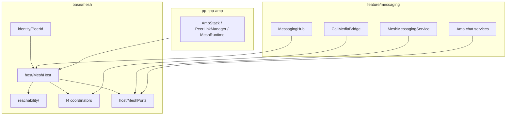

# Mesh layer

**Location:** `src/base/mesh/`  
**CMake:** `pp_base_mesh`, `pp_base_mesh_identity`

The mesh layer is the product peer-network runtime: identity, Amp composition, reachability, and L4 protocol hosting. It is not chat UX, HTTP Brief, or hop-ranking policy (those live in `feature/`).

## Architecture



## Directory layout

```
base/mesh/
  host/           MeshHost, MeshIdentityConfig, MeshPorts (IChatPeerLinks)
  identity/       PeerId derivation (ML-DSA → base58)
  reachability/   Reachability, NAT, LAN mDNS, dial-back
  l4/
    shared/       ProductChannelPolicies
    circuit/      CircuitTunnelCoordinator, AmpCircuitHopRegistry
    media_relay/  AmpMediaRelayCoordinator, MediaRelay*
    call_media/   CallMediaLegCoordinator, ICallMediaTransport
  tests/
```

## Feature boundary

Feature code accesses mesh only through **`MeshHost` narrow ports**:

| Port | Accessor | Use |
|------|----------|-----|
| Chat / dial | `MeshHost::ChatDeps()` → `IChatPeerLinks&` | Amp chat, history, blob, warm/dial |
| Circuit | `MeshHost::CircuitDeps()` | Circuit bridge, hop reach |
| Call-media transport | `CallMediaAmpTransport` via `CallStack` | Wire transport in mesh; `CallMediaBridge` in feature |

Feature must **not** `#include "amp/link/*"` in headers. Implementation `.cpp` files may include `amp/link/PeerLink.h` only where channel session binding requires it; new code should prefer `IChatPeerLinks`.

`IChatPeerLinks::LinkRoe` / `ChannelRoe` are `CodedRoe` aliases — stable `Err` codes match `PeerLinkManager` ([AMP-LINK-ERRORS.md](../contracts/AMP-LINK-ERRORS.md)). Inspect `Failure::GetCode()` for retry/backoff logic; use `message` for logs only.

`MeshHost::Amp()` remains for mesh tests and `AttachAmpStack` harnesses only.

## pp-node

Full `MeshHost` + `MeshHostConfig` flags (no slim `NodeMeshHost` subclass). See [NETWORKING.md](NETWORKING.md) and [projects/adp/STACK.md](../../projects/adp/STACK.md).

## Related docs

- [MESH_IDENTITY.md](MESH_IDENTITY.md) — PeerId derivation
- [projects/adp/STACK.md](../../projects/adp/STACK.md) — Amp stack
- [AMP-CHANNEL.md](../contracts/AMP-CHANNEL.md) — L3 channels
- [NETWORKING.md](NETWORKING.md) — product networking overview
- [projects/p2p-mesh/MESH_ORGANIZATION.md](../../projects/p2p-mesh/MESH_ORGANIZATION.md) — rename + consolidation notes

## Extraction checklist (future `pp-cpp-mesh`)

| Package | Contents |
|---------|----------|
| `pp-cpp-amp` | L1–L3 + link (extracted) |
| `pp-cpp-mesh` | `base/mesh` — host, identity, reachability, l4, ports |
| `pp-browser` | feature + app |

Invariants: `base/mesh` must not depend on `feature/*`; policy (`MeshHopPolicy`, `SoftMigrateLogic`) stays in browser.
