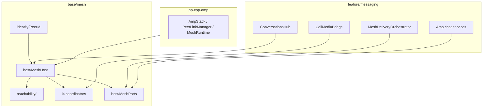

# Mesh layer

**Location:** `src/domain/mesh/`  
**CMake:** `pp_domain_mesh`, `pp_foundation_identity`

The mesh layer is the product peer-network runtime: identity, Amp composition, reachability, and L4 protocol hosting. It is not chat UX, HTTP Brief, or hop-ranking policy (those live in `feature/`).

## Architecture


```mermaid
flowchart TB
  subgraph amp [pp-cpp-amp]
    Stack[AmpStack / PeerLinkManager / MeshRuntime]
  end

  subgraph mesh [base/mesh]
    Host[host/MeshHost]
    Identity[identity/PeerId]
    Reach[reachability/]
    L4[l4 coordinators]
    Ports[host/MeshPorts]
  end

  subgraph feature [feature/messaging]
    Hub[ConversationsHub]
    MMS[MeshDeliveryOrchestrator]
    Chat[Amp chat services]
    Bridge[CallMediaBridge]
  end

  amp --> Host
  Identity --> Host
  Host --> L4
  Host --> Reach
  Host --> Ports
  Hub --> Host
  MMS --> Ports
  Chat --> Ports
  Bridge --> L4
```

## Directory layout

```
domain/mesh/
  host/           MeshHost, MeshIdentityConfig, MeshPorts (IChatPeerLinks)
  shared/         AmpChannelOpen, AmpParkUntil (PeerId derivation: foundation/identity)
  reachability/   Below MeshHost: Reachability(Engine), NAT, LAN mDNS, observed addrs;
                  dial_back/ (serve/ DialBackServer, client/ DialBackClient);
                  punch/ (AmpPunchCoordinator owns serve/ PunchServer — introducer + target — and
                  client/ PunchClientCoordinator — initiator)
  dht/            AmpDhtProtocol owns the record store, serve/ DhtServer, client/ DhtClient; codec, rate limiter
  discovery/      AmpDirectoryProtocol (serve/ DirectoryServer, client/ DirectoryClient),
                  MeshDirectoryCache, NameDirectory
  connectivity/   MeshConnectivity — reaching peers for every consumer: owns the dial registry +
                  listen book and circuit reach (with its punch / rendezvous pieces), hop-candidate
                  policy and the local view; lent to calls and broadcast
  media_plane/    MeshMediaRelay — the shared media_relay client, built on connectivity.
                  MediaRelayAttach (reach the hop, then quote / attach)
  reach/          Reach over a running MeshHost: PeerReachCoordinator, AmpCircuitHopReach,
                  PunchIntroducerWalk, CircuitRendezvousCoordinator, MeshReachPorts
  l4/
    shared/       ProductChannelPolicies, L4ProtocolIds, MediaFrameBody (e2e frame bodies)
    circuit/      wire types + policies; serve/ CircuitRelayServer; client/ CircuitClientCoordinator,
                  AmpCircuitHopRegistry
    media_relay/  wire types + decisions; serve/ MediaRelayServer; client/ MediaRelayClientCoordinator,
                  AmpMediaRelayClient, frame crypto (see SRC_LAYOUT § L4 protocols)
    call_media/   CallMediaLegCoordinator, ICallMediaTransport
  tests/
```

## Folder libraries

Each folder builds its own `pp_domain_mesh_<name>` static library; `pp_domain_mesh` is an interface
aggregate for consumers outside the peer. The `DEPS` in
[`src/domain/mesh/CMakeLists.txt`](../../src/domain/mesh/CMakeLists.txt) are the only allowed include
edges between folders — [`check_mesh_layers.sh`](../../scripts/check/check_mesh_layers.sh) reads them
(transitively) and fails on any other `#include "domain/mesh/…"`. Bottom to top:

```
shared          shared/ + l4/shared/
reachability    dht <- discovery    circuit <- media_relay    call_media
host            MeshHost composes the services above
reach           reach / rendezvous / punch walk over MeshHost
connectivity    MeshConnectivity
media_plane     MeshMediaRelay, MediaRelayAttach
```

A new edge is a `DEPS` change reviewed with the code; an upward include (a protocol reaching into
`host`, `host` into `reach`) means the code sits in the wrong folder.

## Feature boundary

Feature code accesses mesh only through **`MeshHost` narrow ports**:

| Port | Accessor | Use |
|------|----------|-----|
| Chat / dial | `MeshHost::ChatDeps()` → `IChatPeerLinks&` | Amp chat, history, blob, warm/dial |
| Circuit | `MeshHost::CircuitDeps()` | Circuit bridge, hop reach |
| Call-media transport | `CallMediaAmpTransport` via `CallStack` | Wire transport in mesh; `CallMediaBridge` in feature |
| Dial / reach / parking | `MeshConnectivity` (owned by `ConversationsHub`) | Borrowed by `CallStack` (`CallStackDeps::connectivity`); hop candidates injected by `MakeMeshConnectivityDeps` ([L015](../../projects/media-client-layers/DECISIONS.md#l015--a-neutral-meshmediaplane-in-domainmesh-owned-by-the-product-hub-lent-to-calls-and-broadcast)) |
| Media relay | `MeshMediaRelay` (owned by `ConversationsHub`, built on `MeshConnectivity`) | Borrowed by `CallStack` (`CallStackDeps::media_relay`) and broadcast (`RelayAttachPorts`) |

Feature must **not** `#include "amp/link/*"` in headers. Implementation `.cpp` files may include `amp/link/PeerLink.h` only where channel session binding requires it; new code should prefer `IChatPeerLinks`.

`IChatPeerLinks::LinkRoe` / `ChannelRoe` are `CodedRoe` aliases — stable `Err` codes match `PeerLinkManager` ([AMP-LINK-ERRORS.md](../contracts/AMP-LINK-ERRORS.md)). Inspect `Failure::GetCode()` for retry/backoff logic; use `message` for logs only. L4 coordinators must **wrap** link failures (not identity-map) per [CODED_FAILURE.md](../contracts/CODED_FAILURE.md).

`MeshHost::Amp()` remains for mesh tests and `AttachAmpStack` harnesses only.

## Link events and hygiene

Amp owns link liveness; the mesh layer only observes it ([ADR_LINK_PLANE §9–11](https://github.com/people-post/pp-cpp-amp/blob/develop/docs/ADR_LINK_PLANE.md), keepalive v2 in [KEEPALIVE.md](https://github.com/people-post/pp-cpp-amp/blob/develop/docs/KEEPALIVE.md)).

- **Events:** `MeshRuntime::AddLinkEventListener` posts `Connected` / `Dropped` (+ `LinkDropReason`) / `PathChanged` off the strand. `host/MeshLinkEventLog` logs them under `MeshLink` with `path=direct|punched|carrier`, the remote endpoint and RX age — INFO for connects and path changes, WARNING for the drop of a connected link, DEBUG for failed attempts.
- **Per-link, not per-peer:** a direct (ADP) link and a nested relay-carrier link to one PeerId coexist ([A024](../../projects/adp/DECISIONS.md#a024--amp-call-media-over-circuit--nested-session)); drops, waits and lookups key on `LinkHandle`, and `PeerLinkManager::FindConnectedLinkByPeerId(peer, TransportClass)` picks exactly one class. Call media binds a path to one handle and never follows an alias to "whatever now carries the peer" ([AMP-CHANNEL.md § Call-media bundle](../contracts/AMP-CHANNEL.md#call-media-bundle)).
- **Dual dial:** two associations to one PeerId of the same class (a simultaneous punch, a crossed dial) are elected down to one after both were Connected (`dual-dial-lost`). Consumers bound to the loser see an ordinary drop; call media rebinds quietly ([K011](../../projects/call-path-resilience/DECISIONS.md)).
- **Hygiene** (pp-cpp-amp v2.4.0): carrier-closed and failed-inbound links are dropped; only fresh authenticated packets move the path or prove liveness; OS-unreachable sends drop the link at once. Keepalive tiers: product **hot 10 s** (relay reservations, standby paths), **warm 25 s** (chat peers), cold otherwise (`AmpLinkConfig.h`).

### Local network change (call-path-resilience k5)

`foundation/platform/NetworkMonitor` reports material changes of the device's attachment (online, transport, cost, and a fingerprint of the default-route interfaces and their addresses). Backends: Linux rtnetlink (2 s poll fallback), macOS / iOS `NWPathMonitor`, Windows IP-helper notifications + `GetNetworkConnectivityHint`, Android `registerDefaultNetworkCallback` (`PpNetworkMonitor.java`). The owner of the mesh services starts it — `ConversationsHub` in the app, `ProductStackHarness` in `pp-call-probe` — and fans changes out with `ReactToNetworkChange` (`feature/calls/LocalNetworkReaction.h`):

| Change | Mesh (`MeshHost::OnLocalNetworkChanged`, `DecideLocalNetworkReaction`) | Calls (`CallMediaBridge::OnLocalNetworkChanged`) |
|--------|---------------------------|------------------|
| Online on a new attachment, or back online | Amp `NotifyNetworkChanged`: every direct link probed at once (the probe from the new address also moves the peer's path), silent ones dropped after 2 s (`network-changed`), dial backoffs cleared ([KEEPALIVE.md § Network change](https://github.com/people-post/pp-cpp-amp/blob/develop/docs/KEEPALIVE.md)); reachability re-probed 2.5 s later → advertised / punch addresses refreshed | Reconnecting: re-anchor once links settled (2.5 s); Live relayed (offerer): direct-upgrade punches start over |
| Offline | Nothing — probes into no route would drop every link; they may survive a short outage | Nothing |
| Cost / transport label only | Nothing (mobility policy, k6) | Nothing |

Hard lab: hard-w5 Phase-11 FLIP (peer-a changes address mid-call → reconnected on a new path in 2.3 s).

## pp-node

Full `MeshHost` + `MeshHostConfig` flags (no slim `NodeMeshHost` subclass). See [NETWORKING.md](NETWORKING.md) and [projects/adp/STACK.md](../../projects/adp/STACK.md).

## Related docs

- [MESH_IDENTITY.md](MESH_IDENTITY.md) — PeerId derivation
- [projects/adp/STACK.md](../../projects/adp/STACK.md) — Amp stack
- [AMP-CHANNEL.md](../contracts/AMP-CHANNEL.md) — L3 channels
- [NETWORKING.md](NETWORKING.md) — product networking overview
- [projects/p2p-mesh/MESH_ORGANIZATION.md](../../projects/p2p-mesh/MESH_ORGANIZATION.md) — rename + consolidation notes

## Extraction checklist (future `pp-cpp-mesh`)

| Package | Contents |
|---------|----------|
| `pp-cpp-amp` | L1–L3 + link (extracted) |
| `pp-cpp-mesh` | `base/mesh` — host, identity, reachability, l4, ports |
| `pp-browser` | feature + app |

Invariants: `base/mesh` must not depend on `feature/*`; policy (`MeshHopPolicy`, `SoftMigrateLogic`) stays in browser.
