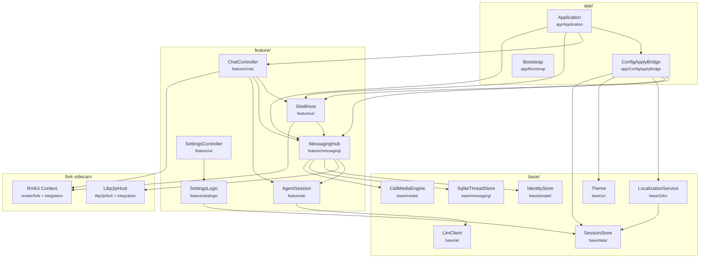
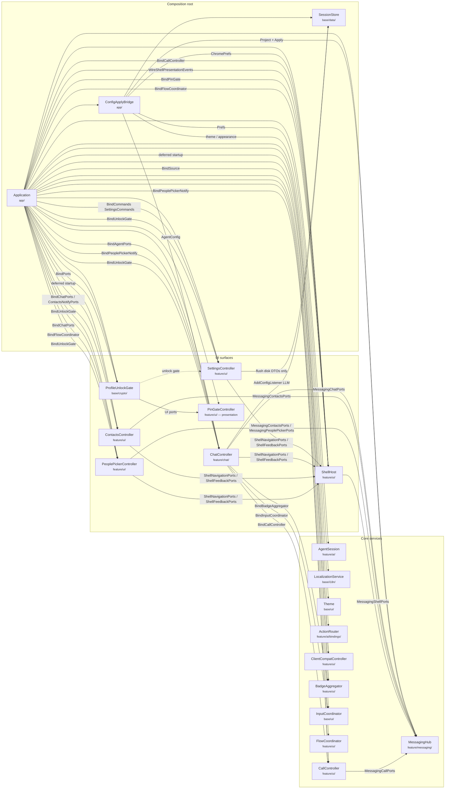
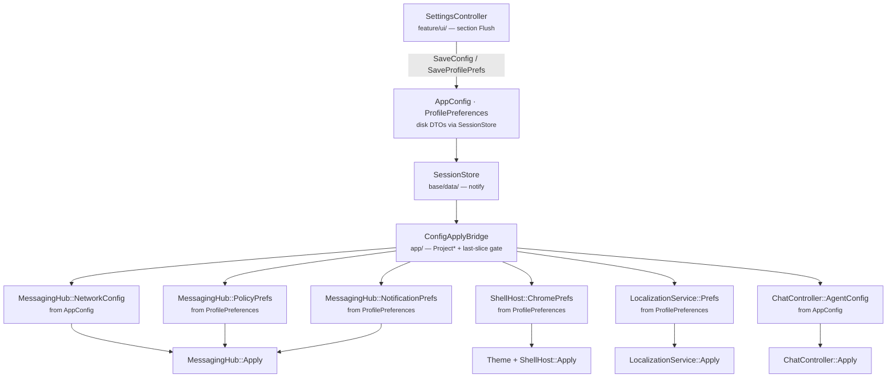
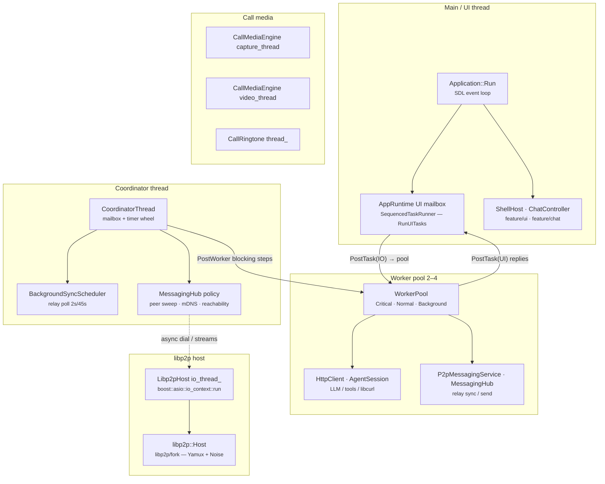

# Runtime composition

**Tier:** architecture  
**Related:** [ARCHITECTURE.md](ARCHITECTURE.md) (system overview), [SRC_LAYOUT.md](SRC_LAYOUT.md) (layers / includes), [UI_FUNCTIONAL_BOUNDARY.md](UI_FUNCTIONAL_BOUNDARY.md) (UI vs functional contracts), [ops/CONFIGURATION.md](../ops/CONFIGURATION.md) (disk DTOs → service slices).

How **Application** relates to the main service modules at runtime: ownership, feature-link order, settings hot-reload, and **threading** (UI / IO / libp2p / media).

For **what UI may call** (state / config / actions / events, facades vs ports), see [UI_FUNCTIONAL_BOUNDARY.md](UI_FUNCTIONAL_BOUNDARY.md). UI ↔ functional decoupling is **complete** (Phase 8, 2026-08): all presenters and `ShellHost` are app-owned; cross-presenter calls use notify ports or `Application` wiring.

## Layers (link / include direction)

```
app → feature → base → common
```

Feature libraries link acyclically: `settings → ai → messaging → ui → chat`. Cross-controller wiring and SessionStore fan-out live in `src/app/` ([`ConfigApplyBridge`](../../src/app/ConfigApplyBridge.h)).



## Runtime composition (who owns whom)

Solid arrows = ownership / wiring from the composition root. Dashed = coordination bridges (lifecycle or command hooks), not data ownership.



## Settings / prefs hot-reload

Disk DTOs stay in `SessionStore`. Services expose **nested** slice types (`MessagingHub::NetworkConfig`, `ShellHost::ChromePrefs`, …). [`ConfigApplyBridge`](../../src/app/ConfigApplyBridge.h) projects and applies only when a slice changes. Field-level howto: [CONFIGURATION.md](../ops/CONFIGURATION.md).



## Allowed edges (hot-reload / settings)

| From | To | Allowed? |
|------|-----|----------|
| Settings section flush | `SessionStore` SaveConfig / SaveProfilePrefs | Yes |
| Settings UI | `MessagingHub::Apply*` / mesh / invite policy | **No** — go through SessionStore → bridge |
| Settings UI | register / rotate / UPnP / clear undelivered / reset profile / appearance / locales / reachability / PIN status | Via `SettingsCommands` (narrow args + views; app-filled); UI syncs state after — **no** `BindMessaging` / `Hub()` |
| `ConfigApplyBridge` | nested `Apply` on services | Yes |
| ChatController | full `AppConfig` listener | **No** — agent slice via bridge |
| ChatController | `SetOnMessagingReady` / reachability | **No** — Application owns |
| Application Run loop | `MessagingHub::TickLibp2p` | **Removed** — hub policy on coordinator timer (t4) |
| UI presenter | Another controller `::Instance()` | **No** — coordinator or ports ([UI_FUNCTIONAL_BOUNDARY.md](UI_FUNCTIONAL_BOUNDARY.md)) |
| Functional system | `ShellHost::State()` mutation | **No** — UI ports / events |

## Threading

**Canonical doc:** [THREADING.md](THREADING.md) — coordinator + worker pool model, `AppRuntime` API.

UI on main thread; blocking work on **worker pool** via `AppRuntime::PostWorker`; **coordinator** owns timer-driven policy. libp2p and call media run their own loops.



### Thread inventory

| Thread / queue | Owner class | Location | Role |
|----------------|-------------|----------|------|
| **Main / UI** | `Application` + `AppRuntime` UI mailbox | `app/` · `base/runtime/` | SDL loop, RmlUi, shell/chat; drained by `RunUITasks()` |
| **Coordinator** | `CoordinatorThread` | `base/runtime/` | Mailbox + timer wheel; relay poll + hub policy |
| **Worker pool** | `WorkerPool` via `AppRuntime` | `common/` · `base/runtime/` | HTTP, LLM/tools, relay sync/send |
| **libp2p IO** | `Libp2pHost` | `libp2p/integration/host/` | `boost::asio::io_context` run loop |
| **Media capture / video** | `CallMediaEngine` | `base/media/` | Dedicated capture + video encode loops |
| **Ringtone** | `CallRingtone` | `base/media/` | Playback loop thread |
| **Notification watch** | `ILocalNotifier` (Linux) | `base/platform/desktop/` | D-Bus watcher; joined in `Shutdown` |

### Cross-thread rules of thumb

- **UI** owns RmlUi and controller mutations. `AppRuntime::PostUI` from pool/coordinator.
- **Worker pool** runs blocking HTTP, LLM, relay orchestration. `PostTaskAndReply` is pool → UI.
- **Coordinator** runs fast policy only; posts blocking steps to pool.
- **libp2p IO** stays non-blocking; integration hops to pool via `PostLibp2pWorker`.
- **Pause/resume:** `AppRuntime::PauseBackgroundWork` / `ResumeBackgroundWork` pauses coordinator + pool.

Full model: [THREADING.md](THREADING.md).

## Notable modules

| Class | Location | Role |
|-------|----------|------|
| **Application** | `app/` | Owns hub, shell, all presenters (`SettingsController`, `ContactsController`, `PeoplePickerController`, `ChatController`, `ShellHost`), `AgentSession`, ActionRouter / ClientCompat / BadgeAggregator / InputCoordinator / FlowCoordinator / CallController / ProfileUnlockGate / PinGate UI; binds ports; installs `ConfigApplyBridge` |
| **SessionStore** | `base/data/` | Live disk DTOs; notifies on save/reload |
| **ConfigApplyBridge** | `app/` | Projects nested service slices; fans out `Apply` |
| **MessagingHub** | `feature/messaging/` | P2P / inbox / identity / mesh; `LoadProfileIdentityView`, register, rotate; nested network/policy slices |
| **ActionRouter** | `feature/ai/bindings/` | Rml action → tool routing; app-owned |
| **ClientCompatController** | `feature/ui/` | Relay client-compat check; app-owned; deferred startup |
| **BadgeAggregator** | `feature/ui/` | Nav unread badges; app-owned; `BindSource` from MessagingHub; chat calls Refresh |
| **InputCoordinator** | `base/ui/` | Key bindings; app-owned; chat registers Enter-to-send |
| **FlowCoordinator** | `feature/ui/` | Modal overlay dismiss/step-back; app-owned; Shell + PeoplePicker |
| **CallController** | `feature/ui/` | Call ring / in-call chrome; app-owned; Shell binds for Rml chrome; chat starts/wakes |
| **PinGateController** | `feature/ui/` | PIN overlay presentation; UI ports for ProfileUnlockGate |
| **ProfileUnlockGate** | `base/crypto/` | Vault unlock policy + caller queue; messaging/UI via ports |
| **ShellHost** | `feature/ui/` | Window shell panes/nav; nested `ChromePrefs` |
| **LocalizationService** | `base/i18n/` | Locale catalogs; nested `Prefs` |
| **SettingsController** | `feature/ui/` | Me-tab UI + flush via `session_store` port; holds injected `SettingsCommands` only (no messaging bind) |
| **SettingsCommands** | `feature/settings/` | Ports for session, identity, locale, appearance, reachability, PIN status, imperative ops; app binds implementations |
| **ChatSessionPorts** | `feature/ui/` | Chat nav ports for contacts/people-picker; app-filled from `ChatController` |
| **ContactsNotifyPorts** | `feature/ui/` | Contacts refresh/select for chat; app-filled from `ContactsController` |
| **PeoplePickerNotifyPorts** | `feature/ui/` | Open-picker hooks for chat/call; app-filled from `PeoplePickerController` |
| **ProfileIdentityView** | `base/people/` | Presentation projection of local identity |
| **ChatController** | `feature/chat/` | Chat UI + agent; nested `AgentConfig` |
| **AgentSession** | `feature/ai/` | Turn plan/execute; bound from hub/chat |
| **AppRuntime** | `base/runtime/` | UI mailbox + worker pool + coordinator |
| **Libp2pHost** | `libp2p/integration/host/` | Vendored host + asio IO thread |
| **CallMediaEngine** | `base/media/` | A/V capture threads; encode/decode → libp2p direct or SFU send fn |