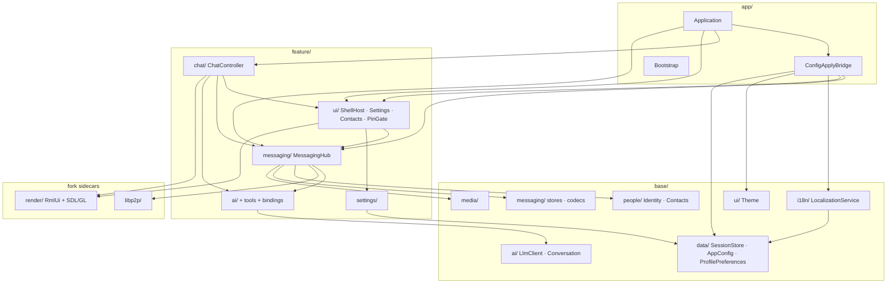
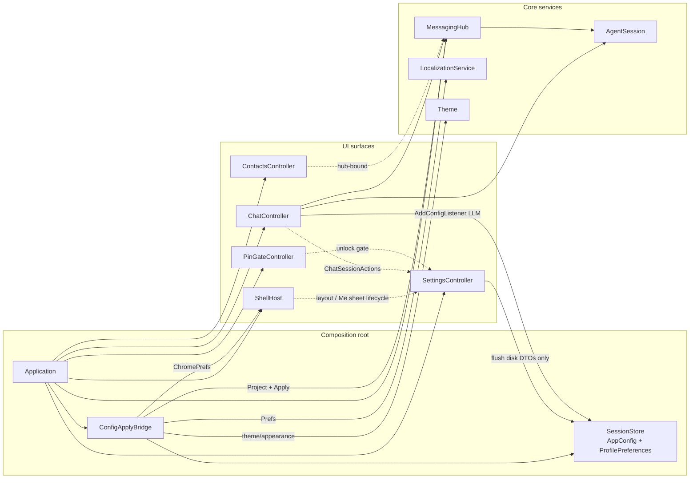
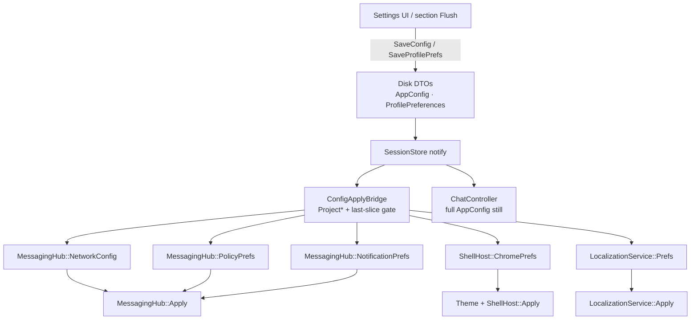

# Runtime composition

**Tier:** architecture  
**Related:** [ARCHITECTURE.md](ARCHITECTURE.md) (system overview), [SRC_LAYOUT.md](SRC_LAYOUT.md) (layers / includes), [ops/CONFIGURATION.md](../ops/CONFIGURATION.md) (disk DTOs → service slices).

How **Application** relates to the main service modules at runtime: ownership, feature-link order, and settings hot-reload.

## Layers (link / include direction)

```
app → feature → base → common
```

Feature libraries link acyclically: `settings → ai → messaging → ui → chat`. Cross-controller wiring and SessionStore fan-out live in `src/app/` ([`ConfigApplyBridge`](../../src/app/ConfigApplyBridge.h)).



## Runtime composition (who owns whom)

Solid arrows = ownership / wiring from the composition root. Dashed = coordination bridges (lifecycle or command hooks), not data ownership.



## Settings / prefs hot-reload

Disk DTOs stay in `SessionStore`. Services expose **nested** slice types (`MessagingHub::NetworkConfig`, `ShellHost::ChromePrefs`, …). [`ConfigApplyBridge`](../../src/app/ConfigApplyBridge.h) projects and applies only when a slice changes. Field-level howto: [CONFIGURATION.md](../ops/CONFIGURATION.md).



## Notable modules

| Module | Role |
|--------|------|
| **Application** | Owns hub lifetime, binds controllers, installs `ConfigApplyBridge` |
| **SessionStore** | Live disk DTOs; notifies on save/reload |
| **ConfigApplyBridge** | Projects nested service slices; fans out `Apply` |
| **MessagingHub** | P2P / inbox / identity / mesh; nested `NetworkConfig` / `PolicyPrefs` / `NotificationPrefs` |
| **ShellHost** | Window shell panes/nav; nested `ChromePrefs` |
| **LocalizationService** | Locale catalogs; nested `Prefs` |
| **SettingsController** | Me-tab UI + flush to SessionStore (not service apply) |
| **ChatController** | Chat UI + agent; still listens to full `AppConfig` for LLM |
| **AgentSession** | Turn plan/execute; bound from hub/chat |
