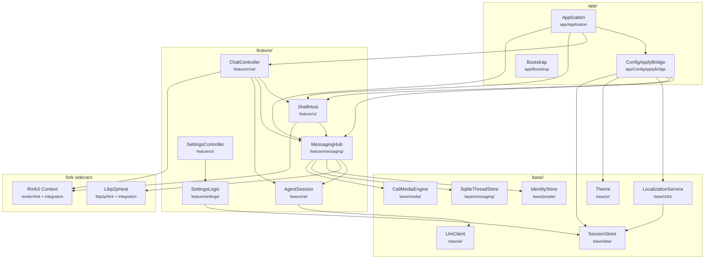
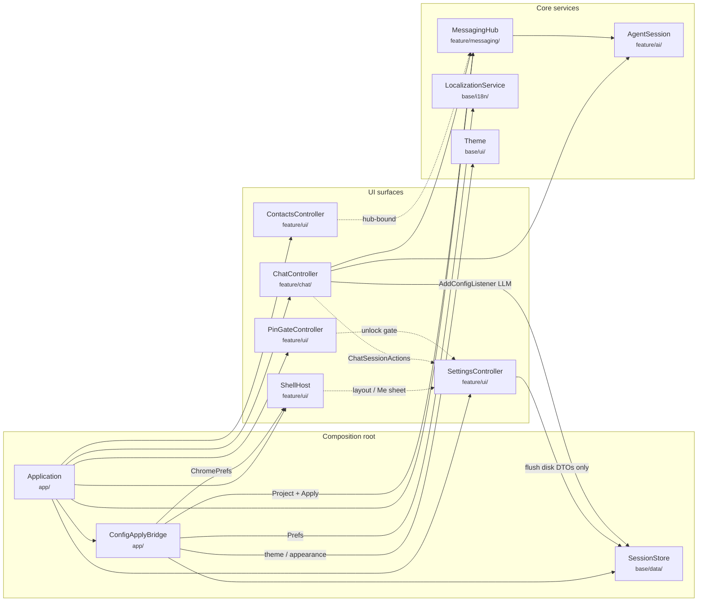
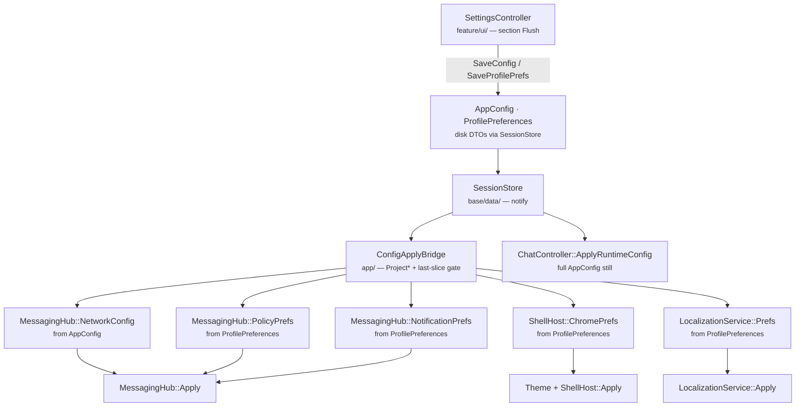
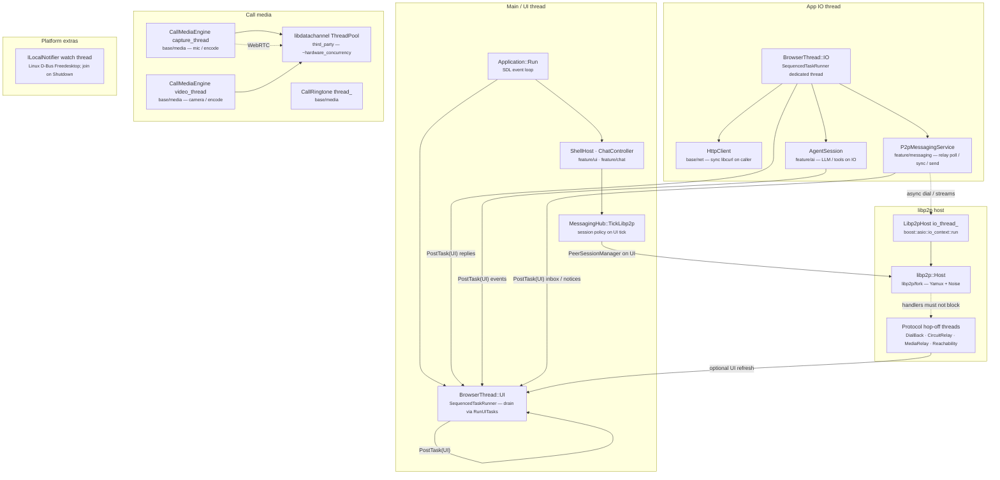

# Runtime composition

**Tier:** architecture  
**Related:** [ARCHITECTURE.md](ARCHITECTURE.md) (system overview), [SRC_LAYOUT.md](SRC_LAYOUT.md) (layers / includes), [ops/CONFIGURATION.md](../ops/CONFIGURATION.md) (disk DTOs → service slices).

How **Application** relates to the main service modules at runtime: ownership, feature-link order, settings hot-reload, and **threading** (UI / IO / libp2p / media).

## Layers (link / include direction)

```
app → feature → base → common
```

Feature libraries link acyclically: `settings → ai → messaging → ui → chat`. Cross-controller wiring and SessionStore fan-out live in `src/app/` ([`ConfigApplyBridge`](../../src/app/ConfigApplyBridge.h)).



## Runtime composition (who owns whom)

Solid arrows = ownership / wiring from the composition root. Dashed = coordination bridges (lifecycle or command hooks), not data ownership.



## Settings / prefs hot-reload

Disk DTOs stay in `SessionStore`. Services expose **nested** slice types (`MessagingHub::NetworkConfig`, `ShellHost::ChromePrefs`, …). [`ConfigApplyBridge`](../../src/app/ConfigApplyBridge.h) projects and applies only when a slice changes. Field-level howto: [CONFIGURATION.md](../ops/CONFIGURATION.md).



## Threading

pp-browser uses a small set of **owned** threads plus short-lived **hop-off** workers. UI work is sequenced on the main thread; blocking network/LLM work goes to `BrowserThread::IO`. libp2p and call media run their own loops.



### Thread inventory

| Thread / queue | Owner class | Location | Role |
|----------------|-------------|----------|------|
| **Main / UI** | `Application` + `BrowserThread::UI` | `app/` · `base/platform/` | SDL loop, RmlUi, shell/chat; UI runner has **no** dedicated thread — drained by `RunUITasks()` |
| **App IO** | `BrowserThread::IO` | `base/platform/` · `common/SequencedTaskRunner` | Dedicated thread: HTTP (libcurl), LLM/tool work, relay poll/sync/send |
| **libp2p IO** | `Libp2pHost` | `libp2p/integration/host/` | `boost::asio::io_context` run loop for the vendored host |
| **Protocol hop-offs** | `DialBackService`, `CircuitRelayService`, `MediaRelayService`, `ReachabilityService` | `libp2p/integration/host/` | Short-lived `std::thread`s so protocol handlers do not block the host IO thread |
| **Media capture / video** | `CallMediaEngine` | `base/media/` | Dedicated capture + video encode loops |
| **Ringtone** | `CallRingtone` | `base/media/` | Playback loop thread |
| **WebRTC pool** | libdatachannel `ThreadPool` (+ optional poll/ICE loops) | `third_party/libdatachannel/` | Vendored pool sized from `hardware_concurrency` |
| **Notification watch** | `ILocalNotifier` (Linux) | `base/platform/desktop/` | D-Bus ActionInvoked watcher; joined in `Shutdown` |

### Cross-thread rules of thumb

- **UI** owns RmlUi, shell state, and most controller mutations. Prefer `BrowserThread::PostTask(UI, …)` from IO / workers.
- **IO** owns blocking Brief HTTP (`HttpClient` / libcurl) and agent network work. `PostTaskAndReply` is IO → UI.
- **libp2p IO** must stay non-blocking for dials/reads; integration services hop to detached workers, then post results as needed.
- **`MessagingHub::TickLibp2p`** runs on the UI tick (from `ChatController`) for idle/session policy — not on the asio thread.
- Pause/resume: `AgentSession` may `BrowserThread::PauseIO` / `ResumeIO` around sensitive UI transitions.

## Notable modules

| Class | Location | Role |
|-------|----------|------|
| **Application** | `app/` | Owns hub lifetime, binds controllers, installs `ConfigApplyBridge` |
| **SessionStore** | `base/data/` | Live disk DTOs; notifies on save/reload |
| **ConfigApplyBridge** | `app/` | Projects nested service slices; fans out `Apply` |
| **MessagingHub** | `feature/messaging/` | P2P / inbox / identity / mesh; nested `NetworkConfig` / `PolicyPrefs` / `NotificationPrefs` |
| **ShellHost** | `feature/ui/` | Window shell panes/nav; nested `ChromePrefs` |
| **LocalizationService** | `base/i18n/` | Locale catalogs; nested `Prefs` |
| **SettingsController** | `feature/ui/` | Me-tab UI + flush to SessionStore (not service apply) |
| **ChatController** | `feature/chat/` | Chat UI + agent; still listens to full `AppConfig` for LLM |
| **AgentSession** | `feature/ai/` | Turn plan/execute; bound from hub/chat |
| **BrowserThread** | `base/platform/` | UI + IO sequenced runners |
| **Libp2pHost** | `libp2p/integration/host/` | Vendored host + asio IO thread |
| **CallMediaEngine** | `base/media/` | A/V capture threads over libdatachannel |