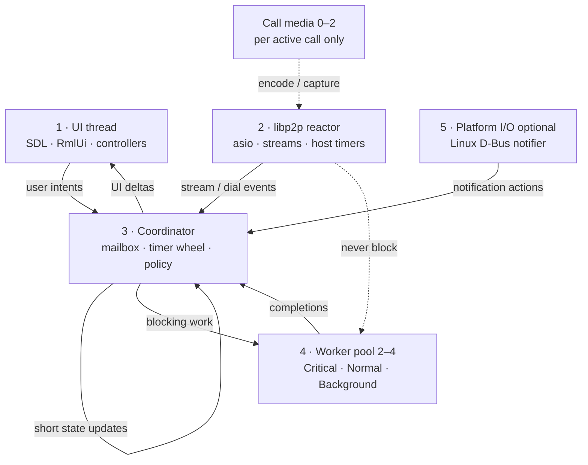

# Threading and async execution

**Tier:** architecture  
**Related:** [RUNTIME_COMPOSITION.md](RUNTIME_COMPOSITION.md) (runtime wiring), [UI_FUNCTIONAL_BOUNDARY.md](UI_FUNCTIONAL_BOUNDARY.md) (cross-thread UI rules), [CALLS.md](CALLS.md) (call media thread policy), [PLATFORMS.md](PLATFORMS.md) (wake / background sync).

How pp-browser schedules work across threads: **today's inventory**, **target fixed-role model**, and **migration principles**.

Implementation tracking: [`projects/thread-coordinator/PHASES.md`](../../projects/thread-coordinator/PHASES.md) (delete project folder when all phases ship).

---

## Goals

1. **Predictable thread budget** — fixed roles instead of unbounded detached workers.
2. **Non-blocking network reactor** — libp2p `io_context` never waits on curl, UPnP, or Argon2.
3. **Explicit priorities** — call control and signaling must not sit behind 30s PollInbox (learned on Samsung / N025 starvation).
4. **Single orchestration front door** — coordinator owns policy; handlers post events, not ad hoc cross-calls.
5. **Clean shutdown** — joinable workers with cancel tokens; no `.detach()` sprawl.

---

## Today (2026-08)

### Model

Two sequenced task runners plus separate libp2p IO and many hop-off threads:

| Role | Mechanism | Thread? |
|------|-----------|---------|
| **UI queue** | `BrowserThread::UI` → `SequencedTaskRunner(false)` | No — drained on main via `RunUITasks()` |
| **App IO queue** | `BrowserThread::IO` → `SequencedTaskRunner(true)`, name `pp-browser-io` | Yes |
| **libp2p reactor** | `Libp2pHost` → `boost::asio::io_context::run()` | Yes |
| **Hop-offs** | `WorkerPool` on `Libp2pHost` + remaining `.detach()` in messaging/calls | Integration layer migrated (t2); ~13 detach sites remain in `feature/messaging/` |
| **UI tick policy** | `MessagingHub::TickLibp2p`, `BackgroundSyncScheduler::Tick` | Main thread, not a dedicated watcher |

### Steady-state thread budget (typical desktop, messaging on, no call)

~**3–5** app-owned OS threads: main + `pp-browser-io` + libp2p IO + optional LAN mDNS + optional Linux D-Bus notifier watch (+ SDL audio internals).

During an active call on the legacy WebRTC path, add capture/video/ringtone threads and libdatachannel's global pool (`max(hardware_concurrency, 4)`).

### Cross-thread rules (current)

- **UI** owns RmlUi and controller mutations. Post via `BrowserThread::PostTask(UI, …)`; `WakeEventLoop()` breaks power-save waits.
- **Browser IO** runs sync libcurl (30s timeout), LLM/tools, most relay orchestration. `PostTaskAndReply` / `PostTaskFront` for IO → UI.
- **libp2p IO** stays non-blocking; integration services hop to detached workers, then post results.
- **`MessagingHub::TickLibp2p`** runs from `Application::Run` when messaging is ready.
- **Pause/resume:** `AppLifecycle` and `AgentSession` may `BrowserThread::PauseIO` / `ResumeIO`.

### Known debt

- Three parallel “IO” concepts (Browser IO, libp2p IO, detached hop-offs) — easy to pick the wrong one.
- No central worker pool; starvation fixes are per-site hop-offs.
- SQLite + mutex rather than a dedicated DB thread — safe if conventions hold.
- libdatachannel hidden pool on legacy call path.

See [RUNTIME_COMPOSITION.md § Threading (today diagram)](RUNTIME_COMPOSITION.md#threading) for the current mermaid topology.

---

## Target architecture

Fixed **roles** with a **coordinator mailbox** and **bounded worker pool**. Thread count is capped; concurrency within the pool is bounded.



### Role definitions

| # | Role | Owner (target) | Blocking allowed? | Responsibility |
|---|------|----------------|-------------------|----------------|
| **1** | **UI thread** | `Application` main loop | No | SDL events, RmlUi layout/render, presenter binding updates, drain UI mailbox |
| **2** | **libp2p reactor** | `Libp2pHost` | No | `io_context::run()`, inbound streams, outbound posts via `Libp2pHost::Post()`, host-native timers |
| **3** | **Coordinator** | `CoordinatorThread` (TBD) | **No** — dispatcher only | Single FIFO/priority mailbox; timer wheel; messaging/call/sync **policy**; posts work to pool; posts UI updates |
| **4** | **Worker pool** | `WorkerPool` (TBD) | **Yes** — only here | libcurl HTTP, UPnP, Argon2, long SQLite writes, protocol stream copy loops, LLM HTTP |
| **5** | **Platform I/O** | `ILocalNotifier` impls | Platform-specific | Linux: D-Bus watch thread (unchanged pattern). Android: JNI callbacks → coordinator mailbox |

**Call media** stays **outside** the general pool: 1–2 dedicated threads per active call (capture / video encode) — jitter-sensitive, real-time.

**Headless node** (`app/node/`): no UI thread; coordinator + libp2p + pool only.

### Coordinator mailbox

All non-UI threads **post messages** to the coordinator; the coordinator **does not** call blocking APIs.

Message shape (conceptual):

```
CoordinatorMessage {
  source:   UI | Libp2p | PushWake | Notifier | Timer | WorkerDone
  priority: Critical | Normal | Background
  deadline: optional monotonic time
  fn:       void()   // fast: update state, enqueue pool work, schedule timer, PostTask(UI)
}
```

**Timer wheel** on the coordinator replaces UI-tick polling for:

- Relay poll intervals (foreground ~2s, background ~45s — see `MessagingLimits.h`)
- Peer session idle sweep (~15s)
- Deferred retries, probe backoff, coalesced wake

Push wake (`PushWakeJni` → `RequestWakeSync`) and app foreground/background inject **immediate** coordinator messages instead of calling `BackgroundSyncScheduler::Tick` on the UI frame.

### Worker pool priorities

Three lanes replace `PostTaskFront` and detached hop-offs:

| Lane | Examples | Must not block |
|------|----------|----------------|
| **Critical** | `AcceptInvite`, call control, N025 / signaling RPC | Normal + Background |
| **Normal** | relay send/sync, chat history, directory fetch, agent tool HTTP | Background only |
| **Background** | UPnP probe, reachability, compaction, prefetch, PollInbox (long curl) | — |

Pool size: **2–4 threads** (fixed at init; tunable via config later). Queue depth exposed for diagnostics; coalesce duplicate work (PollInbox already uses atomics).

Worker completions post `WorkerDone` messages back to the coordinator — not directly to UI except via coordinator → `PostTask(UI)`.

### Thread affinity rules (target)

| Work kind | Run on |
|-----------|--------|
| RmlUi / shell / input | UI |
| libp2p dial, read handler setup, asio timer | libp2p reactor |
| “What should we do next?” policy | Coordinator |
| libcurl, UPnP, Argon2, long DB, stream copy | Worker pool |
| Mic/camera encode | Call media threads |
| Linux D-Bus read/write | Notifier watch → coordinator mailbox |

**Hard rule:** only worker pool threads may block on network or disk for longer than a few milliseconds.

### API compatibility (migration)

Keep stable call sites during migration:

| Today | Target |
|-------|--------|
| `BrowserThread::PostTask(UI, …)` | Unchanged |
| `BrowserThread::PostTask(IO, …)` | Coordinator enqueue Normal, or pool directly for known-blocking work |
| `BrowserThread::PostTaskFront(IO, …)` | Coordinator or pool **Critical** lane |
| `BrowserThread::PostTaskAndReply` | Pool work + coordinator → UI reply |
| `BrowserThread::PauseIO` / `ResumeIO` | Pause coordinator + pool (drain policy TBD in phase 1) |
| `Libp2pHost::Post()` | Unchanged |
| `run_heavy(work, on_done)` | Pool Background or Normal + UI reply |

Target location: `src/common/WorkerPool` (implemented, t1); coordinator in `src/base/platform/` (t4).

### Steady-state budget (target)

~**6–9** OS threads typical: UI + libp2p + coordinator + 2–4 workers + optional Linux notifier (+ call media when active).

No unbounded detach; libdatachannel pool removed when WebRTC legacy path is retired ([p2p-av-calls V026](../../projects/p2p-av-calls/CURRENT_STATE.md)).

---

## Design principles

1. **Coordinator is a dispatcher, not a worker** — if it might block, enqueue to the pool.
2. **One policy front door** — libp2p handlers and UI post intents; coordinator decides dial/poll/send.
3. **Priority is explicit** — three lanes, not ad hoc hop-off threads.
4. **Bounded concurrency** — fixed pool; metrics on queue depth and lane starvation.
5. **UI is pull** — coordinator pushes UI deltas; UI never waits on network.
6. **Media is special** — do not run Opus/H264 in the general pool.
7. **Join on shutdown** — pool and coordinator stop accepting work, cancel in-flight with tokens, join threads.

---

## Related third-party threading

| Library | Model | Action |
|---------|-------|--------|
| boost::asio / libp2p fork | Single `io_context` per host | Keep on role 2 |
| c-ares (libp2p fork) | Detached per DNS query | Migrate to pool Background |
| libcurl | Sync on caller | Pool only |
| SQLite | Caller + mutex | Pool for long writes; keep mutex discipline |
| libdatachannel | Global thread pool | Retire with WebRTC path |
| SDL3 | Internal audio/camera | Unchanged |

---

## Changelog

| Date | Change |
|------|--------|
| 2026-08-03 | Target coordinator + worker pool model; timer wheel on coordinator; migration plan in `projects/thread-coordinator/` |
| 2026-08-03 | Phase t2: libp2p integration hop-offs use `Libp2pHost::GetWorkerPool()` |
| 2026-08-03 | Phase t1: `WorkerPool` in `src/common/` with unit tests |
