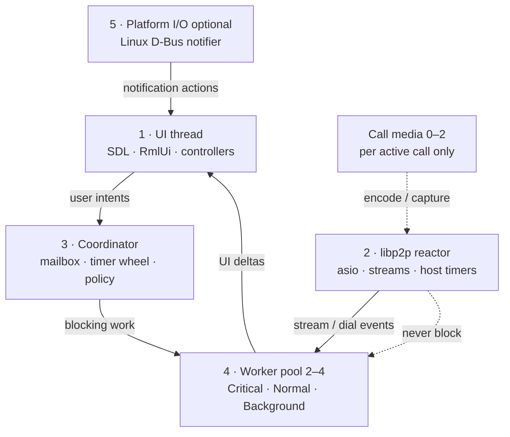

# Threading and async execution

**Tier:** architecture  
**Related:** [RUNTIME_COMPOSITION.md](RUNTIME_COMPOSITION.md) (runtime wiring), [UI_FUNCTIONAL_BOUNDARY.md](UI_FUNCTIONAL_BOUNDARY.md) (cross-thread UI rules), [CALLS.md](CALLS.md) (call media thread policy), [PLATFORMS.md](PLATFORMS.md) (wake / background sync).

How pp-browser schedules work across threads: fixed roles, coordinator mailbox, and bounded worker pool.

**Code map:** `PlatformRuntime`, `CoordinatorThread`, `WorkerPool` — `src/base/platform/`, `src/common/`.

---

## Goals

1. **Predictable thread budget** — fixed roles instead of unbounded detached workers.
2. **Non-blocking network reactor** — libp2p `io_context` never waits on curl, UPnP, or Argon2.
3. **Explicit priorities** — call control and signaling must not sit behind 30s PollInbox.
4. **Single orchestration front door** — coordinator owns policy; handlers post events, not ad hoc cross-calls.
5. **Clean shutdown** — joinable workers; minimal `.detach()` (documented exceptions only).

---

## Architecture

Fixed **roles** with a **coordinator mailbox** and **bounded worker pool**.

### Role inventory

| # | Role | Owner | Blocking? | Responsibility |
|---|------|-------|-----------|----------------|
| **1** | **UI thread** | `Application` main loop | No | SDL events, RmlUi, controllers; drain UI mailbox via `RunUITasks()` |
| **2** | **libp2p reactor** | `Libp2pHost` | No | `io_context::run()`, inbound streams, host-native timers |
| **3** | **Coordinator** | `CoordinatorThread` | No — dispatcher only | Priority mailbox; timer wheel; relay poll + hub policy; posts blocking work to pool |
| **4** | **Worker pool** | `WorkerPool` (2–4 threads) | Yes — only here | libcurl HTTP, UPnP, Argon2, SQLite writes, stream copy loops, LLM HTTP, legacy `BrowserThread::IO` posts |
| **5** | **Platform I/O** | `ILocalNotifier` impls | Platform-specific | Linux: D-Bus watch thread. Android: JNI → coordinator wake |

**Call media** stays outside the general pool: 1–2 dedicated threads per active call (capture / video encode).

**Headless node** (`app/node/`): no UI thread; coordinator + libp2p + pool only.

### Steady-state thread budget (typical desktop, messaging on, no call)

~**6–9** OS threads: main + coordinator + worker pool (2–4) + libp2p IO + optional LAN mDNS + optional Linux D-Bus notifier (+ SDL audio internals).

During an active call on the legacy WebRTC path, add capture/video/ringtone threads and libdatachannel's global pool.

See [RUNTIME_COMPOSITION.md § Threading](RUNTIME_COMPOSITION.md#threading) for the wiring diagram.

---

## Scheduling API

Composition root: `PlatformRuntime::Initialize()` / `Shutdown()` (from `Application` or `pp-node`).

| API | Runs on |
|-----|---------|
| `PlatformRuntime::PostUI` / `BrowserThread::PostTask(UI, …)` | UI (sequenced, drained each frame) |
| `PlatformRuntime::PostWorker(Critical/Normal/Background, …)` | Worker pool |
| `PlatformRuntime::PostCoordinator(Critical/Normal/Background, …)` | Coordinator mailbox |
| `PlatformRuntime::ScheduleCoordinatorRepeating` / `OneShot` | Coordinator timer wheel |
| `BrowserThread::PostTask(IO, …)` | Worker pool **Normal** (compat alias) |
| `BrowserThread::PostTaskFront(IO, …)` | Worker pool **Critical** (compat alias) |
| `BrowserThread::PostTaskAndReply` | Pool Normal → UI |
| `BrowserThread::PostTaskFrontAndReply` | Pool Critical → UI |
| `BrowserThread::PauseIO` / `ResumeIO` | Coordinator + pool pause/resume |
| `PostLibp2pWorker` (integration) | Worker pool via `WorkerDispatch` |

Libp2p integration uses `PostLibp2pWorker`; unit tests fall back to a private per-host pool when dispatch is not installed.

### Worker pool priorities

| Lane | Examples |
|------|----------|
| **Critical** | `AcceptInvite`, call control, N025 / signaling RPC, `PostTaskFront(IO)` |
| **Normal** | relay send/sync, chat history, directory fetch, agent tool HTTP, `PostTask(IO)` |
| **Background** | UPnP probe, reachability, compaction, prefetch, PollInbox |

### Coordinator timer wheel

Drives periodic policy (not UI frame ticks):

- Relay poll: foreground ~2s, background ~45s (`MessagingLimits.h`) — `BackgroundSyncScheduler`
- Hub policy: peer sweep, mDNS, reachability UX — `MessagingHub` (~1s)
- Peer idle sweep: ~15s internal to `PeerSessionManager::Tick`

Push wake (`PushWakeJni` → `RequestWakeSync`) posts an immediate **Critical** coordinator message.

### Cross-thread rules

- **UI** owns RmlUi and controller mutations. Post via `BrowserThread::PostTask(UI, …)`; `WakeEventLoop()` breaks power-save waits.
- **Worker pool** runs sync libcurl (30s timeout), LLM/tools, relay orchestration.
- **Coordinator** runs fast policy only; must not block — enqueue to pool.
- **libp2p IO** stays non-blocking; integration services hop to pool via `PostLibp2pWorker`.
- **Pause/resume:** `AppLifecycle` uses `BrowserThread::PauseIO` / `ResumeIO` on background/foreground.

### Thread affinity

| Work kind | Run on |
|-----------|--------|
| RmlUi / shell / input | UI |
| libp2p dial, read handler setup, asio timer | libp2p reactor |
| Periodic sync / hub policy | Coordinator timers |
| libcurl, UPnP, Argon2, long DB, stream copy | Worker pool |
| Mic/camera encode | Call media threads |
| Linux D-Bus | Notifier watch thread → UI activation handler |

**Hard rule:** only worker pool threads may block on network or disk for longer than a few milliseconds.

---

## Design principles

1. **Coordinator is a dispatcher, not a worker** — if it might block, enqueue to the pool.
2. **One policy front door** — timer wheel + wake paths; avoid UI-tick polling for sync.
3. **Priority is explicit** — three lanes, not ad hoc hop-off threads.
4. **Bounded concurrency** — fixed pool (2–4 threads at init).
5. **UI is pull** — workers/coordinator push UI deltas; UI never waits on network.
6. **Media is special** — do not run Opus/H264 in the general pool.
7. **Join on shutdown** — pool and coordinator stop accepting work and join.

---

## Known debt

| Item | Location | Notes |
|------|----------|-------|
| c-ares DNS TXT | `src/libp2p/fork/.../cares.cpp` | `.detach()` per query — fork cannot link `pp_common`; defer until libp2p executor hook |
| Call ringtone playback | `src/base/media/CallRingtone.cpp` | `.detach()` for SDL audio loop — media-specific |
| Linux notifier → coordinator | `LocalNotifier_Linux.cpp` | Activations post to UI today; coordinator mailbox optional |
| SQLite + mutex | thread stores | No dedicated DB thread — safe if conventions hold |
| libdatachannel pool | legacy WebRTC path | Retire with [p2p-av-calls V026](../../projects/p2p-av-calls/CURRENT_STATE.md) |

---

## Related third-party threading

| Library | Model | Policy |
|---------|-------|--------|
| boost::asio / libp2p fork | Single `io_context` per host | libp2p reactor only |
| c-ares (libp2p fork) | Detached per DNS query | Migrate to pool when fork allows |
| libcurl | Sync on caller | Pool only |
| SQLite | Caller + mutex | Pool for long writes |
| libdatachannel | Global thread pool | Retire with WebRTC path |
| SDL3 | Internal audio/camera | Unchanged |

---

## Changelog

| Date | Change |
|------|--------|
| 2026-08-03 | Call chrome: hop `OnCallWake` / `RefreshPendingRing` to UI from coordinator relay poll; unanswered outbound TTL clears sticky Calling bar |
| 2026-08-03 | **Shipped:** coordinator + worker pool model live; `pp-browser-io` retired; project folder archived |
| 2026-08-03 | Phase t5: `BrowserThread::IO` → worker pool |
| 2026-08-03 | Phase t4: `CoordinatorThread` + timer wheel |
| 2026-08-03 | Phase t3/t3.5: messaging hop-offs + `PlatformRuntime` |
| 2026-08-03 | Phase t2: libp2p integration hop-offs |
| 2026-08-03 | Phase t1: `WorkerPool` in `src/common/` |
