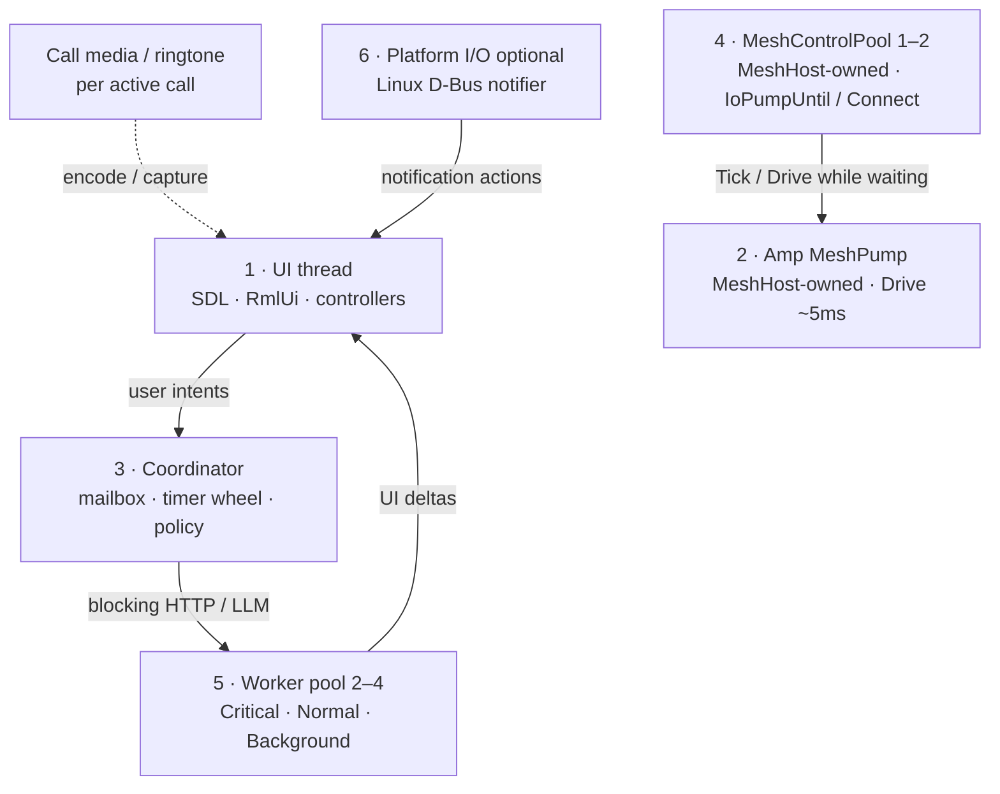

# Threading and async execution

**Tier:** architecture  
**Related:** [RUNTIME_COMPOSITION.md](RUNTIME_COMPOSITION.md) (runtime wiring), [UI_FUNCTIONAL_BOUNDARY.md](UI_FUNCTIONAL_BOUNDARY.md) (cross-thread UI rules), [CALLS.md](CALLS.md) (call media thread policy), [PLATFORMS.md](PLATFORMS.md) (wake / background sync), [OWNERSHIP.md](OWNERSHIP.md) (parent-only destroy / abort-before-join).

How pp-browser schedules work across threads: fixed roles, coordinator mailbox, Amp mesh pump, mesh-control waiters, and bounded worker pool.

**Code map:** `AppRuntime`, `CoordinatorThread`, `WorkerPool` — `src/foundation/runtime/`, `src/common/`; Amp pump + mesh-control pool — `MeshHost` (`src/domain/mesh/host/`).

---

## Goals

1. **Predictable thread budget** — fixed roles instead of unbounded detached workers.
2. **Non-blocking product policy** — coordinator never waits on curl, UPnP, Argon2, or Amp dial waits.
3. **Explicit priorities** — call control and signaling must not sit behind 30s PollInbox.
4. **Single orchestration front door** — coordinator owns policy; handlers post events, not ad hoc cross-calls.
5. **Clean shutdown** — joinable workers; minimal `.detach()` (documented exceptions only).
6. **Hybrid ownership** — own threads for long-lived fixed-cardinality roles; share `WorkerPool` for heterogeneous / fan-out blocking work.

---

## Architecture

Fixed **roles** with a **coordinator mailbox**, **MeshHost-owned Amp pump**, **mesh-control waiter pool**, and **bounded general worker pool**.



### Hybrid ownership rules

| Own a thread when… | Share `WorkerPool` when… |
|--------------------|--------------------------|
| Role is long-lived, fixed cardinality, abort/join lifecycle of its own | Work is event-fan-out, sync I/O, or must compete under Critical/Normal/Background |
| Examples: Amp MeshPump, MeshControlPool, CallMediaEngine, CallRingtone, LAN mDNS, Linux notifier | Examples: libcurl PollInbox, LLM/tools, Argon2 unlock, SQLite writes, attachment drain queue, icon HTTP |

Contain unbounded item fan-out with **internal queues** on the shared pool (e.g. `AttachmentFetchWorkflow::DrainQueue`), not one thread per item.

### Role inventory

| # | Role | Owner | Blocking? | Responsibility |
|---|------|-------|-----------|----------------|
| **1** | **UI thread** | `Application` main loop | No | SDL events, RmlUi, controllers; drain UI mailbox via `RunUITasks()` |
| **2** | **Amp MeshPump** | `MeshHost` (`MeshPumpThread`) | No — short `Drive` | `MeshRuntime::Drive()` ~5ms; Amp has no async reactor / no libp2p `io_context` |
| **3** | **Coordinator** | `CoordinatorThread` | No — dispatcher only | Priority mailbox; timer wheel; relay poll + hub policy (~1s); posts blocking work to pool |
| **4** | **Mesh control** | `MeshHost` (`MeshControlPool`, default 1) | Yes — remaining sync L4 parks | Reachability probe / punch / chat waits; product parks sleep while MeshPump Drives (no Tick from control) |
| **5** | **Worker pool** | `WorkerPool` (2–4 threads) | Yes — only here for product HTTP/LLM/disk | libcurl HTTP, UPnP, Argon2, SQLite writes, LLM HTTP, attachment drain |
| **6** | **Platform I/O** | `ILocalNotifier` impls | Platform-specific | Linux: D-Bus watch thread. Android: JNI → coordinator wake |

**Call media** stays outside the general pool: dedicated capture / video / playout / ringtone threads per active call.

**Headless node** (`app/node/`): no UI thread; coordinator + MeshHost pump/control + pool.

### Steady-state thread budget (typical desktop, messaging on, no call)

~**main + coordinator + MeshPump + MeshControl (1) + WorkerPool (2–4) + optional LAN mDNS + optional Linux D-Bus notifier** (+ SDL audio internals).

During an active call, add SDL capture/video/ringtone threads.

See [RUNTIME_COMPOSITION.md § Threading](RUNTIME_COMPOSITION.md#threading) for the wiring diagram.

---

## Scheduling API

Composition root: `AppRuntime::Initialize()` / `Shutdown()` (from `Application` or `pp-node`). Mesh pump and mesh-control are started/stopped with `MeshHost::Start` / `Stop`.

| API | Runs on |
|-----|---------|
| `AppRuntime::PostUI` | UI (sequenced, drained each frame) |
| `AppRuntime::PostWorker(Critical/Normal/Background, …)` | Worker pool |
| `AppRuntime::PostCoordinator(Critical/Normal/Background, …)` | Coordinator mailbox |
| `AppRuntime::ScheduleCoordinatorRepeating` / `OneShot` | Coordinator timer wheel |
| `AppRuntime::PostWorkerNormal` / `Critical` / `Background` | Worker pool lanes |
| `AppRuntime::PostWorkerAndReplyOnUI` | Pool → UI |
| `AppRuntime::PauseBackgroundWork` / `ResumeBackgroundWork` | Coordinator + **general** pool only (not MeshPump / MeshControl / media) |
| `MeshHost::PostControl` | MeshControlPool (Connect / `IoPumpUntil` waits) |

### Worker pool priorities

| Lane | Examples |
|------|----------|
| **Critical** | `AcceptInvite`, call control signaling that must not wait behind PollInbox |
| **Normal** | relay send/sync, chat history HTTP, directory fetch, agent tool HTTP |
| **Background** | UPnP probe, reachability HTTP, compaction, prefetch, PollInbox |

### Coordinator timer wheel

Drives periodic **policy** (not Amp UDP drain):

- Relay poll: foreground ~2s, background ~45s (`MessagingLimits.h`) — `BackgroundSyncScheduler`, armed from `ConversationsHub::StartCoordinatorTimers`
- Hub policy: peer sweep, mDNS, reachability UX — `ConversationsHub` (~1s)
- Peer idle sweep: ~15s internal where applicable

Amp UDP drain is **MeshHost MeshPump**, not a coordinator timer.

Push wake (`PushWakeJni` → `RequestWakeSync`) posts an immediate **Critical** coordinator message.

### Cross-thread rules

- **UI** owns RmlUi and controller mutations. Post via `AppRuntime::PostUI`.
- **UI delivery (hard):** a non-empty UI mailbox must be drained and Presentable soon — power-save must not starve it. `PostTask(UI)` → `SetUIWakeCallback` → `Backend::RequestForceFrame` (force next poll + `WakeEventLoop`). Idle wait is **Poll + ≤50ms Delay slices** (never `SDL_WaitEventTimeout`). See [PLATFORMS.md](PLATFORMS.md).
- **Worker pool** runs sync libcurl (30s timeout), LLM/tools, relay orchestration.
- **Coordinator** runs fast policy only; must not block — enqueue to pool.
- **Amp MeshPump** runs short `Drive` only; must not run curl / Argon2 / long DB.
- **MeshControlPool** may block on dial / `IoPumpUntil` while calling `MeshHost::Tick` (mutex-serialized with the pump).
- **Pause/resume:** `AppLifecycle` uses `AppRuntime::PauseBackgroundWork` / `ResumeBackgroundWork` on background/foreground. Mesh pump/control follow mesh lifetime (stop with `MeshHost::Stop`), same idea as media.

### UI delivery pipeline

Coordinator / workers push deltas; they must not assume paint. Four stages:

```text
Produce (coordinator / worker)
  → PostTask(UI) + RequestForceFrame
  → Frame drain (ProcessEvents returns → RunUITasks → Update → Present)
  → Chrome observation (mounted DOM + hit targets — not “bool dirty” alone)
```

| Stage | Contract |
|-------|----------|
| Produce | May run off UI; do not mutate RmlUi / shell chrome here |
| Mailbox | `AppRuntime` sequenced UI queue; `HasPendingUITasks()` is observable |
| Drain | Idle wait must return within ≤50ms when forced / woken; cap idle ≤2s always |
| Observe | Call ring visibility = `RemountCallChrome` into mounts; SyncLayout / toasts are also mailbox citizens — same SLA. Logs that prove state (`call_ring.active`) do **not** prove paint |

Do **not** couple relay poll cadence back to `ChatController::Update` for liveness. Poll stays on the coordinator (`ConversationsHub::StartCoordinatorTimers`); UI liveness is the frame loop’s job. Call-wake UI refresh is `ConversationsHub::SetOnCallWake` → `CallController::OnCallWake` (hopped to UI).

### Thread affinity

| Work kind | Run on |
|-----------|--------|
| RmlUi / shell / input | UI |
| Amp `Drive` / L3 mux affinity | MeshPump (and MeshControl while `IoPumpUntil`) |
| Periodic sync / hub policy | Coordinator timers |
| libcurl, UPnP, Argon2, long DB | Worker pool |
| Amp control waits (`IoPumpUntil`, Connect grace) | MeshControlPool |
| Mic/camera encode | Call media threads |
| Linux D-Bus | Notifier watch thread → UI activation handler |

**Hard rule:** only worker-pool and mesh-control threads may block on network or disk for longer than a few milliseconds. Amp data-plane progress is `MeshRuntime::Drive` on the pump (and nested `Tick` from control waiters).

**Peer honesty (Amp / peer streams):** do not park the **general** `WorkerPool` on peer-facing waits. Prefer async IO + local deadline + hard cancel. Call-media hello/ack is async+deadline; blocking bridge `Connect()` and remaining `IoPumpUntil` facades run on **MeshControlPool** as an interim until async `Connect(cb)` / A022-style callbacks. Details: [SESSION_MACHINES.md — Peer honesty rule](../../projects/p2p-av-calls/SESSION_MACHINES.md#peer-honesty-rule-stream-waits).

### Amp / mesh executors

| Class | Dispatch | Examples |
|-------|----------|----------|
| **Pump** | `MeshPumpThread` | `MeshRuntime::Drive`, DHT host tick |
| **Control** | `MeshControlPool` | reachability / remaining sync L4 parks (ConnectAsync no longer holds a control thread) |
| **Compute / HTTP** | App `WorkerPool` | Brief HTTP, LLM, Argon2, SQLite |

Shared Amp helpers live under `pp-cpp-amp` + `domain/mesh/`. Frame size caps: `pp::amp::AmpChannelLimits`.

---

## Design principles

1. **Coordinator is a dispatcher, not a worker** — if it might block, enqueue to the pool; Amp UDP is MeshPump, not the coordinator.
2. **One policy front door** — timer wheel + wake paths; avoid UI-tick polling for sync.
3. **Priority is explicit** — three general-pool lanes, not ad hoc hop-off threads.
4. **Bounded concurrency** — fixed general pool; fixed mesh-control size.
5. **UI is pull** — workers/coordinator push UI deltas; UI never waits on network.
6. **UI mailbox liveness** — power-save is an optimization; it must not defer `RunUITasks` / Present until user input.
7. **Media is special** — do not run Opus/H264 in the general pool.
8. **Join on shutdown** — abort inflight → join MeshControl → join MeshPump → join general pool / coordinator. `AppRuntime::Shutdown` clears `ThreadRuntime::running_` then joins **before** uninstalling `WorkerDispatch`. In-flight `PostWorker` no-ops once `!IsRunning()` (and the pool no-ops once `stopped_`), so nested posts during join neither assert nor race onto another live worker. `ConversationsHub::RequestShutdown` must run **before** that join so unlock → `EnsureMessagingReady` discards mesh bring-up instead of finishing Amp during join (StopMesh after a dead pool segfaulted).

---

## Shutdown order (product)

```text
RequestExit → HideWindow (<100ms close feel)
→ RequestShutdown → AbortCallMediaForShutdown (PrepareForTeardown non-blocking)
→ MeshHost::Stop (abort L4 → MeshControlPool::Shutdown(≤500ms) → join MeshPump)
→ AppRuntime::Shutdown (coordinator + general WorkerPool)
→ destroy hub / secrets / RmlUi / Backend::Shutdown
```

**Budgets (initial):**
- Window hide: immediate on `Backend::RequestExit` / start of `Application::Shutdown`
- `CallMediaBridge::PrepareForTeardown(0)`: abort + generation bump only (no sleep-spin)
- `MeshControlPool::Shutdown`: join ≤500ms; on timeout detach workers and leak pool until process exit
- Full graceful exit target: ~3s wall clock (dogfood); measure with `[startup]` shutdown marks

Timeline marks (grep `[startup]`): `shutdown_begin`, `shutdown_window_hidden`,
`shutdown_abort_call_media_done`, `shutdown_stop_mesh_done`, `shutdown_runtime_join_done`,
`shutdown_backend_quit_done`, `shutdown_complete`.

Parent-only destroy: children request stop; only the owner joins and drops (`OWNERSHIP.md`).

---

## Known debt

| Item | Location | Notes |
|------|----------|-------|
| WorkerPool / coordinator join still unbounded | `pp-cpp-common` WorkerPool + AppRuntime | Needs tagged common release for `Shutdown(deadline)`; MeshControlPool already budgeted |
| Sync L4 test wrappers | AmpCircuitHopReach / AmpMediaRelayClient / SoftMigrate sync façades | Product paths Async; sync wrappers for tests (empty-pump park) |
| Detached MeshControl on join timeout | MeshHost::StopOwnedThreads | Loud log + `unique_ptr::release`; process must exit soon after |
| Call ringtone playback | `src/domain/media/CallRingtone.cpp` | Async `Stop` uses a joinable `joiner_` (Accept-safe); `StopAndJoin` before `SDL_Quit` |
| Linux notifier → coordinator | `LocalNotifier_Linux.cpp` | Activations post to UI today; coordinator mailbox optional |
| SQLite + mutex | thread stores | No dedicated DB thread — safe if conventions hold |

---

## Related third-party threading

| Library | Model | Policy |
|---------|-------|--------|
| asio (`pp-node` status HTTP) | `io_context` | Status server only (not mesh) |
| libcurl | Sync on caller | General WorkerPool only |
| SQLite | Caller + mutex | Pool for long writes |
| SDL3 | Internal audio/camera | Unchanged |

---

## Changelog

| Date | Change |
|------|--------|
| 2026-09-09 | Shutdown latency: HideWindow on RequestExit; PrepareForTeardown(0); MeshControlPool join ≤500ms; shutdown timeline marks |
| 2026-09-09 | CallMediaBridge peer-reach Async; CallSessionManager SoftMigrate nudge uses SoftMigrateAsync (no Worker park) |
| 2026-09-09 | Circuit hop TryEnsure*Async + CallStack punch Async; SoftMigrate/Attach/Reattach await dialability Async |
| 2026-09-09 | SoftMigrate/AttachLocalToSfu/ReattachGuest Async — MeshControl no longer parks on media-relay quote/attach |
| 2026-09-09 | Media-relay RequestQuoteAsync/AcceptAndAttachAsync; CallStack uses MeshHost io_pump (no Tick-from-waiters) |
| 2026-09-09 | Reachability probe async (ProbeAsync + PostToIo); announce PublishAndPush*Async; MeshControl no longer parks on seed dial |
| 2026-09-09 | Amp MeshPump + MeshControlPool owned by MeshHost; coordinator no longer 5ms Amp drain; docs drop libp2p reactor assumptions |
| 2026-08-03 | Call Accept layer: `RemountCallChrome` (dedicated mounts); not always-mounted `data-if` + Dirty alone |
| 2026-08-03 | Relay poll owned by `ConversationsHub::StartCoordinatorTimers` (not ChatController WireMessagingBindings); immediate wake sync on arm; `SetOnCallWake` from Application |
| 2026-08-03 | **UI delivery:** `PostTask(UI)` → `RequestForceFrame`; idle = Poll+≤50ms Delay (no WaitEventTimeout); mid-idle abort on ForceFrame/wake; liveness contract in Cross-thread rules |
| 2026-08-03 | Call chrome + UI mailbox: hop ring refresh to UI; `RequestForceFrame` when UI tasks pending / SyncLayout; WakeEventLoop always pushes (no coalesce-drop); unanswered outbound TTL |
| 2026-08-03 | **Shipped:** coordinator + worker pool model live; `pp-browser-io` retired; project folder archived |
| 2026-08-03 | Phase t5: `BrowserThread::IO` → worker pool |
| 2026-08-03 | Retire `BrowserThread`; UI mailbox lives on `AppRuntime` |
| 2026-08-03 | Phase t4: `CoordinatorThread` + timer wheel |
| 2026-08-03 | Phase t3/t3.5: messaging hop-offs + `AppRuntime` |
| 2026-08-03 | Phase t2: libp2p integration hop-offs |
| 2026-08-03 | Phase t1: `WorkerPool` in `src/common/` |
