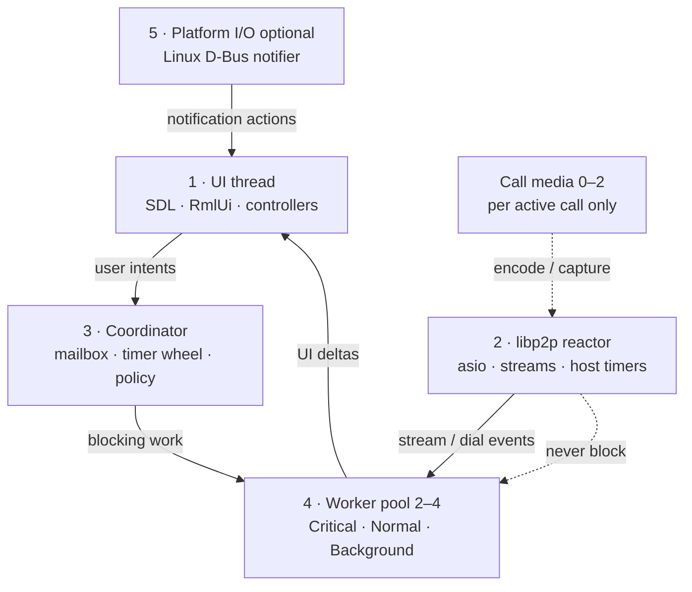

# Threading and async execution

**Tier:** architecture  
**Related:** [RUNTIME_COMPOSITION.md](RUNTIME_COMPOSITION.md) (runtime wiring), [UI_FUNCTIONAL_BOUNDARY.md](UI_FUNCTIONAL_BOUNDARY.md) (cross-thread UI rules), [CALLS.md](CALLS.md) (call media thread policy), [PLATFORMS.md](PLATFORMS.md) (wake / background sync).

How pp-browser schedules work across threads: fixed roles, coordinator mailbox, and bounded worker pool.

**Code map:** `AppRuntime`, `CoordinatorThread`, `WorkerPool` — `src/base/runtime/`, `src/common/`.

---

## Goals

1. **Predictable thread budget** — fixed roles instead of unbounded detached workers.
2. **Non-blocking network reactor** — libp2p `io_context` never waits on curl, UPnP, or Argon2.
3. **Explicit priorities** — call control and signaling must not sit behind 30s PollInbox.
4. **Single orchestration front door** — coordinator owns policy; handlers post events, not ad hoc cross-calls.
5. **Clean shutdown** — joinable workers; minimal `.detach()` (documented exceptions only).

---

## Architecture

Fixed **roles** with a **coordinator mailbox** and **bounded worker pool**.



### Role inventory

| # | Role | Owner | Blocking? | Responsibility |
|---|------|-------|-----------|----------------|
| **1** | **UI thread** | `Application` main loop | No | SDL events, RmlUi, controllers; drain UI mailbox via `RunUITasks()` |
| **2** | **libp2p reactor** | `Libp2pHost` | No | `io_context::run()`, inbound streams, host-native timers |
| **3** | **Coordinator** | `CoordinatorThread` | No — dispatcher only | Priority mailbox; timer wheel; relay poll + hub policy; posts blocking work to pool |
| **4** | **Worker pool** | `WorkerPool` (2–4 threads) | Yes — only here | libcurl HTTP, UPnP, Argon2, SQLite writes, stream copy loops, LLM HTTP |
| **5** | **Platform I/O** | `ILocalNotifier` impls | Platform-specific | Linux: D-Bus watch thread. Android: JNI → coordinator wake |

**Call media** stays outside the general pool: 1–2 dedicated threads per active call (capture / video encode).

**Headless node** (`app/node/`): no UI thread; coordinator + libp2p + pool only.

### Steady-state thread budget (typical desktop, messaging on, no call)

~**6–9** OS threads: main + coordinator + worker pool (2–4) + libp2p IO + optional LAN mDNS + optional Linux D-Bus notifier (+ SDL audio internals).

During an active call, add SDL capture/video/ringtone threads and libp2p call-media IO on the host thread.

See [RUNTIME_COMPOSITION.md § Threading](RUNTIME_COMPOSITION.md#threading) for the wiring diagram.

---

## Scheduling API

Composition root: `AppRuntime::Initialize()` / `Shutdown()` (from `Application` or `pp-node`).

| API | Runs on |
|-----|---------|
| `AppRuntime::PostUI` | UI (sequenced, drained each frame) |
| `AppRuntime::PostWorker(Critical/Normal/Background, …)` | Worker pool |
| `AppRuntime::PostCoordinator(Critical/Normal/Background, …)` | Coordinator mailbox |
| `AppRuntime::ScheduleCoordinatorRepeating` / `OneShot` | Coordinator timer wheel |
| `AppRuntime::PostWorkerNormal` / `Critical` / `Background` | Worker pool lanes |
| `AppRuntime::PostWorkerAndReplyOnUI` | Pool → UI |
| `AppRuntime::PauseBackgroundWork` / `ResumeBackgroundWork` | Coordinator + pool pause/resume |
| `PostLibp2pWorker` (integration) | Worker pool via `WorkerDispatch` |

Libp2p integration uses `PostLibp2pWorker`; unit tests fall back to a private per-host pool when dispatch is not installed.

### Worker pool priorities

| Lane | Examples |
|------|----------|
| **Critical** | `AcceptInvite`, call control, N025 / signaling RPC, `PostTaskFront(IO)` |
| **Normal** | relay send/sync, chat history, directory fetch, agent tool HTTP, `PostTask(IO)` |
| **Background** | UPnP probe, reachability, compaction, prefetch, PollInbox |

### Coordinator timer wheel

Drives periodic policy (not UI frame ticks):

- Relay poll: foreground ~2s, background ~45s (`MessagingLimits.h`) — `BackgroundSyncScheduler`, armed from `MessagingHub::StartCoordinatorTimers`
- Hub policy: peer sweep, mDNS, reachability UX — `MessagingHub` (~1s)
- Peer idle sweep: ~15s internal to `PeerSessionManager::Tick`

Push wake (`PushWakeJni` → `RequestWakeSync`) posts an immediate **Critical** coordinator message.

### Cross-thread rules

- **UI** owns RmlUi and controller mutations. Post via `AppRuntime::PostUI`.
- **UI delivery (hard):** a non-empty UI mailbox must be drained and Presentable soon — power-save must not starve it. `PostTask(UI)` → `SetUIWakeCallback` → `Backend::RequestForceFrame` (force next poll + `WakeEventLoop`). Idle wait is **Poll + ≤50ms Delay slices** (never `SDL_WaitEventTimeout`). See [PLATFORMS.md](PLATFORMS.md).
- **Worker pool** runs sync libcurl (30s timeout), LLM/tools, relay orchestration.
- **Coordinator** runs fast policy only; must not block — enqueue to pool.
- **libp2p IO** stays non-blocking; integration services hop to pool via `PostLibp2pWorker`.
- **Pause/resume:** `AppLifecycle` uses `AppRuntime::PauseBackgroundWork` / `ResumeBackgroundWork` on background/foreground.

### UI delivery pipeline

Coordinator / workers push deltas; they must not assume paint. Four stages:

```text
Produce (coordinator / worker)
  → PostTask(UI) + RequestForceFrame
  → Frame drain (ProcessEvents returns → RunUITasks → Update → Present)
  → Chrome observation (mounted DOM + hit targets — not “bool dirty” alone)
```

| Stage | Contract |
|-------|----------|
| Produce | May run off UI; do not mutate RmlUi / shell chrome here |
| Mailbox | `AppRuntime` sequenced UI queue; `HasPendingUITasks()` is observable |
| Drain | Idle wait must return within ≤50ms when forced / woken; cap idle ≤2s always |
| Observe | Call ring visibility = `RemountCallChrome` into mounts; SyncLayout / toasts are also mailbox citizens — same SLA. Logs that prove state (`call_ring.active`) do **not** prove paint |

Do **not** couple relay poll cadence back to `ChatController::Update` for liveness. Poll stays on the coordinator (`MessagingHub::StartCoordinatorTimers`); UI liveness is the frame loop’s job. Call-wake UI refresh is `MessagingHub::SetOnCallWake` → `CallController::OnCallWake` (hopped to UI).

### Thread affinity

| Work kind | Run on |
|-----------|--------|
| RmlUi / shell / input | UI |
| libp2p dial, read handler setup, asio timer | libp2p reactor |
| Periodic sync / hub policy | Coordinator timers |
| libcurl, UPnP, Argon2, long DB | Worker pool |
| libp2p control RPC (short) | Worker pool |
| libp2p data-plane stream pumps | Host io_context (async) |
| Mic/camera encode | Call media threads |
| Linux D-Bus | Notifier watch thread → UI activation handler |

**Hard rule:** only worker pool threads may block on network or disk for longer than a few milliseconds — **except** libp2p **data-plane** stream pumps, which must run as non-blocking async chains on the host `io_context` (see below).

**Peer honesty (libp2p streams):** do not park WorkerPool threads on `BlockingRead`/`BlockingWrite` for peer-facing stream waits. Prefer async IO on the host `io_context` with a **local deadline** and Yamux **`reset()`** on timeout/Detach (write half-close does not cancel an in-flight read). Call-media hello/ack follows this; dial-back / some relay attach paths still use `Blocking*` — migrate when touched. Details: [SESSION_MACHINES.md — Peer honesty rule](../../projects/p2p-av-calls/SESSION_MACHINES.md#peer-honesty-rule-stream-waits).

### Libp2p integration executors

Integration services under `src/base/p2p/` use three executor classes via `Libp2pScheduler`:

| Class | Dispatch | Examples |
|-------|----------|------------|
| **Control** | App `WorkerPool` (`PostLibp2pWorker`) | dial waits, quote/attach handshake still on Blocking*, `RequestBridge` RPC; call-media **inbound key fill** only (not hello stream wait) |
| **Data** | `Libp2pHost::Post` / stream async (host io_context) | circuit byte pumps, media-relay frame read/fanout, call-media duplex **and** call-media hello/ack |
| **Compute** | Optional service pool (headless) | blockchain batch verify (future) |

Shared helpers: `StreamFrameIo` / `StreamJsonFrame` (`Blocking*` for legacy control; `AsyncReadStreamJson` / `AsyncLengthPrefixedReader` / `StreamBridge` / `DuplexFrameSession` for peer stream waits). Per-session ordering uses `asio::strand` through `Libp2pScheduler::PostToSession`. Frame size caps: `Libp2pExecutorLimits`.

---

## Design principles

1. **Coordinator is a dispatcher, not a worker** — if it might block, enqueue to the pool.
2. **One policy front door** — timer wheel + wake paths; avoid UI-tick polling for sync.
3. **Priority is explicit** — three lanes, not ad hoc hop-off threads.
4. **Bounded concurrency** — fixed pool (2–4 threads at init).
5. **UI is pull** — workers/coordinator push UI deltas; UI never waits on network.
6. **UI mailbox liveness** — power-save is an optimization; it must not defer `RunUITasks` / Present until user input.
7. **Media is special** — do not run Opus/H264 in the general pool.
8. **Join on shutdown** — pool and coordinator stop accepting work and join.

---

## Known debt

| Item | Location | Notes |
|------|----------|-------|
| c-ares DNS TXT | `src/lib/libp2p/.../cares.cpp` | `.detach()` per query — fork cannot link `pp_common`; defer until libp2p executor hook |
| Call ringtone playback | `src/base/media/CallRingtone.cpp` | Async `Stop` uses a joinable `joiner_` (Accept-safe); `StopAndJoin` before `SDL_Quit` |
| Linux notifier → coordinator | `LocalNotifier_Linux.cpp` | Activations post to UI today; coordinator mailbox optional |
| SQLite + mutex | thread stores | No dedicated DB thread — safe if conventions hold |

---

## Related third-party threading

| Library | Model | Policy |
|---------|-------|--------|
| asio / libp2p fork | Single `io_context` per host | libp2p reactor only |
| c-ares (libp2p fork) | Detached per DNS query | Migrate to pool when fork allows |
| libcurl | Sync on caller | Pool only |
| SQLite | Caller + mutex | Pool for long writes |
| SDL3 | Internal audio/camera | Unchanged |

---

## Changelog

| Date | Change |
|------|--------|
| 2026-08-03 | Call Accept layer: `RemountCallChrome` (dedicated mounts); not always-mounted `data-if` + Dirty alone |
| 2026-08-03 | Relay poll owned by `MessagingHub::StartCoordinatorTimers` (not ChatController WireMessagingBindings); immediate wake sync on arm; `SetOnCallWake` from Application |
| 2026-08-03 | **UI delivery:** `PostTask(UI)` → `RequestForceFrame`; idle = Poll+≤50ms Delay (no WaitEventTimeout); mid-idle abort on ForceFrame/wake; liveness contract in Cross-thread rules |
| 2026-08-03 | Call chrome + UI mailbox: hop ring refresh to UI; `RequestForceFrame` when UI tasks pending / SyncLayout; WakeEventLoop always pushes (no coalesce-drop); unanswered outbound TTL |
| 2026-08-03 | **Shipped:** coordinator + worker pool model live; `pp-browser-io` retired; project folder archived |
| 2026-08-03 | Phase t5: `BrowserThread::IO` → worker pool |
| 2026-08-03 | Retire `BrowserThread`; UI mailbox lives on `AppRuntime` |
| 2026-08-03 | Phase t4: `CoordinatorThread` + timer wheel |
| 2026-08-03 | Phase t3/t3.5: messaging hop-offs + `AppRuntime` |
| 2026-08-03 | Phase t2: libp2p integration hop-offs |
| 2026-08-03 | Phase t1: `WorkerPool` in `src/common/` |
