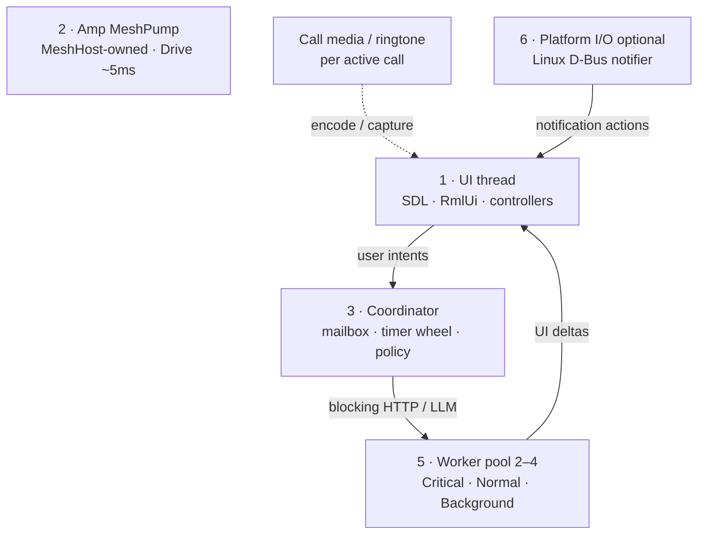

# Threading and async execution

**Tier:** architecture  
**Related:** [LOGGING.md](LOGGING.md) (Module / façade / free-fn logger rules), [RUNTIME_COMPOSITION.md](RUNTIME_COMPOSITION.md) (runtime wiring), [UI_FUNCTIONAL_BOUNDARY.md](UI_FUNCTIONAL_BOUNDARY.md) (cross-thread UI rules), [CALLS.md](CALLS.md) (call media thread policy), [PLATFORMS.md](PLATFORMS.md) (wake / background sync), [OWNERSHIP.md](OWNERSHIP.md) (parent-only destroy / abort-before-join).

How pp-browser schedules work across threads: fixed roles, coordinator mailbox, Amp mesh pump, mesh-control waiters, and bounded worker pool.

**Code map:** `AppRuntime`, `CoordinatorThread`, `WorkerPool` — `src/foundation/runtime/`, `src/common/`; Amp pump + mesh-control pool — `MeshHost` (`src/domain/mesh/host/`).

---

## Goals

1. **Predictable thread budget** — fixed roles instead of unbounded detached workers.
2. **Non-blocking product policy** — coordinator never waits on curl, UPnP, Argon2, or Amp dial waits.
3. **Explicit priorities** — call control and signaling must not sit behind 30s PollInbox.
4. **Single orchestration front door** — coordinator owns policy; handlers post events, not ad hoc cross-calls.
5. **Clean shutdown** — joinable workers; minimal `.detach()` (documented exceptions only).
6. **Hybrid ownership** — own threads for long-lived fixed-cardinality roles; share `WorkerPool` for heterogeneous / fan-out blocking work.

---

## Architecture

Fixed **roles** with a **coordinator mailbox**, **MeshHost-owned Amp pump**, **owner threads**, and a **bounded general worker pool**. Nothing parks a thread waiting on the mesh: every mesh wait is a completion (the mesh-control waiter pool was retired in thread-ownership t3-1).


```mermaid
flowchart TB
  UI["1 · UI thread<br/>SDL · RmlUi · controllers"]
  Pump["2 · Amp MeshPump<br/>MeshHost-owned · Drive ~5ms"]
  Coord["3 · Coordinator<br/>mailbox · timer wheel · policy"]
  Pool["5 · Worker pool 2–4<br/>Critical · Normal · Background"]
  Plat["6 · Platform I/O optional<br/>Linux D-Bus notifier"]
  Media["Call media / ringtone<br/>per active call"]

  UI -->|"user intents"| Coord
  Coord -->|"blocking HTTP / LLM"| Pool
  Pool -->|"UI deltas"| UI
  Media -.->|"encode / capture"| UI
  Plat -->|"notification actions"| UI
```

### Hybrid ownership rules

| Own a thread when… | Share `WorkerPool` when… |
|--------------------|--------------------------|
| Role is long-lived, fixed cardinality, abort/join lifecycle of its own | Work is event-fan-out, sync I/O, or must compete under Critical/Normal/Background |
| Examples: Amp MeshPump, owner threads, CallMediaEngine, CallRingtone, MediaDeviceArbiter device thread, LAN mDNS, Linux notifier | Examples: libcurl PollInbox, LLM/tools, Argon2 unlock, SQLite writes, attachment drain queue, icon HTTP |

Contain unbounded item fan-out with **internal queues** on the shared pool (e.g. `AttachmentFetchWorkflow::DrainQueue`), not one thread per item.

### Role inventory

| # | Role | Owner | Blocking? | Responsibility |
|---|------|-------|-----------|----------------|
| **1** | **UI thread** | `Application` main loop | No | SDL events, RmlUi, controllers; drain UI mailbox via `RunUITasks()` |
| **2** | **Amp MeshPump** | `MeshHost` (`MeshPumpThread`) | No — short `Drive` | `MeshRuntime::Drive()` ~5ms; Amp has no async reactor / no libp2p `io_context` |
| **3** | **Coordinator** | `CoordinatorThread` | No — dispatcher only | Priority mailbox; timer wheel; relay poll + hub policy (~1s); posts blocking work to pool |
| ~~4~~ | ~~Mesh control~~ | retired (thread-ownership t3-1) | — | Mesh waits are completions; L4 inbound CPU / disk work runs on the worker pool (`MeshHost::MakeL4WorkerPost`) |
| **5** | **Worker pool** | `WorkerPool` (2–4 threads) | Yes — only here for product HTTP/LLM/disk | libcurl HTTP, UPnP, Argon2, SQLite writes, LLM HTTP, attachment drain, L4 inbound handlers (chat / history / blob / announce / broadcast / DHT / directory) under MeshPump |
| **6** | **Platform I/O** | `ILocalNotifier` impls | Platform-specific | Linux: D-Bus watch thread. Android: JNI → coordinator wake |
| **7** | **Media sessions** (owner) | `AppRuntime` (`OwnerThread`, `pp-media-sess`) | No | Calls + broadcast control state — see [§ Owner threads](#owner-threads) |
| **8** | **Connectivity** (owner) | `AppRuntime` (`OwnerThread`, `pp-connectivity`) | No | `PeerReachCoordinator` steps, `MeshMediaPlane` (edges, listen book, candidate policy, local view, relay-chosen notices), `ReachabilityEngine` probe steps |

**Call media** stays outside the general pool: dedicated capture / video / playout / ringtone threads per active call.

**Headless node** (`app/node/`): no UI thread; coordinator + MeshHost pump + pool.

### Steady-state thread budget (typical desktop, messaging on, no call)

~**main + coordinator + MeshPump + owner threads (2) + WorkerPool (2–4) + optional LAN mDNS + optional Linux D-Bus notifier** (+ SDL audio internals).

During an active call, add SDL capture/video/ringtone threads.

See [RUNTIME_COMPOSITION.md § Threading](RUNTIME_COMPOSITION.md#threading) for the wiring diagram.

---

## Scheduling API

Composition root: `AppRuntime::Initialize()` / `Shutdown()` (from `Application` or `pp-node`). The mesh pump is started/stopped with `MeshHost::Start` / `Stop`.

| API | Runs on |
|-----|---------|
| `AppRuntime::PostUI` | UI (sequenced, drained each frame) |
| `AppRuntime::PostWorker(Critical/Normal/Background, …)` | Worker pool |
| `AppRuntime::PostCoordinator(Critical/Normal/Background, …)` | Coordinator mailbox |
| `AppRuntime::ScheduleCoordinatorRepeating` / `OneShot` | Coordinator timer wheel |
| `AppRuntime::PostWorkerNormal` / `Critical` / `Background` | Worker pool lanes |
| `AppRuntime::PostWorkerAndReplyOnUI` | Pool → UI |
| `AppRuntime::PauseBackgroundWork` / `ResumeBackgroundWork` | Coordinator + **general** pool only (not MeshPump / owners / media) |
| `MeshHost::MakeL4WorkerPost(lane)` | L4 inbound work: worker pool under MeshPump, inline on the driver for manual-drive harnesses |
| `AppRuntime::PostTo(OwnerThreadId, …)` / `ScheduleOn` | Owner thread (Media sessions / Connectivity); `CurrentlyOn` / `PBR_ASSERT_ON_OWNER` for affinity |

### Worker pool priorities

| Lane | Examples |
|------|----------|
| **Critical** | `AcceptInvite`, call control signaling that must not wait behind PollInbox |
| **Normal** | relay send/sync, chat history HTTP, directory fetch, agent tool HTTP |
| **Background** | UPnP probe, reachability HTTP, compaction, prefetch, PollInbox |

### Coordinator timer wheel

Drives periodic **policy** (not Amp UDP drain):

- Relay poll: foreground ~2s, background ~45s (`MessagingLimits.h`) — `BackgroundSyncScheduler`, armed from `ConversationsHub::StartCoordinatorTimers`
- Hub policy: peer sweep, mDNS, reachability UX — `ConversationsHub` (~1s)
- Peer idle sweep: ~15s internal where applicable

Amp UDP drain is **MeshHost MeshPump**, not a coordinator timer.

Push wake (`PushWakeJni` → `RequestWakeSync`) posts an immediate **Critical** coordinator message.

### Cross-thread rules

- **UI** owns RmlUi and controller mutations. Post via `AppRuntime::PostUI`.
- **UI delivery (hard):** a non-empty UI mailbox must be drained and Presentable soon — power-save must not starve it. `PostTask(UI)` → `SetUIWakeCallback` → `Backend::RequestForceFrame` (force next poll + `WakeEventLoop`). Idle wait is **Poll + ≤50ms Delay slices** (never `SDL_WaitEventTimeout`). See [PLATFORMS.md](PLATFORMS.md).
- **Worker pool** runs sync libcurl (30s timeout), LLM/tools, relay orchestration.
- **Coordinator** runs fast policy only; must not block — enqueue to pool.
- **Amp MeshPump** runs short `Drive` only; must not run curl / Argon2 / long DB.
- **No mesh waits on threads:** a dial / association / probe / key arrival is a completion (callback, `PostAfter` deadline). `AmpParkUntil` survives only in manual-drive test harnesses, where the waiter is the sole Amp driver.
- **Pause/resume:** `AppLifecycle` uses `AppRuntime::PauseBackgroundWork` / `ResumeBackgroundWork` on background/foreground. The mesh pump follows mesh lifetime (stop with `MeshHost::Stop`), same idea as media.

### UI delivery pipeline

Coordinator / workers push deltas; they must not assume paint. Four stages:

```text
Produce (coordinator / worker)
  → PostTask(UI) + RequestForceFrame
  → Frame drain (ProcessEvents returns → RunUITasks → Update → Present)
  → Chrome observation (mounted DOM + hit targets — not “bool dirty” alone)
```

| Stage | Contract |
|-------|----------|
| Produce | May run off UI; do not mutate RmlUi / shell chrome here |
| Mailbox | `AppRuntime` sequenced UI queue; `HasPendingUITasks()` is observable |
| Drain | Idle wait must return within ≤50ms when forced / woken; cap idle ≤2s always |
| Observe | Call ring visibility = `RemountCallChrome` into mounts; SyncLayout / toasts are also mailbox citizens — same SLA. Logs that prove state (`call_ring.active`) do **not** prove paint |

Do **not** couple relay poll cadence back to `ChatController::Update` for liveness. Poll stays on the coordinator (`ConversationsHub::StartCoordinatorTimers`); UI liveness is the frame loop’s job. Call-wake UI refresh is `ConversationsHub::SetOnCallWake` → `CallController::OnCallWake` (hopped to UI).

### Thread affinity

| Work kind | Run on |
|-----------|--------|
| RmlUi / shell / input | UI |
| Amp `Drive` / L3 mux affinity | **Sole Amp driver** — MeshPump, or the test harness Tick loop acting as Amp |
| Amp `PeerLinkManager` / `IChatPeerLinks` **mutations** | Amp IO strand (`MeshRuntime::PostToIo`) |
| Amp teardown (Abort / Close / DropLink / L4 `on_done`) | `MeshRuntime::PostDeferred` |
| Amp deadlines / sync windows | `MeshRuntime::PostAfter` (Amp clock) |
| Periodic sync / hub policy | Coordinator timers |
| libcurl, UPnP, Argon2, long DB | Worker pool |
| Waiting on the mesh | Nowhere — completions (`EnsureAssociation` callback, `PostAfter` deadline) |
| Mic/camera encode | Call media threads |
| Linux D-Bus | Notifier watch thread → UI activation handler |

**Hard rule:** only worker-pool threads may block on network or disk for longer than a few milliseconds, and never on the mesh. Amp data-plane progress is **exclusive** `MeshRuntime::Drive` on MeshPump (or the harness). Nested `Pump`/`Tick`/`Drive` is refused.

**Exclusive Amp Drive (hard):** Exactly one driver calls `Drive`/`Tick`/`Pump` per `MeshRuntime`. Product: `MeshPumpThread`. Tests: harness loop (`AttachAmpStack` default `AttachDrive::Manual`, VirtualClock); wall-clock harnesses such as pp-call-probe pass `AttachDrive::MeshPump` and run the product threading — a main-thread driver deadlocked whenever main waited on work that needed mesh progress. L4 services (punch, hop, broadcast, messaging, dial-back, DHT) are state machines on that thread via `PostToIo` / `PostDeferred` / `PostAfter` — they never call Tick to “unstick” a wait. Product `MakeL4IoPump()` is empty (MeshPump owns Drive). AttachAmpStack harnesses may use `MakeL4IoPump`→`Tick` only from sync `AmpParkUntil` on the harness thread (sole driver) — never from mux/`PostToIo`. Frame handlers may only parse + Post; Abort/Close/complete go on `PostDeferred` after mux stack unwinds. **Lock order: Amp strand → L4 owner mutex.** IO callbacks already hold the strand when they take an L4 coordinator's `mu`; an off-IO entry point that mutates under `mu` and calls back into Amp (`Links()`, session close) must enter via `MeshRuntime::WithIoLock` first (the circuit / media_relay servers and client coordinators `AbortInflight`, `CallMediaLegCoordinator::Stop`) — `mu` → strand deadlocked against MeshPump (quit / Leave hang, 2026-09-25). Read-only accessors may take `mu` alone (leaf). **Inbound request answered from a worker:** bind with `InboundReplyPolicy(policy)` (no `read_once`), return `true`, and reply through `InboundReply` ([`l4/shared/InboundReply.h`](../../src/domain/mesh/l4/shared/InboundReply.h)) — `ChannelSession` is IO-affine, and returning `false` / `read_once` closes the channel before the worker replies (every Amp direct-chat ack was lost under MeshPump until 2026-09-25; sends fell back to the relay after 4 s). See [ADR_LINK_PLANE](https://github.com/people-post/pp-cpp-amp/blob/develop/docs/ADR_LINK_PLANE.md).

**Amp PeerLink strand:** `MeshRuntime` is the product entry (`WhenChannelOpen` / `BindChannel` / `SnapshotByPeerId` / `IsReachable`). Never stash `PeerLink*`. Prefer `IsReachable(PeerId)` over exact-key `IsConnected`.

**Punch / ACP:** Mux frame handlers only `PostToIo`. Sync-window burst via `MeshRuntime::BurstDial` (Amp-clock `PostAfter`, poll on `PostToIo`, Abort/`on_done` on `PostDeferred`). Sync `TryColdPunch` may `AmpParkUntil` only when the waiter **is** the sole Amp driver (test harness PumpAll); punch SM never invokes `IoPump`.

**Dial-back:** Constructed on `MeshRuntime&`; probe deadlines via `PostAfter`. The seed's side walks the requested targets as IO-strand completions (association or `PostAfter` deadline per target). Sync client `Probe` (`AmpParkUntil`) is for manual-drive harnesses.

**DHT / directory:** Constructed on `MeshRuntime&`. DHT has no IoPump (async-only). Directory sync `ListMeshNodes` uses `AmpParkUntil`. Chat/media settle timers prefer `MeshRuntime::PostAfter` via `AmpScheduleUntilSettled` (+ `MeshIoContext.post_after`).

**Windows SEH (punch):** Nested `Drive`/`Pump` under mux or `DrainPostedIo` (legacy sync `BurstDialCandidates` + `IoPump`) caused `0xc0000005` on MSVC. Product path uses `MeshRuntime::BurstDial` (Amp-clock `PostAfter`, Abort/`on_done` on `PostDeferred`); mux handlers only `PostToIo`. `AmpScheduleUntilSettled` must not `AmpParkUntil`+`IoPump` from channel callbacks.

**Peer honesty (Amp / peer streams):** do not park the **general** `WorkerPool` on peer-facing waits. Prefer async IO + local deadline + hard cancel. Call-media hello/ack is async+deadline; an inbound hello waiting for its media key is parked on the calls owner (`CallMediaConnectCoordinator`, answered when the key lands / the deadline passes / shutdown — `CallMediaInboundHandler`), not a blocked thread. Details: [SESSION_MACHINES.md — Peer honesty rule](../../projects/p2p-av-calls/SESSION_MACHINES.md#peer-honesty-rule-stream-waits).

### Amp / mesh executors

| Class | Dispatch | Examples |
|-------|----------|----------|
| **Pump (sole driver)** | `MeshPumpThread` | `MeshRuntime::Drive` |
| **IO work lane** | `MeshRuntime::PostToIo` | PeerLink mutations, SM steps, dial start |
| **Deferred teardown** | `MeshRuntime::PostDeferred` | Abort, Close, DropLink, L4 `on_done` |
| **Timers** | `MeshRuntime::PostAfter` | punch window, channel-open deadlines |
| **Compute / HTTP** | App `WorkerPool` | Brief HTTP, LLM, Argon2, SQLite |

Shared Amp helpers live under `pp-cpp-amp` + `domain/mesh/`. Frame size caps: `pp::amp::AmpChannelLimits`.

---

### Owner threads

Target model ([projects/thread-ownership](../../projects/thread-ownership/DESIGN.md), T001): every piece of mutable product state has **one owner** — Mesh I/O (Amp drive + L4 protocol engines), Connectivity, Media sessions, or UI. Rules:

1. **One owner per object.** Public methods assert they run on it (`PBR_ASSERT_ON_OWNER`, debug builds abort with the call site) or post to it.
2. **Messages between owners.** Posted closures carry values; shared views are immutable snapshots (`shared_ptr<const T>`). Ports are bound once, on the owner, and invoked there — never rebound from another thread.
3. **Owners never block.** Blocking work goes to the worker pool; the result is posted back.
4. **Data plane bypasses owners.** Capture → Amp send and Amp receive → playout stay direct (IO lock); only control goes through owners.
5. **Destroy on the owner.** `DeferredSelf` covers queued callbacks.

`AppRuntime` hosts the owners next to the UI mailbox, behind the teardown gate (T002). `AppRuntimeConfig::owner_threads`: **Dedicated** (product; own OS thread, named through `AppRuntimeConfig::name_thread`) or **Manual** (tests / harnesses: no thread — `RunOwnerTasks` / `RunAllOwnerTasks` drain on the calling thread, which is then `CurrentlyOn` the owner; `DrainWorkersThenUI` and `QuiesceForTeardown` pump manual owners). What runs where: **call state runs on Media sessions** (`CallsThread`, the one place that names the calls owner). Entry points (inbound call control, lifecycle Accept / Decline / Leave, roster fan-out, hop-migrate steps; T003), bridge / seat / topology / connect-coordinator steps and their timer hops all post there. The GUI posts intents and reads `CallUiState`, published after every owner task. The hub's lifecycle edges (build / reset / mesh start and stop / shutdown) use `CallsThread::RunAndWait`: the hub waits on the owner, which never waits on UI; a post the teardown gate drops runs inline, the caller standing in for the owner. A call-control send prepares on the sender and enqueues (Amp on Mesh I/O, relay fallback on a worker), never waiting for delivery. **Broadcast shares the owner**: `BroadcastHub` intents (watch / go live / stop / end) post there with results on UI, the GUI reads `BroadcastUiState` (published after every step; the frame counter is read live), the hub is torn down on the owner (`AppRuntime::RunAndWait`), and the broadcaster's announce runs on the product hub's thread, which owns the announce feed. `AppRuntime::RunAndWait(owner, task)` is the generic form `CallsThread::RunAndWait` builds on. **Connectivity** hosts `PeerReachCoordinator` (steps and timers; was the Coordinator strand) and `MeshMediaPlane` (lifecycle edges wait there, listen registrations post there, the listen book is a snapshot, relay-chosen notices hop IO → connectivity → calls owner). Candidate policy (rendezvous surface, seeds, punch introducers) is evaluated there and read on the Amp IO strand only as a `MeshHopPolicy` snapshot — IO never runs product policy. Media consumers on other owners read this node's mesh from `MeshLocalView` (published while wired), never the `MeshHost` itself, and the mesh config from the hub's published `MeshConfig` snapshot, never its live `AppConfig`. Owner-internal steps carry `PBR_ASSERT_ON_OWNER` (debug). `ReachabilityEngine` runs its probe steps there (UPnP discovery on a worker; `on_updated` consumers hop to IO / UI). **Waits go downward only** (T004): UI → Media sessions → Connectivity → Mesh I/O; a component edge may `RunAndWait` on an owner below its caller, never above — upward is always a post.

### Calls owner

The calls owner (Media sessions) is run by **`CallStack` alone**. Everything else in `feature/calls` is a component in a tree the stack owns; the rules below are the target, and each converted subtree follows them fully.

1. **One queue.** `CallsLoop` holds the owner's events (`CallStackEvent`: plain data, one variant). Edge adapters enqueue from any thread; `CallStack::Dispatch` handles each event on the owner, in order. An event enqueued while one is handled runs after it (no re-entrancy). A priority lane (`EnqueueFront`) exists only for an ordering the enqueuer documents.
2. **Timers are delayed events.** A passive component reports its next deadline (`NextWakeAt`); its parent's `CallsWakeSlot` delivers the wake event then. Components never schedule.
3. **Passive components.** Commands and queries come down from the parent as method calls; a component answers (return values) or reports what happened in its own vocabulary as an event to its parent (`CallsOutbox`, wrapped by each parent up to the queue). Components never post, never schedule, never call siblings, and never hand out callbacks that cross a thread. One allowance: a parent may hand an **owned** child a completion callback for a command — the child calls it only on the owner, from its own handler (it cannot outlive the parent, and the callback never leaves the subtree).
4. **Parents route.** A parent turns a child's event into commands to its other children; the stack routes only among its direct children, who delegate down.
5. **Async work carries its identity.** A command starts it; the result comes back as an event carrying the call id / attempt, and the receiver drops a stale one. Liveness is that comparison, not an object's alive flag; what is still queued or scheduled drops with the loop.
6. **Only edge adapters enqueue from other threads** (UI intents, relay / Amp receive, mesh hooks); they translate the external callback into an event and do nothing else.

**Multi-step flows** (reach → add → retry) are explicit steps: each step is an event carrying its identity (call id + attempt / generation), its handler re-checks that identity first, and the owning component keeps a small state (phase + attempt). A deferred step or a result's continuation waits in the component's `CallsSteps` under an id; `Continue{id}` (or a result event carrying the id) runs it. No coroutines: between two steps anything else may run on the owner, and a separate handler per step keeps that gap visible (a `co_await` hides it).

**Converted:** the stack's inputs from other threads (network / mobility / inbound call control / relay chosen / signaling punch) are events; `CallPathMobility` and `CallMediaSeat` are passive (mobility's re-evaluation is a delayed event); the session manager's subtree reports through typed outboxes (`CallsOutbox`, `SessionEvent` → workflow / topology / hop migrate): its follow-ups, timers and the relay-loss notice are events. Topology, hop migrate and planning are converted fully (their attach / migrate chains cross threads only as events). The 1:1 bridge (`CallMediaBridge`) is converted: its timers, the deferred-key poll (a delayed event per round, no worker), its start deferrals and its reach / migrate / bundle results are `DirectPathEvent`s; its entries (`StopMeshMedia`, answerer start, Retry / Resume) are owner-only. The one exception is received 1:1 media, still delivered through the owner (the hop path delivers on I/O). Its child, the connect sequence (`CallMediaConnectCoordinator`), reports `ConnectEvent`s the same way; an inbound hello travels as an event holding its answer (`CallMediaInboundReply`), NACKed if dropped unanswered, so the transport's handler holds no component pointer. The UI edge (`CallUiBackend`) queues its commands on the stack's loop (`SessionsCommand`), behind the owner's events. `scripts/check/check_calls_owner.sh` (CI lint) keeps posting, timers and waits in `CallStack` / the loop, with the 1:1 media delivery as the one listed exception. **Tree:** the session manager owns the seat and both media paths (the 1:1 bridge and the group topology), so the synchronous hand-offs between them (stop before start, Direct → Hop) stay parent / child calls.

## Design principles

1. **Coordinator is a dispatcher, not a worker** — if it might block, enqueue to the pool; Amp UDP is MeshPump, not the coordinator.
2. **One policy front door** — timer wheel + wake paths; avoid UI-tick polling for sync.
3. **Priority is explicit** — three general-pool lanes, not ad hoc hop-off threads.
4. **Bounded concurrency** — fixed general pool; fixed mesh-control size.
5. **UI is pull** — workers/coordinator push UI deltas; UI never waits on network.
6. **UI mailbox liveness** — power-save is an optimization; it must not defer `RunUITasks` / Present until user input.
7. **Media is special** — do not run Opus/H264 in the general pool.
8. **Join on shutdown** — abort inflight → stop L4 (MeshPump still drives their posted completions) → join MeshPump → free L4 → join general pool / coordinator. `AppRuntime::Shutdown` clears `ThreadRuntime::running_` then joins **before** uninstalling `WorkerDispatch`. In-flight `PostWorker` no-ops once `!IsRunning()` (and the pool no-ops once `stopped_`), so nested posts during join neither assert nor race onto another live worker. `ConversationsHub::RequestShutdown` must run **before** that join so unlock → `EnsureMessagingReady` discards mesh bring-up instead of finishing Amp during join (StopMesh after a dead pool segfaulted).

---

## Shutdown order (product)

```text
RequestExit → HideWindow (<100ms close feel)
→ AppRuntime::BeginShutdown (gen + 3s deadline + watchdog)
→ RequestShutdown → AbortCallMediaForShutdown (PrepareForTeardown non-blocking)
→ AppRuntime::QuiesceForTeardown(≤2s) — see Teardown quiesce
→ MeshHost::Stop (abort + stop L4 → join MeshPump → free L4 / Amp)
→ AppRuntime::Shutdown (coordinator ≤500ms + WorkerPool ≤500ms; detach+leak on timeout)
→ destroy hub / secrets / RmlUi / Backend::Shutdown
```

**Budgets:**
- Window hide: immediate on `Backend::RequestExit` / start of `Application::Shutdown`
- `CallMediaBridge::PrepareForTeardown(0)`: abort + generation bump only (no sleep-spin)
- `CallRingtone::StopAndJoin(≤500ms)`, `CallMediaEngine::Stop` capture/playout/video ≤500ms
- `MediaDeviceArbiter::ShutdownDefault(≤1s)`: runs queued device closes, then joins the device thread (before `SDL_Quit`)
- `CoordinatorThread::Shutdown` / `WorkerPool::Shutdown`: join ≤500ms; on timeout detach and leak until process exit
- Full graceful exit target: ~3s wall clock; `AppRuntime` watchdog calls `std::_Exit(0)` at deadline as **last resort** if joins hang

### Teardown quiesce

Owners post raw `this` onto the worker pool, coordinator and UI mailbox, but teardown frees them (hub, call stack, caches, …) **before** `AppRuntime::Shutdown` joins those threads — and profile reset never joins at all. One gate in `AppRuntime` covers every mailbox (dogfood 2026-09-24 SIGSEGV; audit of ~15 owners):

| State | Posts (`PostWorker*` / `PostCoordinator*` / `PostUI*` / `PostTo`) | Timers | Entered by |
|-------|------------------------------------------------------|--------|------------|
| **Open** | run | fire | start, `ReopenAfterTeardown` |
| **Draining** | queued ones still run; posts from **inside** a running task (continuations, e.g. `call_leave` send) accepted; posts from outside (mesh threads, fresh work) dropped | dropped | `QuiesceForTeardown(budget)` |
| **Closed** | every queued / new post no-ops | dropped | end of the drain (success or budget) |

- `QuiesceForTeardown` resumes paused pools, pumps the UI mailbox when called on the UI thread, and waits until no gated work is pending or running (its own enclosing task excepted). Returns **false** at the budget: work is still running — do not free what it may touch.
- Quit (`Application::Shutdown`): 2 s budget (inside the 3 s watchdog). On false: `ConversationsHub::FlushForExit` and leak messaging until exit.
- Profile reset: 10 s budget, then `ShutdownMessaging` and `ReopenAfterTeardown` before re-initializing. On false: reopen, `CancelShutdownRequest`, report "try again" — nothing freed.
- `ReopenAfterTeardown` bumps an epoch: posts and one-shot timers from before the quiesce stay dead; repeating timers resume (GUI timers must survive a reset — owners cancel their own).
- `DrainWorkersThenUI` is a no-op once quiesced (the quiesce already drained). Otherwise it sits behind Critical → Normal → each owner thread → UI.
- A post a mailbox drops unrun (stopped pool / owner) settles its gate count on destruction, so it cannot stall a later quiesce.
- Per-owner guards remain only for owners that die **mid-life** on their own strand (`DeferredSelf`, [OWNERSHIP.md](OWNERSHIP.md)); do not add per-owner gates for teardown.

Timeline marks (grep `[startup]`): `shutdown_begin`, `shutdown_window_hidden`,
`shutdown_context` (call_active / connect_inflight / worker_queued),
`shutdown_abort_call_media_done`, `shutdown_stop_mesh_done`, `shutdown_runtime_join_done`,
`shutdown_backend_quit_done`, `shutdown_complete`.

### IStoppable lifecycle (shutdown contract)

Owners stop children with a fixed sequence — do not destroy while a joinable thread may still run:

```text
RequestStop(gen) → Drain(deadline) → Join(deadline) → destroy
```

**`Stop()` is idempotent.** Amp L4 protocols / transports (`*Protocol`, `*Coordinator`, `Amp*Transport`, `CallMediaLegCoordinator`) return early unless started: the owner's explicit `Stop` before `MeshHost::Stop` does the work, and the destructor's `Stop` runs when the Amp runtime may already be freed (a second `RemoveProtocolHandler` locked a freed runtime mutex — pp-call-probe teardown hang, 2026-09-25 — and dropped a replacement owner's handler).

**Calls + mesh stop order** lives in one place, `CallStack::StopMesh(mesh, detach_transports)` (hub and pp-call-probe): `PrepareForMeshStop` bracketed by circuit aborts → detach (= destroy) Amp transports → `MeshHost::Stop` → `FinishMeshStop`.

| Owner | Notes |
|-------|--------|
| `CallStack` / `CallMediaBridge` | bump connect generation; `AbortConnectSequence` / `PrepareForTeardown(0)`; media engine budgeted joins |
| `ConversationsHub` / `MeshHost` | `RequestShutdown` / `shutdown_requested_`; stop L4, then join MeshPump |
| `AppRuntime` / `ThreadRuntime` | `BeginShutdown` then budgeted coordinator + WorkerPool |
| LAN mDNS | stop advertise / join watcher before mesh destroy |
| `ILocalNotifier` | `Shutdown` before UI mailbox teardown |
| `CallRingtone` | `StopAndJoin(budget)` before `SDL_Quit` |
| `MediaDeviceArbiter` (default) | `ShutdownDefault(budget)` after the runtime joins, before `SDL_Quit` — released leases close on its device thread |

Sync façades reject new work when `AppRuntime::IsShuttingDown()` (debug log + `Error("shutdown in progress")`):
`CallStack::TryEnsureCircuitHopReachable`, `CallStack::TryEnsurePeerReachable`,
`CallTopologyController::MaybeSoftMigrateToSfu` (+ Async),
`AmpCircuitHopReach::TryEnsureHopReachable` / `TryEnsurePeerReachable`,
`CallMediaBridge::StartConnectSequence`, hub `StartMesh` / `EnsureMessagingReady`.

Parent-only destroy: children request stop; only the owner joins and drops (`OWNERSHIP.md`).

### Cancel / Abort contract (async waiters)

Shutdown and Leave already use **generation invalidate** (`connect_generation_`, `media_cancel_gen`, Amp `AbortPending`). The missing rule is how that interacts with **local waiters** (`connect_worker_inflight_`, promise/cv, one-shot timers):

```text
Invalidate (bump gen / cancel flag)
→ Interrupt (cancel timers, AbortPending, stream reset, cv.notify)
→ Complete waiters for this epoch (failure path or abort clears the token)
→ optional Drain(budget) → Join → destroy
```

**Invariant — arm ⇒ complete on cancel:** whoever arms a waiter owns finishing it when that work is aborted. If abort **cancels** the only callback that would have cleared `inflight` / completed a promise, the abort path must clear/complete it itself. Anti-pattern: `CancelCoordinatorTimer` then spin-wait on a flag that only that timer cleared.

| Path | Contract |
|------|----------|
| Product quit / UI | `PrepareForTeardown(0)` = Abort only (no sleep-spin) — [Shutdown order](#shutdown-order-product) |
| `CallMediaBridge` stop / retry | Calls-owner state. `StopMeshMedia`, Retry and Resume are owner-only (asserted); every stop reaches them through the owner's events. What the bridge still has queued drops with its direct-path generation |
| `CallMediaBridge` Connect | `AbortConnectSequence()` bumps the send gen and calls `CallMediaConnectCoordinator::Abort()`: cancels watchdog / retry timers and the pending `PeerReachCoordinator` reach (completes inline), **clears** `InFlight`; completes no hook |
| Cross-planner SoftMigrate | Lifecycle `media_cancel_gen`; late Direct/Hop work no-ops — [CALLS.md](CALLS.md) / V037 |
| Amp circuit / punch | `AbortPending` + Alive checks — [OWNERSHIP.md](OWNERSHIP.md) |

Session machines: timeout / cancel / Detach must complete through the machine ([SESSION_MACHINES.md](../../projects/p2p-av-calls/SESSION_MACHINES.md)).

### Dogfood matrix (shutdown latency)

Manual scenarios (success metrics):

| Scenario | What to stress | Pass |
|----------|----------------|------|
| Idle mesh | messaging up, no call | p95 close→window-gone &lt;100ms; p95 process-exit &lt;3s |
| Mid-ring | ringtone playing | same; ringtone join ≤500ms or detach |
| Mid-connect | call-media Connect inflight | `shutdown_context connect_inflight=1`; no hang |
| Mid-SoftMigrate | SoftMigrate / SFU attach in flight | SoftMigrate rejects after BeginShutdown |
| Mid-attachment sync | attachment fetch / peer blob on WorkerPool | WorkerPool join ≤500ms or detach+leak |

Checklist: titlebar/OS close, Accept-dialog quit while ringing, quit during group SoftMigrate, quit during unlock→EnsureMessagingReady. Headless quit CI is optional; this matrix is sufficient for now. Grep logs for `[startup] shutdown_*` and watchdog / detach warnings.

**Watchdog (last resort):** `AppRuntime::BeginShutdown` arms a detached thread that `std::_Exit(0)`s at the 3s deadline if the process is still alive. Prefer budgeted joins; the watchdog only covers stuck cases that ignore budgets.
---

## Known debt

| Item | Location | Notes |
|------|----------|-------|
| Sync L4 test wrappers | AmpCircuitHopReach / AmpMediaRelayClient / SoftMigrate sync façades | Product paths Async; sync wrappers for tests (empty-pump park); gated when `IsShuttingDown` |
| Detached WorkerPool / coordinator on join timeout | ThreadRuntime::Shutdown | Loud log + `unique_ptr::release`; process must exit soon (watchdog ≤3s) |
| Call ringtone playback | `src/domain/media/CallRingtone.cpp` | Async `Stop` uses joinable `joiner_`; budgeted `StopAndJoin` before `SDL_Quit`; speaker via a shared `MediaDeviceArbiter` lease |
| Media device open / close / reopen | `src/domain/media/MediaDeviceArbiter.*` | One device thread for every SDL audio and camera open, close and reopen (no open races another holder's close); holders do I/O through `AudioDeviceLease` / `CameraDeviceLease`; `Acquire*` / `Reopen` block the caller — never the UI thread. Camera: `SetCameraEnabled` (UI) only records the request + display rotation; the engine's video thread takes the lease, owns the local encoder, and reports a failed open through `TakeCameraFailure` (polled by `CallController`) |
| Linux notifier → coordinator | `LocalNotifier_Linux.cpp` | Activations post to UI today; coordinator mailbox optional |
| SQLite + mutex | thread stores | No dedicated DB thread — safe if conventions hold |

---

## Related third-party threading

| Library | Model | Policy |
|---------|-------|--------|
| asio (`pp-node` status HTTP) | `io_context` | Status server only (not mesh) |
| libcurl | Sync on caller | General WorkerPool only |
| SQLite | Caller + mutex | Pool for long writes |
| SDL3 | Internal audio/camera | Unchanged |

---

## Changelog

| Date | Change |
|------|--------|
| 2026-09-27 | **UI snapshots / config** (thread-ownership t4): owners read a published `MeshConfig`; affinity asserts on owner-internal steps |
| 2026-09-27 | **Connectivity owner, cont.** (thread-ownership t3-2b/c): `MeshHopPolicy` evaluated on connectivity; `ReachabilityEngine` steps there; call providers read `MeshLocalView` |
| 2026-09-27 | **Connectivity owner** (thread-ownership t3-2a): `PeerReachCoordinator` + `MeshMediaPlane` on `pp-connectivity`; T004 downward-only waits |
| 2026-09-27 | **MeshControl retired** (thread-ownership t3-1): dial-back server walk, inbound call-media key wait and CAS tip fetch are completions; L4 inbound work on the worker pool; `MeshHost::StopAmp` joins MeshPump before freeing L4 |
| 2026-09-27 | **Broadcast on Media sessions** (thread-ownership t2b-4): hub intents post, `BroadcastUiState` snapshot, async announce onto the hub's thread; `AppRuntime::RunAndWait` |
| 2026-09-27 | **Calls on Media sessions** (thread-ownership t2b): `CallsThread` → `pp-media-sess`; GUI intents post, `CallUiState` snapshot; hub lifecycle edges via `CallsThread::RunAndWait` |
| 2026-09-27 | **Owner threads** (thread-ownership t1): `AppRuntime::PostTo` / `CurrentlyOn` / `ScheduleOn` / `RunOwnerTasks`, Dedicated / Manual modes, `PBR_ASSERT_ON_OWNER`, gate settles dropped posts. Mesh stop order is owned by the hub around `MeshMediaPlane` (media-client-layers L015), not `CallStack::StopMesh` |
| 2026-09-25 | **InboundReply:** worker-answered L4 requests (direct chat, history, blob, broadcast, announce, DHT, directory, dial-back) reply on the IO lane with the channel held open — acks were dropped under MeshPump |
| 2026-09-25 | **Idempotent Stop** for Amp L4 transports; `CallStack::StopMesh` single stop order; `MeshHost::AttachAmpStack(…, AttachDrive::MeshPump)` for wall-clock harnesses (pp-call-probe runs the product threading) |
| 2026-09-24 | **Teardown quiesce:** `AppRuntime` gate (Open → Draining → Closed, epoch reopen) over workers / coordinator / UI; quit and profile reset quiesce before freeing messaging; hub `shutdown_requested_` cleared on re-Initialize |
| 2026-09-23 | **Cancel / Abort contract:** arm ⇒ complete on cancel; Bridge `AbortConnectSequence` clears Connect waiter after canceling grace/retry timers |
| 2026-09-23 | **Exclusive Amp Drive:** nested Drive refused; `PostDeferred` / `PostAfter`; L4 `MakeL4IoPump` always empty; punch on `MeshRuntime&` via `BurstDial`; pin pp-cpp-amp `v2.1.8` |
| 2026-09-23 | DHT drop unused IoPump; directory sync via AmpParkUntil; `AmpScheduleUntilSettled` prefers PostAfter (`MeshIoContext.post_after`); never AmpParkUntil on Drive stack |
| 2026-09-23 | Punch ACP: mux handlers PostToIo only; async introducer (no AmpParkUntil under mux); burst on IO strand |
| 2026-09-21 | Amp link plane: LinkId + PeerPresence; WhenChannelOpen/BindChannel; completions via PostToIo; DialBook/LinkTable split; no product PeerLink* |
| 2026-09-09 | Shutdown latency phases 0–5: BeginShutdown+watchdog; budgeted coordinator/WorkerPool/ringtone/media joins; IsShuttingDown gates; dogfood matrix |
| 2026-09-09 | Shutdown latency: HideWindow on RequestExit; PrepareForTeardown(0); MeshControlPool join ≤500ms; shutdown timeline marks |
| 2026-09-09 | CallMediaBridge peer-reach Async; CallSessionManager SoftMigrate nudge uses SoftMigrateAsync (no Worker park) |
| 2026-09-09 | Circuit hop TryEnsure*Async + CallStack punch Async; SoftMigrate/Attach/Reattach await dialability Async |
| 2026-09-09 | SoftMigrate/AttachLocalToSfu/ReattachGuest Async — MeshControl no longer parks on media-relay quote/attach |
| 2026-09-09 | Media-relay RequestQuoteAsync/AcceptAndAttachAsync; CallStack uses MeshHost io_pump (no Tick-from-waiters) |
| 2026-09-09 | Reachability probe async (ProbeAsync + PostToIo); announce PublishAndPush*Async; MeshControl no longer parks on seed dial |
| 2026-09-09 | Amp MeshPump + MeshControlPool owned by MeshHost; coordinator no longer 5ms Amp drain; docs drop libp2p reactor assumptions |
| 2026-08-03 | Call Accept layer: `RemountCallChrome` (dedicated mounts); not always-mounted `data-if` + Dirty alone |
| 2026-08-03 | Relay poll owned by `ConversationsHub::StartCoordinatorTimers` (not ChatController WireMessagingBindings); immediate wake sync on arm; `SetOnCallWake` from Application |
| 2026-08-03 | **UI delivery:** `PostTask(UI)` → `RequestForceFrame`; idle = Poll+≤50ms Delay (no WaitEventTimeout); mid-idle abort on ForceFrame/wake; liveness contract in Cross-thread rules |
| 2026-08-03 | Call chrome + UI mailbox: hop ring refresh to UI; `RequestForceFrame` when UI tasks pending / SyncLayout; WakeEventLoop always pushes (no coalesce-drop); unanswered outbound TTL |
| 2026-08-03 | **Shipped:** coordinator + worker pool model live; `pp-browser-io` retired; project folder archived |
| 2026-08-03 | Phase t5: `BrowserThread::IO` → worker pool |
| 2026-08-03 | Retire `BrowserThread`; UI mailbox lives on `AppRuntime` |
| 2026-08-03 | Phase t4: `CoordinatorThread` + timer wheel |
| 2026-08-03 | Phase t3/t3.5: messaging hop-offs + `AppRuntime` |
| 2026-08-03 | Phase t2: libp2p integration hop-offs |
| 2026-08-03 | Phase t1: `WorkerPool` in `src/common/` |
