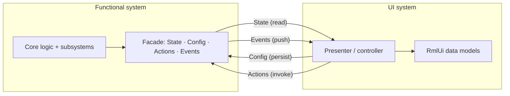

# UI ↔ functional boundary

**Tier:** architecture  
**Related:** [RUNTIME_COMPOSITION.md](RUNTIME_COMPOSITION.md) (runtime wiring), [SRC_LAYOUT.md](SRC_LAYOUT.md) (layers), [CONFIGURATION.md](../ops/CONFIGURATION.md) (persisted prefs → slices).

How the **UI system** (RmlUi surfaces, shell chrome, presenters) interacts with **functional systems** (messaging, agent, vault, session prefs). Features should be able to run without UI; UI binds only through explicit interfaces.

**Layer ([F008](../../projects/feature-layer-reorg/DECISIONS.md#f008--gui-layer-above-feature)):** product UI lives in top-level **`src/gui/`** (`app → gui → feature → …`). The name **`gui`** avoids colliding with domain peer `domain/ui` (non-Rml presentation policy).

**Migration complete (2026-08):** UI presenters and `ShellHost` are app-owned (`unique_ptr` in `Application`). RmlUi static callbacks use `InstallInstance` / `Instance()` shims on the installed pointer — not process-wide singletons. Cross-presenter calls use notify ports or `Application::WireShellPresentationEvents`.

---

## Principles

1. **Two self-contained systems.** Functional components (messaging hub, agent session, vault gate, …) and the UI shell are separate. In theory, features run headless; UI is a client of functional facades.
2. **Explicit interfaces for UI-visible behavior.** Every state, config, and action the UI needs is declared by the owning system (or a narrow facade). UI never reaches into subsystems or internal singletons.
3. **Limited top-level exposure.** UI sees a small set of top-level systems. Everything else (mesh host, thread stores, turn executor, …) stays internal.
4. **Four interaction channels** (see below). State, Config, Actions, and Events — each with clear semantics and thread rules.

---

## Top-level systems vs UI surfaces

**Functional systems** (business logic, may outlive any one screen):

| System | Primary module | UI sees (facade) | Hidden subsystems |
|--------|----------------|------------------|-------------------|
| **Messaging** | `feature/conversations/` | threads, send/receive, reachability, calls | libp2p, relay, mesh, SQLite stores |
| **Agent** | `feature/ai/` | turn status, tool results, generation | LLM client, MCP executor, turn pipeline |
| **Profile / vault** | `foundation/crypto/` | unlock status, PIN policy | Argon2, secrets store |
| **Session / prefs** | `foundation/data/` + `app/ConfigApplyBridge` | flush, reload, disk DTOs | projection, slice fan-out |
| **Localization / theme** | `foundation/i18n/`, `domain/ui/` | labels, appearance | catalogs, asset resolution |
| **Shell / navigation** | `gui/shell/` | tabs, panes, overlays, dialog stack | flow coordinator, input routing |

**UI surfaces** (presenters + RmlUi binding — *not* functional systems):

| Surface | Module | Role |
|---------|--------|------|
| `ShellHost` | `gui/` | Window chrome, pane layout, global feedback |
| `ChatController` | `gui/chat/` | Chat screen presenter |
| `SettingsController` | `gui/` | Me tab / settings presenter |
| `ContactsController` | `gui/` | Contacts tab presenter |
| `PeoplePickerController` | `gui/` | People picker presenter |
| `PinGateController` | `gui/` | PIN overlay presentation |
| `CallController` | `gui/` | In-call / ring chrome |

Surfaces **present** functional state and **dispatch** actions. They must not hold direct pointers to subsystems the UI contract does not name (e.g. no `Libp2pHost*` in a controller header).

---

## Four interaction channels



### 1. State (read-only)

**Purpose:** Snapshots the UI can bind. Functional systems own truth; UI reads, never mutates functional state in place.

**Rules:**

- Expose **immutable view DTOs** or `Snapshot()` methods, not shared mutable structs.
- Prefer small, purpose-built views (`ProfileIdentityView`, `SettingsReachabilityView`) over leaking service internals.
- Presenters poll on `Tick()` or subscribe; then call `DataModelHost::Dirty(model, key)`.
- **UI chrome state** (nav tab, pane open, overlay stack, scroll/focus) is owned by the **UI system** (`ShellState`, presenter-private structs). Functional code must not write `ShellHost::State()` directly.

**Existing examples:**

- `ProfileIdentityView`, `SettingsReachabilityView`, `PinProtectionView`
- `ShellState` (UI-owned chrome — keep functional code out)
- Per-controller private state inside `ChatController`, `SettingsController`

**Target pattern:**

```cpp
struct MessagingView {
  bool ready;
  std::string last_error;
  SettingsReachabilityView reachability;
};

MessagingView Snapshot() const;
void Subscribe(MessagingListener* listener);  // optional push refresh
```

### 2. Config (persisted preferences)

**Purpose:** User preferences that survive restarts and hot-reload into services.

**Rules:**

- Disk DTOs live in `SessionStore` (`AppConfig`, `ProfilePreferences`).
- Services expose **nested slice types** with `operator==` and `Apply(slice)` (equality-gated).
- `ConfigApplyBridge` projects disk → slices; only the bridge calls `Apply`.
- Settings UI **flushes** via `SessionStore` only — never `ConversationsHub::Apply*` directly.
- Ephemeral UI config (pane width, draft text, last scroll) stays in presenters; do not persist unless product requires it.

**Existing examples:**

- `ConversationsHub::NetworkConfig`, `PolicyPrefs`, `NotificationPrefs`
- `ShellHost::ChromePrefs`, `ChatController::AgentConfig`, `LocalizationService::Prefs`
- [RUNTIME_COMPOSITION.md — Settings / prefs hot-reload](RUNTIME_COMPOSITION.md#settings--prefs-hot-reload)

**Quick blocking set:** Section flush in settings is synchronous on the UI thread but only touches `SessionStore`; heavy apply work stays inside service `Apply` implementations (must not block the UI thread for long — post to IO if needed).

### 3. Actions (commands)

**Purpose:** User intents and imperative operations initiated from UI.

**Rules:**

- Declare narrow **ports structs** (`SettingsCommands`, `ChatSessionPorts`, `CallActionsPorts`, `UnlockEnsurePorts`, …) or facade methods — app fills implementations in `Application`.
- **Sync / quick:** return `Roe<void>` or a small result; safe on UI thread when work is trivial.
- **Async / long:** use `run_heavy(work, on_done)` (see `ProfileUnlockPorts`) or `AppRuntime::PostWorker` / `PostWorkerAndReplyOnUI` ([THREADING.md](THREADING.md)).
- Long-running actions should support **progress** and **cancel** when user-visible (agent turns, UPnP probe, profile reset).
- RmlUi static callbacks are thin: `→ presenter method → action port` — not `SomeController::Instance().Hub()->…`.

**Existing examples:**

- `ConversationsFacade` — non-owning wrapper over `ConversationsHub&` (app-owned); chat, chat sub-presenters (`ChatThreadChrome`, `ChatTranscriptScroller`), messaging tools, and `Application` settings/badge wiring call its methods instead of peeking hub accessors. Event subscriptions (`SetOnMessagesChanged`, `SetOnThreadChanged`, …) keep `std::function` params. **Phase 6 done** — replaced the `MessagingChatPorts` mega-struct + `MakeMessagingChatPorts`.
- `MessagingShellPorts` — status-bar cluster/popover snapshots + retest for shell chrome. Mesh reads (host running, reachability, relay load) come from `MeshHost*` (via `MakeMessagingShellPorts(hub)` passing `hub.Mesh()`); only hub-owned bits (messaging-ready, Brief health, help-network, last error) are projected off the hub.
- `SettingsCommands` — register, UPnP, reset profile, appearance, locales, PIN status + Change PIN (`change_pin`); the app-owned `ProfileSecretsService` stays out of `SettingsController` (no `ProfileSecretsService::Instance()`)
- `ChatSessionPorts` — select thread, finalize display, find someone
- `CallActionsPorts` — start/accept/leave call chrome actions for chat, shell, people-picker (filled from `CallController`)
- `CallFunctionalPorts` + `CallUiBackend` — sealed call session/lifecycle access for `CallController` (no raw CSM/Lifecycle pointers)
- `UnlockEnsurePorts` — ensure unlocked / unlock-in-progress for chat, settings, contacts, people-picker (filled from `ProfileUnlockGate`)
- `FlowCoordinatorPorts` — modal begin/end/dismiss for shell + people-picker (filled from `FlowCoordinator`)
- `BadgeNotifyPorts` — badge refresh / sessions unread for chat (filled from `BadgeAggregator`)
- `PinGateActionPorts` — PIN overlay submit/cancel/chooser actions for shell (filled from `PinGateController`)
- `ProfileUnlockPorts` — ensure unlocked, complete with PIN (async heavy work)
- `ActionRouter` — declarative Rml action → MCP tool map

**Target pattern:**

```cpp
struct MessagingActions {
  Roe<void> SendMessage(const SendMessageArgs& args);
  void RunReachabilityProbe(std::function<void()> on_done);
  Roe<void> CancelCall(const std::string& call_id);
};
```

### 4. Events (push notifications)

**Purpose:** Functional-initiated updates that are not stable “state” and are not user “actions”.

**Examples:**

- Messaging became ready / failed
- New inbound message
- Call ended
- Toast / banner requests
- Unlock gate dismissed

**Rules:**

- Prefer callbacks, small listener interfaces, or app-owned coordinators — not polling hidden flags every frame.
- Events may be one-shot; do not mirror every event as permanent state on a facade.
- UI thread delivery: post via `AppRuntime::PostUI` from workers / coordinator.

**Existing examples:**

- `BadgeAggregator::BindSource` — app computes unread from hub + shell tab
- Hub readiness callbacks wired in `Application` (not in controllers)
- `ProfileUnlockUiPorts` — gate pushes presentation hooks to PIN UI

---

## UI chrome vs functional state

| Kind | Owner | Examples | Who may mutate |
|------|-------|----------|----------------|
| **Functional state** | Functional system | messaging ready, call phase, vault locked | Functional system only; UI reads via facade |
| **UI chrome state** | UI system | nav tab, pane visibility, overlay stack, pin overlay layout | Presenters / shell only |
| **View projection** | Presenter | RmlUi-bound fields derived from functional + chrome | Presenter writes binding; sources are read-only snapshots |

**Anti-pattern:** Presenters or functional code reaching into global shell mutable state via `ShellHost::Instance()`, or chrome ports that return mutable references into `ShellHost::State()`.

**Call / PIN chrome (apply-only):** `CallController` and `PinGateController` own local chrome snapshots (`ring_` / `in_call_`, `pin_state_`) and push them through `apply_snapshot` / `apply_pin_gate`. ShellHost copies into `State()` then remounts/dirties — ports do not hand out `CallRingState&` / `PinGateState&`.

**Target:** Functional systems expose state; presenters **project** into chrome. Cross-surface navigation uses a **coordinator** (`FlowCoordinator`, future `ShellCoordinator`), not controller-to-controller `::Instance()` calls.

---

## Composition root responsibilities

`Application` (`src/app/`) is the only place that:

- Owns service lifetimes (`ConversationsHub`, `AgentSession`, `ProfileUnlockGate`, `CallUiBackend`, …) — parent-only destroy: [OWNERSHIP.md](OWNERSHIP.md)
- Binds ports (`SettingsCommands`, `ChatSessionPorts`, `CallActionsPorts`, `CallFunctionalPorts`, `UnlockEnsurePorts`, `FlowCoordinatorPorts`, `BadgeNotifyPorts`, `PinGateActionPorts`, `ProfileUnlockPorts`)
- Installs `ConfigApplyBridge` and SessionStore listeners
- Wires event callbacks (messaging ready → refresh presenters)
- Runs the main loop: UI tick, `TickMesh`, drain `AppRuntime` UI mailbox

Presenters are **app-owned instances** (`Application` holds `unique_ptr` and calls `InstallInstance` for RmlUi static callbacks). New code must not add presenter `::Instance()` call sites outside static RmlUi handlers and SDL function-pointer constraints.

---

## Allowed edges (summary)

| From | To | Allowed? |
|------|-----|----------|
| UI presenter | Functional facade **State** | Read / subscribe |
| UI presenter | Functional facade **Actions** | Via ports or injected facade |
| UI presenter | `SessionStore` flush (settings) | Yes — persisted config only |
| UI presenter | `ConversationsHub::Apply*` / internal APIs | **No** |
| UI presenter | Another controller `::Instance()` | **No** — use coordinator or ports |
| Functional system | `ShellHost::State()` | **No** — use `ProfileUnlockUiPorts`-style hooks |
| `ConfigApplyBridge` | Service `Apply(slice)` | Yes |
| `Application` | Bind all ports + event wiring | Yes |

Full hot-reload table: [RUNTIME_COMPOSITION.md — Allowed edges](RUNTIME_COMPOSITION.md#allowed-edges-hot-reload--settings).

---

## Reference patterns in the repo

| Pattern | Location | Channel |
|---------|----------|---------|
| Persisted config slices | `ConfigApplyBridge`, `ConversationsHub::Apply` | Config |
| Settings imperative ops | `SettingsCommands` | Actions |
| Chat navigation | `ChatSessionPorts` | Actions |
| Contacts notify | `ContactsNotifyPorts` | Actions + Events |
| Unlock ensure | `UnlockEnsurePorts` | Actions |
| Flow coordinator | `FlowCoordinatorPorts` | Actions |
| Badge notify | `BadgeNotifyPorts` | Actions + State |
| PIN gate actions | `PinGateActionPorts` | Actions |
| People picker notify | `PeoplePickerNotifyPorts` | Actions |
| App-owned presenters | `Application` + `InstallInstance` / `ClearInstance` | Composition root |
| Shell navigation (settings / chat / contacts) | `ShellNavigationPorts`, `MakeShellNavigationPorts` | Actions + State snapshot |
| Shell feedback | `ShellFeedbackPorts`, `BindSharedShellFeedback`, `UserFeedback::BindPorts` | Actions + Events |
| Messaging read snapshot | `MessagingUiPorts`, `MessagingView` | State |
| Vault unlock | `ProfileUnlockGate` + `ProfileUnlockPorts` / `ProfileUnlockUiPorts` | Actions + Events |
| Identity / reachability views | `ProfileIdentityView`, `SettingsReachabilityView` | State |
| Modal flow | `FlowCoordinator` | UI chrome / navigation |
| Unread badges | `BadgeAggregator` | State (app-computed) |
| RmlUi registry | `DataModelHost` | UI infrastructure |

**Direction of travel:** Generalize ports + slices from “cross-module exceptions” to the **default**. Presenters remain RmlUi adapters; functional logic stays behind ports and facades.

---

## RmlUi static callbacks

RmlUi event handlers must be static function pointers. Presenters therefore expose:

```cpp
static void InstallInstance(Presenter& instance);  // Application calls at startup
static void ClearInstance();                       // Application calls at shutdown
static Presenter& Instance();                      // static callbacks only
```

`Application` owns `std::unique_ptr<Presenter>` and installs the pointer before model registration. **Do not** call `Presenter::Instance()` from feature code or from `Application` — use injected references (`chat_`, `settings_`, …) or notify ports.

---

## Presenter template (target)

`ConversationsFacade` is now realized as a non-owning wrapper over `ConversationsHub&` (see `src/feature/conversations/ConversationsFacade.{h,cpp}`): imperative ops are real methods and event subscribes take `std::function` params. `ConfigApplyBridge` still holds `ConversationsHub&` for `Apply` slices. The template below shows the longer-term listener/actions split.

```cpp
// Functional — no RmlUi
class ConversationsFacade {
public:
  MessagingView Snapshot() const;
  void Subscribe(MessagingListener* listener);
  MessagingActions& Actions();
  // Config: SessionStore + bridge only — no Apply from UI
};

// UI — RmlUi only here
class ChatPresenter {
public:
  ChatPresenter(ConversationsFacade&, AgentFacade&, ChatSessionPorts ports);

  void Tick(Rml::Context* ctx);       // Snapshot → Dirty()
  void OnSendMessage(std::string text);  // → Actions().SendMessage(...)
};
```

RmlUi model registration stays in the presenter (or a dedicated binding helper). Functional facades do not include RmlUi headers.

---

## Testing implications

- **Functional tests:** Drive facades and ports without RmlUi or `ShellHost::Instance()`.
- **UI tests:** Mock facades; verify presenter projects snapshots and dispatches actions.
- **Headless / deferred startup:** Already supported for vault gate and client compat — boundary makes this the norm.

---

## Further reading

| Doc | Why |
|-----|-----|
| [RUNTIME_COMPOSITION.md](RUNTIME_COMPOSITION.md) | Ownership, runtime wiring, bridge diagram |
| [THREADING.md](THREADING.md) | Thread roles, coordinator, worker pool, affinity rules |
| [CONFIGURATION.md](../ops/CONFIGURATION.md) | Disk DTO → slice field mapping |
| [WINDOW_SHELL.md](../ui/WINDOW_SHELL.md) | Shell chrome behavior |
