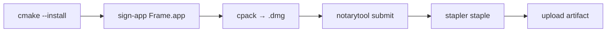

# macOS Developer ID — signing and notarization

**Tier:** ops

How to connect an **Apple Developer Program** account to pp-browser / **Frame** for signed, notarized macOS releases. Repo codename remains `pp-browser`; the shipped macOS product is **Frame** (`Frame.app`).

**Related:** [RELEASE.md](RELEASE.md) (tagging and artifacts), [BUILD.md](BUILD.md), [PRODUCT_BRANDING.md](../ui/PRODUCT_BRANDING.md) (bundle ID), [PLATFORMS.md](../architecture/PLATFORMS.md) (iOS deferred).

---

## Overview

| What | Value in this repo |
|------|-------------------|
| macOS app bundle | `Frame.app` |
| Bundle ID | `dev.frame.app` ([`src/app/CMakeLists.txt`](../../src/app/CMakeLists.txt)) |
| Release artifact | `frame-<version>-macos.dmg` (CPack DragNDrop) |
| Entitlements | [`packaging/macos/Frame.entitlements`](../../packaging/macos/Frame.entitlements) |
| Signing script | [`scripts/macos_sign_and_notarize.sh`](../../scripts/macos_sign_and_notarize.sh) |
| Local env template | [`packaging/macos/signing.env.example`](../../packaging/macos/signing.env.example) |
| CI workflow | [`.github/workflows/release.yml`](../../.github/workflows/release.yml) |

**Developer ID** is for distributing **outside the Mac App Store** (DMG download from GitHub Releases). It is separate from Mac App Store distribution and from iOS provisioning (iOS is not shipped yet).

Until GitHub secrets are configured, release CI **skips signing** and ships unsigned DMGs (Gatekeeper override required). No workflow changes are needed when you add secrets later.

---

## One-time: Apple Developer Portal

Do this at [developer.apple.com/account](https://developer.apple.com/account) after enrolling in the Apple Developer Program.

### 1. Register the bundle ID

1. **Certificates, Identifiers & Profiles → Identifiers → App IDs**
2. Register **`dev.frame.app`** (or your org ID, e.g. `com.yourorg.frame`)
3. If you change the ID, update `MACOSX_BUNDLE_GUI_IDENTIFIER` in [`src/app/CMakeLists.txt`](../../src/app/CMakeLists.txt)

### 2. Create a Developer ID Application certificate

1. **Certificates → +**
2. Choose **Developer ID Application** (not “Mac App Store Distribution”)
3. On your Mac: **Keychain Access → Certificate Assistant → Request a Certificate From a Certificate Authority** → save CSR
4. Upload CSR, download cert, double-click to install in Keychain

You need the **private key** in Keychain alongside the cert for signing.

### 3. Export a `.p12` for CI

1. Keychain Access → **My Certificates**
2. Select **Developer ID Application: …**
3. Right-click → **Export** → `.p12` format, set a password

Keep this file secure; it is imported into GitHub Actions as a secret.

### 4. Create a notarization API key (recommended)

App-specific passwords work but API keys are easier in CI.

1. [App Store Connect](https://appstoreconnect.apple.com) → **Users and Access → Integrations → App Store Connect API**
2. Generate a key with access suitable for notarization
3. Download **`AuthKey_XXXX.p8`** (only available once)
4. Note **Key ID** and **Issuer ID** on the same page

### 5. Note your Team ID

**Membership details** → **Team ID** (10 characters, e.g. `AB12CD34EF`).

---

## GitHub repository secrets

Add under **GitHub repo → Settings → Secrets and variables → Actions**. Replace placeholders with real values.

| Secret | Placeholder / example | Purpose |
|--------|----------------------|---------|
| `APPLE_CERTIFICATE_BASE64` | Base64 of `.p12` | Developer ID cert + private key |
| `APPLE_CERTIFICATE_PASSWORD` | `YOUR_P12_PASSWORD` | `.p12` export password |
| `APPLE_SIGNING_IDENTITY` | `Developer ID Application: Your Org (YOUR_TEAM_ID)` | Exact string from Keychain |
| `APPLE_TEAM_ID` | `YOUR_TEAM_ID` | 10-character Team ID |
| `APPLE_NOTARY_KEY_ID` | `YOUR_NOTARY_KEY_ID` | API key ID |
| `APPLE_NOTARY_ISSUER_ID` | `YOUR_NOTARY_ISSUER_ID` | Issuer ID |
| `APPLE_NOTARY_P8_BASE64` | Base64 of `AuthKey_*.p8` | Notarization private key |

Encode on macOS:

```bash
base64 -i DeveloperIDApplication.p12 | pbcopy    # → APPLE_CERTIFICATE_BASE64
base64 -i AuthKey_XXXX.p8 | pbcopy                 # → APPLE_NOTARY_P8_BASE64
```

Find the exact signing identity:

```bash
security find-identity -v -p codesigning
```

Use the line that starts with `Developer ID Application:`.

---

## How release CI uses secrets

On tag push, the **macos** job in [`release.yml`](../../.github/workflows/release.yml):



| Step | Script command | When skipped |
|------|----------------|--------------|
| After install | `./scripts/macos_sign_and_notarize.sh sign-app "${INSTALL_PREFIX}/Frame.app"` | No `APPLE_CERTIFICATE_BASE64` |
| After cpack | `notarize` + `staple` on the `.dmg` | No `APPLE_NOTARY_*` secrets |

Signing uses **hardened runtime** and [`Frame.entitlements`](../../packaging/macos/Frame.entitlements) (network client/server for Brief API and libp2p).

---

## Local smoke test (macOS)

### Setup env file

```bash
cp packaging/macos/signing.env.example packaging/macos/signing.env
# Edit signing.env — replace YOUR_* placeholders and paths
source packaging/macos/signing.env
```

`signing.env` is gitignored; never commit credentials.

### Build, sign, notarize

```bash
cmake -B build -S . \
  -DCMAKE_BUILD_TYPE=Release \
  -DPP_BROWSER_PACKAGED_BUILD=ON
cmake --build build -j
ctest --test-dir build --output-on-failure
cmake --install build --prefix install

./scripts/macos_sign_and_notarize.sh sign-app install/Frame.app

(cd build && cpack -G DragNDrop)
dmg="$(find build -maxdepth 2 -name '*.dmg' -print -quit)"

./scripts/macos_sign_and_notarize.sh notarize "$dmg"
./scripts/macos_sign_and_notarize.sh staple "$dmg"
```

### Verify Gatekeeper

```bash
spctl -a -t open -vv "$dmg"
codesign --verify --deep --strict --verbose=2 install/Frame.app
```

Open the DMG, drag Frame to Applications, launch without right-click → Open.

### Script commands

```bash
./scripts/macos_sign_and_notarize.sh --help

# Individual steps:
./scripts/macos_sign_and_notarize.sh sign-app   <Frame.app>
./scripts/macos_sign_and_notarize.sh notarize   <Frame.app|file.dmg>
./scripts/macos_sign_and_notarize.sh staple     <Frame.app|file.dmg>

# Convenience (after cpack, when dmg path is known):
./scripts/macos_sign_and_notarize.sh release install/Frame.app build/frame-0.1.0-macos.dmg
```

---

## Troubleshooting

| Symptom | Likely fix |
|---------|------------|
| Notarization rejected — missing entitlement | Add key to [`Frame.entitlements`](../../packaging/macos/Frame.entitlements); check log with `xcrun notarytool log <submission-id> --key ...` |
| `errSecInternalComponent` in CI | Ensure `APPLE_CERTIFICATE_BASE64` decodes cleanly; re-export `.p12`; check keychain import in script |
| Wrong identity | Match `APPLE_SIGNING_IDENTITY` exactly to `security find-identity -v -p codesigning` |
| CI still unsigned | Confirm all seven secrets are set; unsigned path logs `warning: macOS signing credentials not configured` |
| Gatekeeper blocks signed app | Ensure DMG was **notarized and stapled**, not just the `.app` |

---

## Optional follow-ups

| Item | Notes |
|------|-------|
| **`.icns` icon** | Packaged build uses `app-icon.png`; `.icns` improves dock quality ([PRODUCT_BRANDING.md](../ui/PRODUCT_BRANDING.md)) |
| **Org bundle ID** | Switch from `dev.frame.app` before first public signed release if needed |
| **Intel / universal binary** | Current GHA `macos-14` is Apple Silicon only |
| **Mac App Store** | Different cert, sandbox, review — not covered here |
| **iOS** | Separate Xcode target, provisioning profiles, Keychain — see [PLATFORMS.md](../architecture/PLATFORMS.md) |

---

## Quick checklist

- [ ] Apple Developer Program active
- [ ] Bundle ID `dev.frame.app` registered (or CMake updated)
- [ ] Developer ID Application cert in Keychain + `.p12` exported
- [ ] App Store Connect API key (`.p8`) + Key ID + Issuer ID saved
- [ ] Team ID noted
- [ ] Seven GitHub secrets set (or `signing.env` for local only)
- [ ] Local smoke test: signed + notarized DMG opens without Gatekeeper override
- [ ] Tag a pre-release (`v0.x.x-rc1`) and confirm release artifact on GitHub
