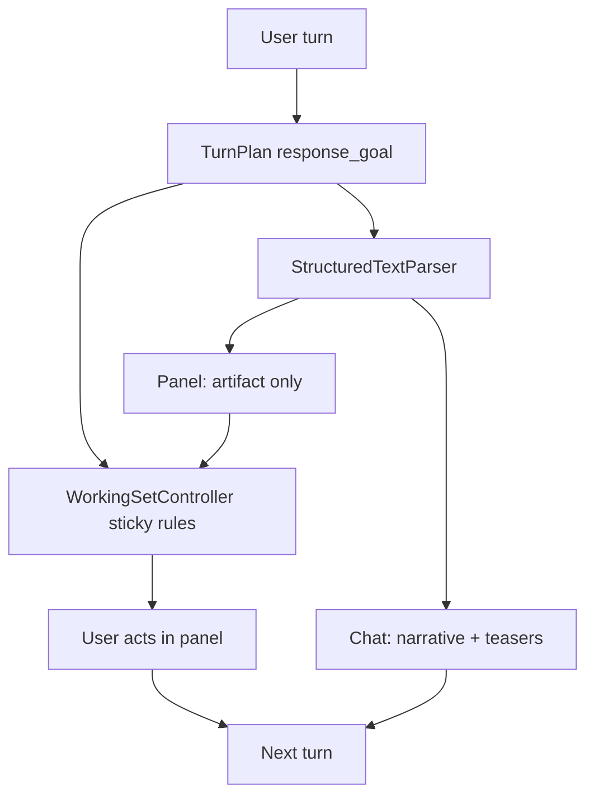

# Working Set Panel

**Tier:** product / UI

**Status:** Implemented (phase 1).

This document is the authoritative design plan for the auxiliary working set panel. Agents extending this feature should follow this doc.

## Why

Assistant replies route working-set candidates through [`WorkingSetController`](../../src/feature/ui/chat/WorkingSetController.h) (invoked from [`ChatController::FinishAssistantReply`](../../src/feature/ui/chat/ChatController.cpp)). The panel is a place to **work** on AI output (browse lists, fill forms, scan tables), not a duplicate of chat narrative.

**Design principle:** Chat explains; panel lets you work. Never mirror narrative paragraphs in the panel.

## Mental model

| Surface | Shell role | User job |
|---------|------------|----------|
| **Chat** | Primary | Understand, ask follow-ups, see decisions |
| **Working set** | Auxiliary | Browse, select, fill forms, act on AI output |
| **Drill-down** | Transient (phase 2) | Inspect one row (person, article) without losing the list |



Related docs: [WINDOW_SHELL.md](WINDOW_SHELL.md), [CHAT_TEMPLATES.md](CHAT_TEMPLATES.md), [AGENT_CONVERSATION.md](AGENT_CONVERSATION.md).

---

## Phase 1 — Foundation

### Implementation checklist

- [x] Add `WorkingSetTypes` and extend `ParseResult` + `AgentEvent` with `response_goal`
- [x] Implement `WorkingSetPolicy`: ResponseGoal-first routing + block heuristics + affinity
- [x] Dual render in `StructuredTextParser`: artifact RML for panel, teasers for chat
- [x] `WorkingSetController` (`src/feature/ui/chat/`): apply, open, sticky update, clear; façade hooks from `ChatController`
- [x] Update `preview.rml` + `base.rcss` for working set panel and chat chips
- [x] Wire form/calendar panel bindings; update `PromptBuilder`, docs, tests

### 1. Core types

Add [`src/common/ui/WorkingSetTypes.h`](../../src/common/ui/WorkingSetTypes.h):

```cpp
enum class WorkingSetKind { LongList, Form, Calendar, Table, Code, KeyValue, Card, None };

enum class WorkingSetAffinity {
  None,           // no active task
  Feed,           // long_list / DisplayFeed / PeopleDiscovery
  Form,           // active form
  DataTable,      // large table
  Document,       // code / key_value / card
};

struct WorkingSetCandidate {
  int block_index;
  WorkingSetKind kind;
  WorkingSetAffinity affinity;
  bool auto_open;
  std::string title;
  std::string subtitle;
  std::string artifact_rml;   // full panel body (no narrative)
  std::string teaser_rml;     // compact chip/summary for chat bubble
};

struct WorkingSetState {
  bool active = false;
  std::string entry_id;
  int block_index = -1;
  WorkingSetKind kind = WorkingSetKind::None;
  WorkingSetAffinity affinity = WorkingSetAffinity::None;
  Rml::String title;
  Rml::String subtitle;
  Rml::String body_rml;
};
```

Extend [`ParseResult`](../../src/base/ai/StructuredTextParser.h):

```cpp
std::vector<WorkingSetCandidate> working_set_candidates;
```

Replace `shell_.preview_rml` in [`ChatController::ShellState`](../../src/feature/ui/chat/ChatController.h) with `WorkingSetState working_set` (bind `working_set.body_rml` as `preview_rml` temporarily if needed to minimize RML churn).

### 2. Two-layer routing: ResponseGoal first, block heuristics second

Add [`src/base/ai/WorkingSetPolicy.cpp`](../../src/base/ai/WorkingSetPolicy.cpp):

**Goal-first defaults** (from [`ResponseGoal`](../../src/base/ai/TurnPlan.h)):

| ResponseGoal | Panel behavior | Chat behavior |
|--------------|----------------|---------------|
| `DisplayFeed`, `PeopleDiscovery` | Primary — auto-open artifact | Short framing paragraph only; list lives in panel |
| `Summarize`, `AnswerQuestion`, `Headlines` | Panel only if eligible block attached | Answer stays in chat; panel for supplemental data |
| `General` | Block heuristics decide | Normal inline blocks |

**Block heuristics** (fallback / within-goal):

| Block | Eligible | Teaser in chat | Artifact in panel |
|-------|----------|----------------|-------------------|
| `long_list` (non-empty) | always | "N items — View in panel" chip | full list, no 240dp cap (`.working-set-long-list`) |
| `form` | always | title + field count chip | expanded form layout |
| `calendar` | always | month label chip | full calendar |
| `table` | rows > 4 or cols > 3 | "Table (N rows)" chip | full table |
| `code` | lines > 12 or len > 400 | truncated preview chip | full code block |
| `key_value` | items > 6 | count chip | full grid |
| `card` | body > ~200 chars | title chip | full card |

Static blocks (`paragraph`, `heading`, `list`, `button`, `choice`, `poll`) stay in chat only — never promoted to panel.

Policy API:

```cpp
WorkingSetRouting RouteTurn(ResponseGoal goal, RenderMode render_mode);
std::optional<WorkingSetCandidate> BuildCandidate(
    const Object& block, int block_index,
    ResponseGoal goal, /* rendered artifact + teaser */);
```

Wire `ResponseGoal` into chat: extend [`AgentEvent`](../../src/feature/ai/AgentSession.h) with `response_goal` and `render_mode`; populate in [`AgentSession::PushAssistantReady`](../../src/feature/ai/AgentSession.cpp) from `state->turn_plan`. Pass through [`HandleAgentEvent`](../../src/feature/ui/chat/ChatController.cpp) → `FinishAssistantReply`.

Mock path: infer goal from mock JSON content (e.g. `long_list` → `PeopleDiscovery`) or default `General`.

### 3. Dual render in StructuredTextParser

Refactor [`RenderBlock`](../../src/base/ai/StructuredTextParser.cpp):

1. Render block normally to get artifact RML.
2. If `WorkingSetPolicy` marks eligible: build `WorkingSetCandidate`, append **teaser** to chat output instead of full block (for goal-primary cases) or teaser + abbreviated inline (for `General` — start with teaser-only for feed/form/calendar).
3. Non-eligible blocks append to chat as today.

Panel-specific render helpers (no scroll cap, panel CSS classes):

- `RenderLongListArtifact(block, parent)` — same data, `.working-set-long-list` wrapper
- `RenderFormArtifact`, `RenderTableArtifact`, etc.

Teaser chip (entry placeholder injected later):

```html
<button class="chat-working-set-chip"
  data-event-click="open_working_set('__ENTRY__', 2)">View full list (12 items)</button>
```

Register `open_working_set(entry_id, block_index)` on `chat` and `shell` data models.

### 4. WorkingSetController

Implemented in [`WorkingSetController.h/.cpp`](../../src/feature/ui/chat/WorkingSetController.h); `ChatController` owns an instance and forwards RML/`FinishAssistantReply` hooks.

- **`ApplyFromParse(entry_id, candidates)`** — pick primary candidate (first auto-open eligible); set `working_set` state; `SetAuxiliaryAvailable(true)` + `OpenAuxiliary()` when any eligible block exists.
- **`Open(entry_id, block_index)`** — manual reopen from chip or header button.
- **`Clear()` / `ClearAll()`** — reset panel (and forget entry candidates on thread switch / shutdown).

In-memory anchor (`WorkingSetController`):

```cpp
std::map<std::string, std::vector<WorkingSetCandidate>> by_entry_;
```

Populated at parse time via `FinishAssistantReply` → `ApplyFromParse`.

### 5. Sticky task lifecycle

`WorkingSetAffinity active_affinity_` (and active entry id) live on `WorkingSetController`.

| Event | Behavior |
|-------|----------|
| New reply, same affinity (e.g. pagination → `DisplayFeed` long_list) | **Update in place** — panel content swaps, stays open |
| New reply, different affinity | **Replace** working set with new primary candidate |
| Form submitted ([`SubmitForm`](../../src/feature/ui/chat/ChatController.cpp)) | **Close** working set (task complete) |
| Row action completed (`send_chat_action` with start_conversation etc.) | Close or collapse to chat status line |
| New chat / thread switch | **Clear** working set (fixes current stale-preview bug) |
| User dismisses panel (Escape / toggle) | Close visually; `auxiliary_available` stays true so user can reopen via chip |

Pagination affinity: detect payload fast path in [`PayloadTurnPlanBuilder`](../../src/feature/ai/PayloadTurnPlanBuilder.cpp) (`blog_articles` + `before_id`) → same `WorkingSetAffinity::Feed`.

### 6. Panel UI

Update [`assets/views/preview.rml`](../../assets/views/preview.rml) (keep file name; rename label in UI):

```html
<div class="working-set-panel stack" data-model="shell">
  <div class="working-set-header">
    <h2 class="heading-2" data-rml="working_set_title"></h2>
    <p class="text muted" data-if="working_set_subtitle != ''" data-rml="working_set_subtitle"></p>
  </div>
  <div class="working-set-body" data-if="working_set_active" data-rml="working_set_rml"></div>
  <p class="text muted empty-panel" data-if="!working_set_active">
    Results, forms, and lists appear here when the assistant produces them.
  </p>
</div>
```

RCSS in [`base.rcss`](../../assets/themes/base.rcss):

- `.working-set-long-list` — full height, no max-height
- `.working-set-form`, `.working-set-table`, `.working-set-code`
- `.chat-working-set-chip` — inline teaser (reuse suggestion button styling)

Chat header button ([`chat.rml`](../../assets/views/chat.rml)): show when `auxiliary_available`; label can stay "Details" or use dynamic title later.

Compact toolbar: keep existing Preview button wired to `toggle_auxiliary()`.

### 7. Form/calendar interactivity (phase 1 scope)

Panel shows expanded static RML for forms/calendars. Wire `working_set` data-model alias to `widgets_by_entry_[entry_id]` when panel opens so submit/calendar nav work in panel.

Known gap: messages layout uses static `data-rml` ([`chat.rml`](../../assets/views/chat.rml)) while form templates bind `turn.*` — panel becomes the primary interactive surface for forms in phase 1.

### 8. LLM prompt

Update [`PromptBuilder::ChatBlocksProfile()`](../../src/base/ai/PromptBuilder.cpp):

- Feeds, people lists, forms, and large tables render as a **compact summary in chat**; full content opens in the **side panel**.
- Keep emitting standard block JSON; no new required fields yet.
- Reserve optional per-block `"surface": "chat" | "panel" | "both"` in [RML_PROFILE.md](RML_PROFILE.md) for phase 2.

### 9. Tests

- [`tests/structured_text_parser_test.cpp`](../tests/structured_text_parser_test.cpp): `long_list` → candidate + teaser, no full list in chat RML for feed goals; paragraph-only → no candidates.
- New [`tests/working_set_policy_test.cpp`](../tests/working_set_policy_test.cpp): goal routing table, affinity detection.

---

## Phase 2 — Extensibility (follow-ups)

| Feature | Approach |
|---------|----------|
| **Transient drill-down** | Row tap → [`ShellHost::PushTransient`](../../src/feature/ui/shell/ShellHost.h) with detail RML; list stays in auxiliary |
| **Pin working set** | User pins panel content; new replies update chat but not panel until unpinned |
| **Multi-block navigator** | Tabs or list when one message has 2+ eligible blocks |
| **Explicit `surface` field** | Block JSON or TurnPlan overrides heuristics |
| **Multi-select in panel** | Selection state on working set model; batch actions back to chat/agent |
| **Persist working set anchor** | Store `entry_id + block_index` in thread metadata for reload |
| **Rename pane** | `preview` → `working_set` in ViewCatalog / RegisterPane |

---

## Files to change (phase 1)

| File | Change |
|------|--------|
| `src/common/ui/WorkingSetTypes.h` | Core types |
| `src/base/ai/WorkingSetPolicy.h/.cpp` (new) | Goal + block routing |
| `src/base/ai/StructuredTextParser.h/.cpp` | Candidates, dual render, teasers |
| `src/feature/ai/AgentSession.h/.cpp` | Pass `response_goal` / `render_mode` in `AgentEvent` |
| `src/feature/ui/chat/WorkingSetController.h/.cpp` | Sticky lifecycle, apply/open/clear |
| `src/feature/ui/chat/ChatController.h/.cpp` | Owns WorkingSetController; RML callbacks + reply hooks |
| `assets/views/preview.rml` | Dynamic working set chrome |
| `assets/themes/base.rcss` | Panel + chip styles |
| `src/base/ai/PromptBuilder.cpp` | Side panel guidance for LLM |
| `docs/ui/WINDOW_SHELL.md`, `docs/ui/CHAT_TEMPLATES.md` | Cross-links and behavior notes |
| `tests/structured_text_parser_test.cpp`, new policy test | Coverage |

---

## Verification checklist

1. Mock `list` → chat shows framing + chip; panel auto-opens with uncapped list; row actions work in panel.
2. Paragraph-only reply → no `auxiliary_available`; panel stays closed.
3. Pagination ("More" footer action) → panel updates in place, stays open.
4. Form submit → panel closes; acknowledgment in chat.
5. Click chip on older message → panel switches to that artifact.
6. Thread switch / new chat → working set cleared.
7. `AnswerQuestion` with small inline list → stays in chat, no panel.
8. Compact layout → toast + toolbar reopen unchanged.
