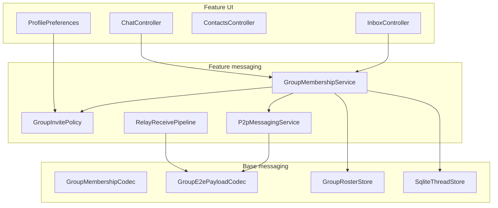

# Group chat — design specification

Maturity tags: **`[v1]`** ships in first group slice; **`[v1.1]`** next; **`[future]`** deferred.

Cross-project: [chat-storage D076/D089/D095](../chat-storage-and-memory/DECISIONS.md), [e2e E022/E024](../e2e-message-crypto/DECISIONS.md), [WIRE_SCHEMAS](../../docs/contracts/WIRE_SCHEMAS.md).

---

## Resolved product decisions

| # | Topic | v1 behavior | Extensibility |
|---|--------|-------------|---------------|
| 1 | Invite authority | Owner-only invite/remove/rename | `MemberRole`, `PermissionFlags`, `group_policy.invite_policy` |
| 2 | Fork history | Fresh start (empty transcript) | `history_mode`, `source_group_id`, `fork_message_id`, `ExportMessagesUpTo` |
| 3 | New member history | Full backfill on accept | `history_visibility`: `full` \| `since_join` |
| 4 | Group identity | Local `group:<uuid>` | — |
| 5 | Offline invitee | Outbox queue + retry | — |

---

## Architecture overview



**Two authority domains:**

| Domain | Mechanism |
|--------|-----------|
| Membership / roster | Owner-signed events; monotonic `roster_epoch` |
| Message ordering | Per-sender `sender_seq` in `(group_id, session_epoch)`; relaxed ingest (D046) |

---

## Roles and permissions `[v1]`

### MemberRole

| Value | v1 used | Notes |
|-------|---------|-------|
| `owner` | yes | One per group |
| `admin` | schema only | v1.1 |
| `member` | yes | Default for non-owner |

### PermissionFlags (bitmask)

| Flag | Owner | Member (v1) |
|------|-------|---------------|
| `send` | yes | yes |
| `invite` | yes | no |
| `remove` | yes | no |
| `rename` | yes | no |
| `transfer_owner` | yes | no |
| `fork` | yes | yes |
| `leave` | yes | yes |

Enforcement: signed membership events include `actor_role`; ingest validates permission at event `roster_epoch`.

### group_policy (JSON on roster state)

```json
{
  "invite_policy": "owner_only",
  "history_visibility": "full"
}
```

Future `invite_policy`: `"admins"`, `"any_member"`.

---

## Membership event wire schema

Delivered as **`ChatPayload` system messages** (`content_type=system`) with `control_type` and JSON `detail`, or as **direct-thread invite cards** to the invitee before they join.

### Event types

| control_type | Signer | detail JSON (required fields) |
|--------------|--------|-------------------------------|
| `group_invite` | owner | See InvitePayload |
| `group_invite_accept` | invitee | `{ "invite_nonce", "group_id" }` |
| `group_invite_decline` | invitee | `{ "invite_nonce", "group_id" }` |
| `member_joined` | owner | `{ "group_id", "member_identity", "role", "roster_epoch" }` |
| `member_left` | member | `{ "group_id", "member_identity", "roster_epoch" }` |
| `member_removed` | owner | `{ "group_id", "member_identity", "roster_epoch" }` |
| `owner_transferred` | owner | `{ "group_id", "new_owner_identity", "roster_epoch", "leave_previous"? }` |
| `group_renamed` | owner | `{ "group_id", "title", "roster_epoch" }` |
| `group_forked` | actor | See ForkPayload |

### InvitePayload

```json
{
  "group_id": "group:550e8400-e29b-41d4-a716-446655440000",
  "group_title": "Weekend hike",
  "inviter_identity": "relay:abc123",
  "invitee_identity": "relay:def456",
  "invite_nonce": "uuid",
  "roster_epoch": 1,
  "expires_at": 1735689600000,
  "actor_role": "owner"
}
```

**Delivery `[v1]`:** encrypted direct message to invitee (`route.kind=direct`, `channel=e2e_public`) containing the system payload. Invitee UI renders Accept / Decline / Block.

**Lifecycle:** `pending` → `accepted` | `declined` | `expired` | `blocked`

### ForkPayload

```json
{
  "source_group_id": "group:…",
  "new_group_id": "group:…",
  "new_group_title": "…",
  "selected_identities": ["relay:a", "relay:b"],
  "history_mode": "fresh",
  "fork_message_id": null,
  "actor_identity": "relay:…",
  "roster_epoch": 2
}
```

v1: `history_mode` is always `"fresh"`. v1.1: `"copy_to_fork_point"` with non-null `fork_message_id`.

---

## Invite spam controls `[v1]`

### Profile setting: `group_invite_policy`

| Value | Behavior |
|-------|----------|
| `everyone` | Accept invites from any verified sender |
| `contacts_only` | Reject if inviter not in local contacts (default) |
| `nobody` | Reject all inbound group invites |

Stored in `ProfilePreferences` (profile `prefs.json`).

### Enforcement layers

1. **GroupInvitePolicy::AllowsInboundInvite** — checks policy + `TrustLevel::Blocked`
2. **Rate limit** — max 20 pending invites per 24h (local counter in profile.db)
3. **Per-invite UI** — Decline, Block inviter (sets contact `trust=blocked`)

Separate from 1:1 DM blocking: a contact may DM but not spam group invites.

---

## Group wire envelope (D095) `[v1]`

### Route

```json
{ "kind": "group", "group_id": "group:550e8400-…" }
```

No `channel` field on group routes (sign bytes use `channel=0xFF` per E014).

### Body — N ciphertexts

```json
{
  "e2e": {
    "member_payloads": {
      "relay:alice": "<base64 AEAD blob>",
      "relay:bob": "<base64 AEAD blob>"
    }
  }
}
```

Each blob uses pairwise `ChatTargetKey` with `(peer_identity, e2e_public)` for auto-key bootstrap (E022/E024).

Direct tiers continue using `payload_b64` only.

### Stream id

Opaque: `v1:group:{group_id}:{session_epoch}`

---

## Storage

### profile.db additions

**`group_targets`** — seq/epoch per group (parallel to `chat_targets`):

| Column | Notes |
|--------|-------|
| `group_id` | PK |
| `local_thread_id` | FK to threads.id |
| `session_epoch` | default 1 |
| `next_outgoing_seq` | default 1 |

**`group_rosters`** — canonical membership:

| Column | Notes |
|--------|-------|
| `group_id` | PK part |
| `member_identity` | PK part — communicating identity value |
| `contact_id` | local Contact.id (optional) |
| `role` | owner \| admin \| member |
| `joined_at` | unix ms |

**`group_metadata`**:

| Column | Notes |
|--------|-------|
| `group_id` | PK |
| `owner_identity` | current owner communicating identity |
| `title` | Shared group name (owner rename / create). Clients may also keep a local override on `threads.local_title` (not synced). |

### Dual title display `[v1]`

| Priority | Source | Synced? |
|----------|--------|---------|
| 1 | `threads.local_title` | No (device-only nickname) |
| 2 | `group_metadata.title` | Yes (`group_renamed`) |
| 3 | `threads.title` cache / `"Group chat"` | Denormalized |

When a local override is active, UI may show the shared name in the subtitle (`Shared: …`). Owner “Rename for everyone” updates metadata + fans out `group_renamed` DMs; it does not clear peers’ `local_title`.

**`pending_group_invites`**:

| Column | Notes |
|--------|-------|
| `invite_nonce` | PK |
| `group_id`, `inviter_identity`, `invitee_identity` | |
| `status` | pending \| accepted \| … |
| `expires_at`, `created_at` | |

### threads table

Populate `group_id` column when `kind=group`. `Thread.group_id` field in C++ struct.

### sync_state (thread.db)

Group scope: `peer_identity_kind=group`, `peer_identity_value={group_id}` (D076 generalization of 1:1 PK).

---

## Inbound ingest `[v1]`

1. Verify signature (sender identity)
2. If `route.kind=group`: lookup roster — hard-reject if recipient not a member (except invite path on direct thread)
3. Decrypt local slice from `member_payloads[local_relay_id]`
4. Classify seq (relaxed ingest default — D046)
5. Append to group thread; update sync_state

**Invite handshake `[v1]`:** Invite records **pending only** — the invitee is not an encrypt target until commit. Invitee Accept/Decline send `group_invite_accept` / `group_invite_decline` DMs back to the inviter. Owner ingest of accept requires the pending row, upserts the member, bumps `roster_epoch`, then publishes owner-signed `member_joined` to all active members (G006 commit). Peers apply `member_joined` (owner + epoch gates) as the roster source of truth. Decline clears pending only. Pending invites store `group_title` / `roster_epoch` so Accept can seed local `group_metadata`. On Accept, the invitee also upserts the inviter as `Owner` and self as `Member` locally so member→owner fan-out works before `member_joined` arrives. Closing a group session dismisses local membership (and clears `group_targets`) so inbound group traffic hard-rejects instead of recreating the thread with an unread. After Accept/Decline/Block, the DM invite card is resolved in-place (actions cleared; status line text).

**Leave / transfer / prune `[v1]` (G009):** Member close fans out `member_left` then deletes the local thread. Owner close with others picks a successor and fans out `owner_transferred` with `leave_previous: true` (one DM applies succession + removes the old owner). Solo owner close is local dismiss only. Ingest rejects `member_left` from a recorded owner and requires monotonic `roster_epoch`. Send/encrypt failure marks members unreachable; owner may remove via `member_removed` fan-out. Unreachable owner shows a local advisory card (Fork / Message owner / Got it) — no automatic second owner.

**Auto-create:** on accepted invite / first valid `member_joined` for local identity.

---

## UI surfaces `[v1]`

| Surface | Location |
|---------|----------|
| Create group | Contacts or inbox action |
| Group roster | Thread menu / working set |
| Invite card | Direct thread bubble (structured actions) |
| Block invites setting | Me → Security or Messaging prefs |
| Fork group | Thread menu → select members |

---

## Phasing checklist

- [x] Design doc + ADRs (G001–G009)
- [ ] C0: `e2e_public` compose enabled when messaging ready
- [x] C1: Group envelope parse/send, N ciphertexts (scaffold)
- [x] C2: Membership codec + invite/accept/decline + leave/transfer/remove wire (fork peer fan-out still incomplete)
- [x] C3: Roster store + group seq targets (group sync polish remaining)
- [x] C4: Inbox create + invite UI + settings
- [ ] C5: Fork flow (fresh start) — local only today; peer fan-out incomplete

---

## Out of scope (explicit)

- MLS / sender-keys tree
- Relay-side encrypted fan-out
- Multi-device seq coordination (D074)
- End-to-end encrypted roster on relay
- Copy-to-fork-point history (v1.1)
