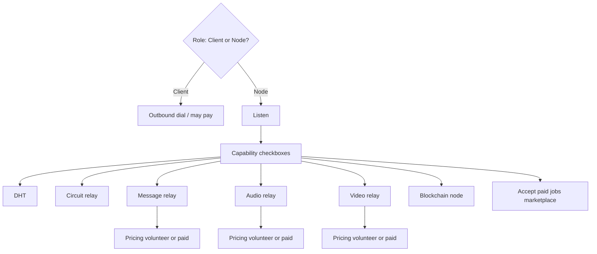
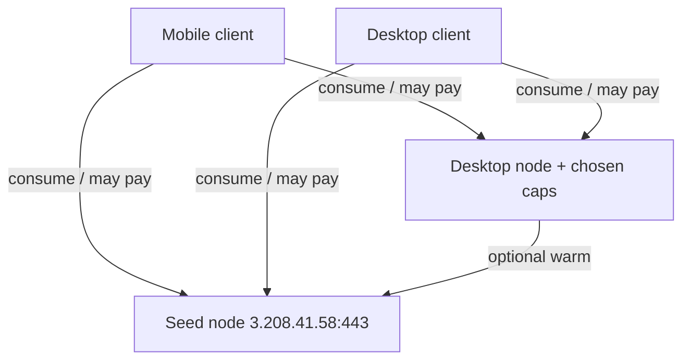

# Libp2p node roles — design

## Model: role + capability checkboxes (N009)

**Two roles only** — not a flat list of unrelated modes:

| Role | Who | Meaning |
|------|-----|---------|
| **Client** | Mobile always; desktop when user opts out | Consume services; outbound dial; do not host |
| **Node** | Desktop default (`node_enabled`) | May host; listen + user-chosen **capabilities** |

**Capabilities** are independent checkboxes **under Node** (what I host). They do not create new roles.

| Layer | Answers | UI (desktop) |
|-------|---------|----------------|
| Role | Do I host at all? | Master toggle: **Help the network** (`node_enabled`) |
| Capabilities | Which services do I run? | Checkboxes enabled only when role = Node |
| Pricing (N010) | Free or paid for a billable service? | Nested under that capability (not a third role) |

Turning role **off** → Client: ignore/disable all capability flags at runtime (flags may remain on disk for when the user re-enables Node).

Mobile: always Client — no role toggle, no capability UI (may **pay** nodes later as a consumer).



## Vision: nodes as ecosystem infrastructure

A **node** is a voluntary **infrastructure element** of the Brief/pp-browser ecosystem. Peers help each other; users pick which services to contribute.

| Capability | Purpose (sketch) | Ships |
|------------|------------------|-------|
| **Inbound listen** | Dialable peer for direct messaging / streams | n1 (implied by Node) |
| **DHT** | Peer and content routing | n2 + checkbox |
| **Circuit relay** | Hop for NATed peers | n3 + checkbox |
| **Message relay** | Store-and-forward / inbox assist | n4+ + checkbox + **pricing** |
| **Audio relay** | Voice media hop / SFU-style | n4+ + checkbox + **pricing** |
| **Video relay** | Video media hop / SFU-style | n4+ + checkbox + **pricing** |
| **Blockchain node** | Chain participation (identity / DA / settlement rails) | n4+ + checkbox |
| **Accept paid jobs** | Optional **marketplace** for discrete tasks (transcode, fetch, compute) — **not** the primary monetization path | later + checkbox |

**Defaults (desktop Node):** listen on; capability checkboxes default **off** until each service is production-ready and the user opts in (or we later choose safe volunteer defaults — decide at ship time).

**Always-on seed** (`3.208.41.58:443` + PeerId) is the first permanent infrastructure node. User desktops **expand** the mesh when online — they do not replace the seed.



## Monetization (N010) — agents: read this

**Do not confuse** “settle on chain” with a single `accept_paid_jobs` capability.

| Mechanism | What it is | Primary use |
|-----------|------------|-------------|
| **Per-capability pricing** | Policy on a **billable** hosted service | Message / audio / video **relay** charge consumers; settle on chain |
| **Accept paid jobs** | Separate optional **job marketplace** | Discrete one-off tasks, not continuous relay metering |

### Per-capability pricing (primary)

For billable capabilities (first: message, audio, video relay):

| Policy | Meaning |
|--------|---------|
| **Volunteer** | Free for peers (mutual-help default) |
| **Paid** | Consumers pay a rate; usage metered; **on-chain settlement** |

Rules:

- Client never hosts or prices — only consumes (and may pay).
- `Node && capability off` → nothing to charge for.
- `Node && capability on && volunteer` → free help.
- `Node && capability on && paid` → advertise rate; consumer agrees before use; settle on chain.
- DHT / circuit relay may stay volunteer longer (mesh glue); relays are the natural first paid surface.
- Shared wallet / settlement module can serve all paid paths; **blockchain node** capability ≠ “I accept payments” by itself.

### Accept paid jobs (secondary, later)

Optional checkbox under Node for advertising/fulfilling **discrete jobs**. Complements relay pricing; does **not** replace it. Do not implement jobs UI as the only way nodes earn.

### UI sketch (desktop, under Node) — when billable caps ship

```text
[x] Help the network                         ← role

  [x] Message relay
        Pricing: (•) Free  ( ) Paid   rate: …
  [ ] Audio relay
        Pricing: …
  [ ] Video relay
        Pricing: …
  [ ] DHT
  [ ] Circuit relay
  [ ] Blockchain node

  [ ] Accept paid jobs                       ← marketplace (later)
```

n1: master toggle only. Pricing UI ships with the first billable capability — **not** in n1, and **not** as a fake standalone “paid settle” capability.

## Platform defaults

| Platform | `node_enabled` | Effective role | Listen | Capability / pricing UI |
|----------|----------------|----------------|--------|-------------------------|
| Mobile | ignored | Client | no | hidden (consumer pay UX later) |
| Desktop | true (default) | Node | yes | shown when Node; pricing nested under billable caps |
| Desktop | false | Client | no | hidden / inert |

Resolver: e.g. `ResolveLibp2pRole`. Effective hosting for *C* requires `role == Node && C_enabled && C_implemented`. Charging for *C* requires that **and** `pricing(C) == paid`.

## Bootstrap seed

Default `bootstrap_peers` entry (IP only, no DNS):

```
/ip4/3.208.41.58/tcp/443/p2p/12D3KooWCmqCKgBL47m25WzUgiAPayf3GqKiRosmPvAqp2MQUFYR
```

- Seed listens on TCP **443** (libp2p transport — N007).
- Desktop nodes listen on **/ip4/0.0.0.0/tcp/40123** (N003) when Node.
- Do **not** use public `bootstrap.libp2p.io` (N006).

After host start, register each bootstrap multiaddr into `PeerSessionManager::RegisterEndpoint` under a stable key (PeerId from `/p2p/…`). Do not force a permanent warm dial on mobile.

## Config model

### n1 (role shell only)

| Field | Default / notes |
|-------|-----------------|
| `bootstrap_peers` | vector; default = seed multiaddr above |
| `node_enabled` | `true`; desktop opt-out; ignored on mobile |
| `listen_multiaddr` | `/ip4/0.0.0.0/tcp/40123` when Node |
| session policy | keep existing |

### Later (capabilities + pricing)

Shape sketch (names TBD at implement time):

```json
"libp2p": {
  "node_enabled": true,
  "listen_multiaddr": "/ip4/0.0.0.0/tcp/40123",
  "bootstrap_peers": ["…"],
  "capabilities": {
    "dht": false,
    "circuit_relay": false,
    "message_relay": false,
    "audio_relay": false,
    "video_relay": false,
    "blockchain": false,
    "accept_paid_jobs": false
  },
  "pricing": {
    "message_relay": { "mode": "volunteer", "rate": null },
    "audio_relay": { "mode": "volunteer", "rate": null },
    "video_relay": { "mode": "volunteer", "rate": null }
  }
}
```

- `capabilities.*` = host this service.
- `pricing.*` = volunteer | paid (+ rate) for **billable** caps only — not a substitute for the capability flag.
- `accept_paid_jobs` = marketplace on/off only; job rates live in a later jobs schema.

Do **not** ship capability/pricing keys/UI in n1 until the matching protocol works (N005).

## Host start path (n1)

`MessagingHub::StartLibp2p` / `Libp2pHost::Start`:

- Pass resolved role (`listen_enabled` + listen multiaddr + `bootstrap_peers`).
- **Client:** create host + `start()` **without** `listen`.
- Extend session clamps to **all mobile** via `Platform::IsMobile()`.

Later: start modules only if `Node && capability_enabled`; enforce pricing at the service admission boundary.

## Me → Network UI

### n1

- Desktop master toggle: **Help the network** → `node_enabled` (hide on mobile).
- Copy: mutual help / infrastructure.
- Optional read-only seed PeerId hint.
- No capability or pricing UI yet.

### n2+

- Checkboxes for shipped capabilities under Node.
- When a **billable** capability ships: nested **Free / Paid** (+ rate) under that row (N010).
- **Accept paid jobs** checkbox only when the marketplace exists — separate from relay pricing.

Hot-reload: role / capability / pricing changes reconfigure modules (`MessagingHub::Reinitialize` or finer hooks).

## Capability roadmap

| Phase | What | UI |
|-------|------|-----|
| **n1** | Role + listen + bootstrap | Master toggle only |
| **n2** | DHT | + DHT checkbox (no pricing required) |
| **n3** | Circuit relay | + checkbox (pricing optional / often volunteer) |
| **n4+** | Message / audio / video relay | + checkbox + **pricing** (volunteer \| paid) |
| **n4+** | Blockchain node | + checkbox (settlement rails, not “paid jobs”) |
| **later** | Accept paid jobs marketplace | + checkbox; job schema separate |

Until peer-hosted relays ship, keep **direct multiaddr** + **HTTP Brief relay** fallback.

## Out of scope for n1

- Capability / pricing flags or UI
- DHT / circuit / message / media / chain / jobs protocols
- Publishing listen addrs / AutoNAT / hole punching
- Replacing HTTP Brief relay; DNS multiaddrs

## Docs + tests (n1)

- Update `CONFIGURATION.md`, `P2P_MESSAGING.md`, `PLATFORMS.md` for Client vs Node.
- Unit tests: JSON round-trip; role resolver; Network draft apply.
