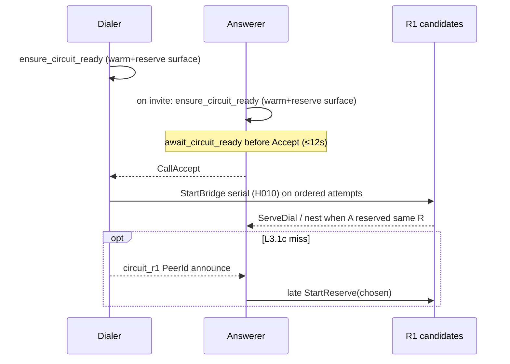

# Circuit R1 rendezvous — dialer-authoritative hop meet

**Status:** Spec / ADR — **not implemented** (today: independent dialer search + answerer multi-reserve)  
**Stack ADR:** [H011](DECISIONS.md#h011--circuit-r1-rendezvous-dialer-authoritative)  
**Attempt budget:** [H010](DECISIONS.md#h010--circuit-startbridge-attempt-budget-not-exhaustive-search)  
**Multi-hop (orthogonal):** [MULTI_HOP_CIRCUIT.md](MULTI_HOP_CIRCUIT.md) / [H008](DECISIONS.md#h008--multi-hop-circuit-chains-planned)  
**No addr gather:** [H007](DECISIONS.md#h007--no-app-layer-hop-candidate-exchange-as-product-path)

## Problem

Nested call-media through a circuit hop requires **both** ends to meet on the **same** immediate relay PeerId **R1**:

```text
Dialer  ──StartBridge(R1)──►  R1  ──ServeDial / nest──►  Answerer
Answerer ──StartReserve(R?)──► R?
```

Today each side chooses independently:

| Side | Mechanism | Candidate source |
|------|-----------|------------------|
| **Dialer** | H010 ranked serial `StartBridge` | `CollectDialableCircuitRelayIds` → `BuildCircuitHopList` (contacts ∪ directory ∪ DHT ∪ seeds) + sticky/Connected reorder |
| **Answerer** | Punch-only + `ReserveOnBootstrapSeeds` | `CollectSeedHopCandidates` only (bootstrap/directory seeds) |

When the dialer advances to hop2 while the answerer only reserved hop1, hop ServeDial returns **not registered** / dialer WaitAck **bridge timed out**. Recent dogfood fixes (reserve-all Connected seeds, same-relay not-reg retry, event-driven far-leg wait) **widen the parking surface** and **retry** — they do not define **who owns the final R1**.

That missing contract is this design.

## Goals

1. **One owner of R1** — dialer selects; answerer does not vote.
2. **Answerer covers the dialer’s likely queue** — park/reserve the shared top-K surface before Accept / Connect race.
3. **Optional thin announce** — after bridge ack, publish **one PeerId** so answerer can late-reserve if park missed.
4. **Stay in-stack** — eligibility still from mesh policy; reachability still Amp circuit; no ICE-style candidate pairs.

## Non-goals

- Bilateral hop “consensus” / voting / ICE pairing.
- Parallel `StartBridge` on first connect (forbidden — H010).
- Answerer reverse `StartBridge` on first pass (H010).
- App multiaddr gather / `call_hop_addrs` (H007 stays).
- Multi-hop path choice beyond R1 (R1 broker owns upstream — H008/N024).
- SoftMigrate **`media_relay` B** pick (V023/N020 — separate from circuit R1).

## Decision summary

**Dialer-authoritative rendezvous:**

```text
eligibility (mesh)  →  shared ordered surface  →  dialer picks R1 (H010)
                                            ↘  answerer parks top-K of same surface
                 optional: dialer announces chosen R1 PeerId after ack
```

Consensus is **not** negotiated. It is **selection by dialer + coverage by answerer** (+ optional confirm).

## Roles

| Role | Call role (typical) | Duty |
|------|---------------------|------|
| **Dialer** | Offerer / Connect initiator | Sole selector of R1; H010 envelope; sticky after success |
| **Answerer** | Invitee | Warm + reserve rendezvous surface; punch-only first pass; late-reserve on announce |
| **R1** | Org seed / contact hop | `op=reserve` + ServeDial far leg; blind to product media keys |
| **Session workflow** | CSM | `ensure_circuit_ready` / `await_circuit_ready` only — no hop PeerId vocabulary |

## Shared rendezvous surface

Both sides must derive the **same ordered PeerId list** (before sticky/Connected dialer-local reorder).

### Source of truth

One helper (name tentative):

```text
CircuitRendezvousSurface(exclude_peer_id) -> vector<PeerId>
```

**Must** use the same policy path as dialer today:

- `BuildCircuitHopList` / `OrderCircuitHops` (contacts → directory → DHT → seeds per `prefer_contacts`)
- Dialability filter equivalent to `CollectDialableCircuitRelayIds` (Connected **or** UDP-dialable Preferred / hop registry)
- Exclude call target PeerId

**Answerer today is too narrow** (seeds-only). L3.1a widens answerer park to this surface (or a documented subset that still covers dialer top-K under fleet configs).

### Coverage rule

```text
K = kCircuitMaxStartBridgeAttempts   // H010 = 4 today
Answerer reserves at least prefix(surface, K) once endpoints exist,
preferring already-Connected first, then serial cold dial+reserve
(same shape as ReserveOnBootstrapSeeds, but over the shared surface).
```

Sticky / Connected reorder is **dialer-local** and can move a later surface entry to try #1. Therefore answerer must cover **enough of the surface**, not only `surface[0]`. Practical rule:

- Prefer reserve **all Connected** members of the surface (already landed).
- Additionally ensure **≥ K members** of the surface are reserved or Connecting before dialer Connect reaches circuit Ensure (Accept await / `ensure_circuit_ready`).
- If `|surface| < K`, reserve all.

### Sticky as soft affinity (not consensus)

`AmpCircuitHopReach::last_good_relay_peer_key_` and hop-registry sticky remain dialer hints. Optional L3.1b: answerer, when warm for peer P, may **prefer** last-good R1 first in reserve order if cached from a prior successful call with P — still coverage, not a vote.

## Sequence (first connect)



Answerer never picks “the” hop. Dialer may fail fast on not-reg and retry same/next relay per H010; park coverage makes first success likely on try #1–2.

## Phasing

### L3.1a — Shared surface + park coverage (no new wire) — **primary**

| Work | Where |
|------|--------|
| Extract `CircuitRendezvousSurface` (or reuse/rename collect path) | `CallMediaPlane` / small mesh helper |
| Point dialer `CollectDialableCircuitRelayIds` and answerer reserve at **same** builder | `WireCircuitHopReach`, `ReserveOn*`, `EnsureBootstrapSeedParkedAsync` |
| Reserve top-K + all Connected of surface | `ReserveOnBootstrapSeedsOnIo` → rename/generalize |
| Unit: surface order stable; park list ⊇ dialer top-K under fixture | gtest |
| Hard-lab: dual-NAT stack with ≥2 seeds | `hard-w5` STACK |

**Exit:** dialer StartBridge hop index ∈ answerer reserved set for green dual-NAT without relying on sticky luck.

### L3.1b — Sticky prefer on answerer (optional polish)

Cache last-good R1 per remote PeerId (mesh/session, not invite). Answerer sorts that PeerId first when present. No wire.

### L3.1c — Chosen R1 PeerId announce (narrow H007 amendment)

Only if L3.1a still races under large surfaces or partial park.

| Rule | Detail |
|------|--------|
| **When** | Dialer after successful `StartBridge` ack (before or as nest Establish starts) |
| **What** | Single field: `circuit_r1` = base58 PeerId of chosen immediate relay |
| **Where** | Additive call-control field on an existing progress/accept path **or** a tiny dedicated control — TBD at implement; must not carry multiaddrs |
| **Answerer** | If not reserved: `StartReserve(circuit_r1)` immediately; if unknown PeerId / undialable: ignore + log |
| **Compat** | Old peers ignore unknown JSON keys; no `caps.v` bump required if purely additive optional |

**Explicitly not H007 regression:** no candidate list, no observed UDP endpoints, no STUN. One PeerId after dialer already chose.

### L3.1d — Tests & dogfood gates

| Gate | Expect |
|------|--------|
| Compose | Two seeds; dialer forced sticky-empty order that prefers seed B; answerer park covers B |
| `hard-w5` STACK | Product Invite→RX→Leave under dual-NAT without not-reg burn across hops |
| Regression | H010 unit budget tests; single-seed fleet still parks one |

## API sketch (consume / stack)

Session workflow stays vocabulary-free (H010 layering):

```text
ensure_circuit_ready()          // kick warm+reserve shared surface
await_circuit_ready(timeout)    // Accept gate — parked enough?
```

Stack / plane (implementation names TBD):

```text
vector<string> CircuitRendezvousSurface(exclude);
void ReserveRendezvousSurface();           // top-K + Connected
void NoteChosenCircuitR1(peer_id);         // dialer post-ack (L3.1c)
void PreferLateReserve(peer_id);           // answerer on announce
optional<string> LastGoodCircuitR1(peer);  // L3.1b
```

## Interaction with existing ADRs

| ADR | Relationship |
|-----|----------------|
| **H010** | Unchanged spend limit; rendezvous reduces wasted tries |
| **H007** | Still no addr/candidate gather; L3.1c allows **one chosen PeerId** only |
| **H008 / N024** | Consumer still picks one immediate R1; multi-hop path opaque behind R1 |
| **H005** | Circuit still last resort vs punch; R1 meet does not change billing modes |
| **V023** | `media_relay` B pick stays call SoftMigrate; may equal R1 on brokered attach later |

## Failure modes

| Failure | Handling |
|---------|----------|
| Surface empty | EnsureViaCircuit fails `no dialable circuit relays` (today) |
| Park timeout | Accept await may proceed with ≥1 Connected (H010); dialer not-reg retry still applies |
| Dialer picks R outside park | H010 advance / sticky retry; L3.1c late-reserve if enabled |
| Announce lost / old peer | Fall back to park coverage + H010 only |
| R1 dies mid-call | SoftMigrate / retry fresh envelope — out of first-connect rendezvous scope |

## Ownership

| Layer | Owns |
|-------|------|
| **media-hop-reachability (this doc)** | Rendezvous contract, phasing, H011 |
| **`src/domain/mesh/` + Amp circuit** | Reserve / ServeDial / StartBridge |
| **`CallMediaPlane` / `AmpCircuitHopReach`** | Surface collect, dialer select, answerer park, sticky |
| **p2p-av-calls / CSM** | Kick/await ready only; optional L3.1c wire field codec |
| **p2p-mesh** | Who is eligible on the surface (`BuildCircuitHopList`) |

## Code anchors (today → target)

| Today | Target |
|-------|--------|
| `CollectDialableCircuitRelayIds` | Shared via `BuildCircuitRendezvousCandidates` (**L3.1a**) |
| `ReserveOnBootstrapSeedsOnIo` (seeds-only) | Reserves shared surface Connected + cold (**L3.1a**) |
| `OrderCircuitRelayAttempts` (dialer sticky) | Unchanged; dialer-local |
| `EnsureViaCircuitAsync` | Unchanged H010 loop; optionally `NoteChosenCircuitR1` on ack (L3.1c) |
| `ensure_circuit_ready` / `await_circuit_ready` | Same ports; park uses shared surface underneath |

## Related

- [DESIGN.md](DESIGN.md) — stack vs policy
- [DECISIONS.md H010](DECISIONS.md#h010--circuit-startbridge-attempt-budget-not-exhaustive-search) — budget
- [DECISIONS.md H011](DECISIONS.md#h011--circuit-r1-rendezvous-dialer-authoritative) — this ADR
- [MULTI_HOP_CIRCUIT.md](MULTI_HOP_CIRCUIT.md) — transitive path behind R1
- [HARD_LAB.md](../../packaging/pp-node/HARD_LAB.md) — dual-NAT gates
