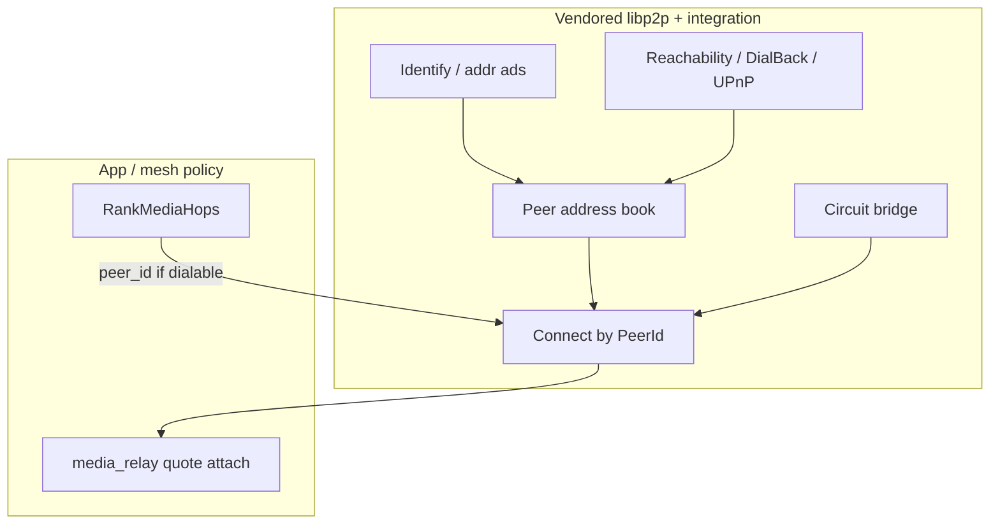

# Media hop reachability — design

**Project:** [README.md](README.md)  
**ADRs:** [DECISIONS.md](DECISIONS.md)  
**Phases:** [PHASES.md](PHASES.md)  
**Networking:** [NETWORKING.md](../../docs/architecture/NETWORKING.md)

## Goals

1. **Dial a media hop by PeerId** under real NATs using capabilities **inside** the vendored libp2p stack (and thin `libp2p/integration` hosts), not a call-layer candidate exchange.
2. SoftMigrate (and future 1:1 libp2p voice) only **selects** hops and opens `media_relay`; reachability is a stack precondition.
3. Preserve **blind** hop + app E2E call keys ([V021](../p2p-av-calls/DECISIONS.md) / [V026](../p2p-av-calls/DECISIONS.md#v026--libp2p-only-call-media-http--libp2p-networking)).

## Non-goals

- App protocols that mimic ICE (`call_hop_addrs`, STUN-over-signaling).
- WebRTC for hop dial (V026).
- Open public hop market (N020).
- Putting SoftMigrate / pricing inside the fork.

## Problem

| Stack should own | App/mesh still owns |
|------------------|---------------------|
| Listen + observed multiaddrs | Hop **eligibility** (contacts ∪ seed) |
| Persist / refresh peer addr book | Quote / budgets / settle |
| Circuit / hole-punch when ready | Who picks SoftMigrate initiator |
| `Connect(peer_id)` success/fail | `media_relay` framing (N021) |

Today SoftMigrate often fails with **PeerId known, multiaddr empty** because addrs live only in contacts/bootstrap — the host does not own a full dialability story for arbitrary hop PeerIds.

## Target model



### In-stack work (L1–L3)

| Capability | Direction |
|------------|-----------|
| **Address book** | Store multiaddrs per PeerId from Identify, dial success, bootstrap; TTL / replace stale |
| **Advertise** | Node listen + UPnP external + DialBack-observed pushed via Identify |
| **Circuit** | Evolve custom `/pp-browser/circuit-relay` toward **PeerId-first** dial (relay already connected to target, or reservation) so Clients need not know target LAN ma |
| **Hole punch** | Later (DCUtR-class) when fork allows — document gap, don’t fake in app |

### Consume API (tentative — L4)

```text
// Policy still in MeshHopPolicy; dialability from stack:
bool IsPeerDialable(PeerId);
optional<Multiaddr> PreferredDialAddr(PeerId);  // may be empty if circuit-only path

// SoftMigrate:
for hop in RankMediaHops(...):
  if !IsPeerDialable(hop) continue;
  RegisterEndpoint / Connect + RequestQuote...
```

Exact C++ types live next to `PeerSessionManager` / host — refine at L1.

## Publish vs gather

**Durable path:** Nodes that are Reachable keep the stack’s address book fresh (and optionally mirror into contacts for UX).  
**Rejected path:** Mid-call multiaddr request/reply over `call_*` as the primary design (H007).

## Privacy

Stack-held addrs are shared with peers that dial or Identify — same class as today’s contact multiaddrs. Admission for circuit/media remains mesh policy (N014/N020).

## Failure UX

SoftMigrate: skip undialable hops; aggregated error if none work. Do not invent ICE Retry UI for libp2p dial — reuse connect-failed / hop-needed copy under V026.
