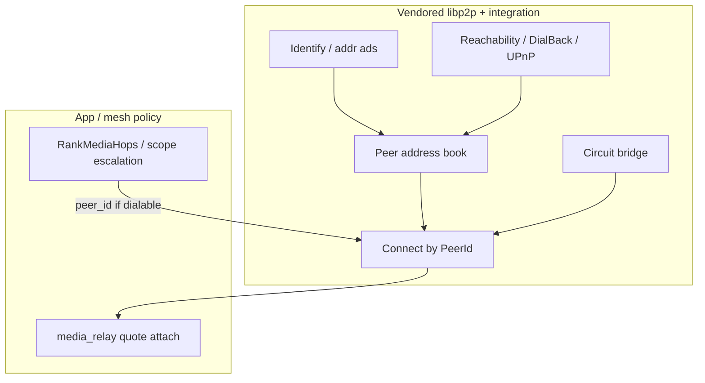

# Media hop reachability — design

**Authoritative specification** for dial-by-PeerId inside the libp2p stack.  
**Execution order:** [PHASES.md](PHASES.md). **What's landed:** [CURRENT_STATE.md](CURRENT_STATE.md). **Rationale:** [DECISIONS.md](DECISIONS.md).

**Related:** [p2p-mesh](../p2p-mesh/DESIGN.md) (relay **policy**), [RELAY_SCOPE.md](../p2p-mesh/RELAY_SCOPE.md) (scope), [NETWORKING.md](../../docs/architecture/NETWORKING.md), [CALLS.md](../../docs/architecture/CALLS.md)

---

## Overview

Peers (and SoftMigrate) must **dial a media hop by PeerId** under real NATs. That dialability story lives in the **vendored libp2p fork** and thin `base/p2p` hosts — not in call signaling or a second NAT toolkit.

SoftMigrate (and future 1:1 libp2p voice) **selects** hops and opens `media_relay`; reachability is a **stack precondition**. Hop relays stay **blind**; app E2E call keys remain in the call layer.



---

## Goals

1. **Dial a media hop by PeerId** using capabilities inside the vendored libp2p stack and integration hosts.
2. Preserve **blind** hop semantics + app E2E call keys (see [p2p-av-calls](../p2p-av-calls/DECISIONS.md)).
3. One peer stack — app layers **consume** dialability; they do not reimplement NAT traversal.

## Non-goals

- App protocols that mimic ICE (`call_hop_addrs`, STUN-over-signaling).
- WebRTC for hop dial.
- Open public hop market (mesh policy — [p2p-mesh](../p2p-mesh/DESIGN.md)).
- Relay scope, bridge score, pricing, or settle (mesh — [RELAY_SCOPE.md](../p2p-mesh/RELAY_SCOPE.md)).
- Putting SoftMigrate / pricing inside the fork.

---

## Ownership

| Layer | Owns |
|-------|------|
| **This project (stack)** | Discovery, listen/observed addrs, reachability probes, peer address book, circuit evolution, `IsPeerDialable` |
| **[p2p-mesh](../p2p-mesh/)** | Who may be a hop (contacts ∪ seed), relay scope, budgets, incentives, settle |
| **[p2p-av-calls](../p2p-av-calls/)** | SoftMigrate / attach **consume** “is dialable?” |
| **HTTP Brief** | Message inbox durability (not hop dial) |

Do **not** expand this project to cover scope routing or incentives — that splits ownership locked in H001.

---

## Problem

| Stack should own | App/mesh still owns |
|------------------|---------------------|
| Listen + observed multiaddrs | Hop **eligibility** (contacts ∪ seed) |
| Persist / refresh peer addr book | Quote / budgets / settle |
| Circuit / hole-punch when ready | Who picks SoftMigrate initiator |
| `Connect(peer_id)` success/fail | `media_relay` framing |

SoftMigrate often fails with **PeerId known, multiaddr empty** because addrs live only in contacts/bootstrap — the host does not own a full dialability story for arbitrary hop PeerIds.

---

## Stack capabilities

### Address book

Store multiaddrs per PeerId from Identify, dial success, bootstrap; TTL / replace stale entries. Expose to `PeerSessionManager` / dial helpers. Contacts may **mirror** stack addrs as a TTL UX cache — not the source of truth (H003).

### Advertise

Unify listen + UPnP external + DialBack-observed addrs into Identify advertisements. Nodes with `media_relay` on should publish fresh ads when peers connect.

### Circuit bridge

Evolve custom `/pp-browser/circuit-relay` toward **PeerId-first** dial when a relay already has the target (or reservation).

| Mode | Description | Maturity |
|------|-------------|----------|
| **Single-hop** | One relay direct-dials target | Shipped |
| **Multi-hop v2** | Transitive paths via `bridge_path`, nested subcontract | Planned — [MULTI_HOP_CIRCUIT.md](MULTI_HOP_CIRCUIT.md) |

**Preference order:** stack address book + Reachable ads → circuit → SoftMigrate failure (H002). Circuit may enable dial to hop PeerId; prefer contact then seed bridges.

**Billing note:** Direct attach (A pays hop B) vs brokered attach (A pays immediate relay R1 only when R1 orchestrates path) — see H005 and mesh N024.

### Hole punch

DCUtR-class hole punch when the fork allows — document gap; do not fake in app.

---

## Consume API

Policy stays in mesh (`MeshHopPolicy`, scope escalation); dialability comes from the stack:

```text
// Tentative — refine at integration time next to PeerSessionManager:
bool IsPeerDialable(PeerId);
optional<Multiaddr> PreferredDialAddr(PeerId);  // may be empty if circuit-only path

// SoftMigrate loop:
for hop in RankMediaHops(...):
  if !IsPeerDialable(hop) continue;
  RegisterEndpoint / Connect + RequestQuote...
```

Exact C++ types live next to `PeerSessionManager` / host.

---

## Publish vs gather

**Durable path:** Nodes that are Reachable keep the stack’s address book fresh (and optionally mirror into contacts for UX).

**Rejected path:** Mid-call multiaddr request/reply over `call_*` as the primary design (H007). No WebRTC / app STUN for hops (H004).

---

## Privacy

Stack-held addrs are shared with peers that dial or Identify — same class as today’s contact multiaddrs. Admission for circuit/media remains mesh policy (contact-first, scope caps).

---

## Failure UX

SoftMigrate: skip undialable hops; aggregated error if none work. Do not invent ICE Retry UI for libp2p dial — reuse connect-failed / hop-needed copy under V026.

---

## Multi-hop circuits

When single-hop cannot reach target B, immediate relay R1 may subcontract upstream R2 within a hop cap. Consumer A still scores and pays **R1 only**.

Full protocol and session model: [MULTI_HOP_CIRCUIT.md](MULTI_HOP_CIRCUIT.md). Bridge score integration: [RELAY_SCOPE.md](../p2p-mesh/RELAY_SCOPE.md).

---

## Maturity summary

| Capability | Maturity | Notes |
|------------|----------|-------|
| Peer address book (L1) | Shipped | `PeerAddressBook`, upsert on bootstrap/connect |
| Advertised listen set (L2) | Shipped | Identify + probe-derived addrs |
| Circuit PeerId dial (L3) | Shipped | Single-hop; circuit fallback in SoftMigrate path |
| Multi-hop circuit (L3.5) | Planned | H008, N024 |
| SoftMigrate consume only (L4) | In progress | Drop reliance on empty contact ma as only signal |
| Directory / DHT dial assist (L5) | Planned | Still closed-set for media hops |

Detail and checkboxes: [PHASES.md](PHASES.md), [CURRENT_STATE.md](CURRENT_STATE.md).

---

## References (decisions)

| Topic | ADR |
|-------|-----|
| Implementation in libp2p | H001 |
| Publish > circuit > fail | H002 |
| Contacts as cache only | H003 |
| No WebRTC / app STUN | H004 |
| Circuit + billing modes | H005 |
| Mobile never hosts | H006 (updated — default Client; N025 call-scoped listen) |
| No `call_hop_addrs` product path | H007 |
| Multi-hop circuit chains | H008 |

Mesh cross-refs: N014 (contact-first), N022 (libp2p investment), N024 (brokered relay). Call cross-ref: V026.
