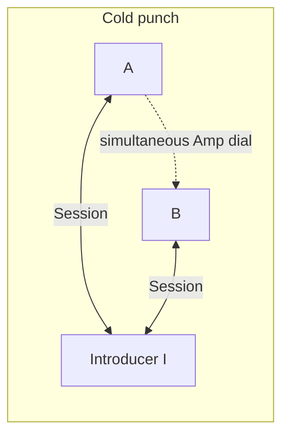
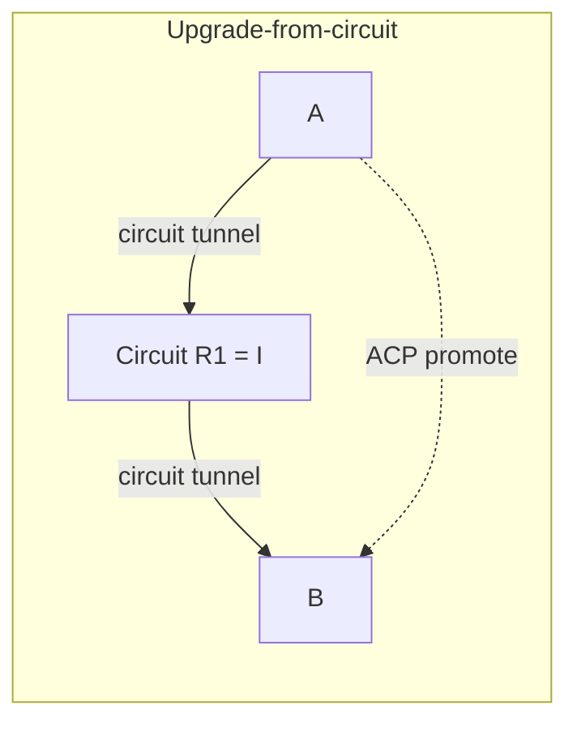

# Amp Coordinated Punch (ACP) — plan

**Status:** Spec / ADR only — **not implemented**  
**Stack ADR:** [H009](DECISIONS.md#h009--amp-coordinated-punch-acp)  
**Preference order:** [H002](DECISIONS.md#h002--publish-in-stack--punch--circuit--fail)  
**Underlay:** Amp UDP (D10 / A017) — not libp2p DCUtR as a product path  
**Related:** dial-back / UPnP ([D8](../adp/DECISIONS.md)), circuit ([H005](DECISIONS.md#h005--circuit-last-resort-bill-media-hop), [H008](DECISIONS.md#h008--multi-hop-circuit-chains-planned)), keepalive ([pp-cpp-amp KEEPALIVE](https://github.com/people-post/pp-cpp-amp/blob/develop/docs/KEEPALIVE.md))

## Problem

Both peers may be **outbound-only** (home NAT, mobile CGNAT-adjacent) yet still able to open a **direct** Amp UDP PeerLink if they exchange **observed endpoints** and dial **simultaneously**. Today the stack jumps from failed direct dial to **circuit** (and SoftMigrate). Keepalive and `MaybeLearnPath` only refresh or migrate an **already-authenticated** path — they do not create a new direct path.

```text
Today:     A ──direct fail──► circuit R1 ──► B
Target:    A ◄──ACP via introducer I──► B   (direct PeerLink; circuit optional fallback / upgrade)
```

This doc plans **Amp Coordinated Punch (ACP)** — a DCUtR-*shaped* protocol owned by the Amp mesh reachability stack. Implementation is a later phase ([PHASES.md § L3.25](PHASES.md#l325--amp-coordinated-punch)).

## Goals

1. **Create direct Amp PeerLinks** when both sides are punchable but neither is inbound-Reachable alone.
2. **Stay in-stack** — SoftMigrate / call signaling only consume dialability ([H001](DECISIONS.md#h001--separate-project-implementation-in-amp-mesh), [H007](DECISIONS.md#h007--no-app-layer-hop-candidate-exchange-as-product-path)).
3. **Reuse existing trust planes** — introducer is a peer that already has authenticated Sessions to both ends (seed, Reachable contact, or circuit R1), not a public STUN service.
4. **Fit Session rules** — at most one Connected PeerLink per PeerId ([A026](../adp/DECISIONS.md)); parent-only destroy ([A027](../adp/DECISIONS.md)).
5. **Prefer cheaper paths** — successful punch updates the address book and `IsPeerDialable` so circuit / SoftMigrate are used less often.

## Non-goals (v1 plan)

- WebRTC / ICE / libjuice / app STUN ([H004](DECISIONS.md#h004--no-webrtc--no-app-stun-for-hops)).
- Reviving libp2p Host/TCP DCUtR as the product punch path (A017 purge stands).
- Claiming **symmetric NAT / carrier CGNAT** coverage in hard-lab or UX before measured.
- Replacing multi-hop circuit ([H008](DECISIONS.md#h008--multi-hop-circuit-chains-planned)) — punch and multi-hop are **parallel**: punch for punchable pairs; multi-hop for unpunchable partitions.
- Putting introducer eligibility, pricing, or scope escalation inside Amp — mesh policy owns who may introduce ([RELAY_SCOPE.md](../p2p-mesh/RELAY_SCOPE.md)).

## Preference order (H002)

```text
1. Publish + direct dial (addr book, ch0 ads, UPnP, IPv6, LAN)
2. Amp Coordinated Punch (this doc)
3. Circuit (single-hop today; multi-hop later)
4. Fail (SoftMigrate skips hop / surfaces hop-needed)
```

Circuit remains the TURN-analogue for PeerId paths when punch fails or is skipped.

## Topology model

### Roles

| Node | Role |
|------|------|
| **A**, **B** | Peers that want a direct Amp PeerLink |
| **I** | **Introducer** — already has authenticated Amp Sessions to A and B; coordinates candidate exchange + sync window |
| **R1** (optional) | Circuit broker already bridging A↔B; may **also** act as I for **upgrade-from-circuit** |

### Introducer trust (v1)

| Allowed I | Notes |
|-----------|--------|
| Org / L0 **seed** | Default dogfood path; same trust as dial-back probes |
| **Reachable contact** already Sessioned to both | Contact-first affinity |
| **Circuit R1** when A already has a circuit to B | Upgrade path; A may still pay R1 until direct wins |

v1 does **not** require a stranger public introducer market.

### Path shapes





## Protocol outline (v1)

Exact wire frames land with implementation; semantics:

1. **Need punch** — Direct dial from A to known B addrs fails (or addrs empty / stale) and policy still wants direct before circuit, **or** A already on circuit to B and wants upgrade.
2. **Pick I** — Mesh/stack selects an introducer that can Session to both (seed → contact → current R1).
3. **Collect candidates** — Each side sends **observed Amp UDP endpoints** to I: dial-back-observed, UPnP external, successful prior dials, ch0-advertised listen set. No app STUN.
4. **Sync window** — I issues a short punch epoch (start time / nonce) to A and B over existing Sessions.
5. **Simultaneous dial** — A and B burst Amp associate/dial toward each other’s candidate set for the epoch.
6. **Elect** — First authenticated MSH / PeerLink wins ([A026](../adp/DECISIONS.md)). Loser path is closed by the **parent** owner only ([A027](../adp/DECISIONS.md)) — no TearDown-from-callback races.
7. **Publish** — Winner endpoints upsert into the stack address book; `IsPeerDialable(B)` becomes true for direct; optional contact mirror cache (H003).
8. **Demote circuit** — On upgrade-from-circuit, migrate channels to the direct PeerLink, then request circuit close when safe.

### Keepalive vs punch

| Mechanism | Job |
|-----------|-----|
| Amp **keepalive** | Refresh NAT mapping on an **established** association |
| **`MaybeLearnPath`** | Migrate an authenticated connection to a new observed UDP endpoint |
| **ACP** | **Create** a new direct PeerLink when none exists (or promote off circuit) |

Do not implement punch as “send more keepalives.”

## Interaction with SoftMigrate / calls

- SoftMigrate continues to **rank** hops and open `media_relay`; it does **not** run punch.
- Punch improves **stack dialability** so more hops succeed on direct attach ([H005](DECISIONS.md#h005--circuit-last-resort-bill-media-hop)).
- Call-media over circuit (A024 nested Session) may later **upgrade** to direct PeerLink via ACP without reinventing ICE in call signaling.

## Failure and fallback

| Outcome | Next step |
|---------|-----------|
| Punch epoch expires, no auth | Fall through to circuit (H002) |
| Partial connectivity (one side sees packets, no MSH) | Do not claim Reachable; retry once or circuit |
| Symmetric / CGNAT suspected | Skip repeated punch; prefer circuit / multi-hop; no UX overclaim |
| Introducer unreachable | Pick next I or circuit |

## Testing

- Loopback / dual-stack fixtures first (deterministic sync window).
- Hard-lab NAT shapes only after v1 lands — do not claim CGNAT coverage early ([hard-lab](../hard-lab/DESIGN.md)).
- Compose tests must assert A026 single Session and A027 parent-only teardown under dual-dial races.

## Phasing

| Slice | Scope |
|-------|--------|
| **Docs** | This file + H009 + DESIGN/PHASES reset (Amp framing) — **this change** |
| **L3.25a** | Addr lifecycle clarity on Amp (observed/listen/advertise); cold punch via seed introducer |
| **L3.25b** | Contact introducer; address-book upsert; SoftMigrate dialability benefit |
| **L3.25c** | Upgrade-from-circuit (R1 as I); promote then demote circuit |

**Parallel:** [L3.5 multi-hop circuit](PHASES.md#l35--multi-hop-circuit-v2) — do not block punch on multi-hop or vice versa.

## Code anchors (targets)

| Piece | Likely home |
|-------|-------------|
| Punch coordinator | `src/domain/mesh/reachability/` (+ thin Amp helpers in pp-cpp-amp if associate burst needs stack support) |
| Observed addrs | Dial-back, UPnP (`NatTraversal`), ch0 ads via `MeshHost` |
| Circuit upgrade | `CircuitTunnelCoordinator` + PeerLink election |
| Consume | Existing `IsPeerDialable` / hop reach helpers (`AmpCircuitHopReach`) |

## References

| Topic | Doc / ADR |
|-------|-----------|
| Preference order | H002 |
| No app STUN / gather | H004, H007 |
| Circuit billing | H005, N024 |
| Multi-hop (parallel) | H008, MULTI_HOP_CIRCUIT.md |
| Amp underlay | D10, A017, NETWORKING.md |
| Session / ownership | A026, A027 |
