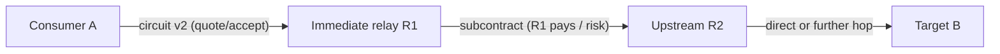

# Multi-hop circuit relay — plan

**Status:** Spec / ADR only — **not implemented** (today is single-hop)  
**Stack ADR:** [H008](DECISIONS.md#h008--multi-hop-circuit-chains-planned)  
**Pricing ADR:** [N024](../p2p-mesh/DECISIONS.md#n024--circuit-pricing-pay-immediate-relay-only)  
**Scope / partition model:** [RELAY_SCOPE.md](../p2p-mesh/RELAY_SCOPE.md)  
**Today’s code:** `CircuitRelayService::RelayBridge` — one relay, one direct dial to target

## Problem

Partition escape needs **transitive** reachability, not only “pick one relay that can direct-dial the target.”

```text
Today (landed L3):     A ──circuit──► R1 ──direct dial──► B     (fails if R1 cannot dial B)

Target (planned):      A ──circuit──► R1 ──…──► R2 ──…──► B     (R1 may forward via R2+)
```

Example: **A** (mobile, outbound-only) can dial contact **R1**. **R1** cannot dial target **B**, but **R1** can dial org seed **R2**, and **R2** can dial **B**. A single-hop bridge through **R1** fails today even though a path exists.

This doc plans **multi-hop custom circuit** (`/pp-browser/circuit-relay`) evolution. Implementation is a later phase ([PHASES.md § L3.5](PHASES.md#l35--multi-hop-circuit-v2)).

## Goals

1. **Transitive partition bridging** — escape islands where no single relay sees both consumer and target.
2. **Same product story** — contact-first, scope escalation, circuit last resort ([H002](DECISIONS.md#h002--publish-in-stack--circuit--fail), [N023](../p2p-mesh/DECISIONS.md#n023--relay-scope-and-domain-bridging-not-geography-tiers)).
3. **Simple consumer UX** — **A** chooses and pays **one immediate relay R1** only ([N024](../p2p-mesh/DECISIONS.md#n024--circuit-pricing-pay-immediate-relay-only)).
4. **Provider economics** — **R1** selects downstream relays (**R2**, …) and must keep **positive margin** when paid.

## Non-goals (v1 plan)

- libp2p circuit v2 as the product path (stay on custom `/pp-browser/circuit-relay` evolution).
- Consumer-visible hop-by-hop quote UI (A sees one circuit quote from R1).
- Multi-hop **media bit paths** — SFU remains one blind `media_relay` hop; circuit multi-hop is **reachability plumbing** to attach ([H005](DECISIONS.md#h005--circuit-last-resort-bill-media-hop)).
- Open-ended public proxy chains (cap hop count; scope admission each leg).

## Topology model

### Roles

| Node | Role |
|------|------|
| **A** | Consumer (Client / outbound Node) |
| **R1** | **Immediate relay** — only peer A selects, quotes, and pays for **circuit** connectivity |
| **R2…** | **Upstream relays** — chosen by R1; opaque to A unless ops/debug |
| **B** | Target PeerId (peer, org seed, or `media_relay` hop) |

### Path shape



**Billing split (locked in N024):**

| Leg | Who pays whom | Capability |
|-----|---------------|------------|
| A → R1 → … → B (connectivity) | **A pays R1 only** | `circuit_relay` |
| A → B media after attach | **A pays B** (initiator / N019) | `media_relay` |

Circuit chain cost is **not** folded into the media hop quote unless product later adds an explicit bundled SKU (out of scope).

## Consumer vs provider algorithms

### Consumer (A) — unchanged outer UX

1. Build eligible **immediate relay** candidates ([`OrderCircuitHops`](../p2p-mesh/RELAY_SCOPE.md#code-anchors-ns1-landed--ns2-open), scope escalation [N023](../p2p-mesh/DECISIONS.md#n023--relay-scope-and-domain-bridging-not-geography-tiers)).
2. Score / bridge-score **R1** candidates: dialable from A, affinity, price, reputation — **not** full path enumeration on A.
3. **Quote + accept** with **R1** for a circuit session to **target PeerId B** (rate + ceiling when paid).
4. On success, stack holds an end-to-end bridged stream (opaque tunnel); A does not configure R2.

Bridge score evolves from “R1 direct-dials B” to “**R1 advertises or proves it can reach B** (direct or via subcontract)” — see [RELAY_SCOPE § Multi-hop bridge score](../p2p-mesh/RELAY_SCOPE.md#multi-hop-bridge-score).

### Provider (R1) — new inner loop

When R1 accepts A’s bridge to B:

1. If R1 can **direct-dial B**, behave as today (`RelayBridge`).
2. Else R1 runs **upstream relay selection** (same mesh policy family: scope, contacts-first, capacity, **margin**).
3. R1 opens a **nested circuit** (or internal forward) to **R2** toward B; R1 pays R2 under R2’s circuit pricing (volunteer or paid).
4. R1 must reject or re-quote if expected downstream cost ≥ quoted price to A.

R1 is a **circuit aggregator**: one commercial relationship with A, zero or more with upstream relays.

## Protocol sketch (circuit v2 — not implemented)

Extend `/pp-browser/circuit-relay/1.0.0` with a **v2** frame family (exact JSON fields TBD at implementation):

| Op | Direction | Purpose |
|----|-----------|---------|
| `bridge` | A → R1 | v1 compatible; R1 direct-dials B |
| `bridge_path` | A → R1 | Target PeerId B; R1 responsible for multi-hop completion |
| `sub_bridge` | R1 → R2 | R1 requests upstream leg (R1 acts as consumer) |
| `path_ack` / `path_fail` | R1 → A | Single ack when end-to-end tunnel ready; structured fail |

**Requirements (design constraints):**

- **Max hop count** — v1 cap: **2 relays** on path (A→R1→R2→B). Configurable hard limit; loop detection.
- **Per-hop admission** — each relay enforces `serve_scope_mask` for its **direct** dialer (A at R1; R1 at R2).
- **Teardown** — failure at R2 unwinds R1↔A with explicit error; no half-open tunnels.
- **Metering** — byte counts at R1 for A billing; R1↔R2 metering for R1’s upstream cost (implementation detail).

## Ownership

| Layer | Owns |
|-------|------|
| [media-hop-reachability](README.md) | Protocol v2, `CircuitRelayService`, session tunnel handles, `IsPeerDialable` for **direct** legs |
| [p2p-mesh](../p2p-mesh/) | Immediate-relay pick, quotes, **N024** pricing, bridge score, scope |
| [p2p-av-calls](../p2p-av-calls/) | SoftMigrate still bills **media hop B**; may **use** circuit chain only to make B dialable |

## Relationship to landed work

| Phase | Status | Multi-hop note |
|-------|--------|----------------|
| L1 address book | Done | Upstream relays use same book for B resolution |
| L2 Identify ads | Done | R1 may learn R2 reachability hints from ads |
| L3 PeerId bridge | Done | **Single-hop only** — documents gap this plan closes |
| L4 SoftMigrate consume | Next | Can ship without multi-hop; partition cases remain degraded |
| **L3.5** multi-hop v2 | Planned | After L4 or in parallel if partition escape is launch-critical |

## Phasing

See [PHASES.md § L3.5](PHASES.md#l35--multi-hop-circuit-v2) and [p2p-mesh PHASES § ns3](../p2p-mesh/PHASES.md#ns3--multi-hop-circuit-policy).

1. **Docs + ADRs** (this file, H008, N024) — **now**
2. **ns2** — bridge score uses “reachable via subcontract” signals (Identify / probe cache)
3. **L3.5** — circuit v2 protocol + R1 upstream selection in stack
4. **Paid circuit quotes** — when `circuit_relay` pricing ships (volunteer OK without quotes)

## Open items (non-blocking for this doc)

| Item | Default in plan | Confirm later? |
|------|-----------------|----------------|
| Max relays v1 | 2 (A→R1→R2→B) | Tune at implementation |
| Quote before bridge (paid R1) | Yes — mirror N019 ceiling pattern | |
| R1 volunteer + paid R2 | Allowed — R1 absorbs cost or skips R2 | |
| Debug visibility of R2 | Ops/log only; not consumer UI v1 | |

## Related

- [DESIGN.md](DESIGN.md) — stack vs policy split
- [DECISIONS.md H005](DECISIONS.md#h005--circuit-last-resort-bill-media-hop) — media hop billing unchanged
- [LIBP2P_UPSTREAM.md](../../docs/architecture/LIBP2P_UPSTREAM.md) — fork notes (add at implementation)
