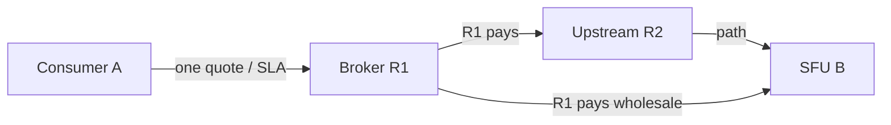

# Multi-hop circuit relay — plan

**Status:** Spec / ADR only — **not implemented** (today is single-hop)  
**Stack ADR:** [H008](DECISIONS.md#h008--multi-hop-circuit-chains-planned)  
**Pricing ADR:** [N024](../p2p-mesh/DECISIONS.md#n024--immediate-relay-as-service-broker)  
**Scope / partition model:** [RELAY_SCOPE.md](../p2p-mesh/RELAY_SCOPE.md)  
**Today’s code:** `CircuitRelayService::RelayBridge` — one relay, one direct dial to target

## Problem

Partition escape needs **transitive** reachability, not only “pick one relay that can direct-dial the target.”

```text
Today (landed L3):     A ──circuit──► R1 ──direct dial──► B     (fails if R1 cannot dial B)

Target (planned):      A ──circuit──► R1 ──…──► R2 ──…──► B     (R1 may forward via R2+)
```

Example: **A** (mobile, outbound-only) can dial contact **R1**. **R1** cannot dial target **B**, but **R1** can dial org seed **R2**, and **R2** can dial **B**. A single-hop bridge through **R1** fails today even though a path exists.

This doc plans **multi-hop custom circuit** (`/pp-browser/circuit-relay`) evolution. Implementation is a later phase ([PHASES.md § L3.5](PHASES.md#l35--multi-hop-circuit-v2)).

## Goals

1. **Transitive partition bridging** — escape islands where no single relay sees both consumer and target.
2. **Same product story** — contact-first, scope escalation, circuit last resort ([H002](DECISIONS.md#h002--publish-in-stack--punch--circuit--fail), [N023](../p2p-mesh/DECISIONS.md#n023--relay-scope-and-domain-bridging-not-geography-tiers)).
3. **Simple consumer UX** — **A** chooses and pays **one immediate relay R1** only ([N024](../p2p-mesh/DECISIONS.md#n024--immediate-relay-as-service-broker)).
4. **Provider economics** — **R1** selects upstream relays and downstream **`media_relay`**; bundles cost + SLA into one quote to A.

## Non-goals (v1 plan)

- libp2p circuit v2 as the product path (stay on custom `/pp-browser/circuit-relay` evolution).
- Consumer-visible hop-by-hop quote UI (A sees one quote from R1).
- Hardcoded maximum relay count in protocol or binary (limit comes from **config only**).
- Multi-hop **media bit paths** through several SFUs — brokered calls still use **one** subcontracted blind `media_relay` hop B behind R1; circuit multi-hop is reachability plumbing ([H005](DECISIONS.md#h005--circuit-last-resort-bill-media-hop) direct vs brokered).

## Topology model

### Roles

| Node | Role |
|------|------|
| **A** | Consumer (Client / outbound Node) |
| **R1** | **Immediate relay / broker** — only peer A selects, quotes, and pays; owns SLA to A |
| **R2…** | **Upstream circuit relays** — chosen by R1; opaque to A unless ops/debug |
| **B** | **`media_relay` SFU** (or other target PeerId) — subcontracted by R1 on brokered calls; wholesale cost to R1 |

### Path shape



### Attach modes ([H005](DECISIONS.md#h005--circuit-last-resort-bill-media-hop))

| Mode | When | Who A pays | Quote |
|------|------|------------|-------|
| **Direct** | A dialable to **B**; no broker | **B** | N019 on B (friend / volunteer SFU) |
| **Brokered** | A uses **R1** for path and/or media | **R1 only** | R1 bundled: circuit + subcontracted media + latency class |

On the **brokered** path, R1 is experienced as “the hop” at **R1’s price** — not B’s list rate. R1 absorbs B’s (and R2’s) wholesale cost and may markup for path orchestration and **latency / delivery guarantee**.

## Consumer vs provider algorithms

### Consumer (A)

1. Build eligible **immediate relay** candidates ([`OrderCircuitHops`](../p2p-mesh/RELAY_SCOPE.md#code-anchors-ns1-landed--ns2-open), scope escalation [N023](../p2p-mesh/DECISIONS.md#n023--relay-scope-and-domain-bridging-not-geography-tiers)).
2. Score **R1**: dialable from A, affinity, **bundled price**, reputation, advertised SLA/latency class.
3. **Quote + accept with R1** (rate + ceiling when paid; latency/delivery tier in quote metadata).
4. R1 completes path + (if call) media attach; A holds opaque session with R1.

If A can **direct-dial B**, prefer **direct attach** (simpler, no broker markup) unless policy chooses broker for partition.

### Provider (R1) — broker inner loop

When R1 accepts A’s session toward target B:

1. **Circuit:** direct-dial B if possible; else pick R2+ (scope, margin, capacity) and nested circuit.
2. **Media (brokered calls):** request **wholesale quote** from **call-agreed B**; fold into retail quote to A.
3. **Margin:** reject or re-quote if wholesale (R2 + B + ops) ≥ retail to A.
4. **SLA / re-pick bounds** — R1 re-picks **upstream circuit** (R2+) to reach the agreed target; R1 does **not** unilaterally swap **call-agreed `media_relay` B** (see below).

R1 is a **service broker**: one retail relationship with A; wholesale with R2 and B.

### Re-pick bounds (calls — B is roster-bound)

**B** is the group’s agreed blind SFU for a **`call_id`** (coordinator pick + authenticated attach per V023/N020). Participants exchange media **via that B**; it is not an opaque subcontract R1 may replace without call context.

| Failure | Who re-picks | What may change |
|---------|--------------|-----------------|
| Upstream circuit leg (R2+, path) | **R1** (within retail SLA / quote) | Alternate R2, alternate route — **same B** |
| R1↔B wholesale attach / circuit to B | **R1** first (retry, alternate path) | Still **same B** |
| **B** unavailable / hop failed | **Call coordinator** (SoftMigrate re-pick) | New hop PeerId — **call-level**; exclude failed B; roster + `call_id` auth |
| New B chosen | Coordinator + participants | See **quote renewal** below |

R1’s bundled quote is “deliver A to **this call’s B** at tier T,” not “R1 picks any SFU.” If the group migrates to **B′**, hop selection runs again at the **call layer**; R1 is not a substitute coordinator.

### Quote renewal (brokered attach)

| Situation | Consumer (A) |
|-----------|--------------|
| **Path-only retry** — same **B**, same tier T, same retail rate/ceiling (e.g. R2′) | **Auto-extend** — no re-accept |
| Coordinator picks **B′** and retail **rate or ceiling** changes | **Re-accept** new R1 quote (scoped to B′) |
| B′ with **unchanged** retail rate/ceiling and tier T | May **auto-extend** if wholesale equivalent; optional lightweight ack in UI |
| A can **direct-dial B′** | **Direct attach** (H005); no broker |

Paid: must not exceed accepted **billing ceiling** without re-accept ([N019](../p2p-mesh/DECISIONS.md#n019--media_relay-updown-budgets-quotes-no-surprise-bills) / V022).

**Messaging / non-call circuit:** target PeerId may still be fixed by app intent; same rule — R1 re-picks **path**, not the agreed destination identity, unless the app session explicitly delegates hop choice to R1.

## Hop limit (config, not hardcoded)

| Setting | Behavior |
|---------|----------|
| **`circuit_relay.max_hops`** | Config variable; **default 3** relay legs on a path |
| **Stack rule** | Enforce **configured** limit only — **no** fixed protocol maximum baked into code |
| **Raising limit** | Ops may set &gt; 3 later; software honors config |
| **Safety** | Loop detection + per-hop `serve_scope_mask` admission always apply |

Counting convention (illustrative): each **relay node** on the path consumes one hop toward the limit (A→R1→R2→R3→B with three relays uses `max_hops >= 3`).

## Protocol sketch (circuit v2 — not implemented)

Extend `/pp-browser/circuit-relay/1.0.0` with a **v2** frame family (exact JSON fields TBD at implementation):

| Op | Direction | Purpose |
|----|-----------|---------|
| `bridge` | A → R1 | v1 compatible; R1 direct-dials B |
| `bridge_path` | A → R1 | Target PeerId B; R1 responsible for multi-hop completion |
| `sub_bridge` | R1 → R2 | R1 requests upstream leg (R1 acts as consumer) |
| `broker_media` | R1 → B | Wholesale media_relay quote/attach (brokered calls) |
| `path_ack` / `path_fail` | R1 → A | End-to-end ready or structured fail |

**Requirements (design constraints):**

- **Hop count** — enforce `circuit_relay.max_hops` from config; default 3.
- **Per-hop admission** — each relay enforces `serve_scope_mask` for its **direct** dialer.
- **Teardown** — failure at any subcontract leg unwinds to A with explicit error.
- **Metering** — R1 meters retail to A; wholesale meters R1↔R2 and R1↔B for settlement.

## Ownership

| Layer | Owns |
|-------|------|
| [media-hop-reachability](README.md) | Protocol v2, hop limit config, tunnel handles |
| [p2p-mesh](../p2p-mesh/) | Broker quotes, bridge score, R1 upstream scorer, settlement |
| [p2p-av-calls](../p2p-av-calls/) | SoftMigrate **direct** vs **brokered** attach consume |

## Relationship to landed work

| Phase | Status | Multi-hop note |
|-------|--------|----------------|
| L1 address book | Done | Upstream relays use same book for B resolution |
| L2 Identify ads | Done | R1 learns reachability hints for subcontract scoring |
| L3 PeerId bridge | Done | **Single-hop only** |
| L4 SoftMigrate consume | Next | Direct attach first; broker mode later |
| **L3.5** multi-hop v2 | Planned | Configurable hop cap; broker protocol |

## Phasing

See [PHASES.md § L3.5](PHASES.md#l35--multi-hop-circuit-v2) and [p2p-mesh PHASES § ns3](../p2p-mesh/PHASES.md#ns3--multi-hop-circuit-policy).

1. **Docs + ADRs** (H008, N024, this file) — **done**
2. **ns2 / ns3** — bridge score; R1 broker quote + upstream scorer
3. **L3.5** — circuit v2 + config `max_hops`
4. **Calls** — brokered SoftMigrate attach (R1 wholesale with B)

## Related

- [DESIGN.md](DESIGN.md) — stack vs policy split
- [DECISIONS.md H005](DECISIONS.md#h005--circuit-last-resort-bill-media-hop) — direct vs brokered attach
- [LIBP2P_UPSTREAM.md](../../docs/architecture/LIBP2P_UPSTREAM.md) — fork notes (add at implementation)
