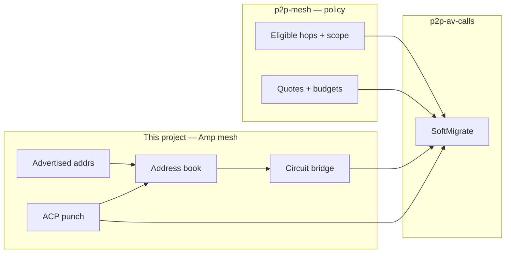

# Media hop reachability

**Status:** L1–L3 shipped in Amp mesh; L3.25 punch + L3.5 multi-hop planned (parallel); L4 SoftMigrate consume in progress  
**Owner:** Hongwei + agents  

**Related:** [p2p-mesh](../p2p-mesh/) (relay policy), [NETWORKING.md](../../docs/architecture/NETWORKING.md), [MESH.md](../../docs/architecture/MESH.md), [p2p-av-calls](../p2p-av-calls/) (V026), [CALLS.md](../../docs/architecture/CALLS.md)

## One-line goal

Peers (and SoftMigrate) can **dial a media hop by PeerId** because the **Amp mesh stack** knows how to find and reach it — address lifecycle, NAT, punch, circuit — not because call signaling invents a second dial toolkit.

## How the pieces fit

| Question | Where to read |
|----------|----------------|
| How does dial-by-PeerId work? | [DESIGN.md](DESIGN.md) |
| Amp Coordinated Punch | [HOLE_PUNCH.md](HOLE_PUNCH.md) |
| Multi-hop circuit protocol | [MULTI_HOP_CIRCUIT.md](MULTI_HOP_CIRCUIT.md) |
| Who may relay, scope, pricing | [p2p-mesh DESIGN](../p2p-mesh/DESIGN.md), [RELAY_SCOPE.md](../p2p-mesh/RELAY_SCOPE.md) |
| What's in the repo today? | [CURRENT_STATE.md](CURRENT_STATE.md) |
| Build order | [PHASES.md](PHASES.md) |
| Why we chose X | [DECISIONS.md](DECISIONS.md) |

## Ownership (locked)

| Layer | Owns |
|-------|------|
| **Amp + `src/domain/mesh/`** | Discovery, listen/observed addrs, reachability probes, punch, circuit, dial |
| **p2p-mesh policy** | Who may be a hop (contacts ∪ seed), **relay scope / domain bridging** ([RELAY_SCOPE.md](../p2p-mesh/RELAY_SCOPE.md)), budgets, incentives, settle; introducer eligibility policy |
| **p2p-av-calls** | SoftMigrate / attach **consume** “is dialable?” |
| **This project** | Spec for the **in-stack** program; thin consume notes |

**Out of scope here:** App-only `call_hop_addrs` / ICE-like gather over chat. Relay scope, bridge score, and scope escalation — [p2p-mesh RELAY_SCOPE.md](../p2p-mesh/RELAY_SCOPE.md).

## Documents

| File | Purpose |
|------|---------|
| [DESIGN.md](DESIGN.md) | **Authoritative spec** — stack model, consume API, ownership |
| [HOLE_PUNCH.md](HOLE_PUNCH.md) | Amp Coordinated Punch plan — not implemented |
| [MULTI_HOP_CIRCUIT.md](MULTI_HOP_CIRCUIT.md) | Multi-hop circuit plan — today single-hop |
| [DECISIONS.md](DECISIONS.md) | ADRs (H001+) |
| [PHASES.md](PHASES.md) | L0–L5 checklists |
| [CURRENT_STATE.md](CURRENT_STATE.md) | Gap vs stack today |
