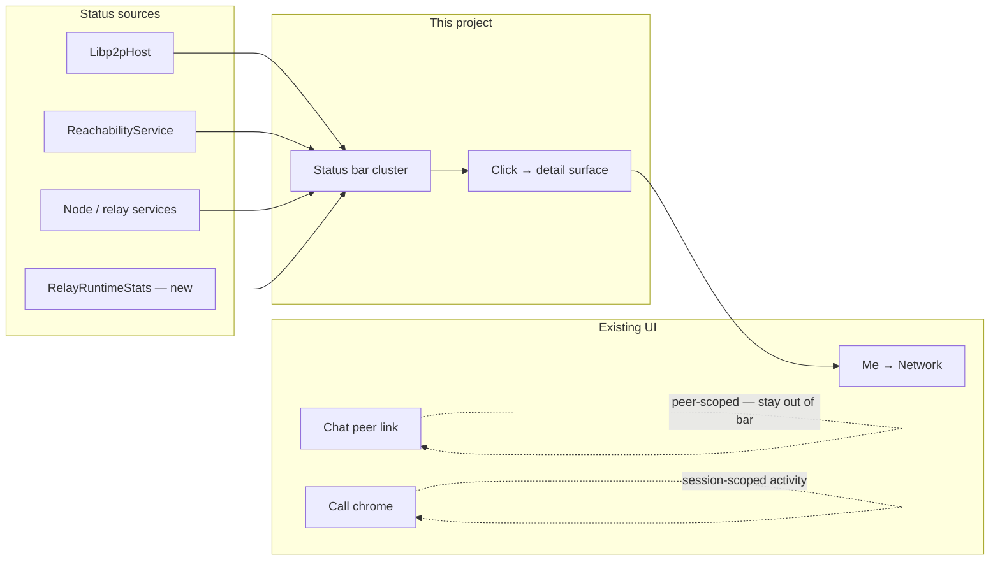

# Network status chrome

**Status:** **s0 design** — open questions before implementation  
**Owner:** Hongwei + agents  

**Stable refs:** [WINDOW_SHELL.md](../../docs/ui/WINDOW_SHELL.md), [UI_DESIGN_SYSTEM.md](../../docs/ui/UI_DESIGN_SYSTEM.md), [NETWORKING.md](../../docs/architecture/NETWORKING.md)  
**Related:** [p2p-mesh](../p2p-mesh/) (relay policy / helping), [media-hop-reachability](../media-hop-reachability/) (reachability stack), [i18n](../i18n/)

## One-line goal

Make the **desktop status bar** (and a **click → details** surface) a reliable ambient view of mesh posture, reachability / relay path quality, helping-the-network mode, and live relay load — without turning the bar into a second Me → Network page.

## Scope (this project)

| In | Out (unless later expanded) |
|----|-----------------------------|
| Left status cluster: Mesh · Reach · Help · Load | Chat per-peer link chrome (`Direct` / `Via relay`) |
| Visual language: icons, color, strength bars, motion | Replacing Me → Network settings toggles |
| Click → network status detail (popover / sheet / deep-link) | Public/paid relay marketplace UI |
| Relay runtime stats APIs needed by the chrome | Multi-hop circuit protocol (media-hop / mesh) |
| Right-side activity coexistence rules | Compact / mobile status bar (today desktop-expanded only) |
| i18n for all user-visible status strings | Ops-only `pp-node --status` redesign |

## Documents

| File | Purpose |
|------|---------|
| [DESIGN.md](DESIGN.md) | Spec draft — slots, visuals, detail surface, ownership |
| [OPEN_QUESTIONS.md](OPEN_QUESTIONS.md) | Clarifications that block or reshape implementation |
| [DECISIONS.md](DECISIONS.md) | ADRs (S001+) once questions resolve |
| [PHASES.md](PHASES.md) | Delivery order (no code until s0 questions close) |
| [CURRENT_STATE.md](CURRENT_STATE.md) | What ships today vs gaps |

## How pieces fit

