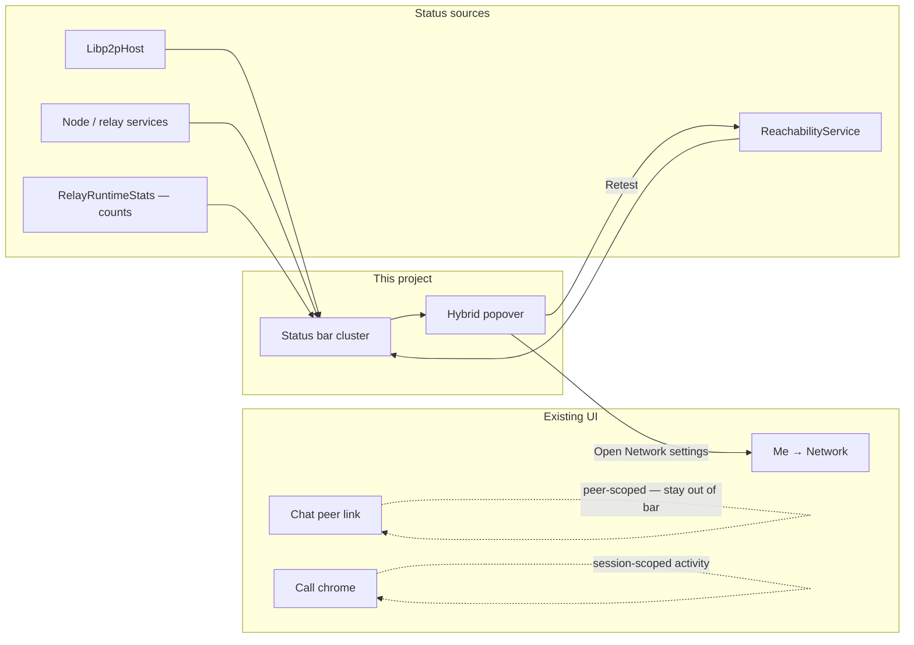

# Network status chrome

**Status:** **s0 done** — decisions locked; **s1** ambient cluster next  
**Owner:** Hongwei + agents  

**Stable refs:** [WINDOW_SHELL.md](../../docs/ui/WINDOW_SHELL.md), [UI_DESIGN_SYSTEM.md](../../docs/ui/UI_DESIGN_SYSTEM.md), [NETWORKING.md](../../docs/architecture/NETWORKING.md)  
**Related:** [p2p-mesh](../p2p-mesh/) (relay policy / helping), [media-hop-reachability](../media-hop-reachability/) (reachability stack), [i18n](../i18n/)

## One-line goal

Make the **desktop status bar** (and a **click → popover**) a reliable ambient view of mesh posture, reachability, helping-the-network mode, and live relay load counts — without turning the bar into a second Me → Network page.

## Locked product shape (S003–S010)

| Topic | Decision |
|-------|----------|
| Platforms | Desktop expanded only |
| Slots | Adaptive: Client A+B; Node/help A–D (Load when count > 0) |
| Click | Hybrid popover + Open Network settings… |
| Detail actions | Inspect + Retest; no capability toggles |
| Reach s1 | `ReachabilitySnapshot` only; hop “relay available” later |
| Load MVP | Active counts only; aggregates, no peer identities |
| Chrome | 24dp; new SVGs; activity right / load left; transitional motion; settings string parity |

## Scope (this project)

| In | Out (unless later expanded) |
|----|-----------------------------|
| Left status cluster: Mesh · Reach · Help · Load | Chat per-peer link chrome |
| Visual language: icons, color, strength bars | Replacing Me → Network toggles |
| Click → hybrid popover + settings deep-link | Compact / mobile status bar |
| Relay runtime **count** stats for chrome | Throughput/RTT in v1 bar; `pp-node` redesign |
| Right-side activity coexistence | Public/paid relay marketplace UI |
| i18n for status strings | Helper client names / PeerIds |

## Documents

| File | Purpose |
|------|---------|
| [DESIGN.md](DESIGN.md) | Authoritative product spec |
| [DECISIONS.md](DECISIONS.md) | ADRs S001–S010 |
| [OPEN_QUESTIONS.md](OPEN_QUESTIONS.md) | Resolved Q1–Q17; park new questions |
| [PHASES.md](PHASES.md) | s0–s4 delivery order |
| [CURRENT_STATE.md](CURRENT_STATE.md) | What ships today vs gaps |

## How pieces fit

