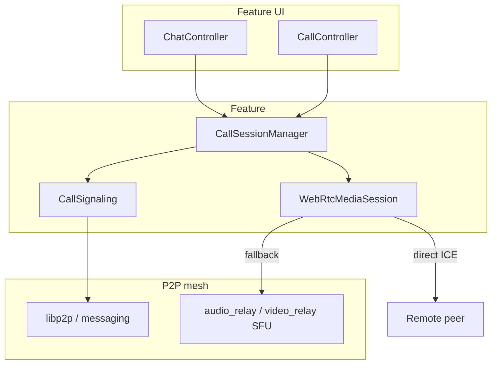

# P2P A/V calls — design

Maturity tags: **`[v1]`** ships in first call slice; **`[v1.1]`** next; **`[future]`** deferred.

Cross-project: [p2p-mesh](../p2p-mesh/), [group-chat](../group-chat/), [e2e-message-crypto](../e2e-message-crypto/), [push-notifications](../push-notifications/).

---

## Resolved product decisions

| # | Topic | v1 behavior |
|---|--------|-------------|
| 1 | Scope | 1:1 + group, voice + video, mobile included — one v1, phased delivery |
| 2 | Media stack | **Hybrid (Option C):** mesh signaling + WebRTC-shaped media; mesh SFU/TURN fallback |
| 3 | Start authority | Any **group member** may start a call linked to that group; 1:1 either peer |
| 4 | Guests / late join | **Invite only** — join without joining the chat group; mid-call invites OK |
| 5 | Host model | **Hostless** — call ends when last participant leaves |
| 6 | Epoch coordinator | Deterministic **minimum communicating-identity** among remaining participants (V002) |
| 7 | Ring | **`call_wake`** push required for v1 |
| 8 | Participant cap | Protocol soft max **16**; engineering may enforce **8** until SFU load OK |
| 9 | History | System messages: Call started / ended (missed/declined later) |
| 10 | Media key | One shared call media key; **rotate on every leave**; overlapping epochs for UX |
| 11 | Recording | Out of v1 |
| 12 | SFU seeds | Org `pp-node` seeds run volunteer SFU; more seeds after release (ops) |
| 13 | Delivery | **Parallel** media vs mesh SFU (V010); a2 LAN voice done; a3 LAN video (V016); NAT after seed SFU |
| 14 | Persistence | `call_*` in **profile.db**; keys vault-backed (V011) |
| 15 | Signaling carrier | Direct E2E `ChatPayload` system controls (V012) |
| 16 | WebRTC lib | **libdatachannel + libopus + SDL** (V014) |
| 17 | a3 scope | LAN 1:1 video first; SFU / iOS bring-up deferred (V016) |
| 18 | Video codec | **H264** CBP via **platform HW** (V017); Linux VA-API best-effort |
| 19 | Video UI path | SDL camera → platform HW H264 → persistent GL texture in shell tiles (V018) |
| 20 | Call media shape | Always Opus+H264 m-lines; Voice/Video = entry UX only; audio mandatory / video best-effort (V019) |

---

## Architecture overview

Two planes:

| Plane | Transport | Purpose |
|-------|-----------|---------|
| **Signaling** | Existing mesh / E2E messaging (direct + optional origin-thread system msgs) | Invite, accept, leave, roster, media-key epochs, SFU hints |
| **Media** | WebRTC (ICE + DTLS-SRTP / equivalent) | Always Opus + **H264** m-lines (V019); LAN first, SFU later (V016) |



**Call roster ≠ chat roster.** Guests appear only on `call_participants`. They do not receive group chat history or group membership events.

---

## Entities `[v1]`

### `call_id`

Opaque: `call:<uuid>` (creator-generated).

### `CallSession`

| Field | Notes |
|-------|--------|
| `call_id` | PK |
| `origin_thread_id` | Optional local thread that started the call (1:1 or group) |
| `origin_group_id` | Optional `group:…` when started from a group |
| `media_mode` | `voice` \| `video` (session may allow per-peer camera off) |
| `state` | `ringing` \| `active` \| `ended` |
| `created_at` / `ended_at` | unix ms |
| `media_epoch` | u32; bumps on key rotate |
| `media_key_id` | opaque id for current epoch material |
| `sfu_hint` | optional multiaddr / peer id of chosen SFU |

### `CallParticipant`

| Field | Notes |
|-------|--------|
| `call_id` | PK part |
| `identity` | Communicating identity value (e.g. `relay:…`) |
| `role_in_call` | `member` only in v1 (no call-admin) |
| `state` | `invited` \| `ringing` \| `joined` \| `left` \| `declined` \| `missed` |
| `media` | `{ audio_muted, video_enabled }` |
| `joined_at` / `left_at` | optional |

**Cap:** reject new joins when `joined` count ≥ effective max (8 or 16).

### Persistence (V011)

| Data | Store |
|------|--------|
| `call_sessions`, `call_participants`, pending invites | `profile.db` |
| Media epoch key bytes | Profile secrets / DEK vault (PSK class) |
| `call_started` / `call_ended` rows | Origin `thread.db` as system `ChatPayload` |

Schema details land with a1 (migrations + store API).

---

## Lifecycle `[v1]`

```text
1. Initiate
   Actor creates call_id + media_epoch=1 + media_key
   → CallInvite to selected identities (pairwise E2E)
   → optional origin-thread system: "Call started"
   → call state = ringing until ≥1 remote joined, then active
   (solo initiator may sit in active/waiting UI)

2. Ring / wake
   Online: signaling delivery
   Offline / background: call_wake push → app fetches invite → incoming-call UI

3. Accept / decline / miss
   Accept → CallJoin (caps) → receive current media_key + ICE/SFU hints → media bring-up
   Decline → CallDecline
   Timeout → missed; optional history hint later

4. Media
   Prefer direct ICE; else org/friend SFU (contact-first, then seed — mesh N014)
   Encrypt media under shared media_key / SRTP master derived from it (V001)

5. Mid-call
   Mute / camera; CallInvite for guests or late joiners
   Leave → CallLeave → epoch coordinator rotates key (V002/V003)

6. End
   Last participant Leave → state=ended; tear down media
   → origin-thread system: "Call ended" when linked
```

**Hostless:** no end-for-all. Creator leave does not end the call if others remain.

---

## Signaling events `[v1]`

Delivered as E2E **direct** `ChatPayload` **system** messages (V012) to each target — pairwise only (not group N-ciphertext). Reuses outbox, ingest, and sync. Exact binary/`detail` JSON freezes in a6; logical `control_type` values:

| Type | Direction | Purpose |
|------|-----------|---------|
| `call_invite` | initiator → invitee | `call_id`, origin hint, media_mode, expires_at, sfu_hint? |
| `call_accept` / `call_join` | invitee → participants | capabilities; ack for key distribution |
| `call_decline` | invitee → initiator | |
| `call_leave` | leaver → remaining | triggers key rotate |
| `call_roster` | coordinator → all | participant snapshot + `media_epoch` |
| `call_media_key` | coordinator → each remaining | wrapped epoch key (pairwise AEAD) |
| `call_ended` | any observer / last leaver | tombstone |

Invitees who are not in the origin group still use **direct** E2E only.

ICE trickle / SDP: embed in signaling `detail` or follow-up system controls as needed at a2; if latency is unacceptable, revisit a dedicated libp2p signal protocol then.

### History system messages (origin thread)

| control_type | When |
|--------------|------|
| `call_started` | Session created from that thread |
| `call_ended` | Session ended (duration optional in detail JSON) |

`[v1.1]` missed / declined hints.

---

## Media plane `[v1]`

### Stack (V001)

- **Signaling / discovery:** mesh + call events above  
- **Media:** WebRTC-compatible ICE + encrypted media (DTLS-SRTP or equivalent profile locked at a2)  
- **Codecs:** Opus audio required; video **H264** Constrained Baseline via **platform HW** (V017: Win MF / macOS VideoToolbox / Android MediaCodec; Linux VA-API best-effort — no soft-codec product fallback).  
- **SDP shape (V019):** Every call’s initial offer/answer includes **both** audio and video m-lines. Mute/camera change sent content only (no renegotiation). Audio is mandatory; video encode/decode is best-effort and must not tear down voice.  
- **Voice vs Video start:** Two header buttons for familiar UX; once connected, same in-call model (Camera allowed; show remote video whenever peer sends frames). `media_mode` may remain for invite/history copy.  
- **Capture / blit:** SDL3 camera on user enable; shell RML tiles + persistent GL texture (V018); camera off on join (V009). Encode defaults ~640×360 @ 15–24 fps (network adapt later).  
- **Topology:** 1:1 try P2P; group (N≥3) prefer **SFU**; 1:1 falls back to SFU/TURN when ICE fails. **a3** claims LAN only (V016); dogfood Win/macOS primary + Android in a3; iOS separate.  

### SFU and mesh

Consumes p2p-mesh capabilities:

| Capability | Call use |
|------------|----------|
| `audio_relay` | Voice SFU / TURN-like hop |
| `video_relay` | Video SFU hop |
| Circuit relay (n3) | Help dial SFU / peers when NATed |
| Contact-first (N014) | Prefer friend Node SFU, then org seed |

**Mobile Client** never hosts SFU. Org **`pp-node` seeds** must offer volunteer audio (and video) SFU for v1 mobile↔mobile. Additional SFU seeds are an ops commitment after release.

### Defaults

- Camera **off** on join for video sessions unless user enables  
- Mic **on** (user may mute before accept in UI)  
- No local or remote recording APIs in v1  

---

## Media crypto `[v1]`

### Shared call media key

- One **256-bit** key per `media_epoch` for all **joined** participants  
- **Not** the group-chat N-ciphertext model — realtime efficiency (V004)  
- Creator generates epoch 1; later epochs minted by **epoch coordinator** (V002)

### Distribution

Wrap `call_media_key` to each joiner via existing **pairwise** E2E (`e2e` / `e2e_public` as available). Guests get the same wrap path.

### Rotate on leave (V003)

On every `call_leave` (or remove-from-call if added later):

1. Remaining set R = joined \ leaver  
2. If R empty → end call  
3. Else coordinator = min(identity) in R (lexicographic UTF-8 of communicating identity)  
4. Coordinator mints new key, bumps `media_epoch`, sends `call_media_key` to each in R  
5. **Overlapping epochs:** senders may emit with new key immediately; receivers accept previous epoch for a short grace (e.g. 2s) to avoid hard audio cuts  

Threat note: a leaver who retained the old key can decrypt grace-window packets; after grace, new media is confidential from them. Metadata (who is dialing SFU) remains visible to relays.

---

## Push: `call_wake` `[v1]`

Extends [push-notifications](../push-notifications/) (P001 opaque wakes).

| Field | Rule |
|-------|------|
| `type` | `call_wake` (distinct from `inbox_wake`) |
| Content | **No** names, `call_id`, or media in the push body |
| Client | On wake → sync/fetch pending call invites → show incoming-call UI (or generic “Incoming call” if vault locked — align with P003) |
| Alerts off | Same as inbox: unregister / no banner; user may miss rings (document) |

Desktop dead-process: no remote wake (P004) — documented limitation.

CallKit / ConnectionService full OS integration: `[v1.1]` / platform follow-up; v1 may use high-priority local notification → tap → in-app ring.

---

## UI sketch `[v1]`

| Surface | Behavior |
|---------|----------|
| 1:1 / group chat header | Voice / Video call actions |
| Incoming | Full-screen or modal ring; Accept / Decline |
| In-call | Unified once connected (V019): mute / leave / duration + **Camera** (off by default); stage + PiP when any side has video frames; compact bar when neither does |
| Origin thread | `call_started` / `call_ended` bubbles |
| Invite | Share invite into a DM (guest) or pick member |

No ambient Join chip for uninvited group members in v1.

---

## Threat model (v1)

| Adversary | Mitigation |
|-----------|------------|
| SFU / relay reads media | Media encrypted under call key (WebRTC SRTP / app AEAD profile) |
| SFU forges media as peer | DTLS/SRTP auth + identity binding in signaling |
| Ex-participant after leave | Epoch rotate + grace window bound |
| Push path learns call details | Opaque `call_wake` only |
| Guest reads group chat | Guests not on group roster |

Not protected in v1: call metadata to SFU (participant count, timing), classical signature breaks on envelopes.

---

## Out of scope

- Recording, transcripts, live captions  
- Screen share, background blur, reactions  
- PSTN  
- MLS for media keys  
- Ambient group Join without invite  
- Making mobile a Node / SFU host  

---

## Relation to p2p-mesh delivery

Honest mobile video needs mesh progress roughly:

`n1` (done) → `np` (`pp-node`) → `nr` / `nu` → `n3` circuit → **SFU audio/video on seeds** (n4 media caps, volunteer first)

**Delivery (V010 / V016):** **a1** proceeded in parallel; **a2** LAN voice done; **a3** LAN video (not SFU); NAT’d mobile green path after seed SFU. **iOS** mic/session/camera = separate mobile-bring-up, not a3 exit.

### Mesh alignment (a0) — locked guidance

**Contact-first (N014) for media hops:** When choosing SFU/TURN (or circuit toward SFU), use the same priority as message/circuit hops: **contacts / trusted → org seed → public volunteer/paid → HTTP fallback (if any)**. Friend Nodes must opt in with `audio_relay` / `video_relay`; never coerce.

**Org `pp-node` seed profile (ops sketch):**

| Setting | v1 call expectation |
|---------|---------------------|
| Role | Always Node |
| `capabilities.audio_relay` | **on**, pricing `volunteer` initially |
| `capabilities.video_relay` | **on**, pricing `volunteer` initially |
| `capabilities.circuit_relay` | **on** when n3 ships (help Clients dial SFU) |
| Listen | Public multiaddr (e.g. tcp/443) — fail loud if busy (N016) |
| Scale-out | Add more SFU seeds post-release (V008); clients keep seed list in `bootstrap_peers` / config |

Exact capability JSON keys already sketched in [p2p-mesh DESIGN](../p2p-mesh/DESIGN.md); implement with n4 media caps.

**LAN dogfood (a2 without SFU):** Two desktops (or desktop + emulator) on the same LAN with mutually reachable ICE host candidates. No claim of mobile NAT success. Document in CURRENT_STATE when the dogfood path is proven.

**Push:** Relay should emit **`call_wake`** when storing/forwarding a call-invite class envelope (or on dedicated call-invite accept path). Spec detail with push project at a1 — opaque body only (V006).
