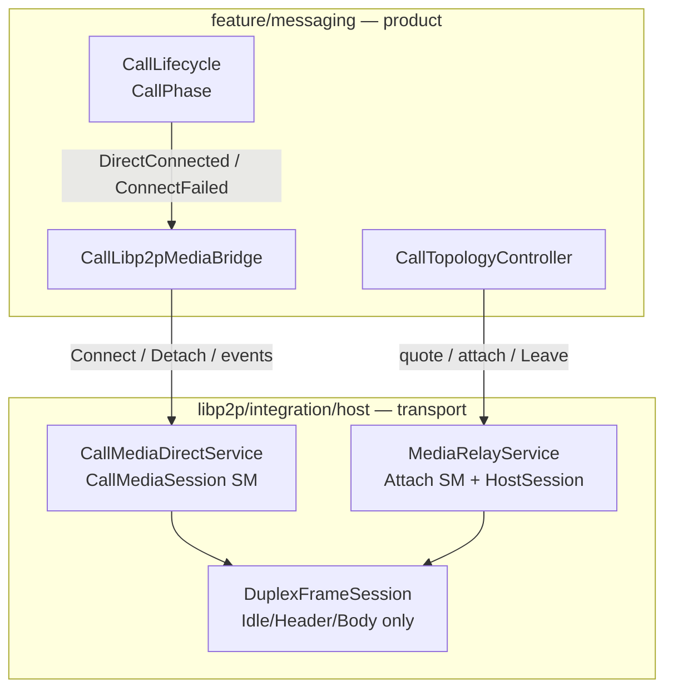
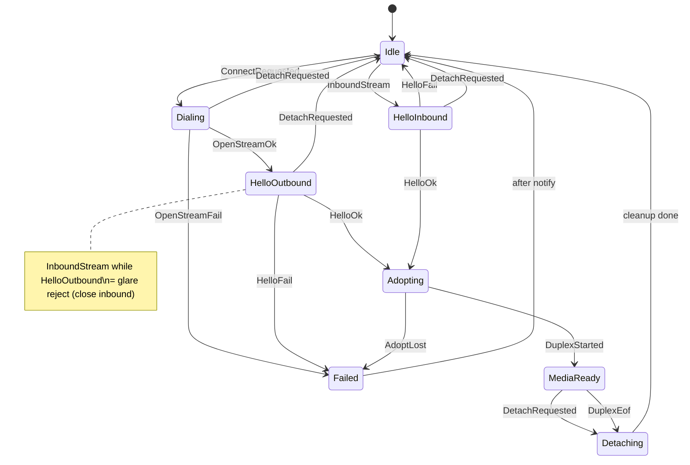

# Call / host session machines

**Tier:** project (design)  
**Status:** Design frozen (s1) — **s2 call-media SM implementing**  
**ADR:** [V033](DECISIONS.md#v033--transport-session-machines-not-host-wide-inbound-sm)  
**Code map:** [CALLS.md](../../docs/architecture/CALLS.md)  
**Admit matrix:** [HOST_RECEIVE_POLICY.md](HOST_RECEIVE_POLICY.md)  
**Mesh twin (media-relay attach):** [MEDIA_RELAY_ATTACH.md](../p2p-mesh/MEDIA_RELAY_ATTACH.md)  
**Threads:** [THREADING.md](../../docs/architecture/THREADING.md)

Design for making **long-lived** libp2p host protocol sessions robust at the architecture level. The working dogfood path took hard-won patches; this doc captures the intended machines **before** structural edits.

---

## Why

1:1 call-media and group `media_relay` work on device, but host session code is fragile by construction: boolean soup, timeout vs late-callback races, glare rules in comments, teardown order only experts know.

Product UX already has [`CallLifecycle`](../../src/feature/messaging/CallLifecycle.h) (`CallPhase` + `Apply(event)`). **Transport** sessions under it do not.

**Rule:** design thoroughly → freeze V033 / N026 → refactor **one** machine at a time behind behavior-preserving tests → dogfood. No drive-by cleanup of working paths.

---

## Goals

1. Illegal transitions are unrepresentable (or logged and ignored) for call-media (and media-relay attach — mesh doc).
2. One owner per session concern — phase in one place; side effects are outcomes of `Apply`.
3. Timeout / cancel / Detach complete through the machine (no orphan waiters).
4. Observability — INFO `phase=… event=…` so dogfood can triage “stuck in HelloInbound” vs “MediaReady but silent.”
5. Behavior-preserving migration — dogfood scenarios stay green.
6. Layer clarity — transport SM in `libp2p/integration/host`; product SM stays in `feature/messaging`.

## Non-goals

| Non-goal | Why |
|----------|-----|
| Host-wide inbound request SM | Protocols differ (RPC vs duplex); wrong granularity |
| SM for chat / chat-history / dial-back | Linear request/response; ceremony without payoff |
| Hierarchical / framework SMs | Repo style is flat enum + `Apply` |
| Absorbing `CallLifecycle` into host | SRC_LAYOUT; UX phases ≠ stream phases |
| Rewriting Yamux / multiselect | Session ownership is the bug, not the router |
| Wire-shape changes for the refactor | Lifecycle cleanup must not require protocol bumps |

---

## Layering



| Layer | Owns | Must not own |
|-------|------|--------------|
| **CallLifecycle** | Ring / accept / media-connecting / InCall | Stream adopt, hello glare, Yamux pump |
| **Bridge / Topology** | When to dial, retry, SoftMigrate, attach | Internal host phase bits |
| **CallMediaDirectService SM** | One active 1:1 media session | Invite TTL, N025 listen desire |
| **MediaRelay attach SM** | Per-inbound-stream control handshake | Hop eligibility / pricing (mesh) |
| **DuplexFrameSession** | Frame R/W phases | Session admit / glare |
| **Fork Router** | Multiselect → handler | App session policy |

**Two machines, not one.** Call-media is “one active duplex.” Media-relay is “many HostSessions × participants × per-stream control.” Specs live next to their owners: this file (call-media) and [MEDIA_RELAY_ATTACH.md](../p2p-mesh/MEDIA_RELAY_ATTACH.md).

---

## Style (locked — V033)

Mirror `CallLifecycle`:

```text
enum class XxxPhase { ... };
enum class XxxEvent { ... };
void Apply(XxxEvent ev, /* small context */);
// SetPhase logs: phase=… event=…
```

1. **Flat** phase enum — no nested regions.
2. **Events in, effects out** — `Apply` may close streams, post workers, invoke callbacks.
3. **Ignored illegal events** — WARNING with current phase; do not assert on async stale events.
4. **Named terminals** — Failed / Detached / Closed are phases or explicit outcomes.
5. **No SM framework dependency.**

---

## Threading (locked — V033)

| Work | Thread | Rule |
|------|--------|------|
| `setProtocolHandler` entry | Host **io** | Hop immediately for blocking work |
| Control handshake (hello / quote JSON) | Worker **Normal** | Never Critical (deadlock with Leave/Connect) |
| SM `Apply` | **One strand per service** (mutex on Impl or serial queue) | All transitions enter there |
| Duplex media R/W | Host **io** | Async pump; no BlockingWrite for fan-out |
| Product callbacks | Posted off SM strand | SM never calls UI directly |
| Detach / Stop / ClearInboundHandler | Same SM strand | Completes waiters; rejects further adopts |

**Invariant:** waits arm a timeout **inside** the machine (or a generation token the machine owns). External stack `promise` + `wait_for` is a migration smell — eliminate per service as each SM lands.

---

## Call-media session machine

**Code today:** [`CallMediaDirectService`](../../src/libp2p/integration/host/CallMediaDirectService.cpp) — **s2a landed** (`CallMediaSessionPhase` + INFO logs). Flag soup collapsed (`outbound_hello_inflight` / `pump_running` / `session_ready` → phase); `connect_settled` remains as the SM-owned Connect waiter token; `offerer_glare` is the Dialing/HelloOutbound glare bit. Phase moves go through **`ApplyLocked(event)`** (CallLifecycle-style); `SetPhaseLocked` is the logger/atomic only.  
**Policy rows:** [HOST_RECEIVE_POLICY — 1:1 media](HOST_RECEIVE_POLICY.md#11-media-host-call-media).  
**Product reporter:** `CallLibp2pMediaBridge` → `CallLifecycle` (`DirectConnected` / `ConnectFailed`).

### Phases

| Phase | Meaning |
|-------|---------|
| `Idle` | No stream; may accept inbound or start Connect |
| `Dialing` | Outbound `OpenStream` in flight |
| `HelloOutbound` | Writing/reading hello/ack on outbound stream (`outbound_hello_inflight`) |
| `HelloInbound` | Worker reading inbound hello; filling media key via handler |
| `Adopting` | Won the race; about to start duplex (single-writer to active stream) |
| `MediaReady` | Duplex pump running; `session_ready` |
| `Detaching` | Closing stream, aborting waiters, stopping pump |
| `Failed` | Terminal failure before MediaReady (then → Idle after notify) |

`Failed` may be instantaneous (notify + transition to Idle) if we prefer fewer sticky phases — either is fine if logged.

### Events

| Event | Typical source |
|-------|----------------|
| `ConnectRequested` | Bridge `Connect()` |
| `OpenStreamOk` / `OpenStreamFail` | `PeerSessionManager::OpenStream` |
| `InboundStream` | Protocol handler |
| `HelloOk` / `HelloFail` | Control handshake on Normal worker |
| `AdoptWon` / `AdoptLost` | Single-active-session rule |
| `DuplexStarted` | IO pump armed |
| `DuplexEof` / `DuplexError` | IO read path |
| `DetachRequested` | Bridge Leave / SoftMigrate `ReleaseDirect` / Stop |
| `ConnectTimeout` | SM-owned timer |
| `HandlerCleared` | Teardown before destroy |

### State diagram



### Guard table (implements admit policy)

| Situation | Guard / transition |
|-----------|-------------------|
| Inbound while `MediaReady` / `Adopting` / `Detaching` | Reject: close stream; log ignore |
| Inbound while `HelloOutbound` or `Dialing` (offerer fallback) | **Glare loser:** close inbound; keep outbound |
| Inbound while `Idle` | → `HelloInbound` |
| Second `ConnectRequested` while not Idle | Abort prior waiter or reject — pick one in s1; lean **Detach then Connect** |
| SoftMigrate `ReleaseDirect` | `DetachRequested` from MediaReady; must **not** surface as `ConnectFailed` to lifecycle when SFU path active (bridge policy; SM only reports transport down) |
| `ClearInboundHandler` | `HandlerCleared` — late inbound cannot touch destroyed bridge |

### Effects by transition (sketch)

| Transition | Effects |
|------------|---------|
| → `Dialing` | Arm connect timeout; store params/callbacks |
| → `HelloOutbound` | Set glare bit; async hello write/read on host io_context; arm handshake deadline (reset on expiry) |
| → `HelloInbound` | Async hello read on io_context + handshake deadline; inbound handler may hop to Normal for key fill only |
| → `Adopting` | `TryAdopt` under lock; only one winner; cancel handshake timer |
| → `MediaReady` | Start IO duplex; `on_connected`; complete Connect waiter OK |
| → `Failed` | `on_failed`; complete waiter error; reset stream |
| → `Detaching` | Stop pump; cancel handshake; **reset** stream (not write half-close); complete waiter if any; then Idle |
| `ConnectTimeout` | TeardownTransport (reset handshake) + Idle — never leave async hello pinned after Connect returns |

### Collapses today’s flags

| Flag / idiom today | Becomes |
|--------------------|---------|
| `outbound_hello_inflight` | phase ∈ {`HelloOutbound`} (and optionally `Dialing`) |
| `pump_running` / `session_ready` | phase == `MediaReady` |
| `connect_settled` | waiter owned by SM; completed only on Failed/MediaReady/Detach |
| Comment “glare loser” | guard on `InboundStream` in HelloOutbound |

### Bridge boundary

- Bridge still decides **when** to Connect / Detach / ignore EOF during SoftMigrate.
- SM reports transport facts: connected, failed, detached.
- Lifecycle phases stay in `CallLifecycle` — do not merge.

### Golden scenarios (must pass before/after s2)

1. Answerer reverse-dial wins → MediaReady; offerer inbound grace unused.
2. Offerer fallback dial wins after grace → MediaReady; late reverse-dial closed (glare).
3. Dual dial race → exactly one adopt; other closed; no Critical deadlock. — **loopback:** `DualDialExactlyOneAdoptEachSide`
4. Leave / Detach during Dialing or Hello* → Idle promptly; Connect unblocked (<15s hang). — **loopback:** `DetachUnblocksConnectWait`
5. SoftMigrate ReleaseDirect → Detach without lifecycle ConnectFailed when SFU expected. — **loopback:** `FailAfterDetachDoesNotCallOnFailed`
6. Stop / ClearInboundHandler → late inbound no-ops. — **loopback:** `ClearInboundHandlerRejectsLateInbound`
7. Connect timeout → Failed → Idle; late OpenStreamOk ignored. — **loopback:** `ConnectTimeoutReturnsIdleAndIgnoresLateOpen`

---

## Media-relay

Per-stream attach handshake and HostSession ownership: **[p2p-mesh MEDIA_RELAY_ATTACH.md](../p2p-mesh/MEDIA_RELAY_ATTACH.md)** (N026).  
QoS / admit numbers stay in [HOST_RECEIVE_POLICY.md](HOST_RECEIVE_POLICY.md) and V032.

---

## Optional later: circuit bridge

Defer unless bridge bugs block dogfood. Sketch only: `Admit → DialTarget → OpenTargetStream → Bridging → Cancelled/Closed` per request in `CircuitRelayService`. Not scheduled until call-media + media-relay SMs land.

---

## Migration

| Step | What |
|------|------|
| **s0** | This design + V033 / N026 (docs only) |
| **s1** | Freeze open questions below; write behavior catalog / unit-test skeletons (no behavior change) |
| **s2** | Call-media SM strangler in `CallMediaDirectService` — loopback goldens (**done**) |
| **s3a+s3b** | Media-relay inbound + client attach SM (**done**) |
| **Compose** | Circuit + call-media / media_relay loopback partition tests (**done**) |
| **s4** | Optional circuit SM; promote race table homes into CALLS.md |

**Strangler:** introduce phase enum beside flags → route new paths through `Apply` → delete flags when unused.  
**Refuse** chat/history/dial-back refactors in the same PR as a session SM.

---

## s1 freeze (2026-08-07)

| Question | Decision |
|----------|----------|
| SM strand | **Mutex on `Impl`** for all `Apply` / phase transitions. Duplex start posts to host io without holding the lock across awaits. |
| Connect API | Keep **blocking** bridge-facing `Connect()` for s2; waiter/timeout owned inside the SM. Fully async later. |
| Failed phase | **Instant notify → Idle** (log failure event; do not stick in `Failed`). |
| Second Connect while busy | **Detach-then-Connect** (abort prior waiter, then dial). |
| Scope | **s2 = call-media only**; media-relay N026 after call-media SM. |

**Glare note (preserve dogfood):** Reject inbound only while outbound **offerer** hello is in flight (`offerer_glare`, set on outbound hello). Do **not** reject inbound during `Dialing` — answerer reverse-dial must still win while offerer `OpenStream` is outstanding.

**Dual-dial concurrency:** A single process may have outbound `Dialing`/`HelloOutbound` overlapping inbound `HelloInbound` until one `AdoptWon`. Phase logs follow the latest transition; outbound callbacks must key off waiter/`stream`/`offerer_glare`, not exclusive `Phase==Dialing`.

**Bug fix (s2):** If inbound hello fails while an outbound `Connect` waiter is still active, restore `Dialing` (do not force `Idle`) so OpenStream/hello can proceed — otherwise Connect hung until timeout.

**Bug fix (s2):** `Fail` / duplex EOF is ignored when phase is already `Detaching` or `Idle` so intentional `Detach` (SoftMigrate `ReleaseDirect`) does not fire `on_failed`.

---

## Success criteria

| Signal | Meaning |
|--------|---------|
| Phase logs explain stuck Connecting | Triage without reading Impl |
| Glare / Detach / timeout are transitions | No new `settled` atomics in that service |
| Unit tests for illegal event sequences | Faked streams; no full mesh |
| CALLS.md critical races point at SM phases | Races have a home |
| Dogfood intent unchanged | Robustness without feature churn |
