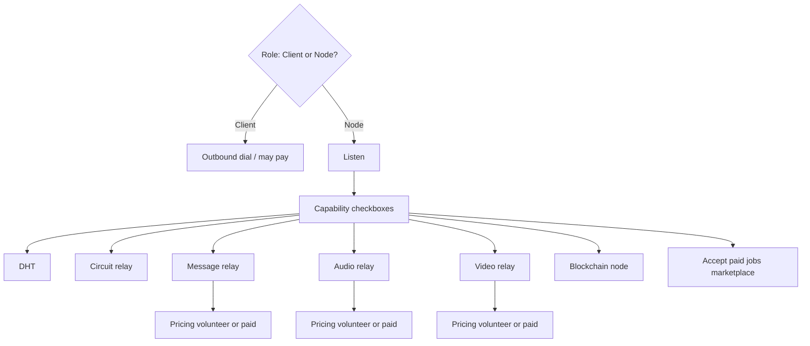
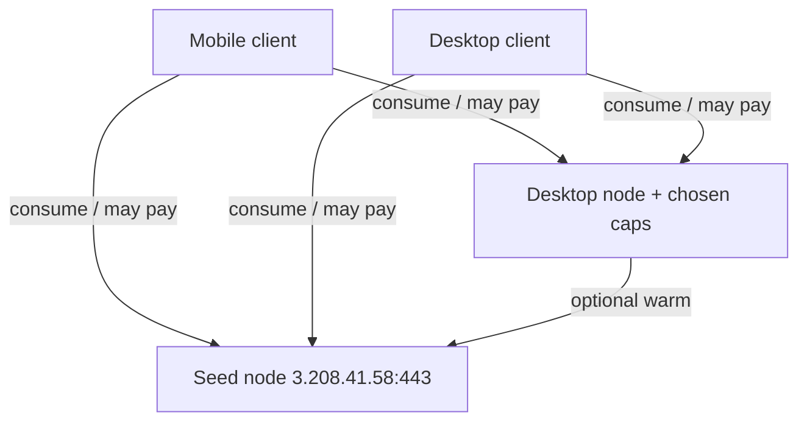
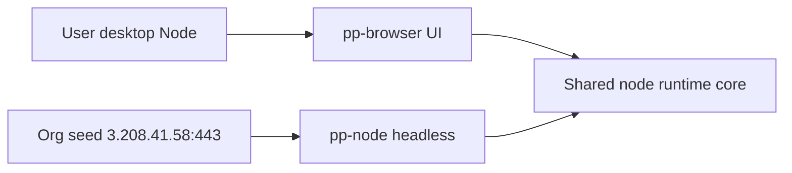
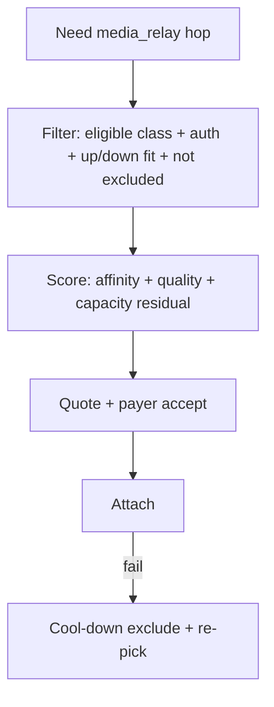

# P2P mesh — design

## Model: role + capability checkboxes (N009)

**Two roles only** — not a flat list of unrelated modes:

| Role | Who | Meaning |
|------|-----|---------|
| **Client** | Mobile always; desktop when user opts out | Consume services; outbound dial; do not host |
| **Node** | Desktop default (`node_enabled`) | May host; listen + user-chosen **capabilities** |

**Capabilities** are independent checkboxes **under Node** (what I host). They do not create new roles.

| Layer | Answers | UI (desktop) |
|-------|---------|----------------|
| Role | Do I host at all? | Master toggle: **Help the network** (`node_enabled`) |
| Capabilities | Which services do I run? | Checkboxes enabled only when role = Node |
| Pricing (N010) | Free or paid for a billable service? | Nested under that capability (not a third role) |

Turning role **off** → Client: ignore/disable all capability flags at runtime (flags may remain on disk for when the user re-enables Node).

Mobile: always Client — no role toggle, no capability UI (may **pay** nodes later as a consumer).



## Vision: nodes as ecosystem infrastructure

A **node** is a voluntary **infrastructure element** of the Brief/pp-browser ecosystem. Peers help each other; users pick which services to contribute.

| Capability | Purpose (sketch) | Ships |
|------------|------------------|-------|
| **Inbound listen** | Dialable peer for direct messaging / streams | n1 (implied by Node) |
| **DHT** | Peer and content routing | n2 + checkbox |
| **Circuit relay** | Hop for NATed peers | n3 + checkbox |
| **Message relay** | Store-and-forward / inbox assist | **Separate** from n4-media (N017); HTTP Brief default for now |
| **Media relay** | Blind selective forwarder for calls (`media_relay`) | **n4-media** + checkbox **default on**; bandwidth budget; pricing later (N018) |
| **Blockchain node** | Chain participation (identity / DA / settlement rails) | n4+ + checkbox |
| **Accept paid jobs** | Optional **marketplace** for discrete tasks (transcode, fetch, compute) — **not** the primary monetization path | later + checkbox |

**Defaults (desktop Node):** listen on; capability checkboxes default **off** until each service is production-ready and the user opts in (or we later choose safe volunteer defaults — decide at ship time).

**Always-on seed** (`3.208.41.58:443` + PeerId) is the first permanent infrastructure node. User desktops **expand** the mesh when online — they do not replace the seed.



## Monetization (N010) — agents: read this

**Do not confuse** “settle on chain” with a single `accept_paid_jobs` capability.

| Mechanism | What it is | Primary use |
|-----------|------------|-------------|
| **Per-capability pricing** | Policy on a **billable** hosted service | Message / **media_relay** charge consumers; settle on chain |
| **Accept paid jobs** | Separate optional **job marketplace** | Discrete one-off tasks, not continuous relay metering |

### Per-capability pricing (primary)

For billable capabilities (first: message_relay, media_relay):

| Policy | Meaning |
|--------|---------|
| **Volunteer** | Free for peers (mutual-help default) |
| **Paid** | Consumers pay a rate; usage metered; **on-chain settlement** |

Rules:

- Client never hosts or prices — only consumes (and may pay).
- `Node && capability off` → nothing to charge for.
- `Node && capability on && volunteer` → free help.
- `Node && capability on && paid` → advertise rate; consumer agrees before use; settle on chain.
- DHT / circuit relay may stay volunteer longer (mesh glue); relays are the natural first paid surface.
- Shared wallet / settlement module can serve all paid paths; **blockchain node** capability ≠ “I accept payments” by itself.

### Accept paid jobs (secondary, later)

Optional checkbox under Node for advertising/fulfilling **discrete jobs**. Complements relay pricing; does **not** replace it. Do not implement jobs UI as the only way nodes earn.

### UI sketch (desktop, under Node) — when billable caps ship

```text
[x] Help the network                         ← role

  [x] Message relay
        Pricing: (•) Free  ( ) Paid   rate: …
  [ ] Audio relay
        Pricing: …
  [ ] Video relay
        Pricing: …
  [ ] DHT
  [ ] Circuit relay
  [ ] Blockchain node

  [ ] Accept paid jobs                       ← marketplace (later)
```

n1: master toggle only. Pricing UI ships with the first billable capability — **not** in n1, and **not** as a fake standalone “paid settle” capability.

## Platform defaults

| Platform | `node_enabled` | Effective role | Listen | Capability / pricing UI |
|----------|----------------|----------------|--------|-------------------------|
| Mobile | ignored | Client | no | hidden (consumer pay UX later) |
| Desktop | true (default) | Node | yes | shown when Node; pricing nested under billable caps |
| Desktop | false | Client | no | hidden / inert |

Resolver: e.g. `ResolveLibp2pRole`. Effective hosting for *C* requires `role == Node && C_enabled && C_implemented`. Charging for *C* requires that **and** `pricing(C) == paid`.

## Bootstrap seed

Default `bootstrap_peers` entry (IP only, no DNS):

```
/ip4/3.208.41.58/tcp/443/p2p/12D3KooWCmqCKgBL47m25WzUgiAPayf3GqKiRosmPvAqp2MQUFYR
```

- Seed listens on TCP **443** (libp2p transport — N007).
- Desktop nodes prefer listen **/ip4/0.0.0.0/tcp/18517** (N003) when Node; busy-port policy **N016**.
- Do **not** use public `bootstrap.libp2p.io` (N006).

After host start, register each bootstrap multiaddr into `PeerSessionManager::RegisterEndpoint` under a stable key (PeerId from `/p2p/…`). Do not force a permanent warm dial on mobile.

## Listen port & busy bind (N003 / N016)

| Context | Preferred | If bind fails |
|---------|-----------|----------------|
| Desktop Node (`pp-browser`) | **18517** | Try **18517–18526**, then optional ephemeral; **persist** chosen `listen_multiaddr`; show **actual** port in Network / port-forward / UPnP UI |
| Org `pp-node` | Configured (often **443**) | **Fail loud** by default — no silent port hop |

Port-forward and firewall coaching must use the **live** listen port from config/runtime, not a hard-coded 18517 if fallback ran.

## Config model

### n1 (role shell only)

| Field | Default / notes |
|-------|-----------------|
| `bootstrap_peers` | vector; default = seed multiaddr above |
| `node_enabled` | `true`; desktop opt-out; ignored on mobile |
| `listen_multiaddr` | Preferred `/ip4/0.0.0.0/tcp/18517` when Node; may change after N016 fallback |
| session policy | keep existing |

### Later (capabilities + pricing)

Shape sketch (names TBD at implement time):

```json
"libp2p": {
  "node_enabled": true,
  "listen_multiaddr": "/ip4/0.0.0.0/tcp/18517",
  "bootstrap_peers": ["…"],
  "capabilities": {
    "dht": false,
    "circuit_relay": false,
    "message_relay": false,
    "media_relay": true,
    "blockchain": false,
    "accept_paid_jobs": false
  },
  "pricing": {
    "message_relay": { "mode": "volunteer", "rate": null },
    "media_relay": { "mode": "volunteer", "rate": null }
  },
  "media_relay_budget": {
    "node_capacity_up_bps": null,
    "node_capacity_down_bps": null,
    "max_session_up_bps": null,
    "max_session_down_bps": null,
    "default_per_user_up_bps": null,
    "default_per_user_down_bps": null
  }
}
```

- `capabilities.*` = host this service. **`media_relay` default true** on desktop Node / `pp-node` when Node is on (N018); user may disable.
- `media_relay_budget.*` = **↑/↓** node / session / per-user ceilings (N019). `null` = unbounded / ops default. Relay limits by volume only; does not classify A/V.
- Session **quote/accept** + billing ceiling: calls V022 / mesh N019 (volunteer rate 0 uses same path).
- `pricing.*` = volunteer | paid (+ rate) for **billable** caps only — not a substitute for the capability flag.
- `accept_paid_jobs` = marketplace on/off only; job rates live in a later jobs schema.
- Older sketches’ `audio_relay` / `video_relay` / single `max_aggregate_bps` map to **`media_relay`** + ↑/↓ fields.

Do **not** ship capability/pricing keys/UI in n1 until the matching protocol works (N005).

## Host start path (n1)

`MessagingHub::StartLibp2p` / `Libp2pHost::Start`:

- Pass resolved role (`listen_enabled` + listen multiaddr + `bootstrap_peers`).
- **Client:** create host + `start()` **without** `listen`.
- Extend session clamps to **all mobile** via `Platform::IsMobile()`.

Later: start modules only if `Node && capability_enabled`; enforce pricing at the service admission boundary.

## Me → Network UI

### n1

- Desktop master toggle: **Help the network** → `node_enabled` (hide on mobile).
- Copy: mutual help / infrastructure.
- Optional read-only seed PeerId hint.
- No capability or pricing UI yet.

### n2+

- Checkboxes for shipped capabilities under Node.
- When a **billable** capability ships: nested **Free / Paid** (+ rate) under that row (N010).
- **Accept paid jobs** checkbox only when the marketplace exists — separate from relay pricing.

Hot-reload: role / capability / pricing changes reconfigure modules (`MessagingHub::Reinitialize` or finer hooks).

## Capability roadmap

| Phase | What | UI |
|-------|------|-----|
| **n1** | Role + listen + bootstrap | Master toggle only |
| **n2** | DHT | + DHT checkbox (no pricing required) |
| **n3** | Circuit relay | + checkbox (pricing optional / often volunteer) |
| **n4-media** | Blind `media_relay` forwarder (N017/N018/N019) | + checkbox **default on** (volunteer); ↑/↓ budgets + quote schema; pricing stub |
| **later** | Peer message_relay | Optional; do not hard-cut HTTP Brief |
| **later** | Paid relay UI / settle (N010) | Nested Free/Paid when metering ships |
| **n4+ / later** | Blockchain node | + checkbox (settlement rails, not “paid jobs”) |
| **later** | Accept paid jobs marketplace | + checkbox; job schema separate |

**A/V calls consumer:** [p2p-av-calls](../p2p-av-calls/) **a4** needs blind **`media_relay`** (V020/V021). Relay must not know payload contents. Exact SFU choice priority **TBD**.

Until media_relay ships, keep **direct ICE** for 1:1; group waits on forwarder. HTTP Brief remains message offline fallback.

## Packaging: `pp-node` binary (N011)

**Org / dedicated servers** (including the locked seed at `3.208.41.58:443`) run a **separate headless binary**, not a GUI flag on `pp-browser`.

| Binary | Audience | Stack |
|--------|----------|--------|
| **`pp-browser`** | People (desktop/mobile UI) | SDL + RmlUi + optional in-app Node role (N009) |
| **`pp-node`** | Org seeds, datacenter, power-user daemons | Same node **core** (libp2p / MessagingHub start path / capabilities); **no** UI |



### Why not `--headless` on `pp-browser` as the server story

Today `main` always boots SDL/RmlUi. A headless flag would still pull GUI deps, fight PIN/window lifecycle, and bloat systemd/Docker images. Optional `pp-browser --node-only` may exist later for **local dogfood only** — it is **not** the production org-server path (N011).

### `pp-node` behavior

- Always effective **Node** (no Client mode; no Me → Network UI).
- Listen from config (org seed: `/ip4/0.0.0.0/tcp/443`; desktop preferred **18517**, N016 if busy).
- Capability / pricing defaults may be **ops-oriented** (more caps on) via a server config profile — still the same schema as the app.
- Non-interactive identity unlock (key file / env / `--pin`-style automation); no window, no RmlUi.
- Process model: start host → register/bootstrap as configured → run until SIGINT/SIGTERM (systemd-friendly).

### CLI sketch

```bash
pp-node --config /etc/pp-node/config.json
pp-node --listen /ip4/0.0.0.0/tcp/443 \
        --capabilities dht,circuit_relay,message_relay
```

### Implementation rule

**One networking stack, two entrypoints.** Extract a reusable “node runtime” from `MessagingHub::StartLibp2p` / host lifecycle; do **not** fork a second libp2p integration for servers. Phase **np** ships the binary after n1’s listen/bootstrap shell exists in the shared core.

## Reachability & network help (N012)

Users behind **home routers (NAT)** or **firewalls** often cannot accept inbound dials even when Node is on. Detect **reachability**, show a clear status, and teach **what they can do** — without over-claiming “firewall” vs “router.”

### Status model (prefer these labels)

| Status | Meaning | Typical cause |
|--------|---------|----------------|
| **Reachable** | Remotes can dial our advertised listen addr | Public IP, good port forward, or IPv6 |
| **Outbound only** | We can dial seed/peers; inbound unlikely | NAT / router without forward; many firewalls |
| **Blocked** | Cannot reach seed or open needed sockets | Outbound firewall, captive portal, offline |
| **Unknown / Checking…** | Not measured yet | Startup |

Do **not** show scary “You are behind a firewall” as a hard fact. Infer softly: private LAN IP + outbound-only → “likely behind a home router”; outbound fail → “network may be blocking connections.”

### Detection (phased)

| Stage | Mechanism |
|-------|-----------|
| **Cheap (nr / post-n1)** | Classify listen/interface IPs (RFC1918 vs public); dial Brief seed; notice whether any remote ever connects inbound |
| **Better** | Seed / probe peer dial-back (“can you open a stream to me?”) — natural `pp-node` seed feature |
| **Later** | AutoNAT-style observed addrs; hole punch; circuit-relay when stuck outbound-only |

### UX (desktop; Node-relevant)

1. **Me → Network — Connection card** — status chip + one sentence + **Learn what to do** / **Test again**.
2. **Soft banner** — only if `node_enabled` and outbound-only (or blocked) for a while; not for every Client.
3. **Guided sheet** by status:
   - **Outbound only + private IP** → likely router/NAT: forward WAN→this PC on the **actual** listen port (preferred **18517**, or whatever was persisted after N016) → Test again. Brand-agnostic checklist; no false guarantees (CGNAT, ISP blocks, double NAT).
   - **Blocked** → allow `pp-browser` / `pp-node` in OS firewall; try another network / disable VPN briefly.
   - **Reachable** → short success: others can connect directly.
4. Always offer **Skip / keep using relay** so messaging still works without port forward.
5. **Clients** do not need port-forward coaching; optional light tip only if they care about hosting later.
6. **`pp-node`** — ops logs / `--status` (inbound OK from probe), not consumer copy.

### Rules

- Do not nag for port forward until **Node is on** and status is measured outbound-only.
- Explain **impact**: “Direct connections to you may use relay until inbound works.”
- One next action per sheet; i18n en + zh-Hans when UI ships.

Phase **nr** (reachability) follows n1 (and can share probes with **np** seed). Full AutoNAT / hole punch remain later than cheap detection + help UI.

## Making inbound easier: UPnP + IPv6 (N013)

Manual port-forward (N012) is the fallback. Prefer automatic / zero-config paths first:

| Mechanism | Behavior |
|-----------|----------|
| **IPv6 listen / advertise** | When the host has a usable global IPv6 addr, prefer advertising it; many homes are inbound-reachable on v6 with no router UI. Connection card may say “Reachable via IPv6.” |
| **UPnP / NAT-PMP / PCP** | One-tap (or auto-try when Node is on) to map WAN→listen port on supporting routers. Success → re-run reachability test. Failure → N012 manual guide. |
| **Manual port forward** | Last resort checklist from N012 |

Phase **nu** ships after **nr** has a status card (so success/failure is visible). Do not require UPnP for org `pp-node` on public IPs.

## Relay path preference (N014 / N020)

**Intent (N014):** Prefer asking/serving **contacts** and trusted Nodes; org seed as reliable backstop; public later.

**`media_relay` algorithm (N020 / calls V023):** Risk-aware **filter → score → quote**, not a hardcoded stage list.

| Horizon | Rule |
|---------|------|
| **Short term** | Feasible set = **contacts ∪ household ∪ org seed** only; no open public market. Score: affinity + quality floor + residual capacity (price = 0). Auth + ↑/↓ quote required. Provider: prefer contacts; limit strangers. |
| **Mid term** | Curated public; paid rates to ration overflow; concentration penalty; quality history |
| **Long term** | Bonds, receipts, anti-dumping, anti-capture — pricing **regulates** ecosystem; revenue is not the mission |



Circuit hops in **nf** may keep a simpler contacts→seed preference. Message path: HTTP Brief fallback; peer `message_relay` optional later (N017).

## Preferred delivery order (N015)

Ship value in this sequence unless a later ADR revises it:

1. **n1** — Role shell, listen, bootstrap, master toggle  
2. **np** — `pp-node` + seed dial-back probe support  
3. **nr** — Reachability status + manual help (uses dial-back)  
4. **nu** — IPv6 advertise + UPnP/NAT-PMP (N013)  
5. **n3** — Circuit-relay capability (helps outbound-only users)  
6. **nf** — Contact-first preference (N014); thin OK — SFU pick ranking TBD  
7. **n4-media** — True audio/video SFU on `pp-node` + desktop checkboxes (N017); unblocks calls **a4**  
8. **Later** — Peer message_relay (optional); paid pricing UI (N010); capability directory / soft reputation  
9. **n2** — DHT (useful, but seed + circuit + directory often cover chat UX earlier)  
10. Chain settle rails, paid-jobs marketplace, Home Node pack, schedules/caps  

Agents: prefer **n4-media** for calls over peer message_relay or paid UI. Prefer this order over “implement DHT next because it is n2.”

## Horizons (still open)

| Idea | Notes |
|------|-------|
| **Capability directory** | Mid-term curated public for media_relay (N020); still respect affinity |
| **Node reputation / receipts** | Soft trust before heavy staking (N020 long term) |
| **Bonds / anti-dumping / anti-capture** | Pricing as regulation (N020); revenue not the mission |
| **Schedules & resource caps** | Node only on AC / idle; bandwidth ceilings |
| **Home Node pack** | Always-on mini PC + `pp-node` |
| **Gradual HTTP→peer message_relay** | Dual-run; don’t hard-cut Brief HTTP |
| **Same PeerId for ops** | Org GUI profile and `pp-node` may share identity |
| **Contribution UX** | Light thanks/stats for volunteer nodes |

## Out of scope for n1

- Capability / pricing flags or UI
- DHT / circuit / message / media / chain / jobs protocols
- **`pp-node` binary** (phase **np** — done)
- **Reachability UI** (phase **nr**; dial-back probe landed in **np**)
- **UPnP / IPv6 auto-path** (phase **nu**)
- **Friend-preferential routing** (phase **nf**)
- Publishing listen addrs to public directory
- Replacing HTTP Brief relay; DNS multiaddrs

## Docs + tests (n1)

- Update `CONFIGURATION.md`, `P2P_MESSAGING.md`, `PLATFORMS.md` for Client vs Node (mention N011–N015 as follow-up).
- Unit tests: JSON round-trip; role resolver; Network draft apply.
