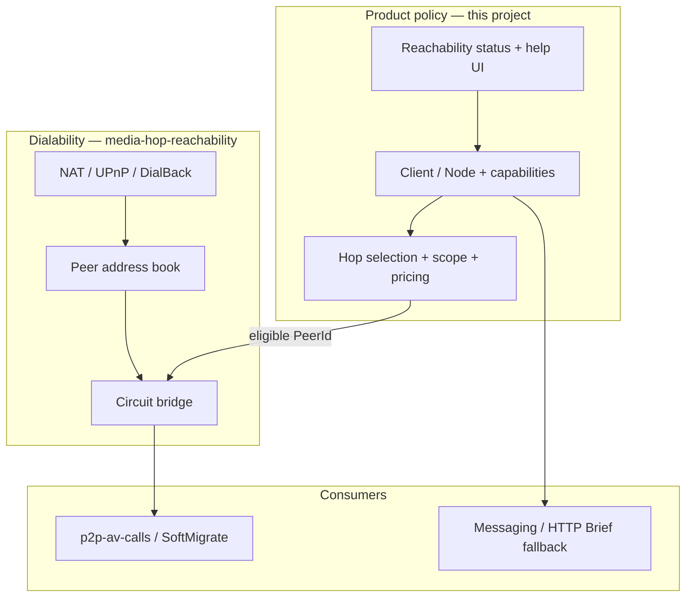
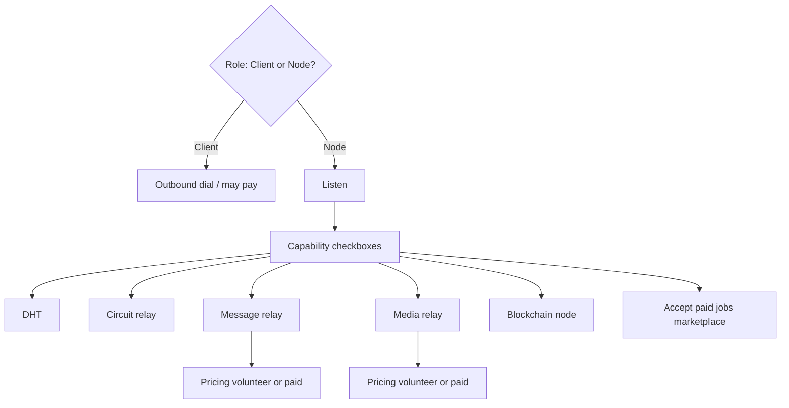
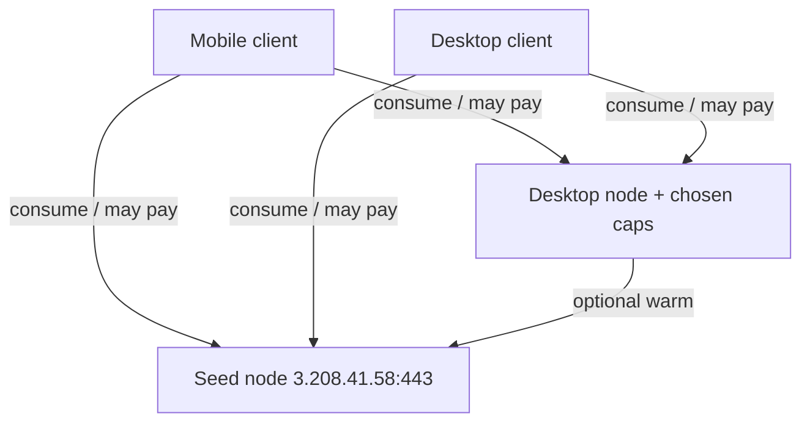
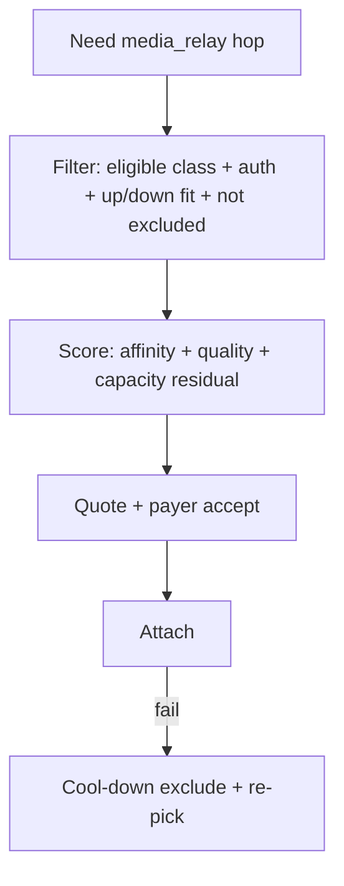
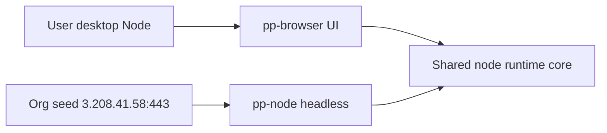

# P2P mesh — design

**Authoritative specification** for the Client/Node mesh, capabilities, relay policy, and packaging.  
**Execution order and checklists:** [PHASES.md](PHASES.md). **What's landed in code:** [CURRENT_STATE.md](CURRENT_STATE.md). **Rationale and history:** [DECISIONS.md](DECISIONS.md).

---

## Overview

The mesh lets Brief/pp-browser peers help each other: desktop users may **host** infrastructure; mobile defaults to **consume-only**, with **call-scoped listen on Wi‑Fi** when in an active call (N025). Hosting on desktop is a **role** plus optional **capabilities** (DHT, relays, chain, jobs). Relay paths prefer **contacts and org seed** before wider pools; **reachability** (NAT, UPnP, dial-back) determines who can be dialed; **media-hop-reachability** owns dial-by-PeerId inside libp2p.



| Layer | Owns |
|-------|------|
| **p2p-mesh (this doc)** | Role, capabilities, config, Me → Network UI, relay **policy** (who, scope, quotes, settle), `pp-node` packaging |
| **[media-hop-reachability](../media-hop-reachability/)** | In-stack **dialability**: peerstore, Identify, circuit evolution, `IsPeerDialable` |
| **[RELAY_SCOPE.md](RELAY_SCOPE.md)** | Scope tags, escalation, bridge score, provider caps |
| **[p2p-av-calls](../p2p-av-calls/)** | Call lifecycle; SoftMigrate **consumes** ranked hops |
| **HTTP Brief** | Message inbox durability when peer paths fail |

---

## Roles and capabilities

**Two roles only** — not a flat list of unrelated modes:

| Role | Who | Meaning |
|------|-----|---------|
| **Client** | Mobile default; desktop when user opts out | Consume services; outbound dial; **no always-on listen** |
| **Node** | Desktop default (`node_enabled`) | May host; listen + user-chosen **capabilities** |

Mobile is **not** a third role. **Call-scoped listen** (N025) is gated policy on top of Client — ephemeral listen on Wi‑Fi during an active call (and optional later **Help on Wi‑Fi**), not full Node.

**Capabilities** are independent checkboxes **under Node** (what I host). They do not create new roles.

| Layer | Answers | UI (desktop) |
|-------|---------|----------------|
| Role | Do I host at all? | Master toggle: **Help the network** (`node_enabled`) |
| Capabilities | Which services do I run? | Checkboxes enabled only when role = Node |
| Pricing | Free or paid for a billable service? | Nested under that capability (not a third role) |

Turning role **off** → Client: ignore/disable all capability flags at runtime (flags may remain on disk for when the user re-enables Node).

Mobile: **Client by default** — no master **Help the network** toggle. During a **foreground call on Wi‑Fi**, ephemeral listen may start (N025) so peers can dial by PeerId on LAN; optional in-call **`media_relay`** for contacts only. Background incoming calls still use **`call_wake`** + outbound dial, not idle listen.



**Effective service *C*:** `role == Node && C_enabled && C_implemented`.  
**Charging for *C*:** that **and** `pricing(C) == paid`.

Resolver: e.g. `ResolveLibp2pRole`.

### Platform defaults

| Platform | `node_enabled` | Effective role | Listen | Capability / pricing UI |
|----------|----------------|----------------|--------|-------------------------|
| Mobile | ignored | Client | **Default no**; **ephemeral on Wi‑Fi during active call** (N025) | hidden; no Node matrix |
| Desktop | true (default) | Node | yes (always when Node) | shown when Node; pricing nested under billable caps |
| Desktop | false | Client | no | hidden / inert |

### Mobile participation (N025)

| Mode | Listen | `media_relay` | When |
|------|--------|---------------|------|
| **Client (default)** | No | No | Normal use |
| **Call participant** | Ephemeral | Optional — contacts / in-call only | Foreground call + Wi‑Fi |
| **Wi‑Fi helper (planned)** | While toggle on | Volunteer, social scope, capped | User opt-in; **off on cellular** |

**Not in scope for mobile:** always-on Node, public/paid relay, listen on cellular by default, background idle listen for ring.

---

## Nodes as ecosystem infrastructure

A **node** is a voluntary **infrastructure element** of the Brief/pp-browser ecosystem. Peers help each other; users pick which services to contribute.

| Capability | Purpose | Maturity |
|------------|---------|----------|
| **Inbound listen** | Dialable peer for direct messaging / streams | Shipped (implied by Node) |
| **DHT** | Peer and content routing | Planned |
| **Circuit relay** | Hop for NATed peers | Shipped (single-hop today; multi-hop planned) |
| **Message relay** | Store-and-forward / inbox assist | Planned; HTTP Brief remains default |
| **Media relay** | Content-agnostic multiplexed forwarder — framing + QoS types; blind to payload | Shipped |
| **Blockchain node** | Chain participation (identity / DA / settlement rails) | Planned |
| **Accept paid jobs** | Optional **marketplace** for discrete tasks — **not** primary monetization | Planned |

**Defaults (desktop Node):** capability checkboxes default **off** until each service is production-ready and the user opts in, except **`media_relay` defaults on** for org `pp-node` and desktop Node when enabled.

**Always-on seed** (`3.208.41.58:443` + PeerId) is the first permanent infrastructure node. User desktops **expand** the mesh when online — they do not replace the seed.



---

## Bootstrap and listen

### Bootstrap seed

Default `bootstrap_peers` entry (IP only, no DNS):

```
/ip4/3.208.41.58/tcp/443/p2p/12D3KooWCmqCKgBL47m25WzUgiAPayf3GqKiRosmPvAqp2MQUFYR
```

- Seed listens on TCP **443** (libp2p transport — distinct from HTTPS Brief API).
- Desktop nodes prefer listen **/ip4/0.0.0.0/tcp/18517** when Node.
- Do **not** use public `bootstrap.libp2p.io`.

After host start, register each bootstrap multiaddr into `PeerSessionManager::RegisterEndpoint` under a stable key (PeerId from `/p2p/…`). Do not force a permanent warm dial on mobile.

### Listen port and busy bind

| Context | Preferred | If bind fails |
|---------|-----------|----------------|
| Desktop Node (`pp-browser`) | **18517** | Try **18517–18526**, then optional ephemeral; **persist** chosen `listen_multiaddr`; show **actual** port in Network / port-forward / UPnP UI |
| Org `pp-node` | Configured (often **443**) | **Fail loud** by default — no silent port hop |

Port-forward and firewall coaching must use the **live** listen port from config/runtime, not a hard-coded 18517 if fallback ran.

---

## Configuration

Target shape (field names may refine at implement time):

```json
"libp2p": {
  "node_enabled": true,
  "listen_multiaddr": "/ip4/0.0.0.0/tcp/18517",
  "bootstrap_peers": ["…"],
  "prefer_contacts_for_routing": true,
  "capabilities": {
    "dht": false,
    "circuit_relay": false,
    "message_relay": false,
    "media_relay": true,
    "blockchain": false,
    "accept_paid_jobs": false
  },
  "pricing": {
    "message_relay": { "mode": "volunteer", "rate": null },
    "media_relay": { "mode": "volunteer", "rate": null }
  },
  "media_relay_budget": {
    "node_capacity_up_bps": null,
    "node_capacity_down_bps": null,
    "max_session_up_bps": null,
    "max_session_down_bps": null,
    "default_per_user_up_bps": null,
    "default_per_user_down_bps": null
  }
}
```

- `capabilities.*` — host this service. **`media_relay` default true** on desktop Node / `pp-node` when Node is on; user may disable.
- `media_relay_budget.*` — **↑/↓** node / session / per-user ceilings. `null` = unbounded / ops default. Relay limits by volume only; does not classify A/V.
- Session **quote/accept** + billing ceiling: volunteer rate 0 uses the same path as paid.
- `pricing.*` — volunteer | paid (+ rate) for **billable** caps only — not a substitute for the capability flag.
- `accept_paid_jobs` — marketplace on/off only; job rates live in a later jobs schema.
- Legacy sketches with `audio_relay` / `video_relay` / single `max_aggregate_bps` map to **`media_relay`** + ↑/↓ fields.

Do **not** expose capability/pricing UI until the matching protocol works.

---

## Services

### DHT

Kademlia-style peer and content routing. Useful for discovery later; seed + circuit + directory often cover chat UX earlier. Checkbox under Node when shipped.

### Circuit relay

Custom protocol `/pp-browser/circuit-relay/1.0.0` — stream bridge for NATed peers. Checkbox under Node; org seed typically enables it. Pricing optional (often volunteer).

**Today:** single-hop (one relay must direct-dial target). **Planned:** multi-hop v2 — see [MULTI_HOP_CIRCUIT.md](../media-hop-reachability/MULTI_HOP_CIRCUIT.md).

Contact-first preference applies: `MessagingHub::RequestCircuitBridgePreferred`, `OrderCircuitHops`.

### Message relay

Peer store-and-forward / inbox assist — **separate** from media relay. HTTP Brief remains the durability anchor; peer message relay is optional and gradual.

### Media relay

Homegrown **content-agnostic** forwarder — no media keys, no codec decode.

| Aspect | Detail |
|--------|--------|
| Protocol | `/pp-browser/media-relay/1.0.0` |
| Framing | `stream_id \| channel_id \| channel_type \| seq \| mark` + opaque payload |
| QoS types | `reliable_ordered`, `latest_lossy`, optional `best_effort`; subscribe by `(stream_id, channel_id)` |
| Session | Quote → accept → attach; ↑/↓ budgets (C/B/A per direction); volunteer rate 0 |
| Auth | Before attach; roster proof tied to call context |
| Pick | Contacts ∪ org seed; filter → score → quote → re-pick on failure |

Call consumer maps audio/video layers per shared adaptive policy ([p2p-av-calls](../p2p-av-calls/)). Relay must not know payload contents.

### Blockchain node

Settlement / identity rails — separate from “I accept payments” or relay pricing.

### Accept paid jobs

Optional marketplace for discrete one-off tasks (transcode, fetch, compute). Complements relay pricing; does **not** replace it.

---

## Reachability and inbound connectivity

Users behind **home routers (NAT)** or **firewalls** often cannot accept inbound dials even when Node is on. The product detects **reachability**, shows a clear status, and teaches **what they can do** — without over-claiming “firewall” vs “router.”

### Status model

| Status | Meaning | Typical cause |
|--------|---------|----------------|
| **Reachable** | Remotes can dial our advertised listen addr | Public IP, good port forward, or IPv6 |
| **Outbound only** | We can dial seed/peers; inbound unlikely | NAT / router without forward; many firewalls |
| **Blocked** | Cannot reach seed or open needed sockets | Outbound firewall, captive portal, offline |
| **Unknown / Checking…** | Not measured yet | Startup |

Do **not** show scary “You are behind a firewall” as a hard fact. Infer softly: private LAN IP + outbound-only → “likely behind a home router”; outbound fail → “network may be blocking connections.”

### Detection stack

| Mechanism | Role |
|-----------|------|
| IP classification | RFC1918 vs public on listen interfaces |
| Seed dial | Can we reach bootstrap? |
| Inbound seen | Has any remote connected inbound? |
| Dial-back | Seed / probe peer dial-back (“can you open a stream to me?”) — `pp-node` feature |
| Later | AutoNAT-style observed addrs; hole punch; circuit-relay when stuck outbound-only |

Stack implementation details: [media-hop-reachability](../media-hop-reachability/DESIGN.md).

### Making inbound easier

Prefer automatic paths before manual port-forward:

| Mechanism | Behavior |
|-----------|----------|
| **IPv6 listen / advertise** | When the host has a usable global IPv6 addr, prefer advertising it; Connection card may say “Reachable via IPv6.” |
| **UPnP / NAT-PMP / PCP** | One-tap (or auto-try when Node is on) to map WAN→listen port on supporting routers. Success → re-run reachability test. Failure → manual guide. |
| **Manual port forward** | Last resort checklist |

Org `pp-node` on public IPs need not use UPnP.

### UX (desktop; Node-relevant)

1. **Me → Network — Connection card** — status chip + one sentence + **Learn what to do** / **Test again**.
2. **Soft banner** — only if `node_enabled` and outbound-only (or blocked) for a while; not for every Client.
3. **Guided sheet** by status:
   - **Outbound only + private IP** → likely router/NAT: forward WAN→this PC on the **actual** listen port → Test again. Brand-agnostic checklist; no false guarantees (CGNAT, ISP blocks, double NAT).
   - **Blocked** → allow `pp-browser` / `pp-node` in OS firewall; try another network / disable VPN briefly.
   - **Reachable** → short success: others can connect directly.
4. Always offer **Skip / keep using relay** so messaging still works without port forward.
5. **Clients** do not need port-forward coaching.
6. **`pp-node`** — ops logs / `--status` (inbound OK from probe), not consumer copy.

**Rules:** Do not nag for port forward until **Node is on** and status is measured outbound-only. Explain impact: “Direct connections to you may use relay until inbound works.” One next action per sheet; i18n en + zh-Hans when UI ships.

---

## Relay selection and scope

**Intent:** Prefer asking/serving **contacts** and trusted Nodes; org seed as reliable backstop; curated/public later.

**Media relay algorithm:** Risk-aware **filter → score → quote**, not a hardcoded stage list.

| Horizon | Rule |
|---------|------|
| **Near term** | Feasible set = **contacts ∪ household ∪ org seed** only; no open public market. Score: affinity + quality floor + residual capacity (price = 0). Auth + ↑/↓ quote required. Provider: prefer contacts; limit strangers. |
| **Mid term** | Curated public; paid rates to ration overflow; concentration penalty; quality history |
| **Long term** | Bonds, receipts, anti-dumping, anti-capture — pricing **regulates** ecosystem; revenue is not the mission |



Circuit hops may keep a simpler contacts→seed preference. Message path: HTTP Brief fallback; peer `message_relay` optional later.

**Scope and domains:** Human “local / country / global” maps to nested **connectivity domains** and machine **relay scope** tags — full spec in [RELAY_SCOPE.md](RELAY_SCOPE.md). Consumers escalate narrow→wide; providers auto-cap scope from reachability. **Dialability** (can we open a path?) remains [media-hop-reachability](../media-hop-reachability/).

---

## Monetization

**Do not confuse** “settle on chain” with a single `accept_paid_jobs` capability.

| Mechanism | What it is | Primary use |
|-----------|------------|-------------|
| **Per-capability pricing** | Policy on a **billable** hosted service | Message / **media_relay** charge consumers; settle on chain |
| **Accept paid jobs** | Separate optional **job marketplace** | Discrete one-off tasks, not continuous relay metering |

### Per-capability pricing (primary)

For billable capabilities (first: message_relay, media_relay):

| Policy | Meaning |
|--------|---------|
| **Volunteer** | Free for peers (mutual-help default) |
| **Paid** | Consumers pay a rate; usage metered; **on-chain settlement** |

Rules:

- Client never hosts or prices — only consumes (and may pay).
- `Node && capability off` → nothing to charge for.
- `Node && capability on && volunteer` → free help.
- `Node && capability on && paid` → advertise rate; consumer agrees before use; settle on chain.
- DHT / circuit relay may stay volunteer longer (mesh glue); relays are the natural first paid surface.
- Shared wallet / settlement module can serve all paid paths; **blockchain node** capability ≠ “I accept payments” by itself.

HTTP settle preferred; chain settle backup.

### Accept paid jobs (secondary)

Optional checkbox under Node for advertising/fulfilling **discrete jobs**. Complements relay pricing; does **not** replace it. Do not implement jobs UI as the only way nodes earn.

### UI sketch (desktop, under Node)

```text
[x] Help the network                         ← role

  [x] Message relay
        Pricing: (•) Free  ( ) Paid   rate: …
  [ ] Media relay
        Pricing: (•) Free  ( ) Paid   rate: …
  [ ] DHT
  [ ] Circuit relay
  [ ] Blockchain node

  [ ] Accept paid jobs                       ← marketplace (planned)
```

Pricing UI ships with the first billable capability — **not** as a fake standalone “paid settle” capability.

---

## Host lifecycle

`MessagingHub::StartLibp2p` / `Libp2pHost::Start`:

- Pass resolved role (`listen_enabled` + listen multiaddr + `bootstrap_peers`).
- **Client:** create host + `start()` **without** `listen`.
- Extend session clamps to **all mobile** via `Platform::IsMobile()`.
- Start modules only if `Node && capability_enabled`; enforce pricing at the service admission boundary.

Hot-reload: role / capability / pricing changes reconfigure modules (`MessagingHub::Reinitialize` or finer hooks).

---

## Me → Network UI

| Element | When |
|---------|------|
| Desktop master toggle **Help the network** → `node_enabled` | Always (hidden on mobile) |
| Copy: mutual help / infrastructure | Always |
| Optional read-only seed PeerId hint | Always |
| Connection card (reachability status + help) | When Node |
| Capability checkboxes under Node | Per shipped capability |
| Nested **Free / Paid** (+ rate) under billable caps | When billable capability ships |
| **Friends first** toggle (`prefer_contacts_for_routing`) | Shipped |
| **Accept paid jobs** checkbox | When marketplace exists |

Surface **actual** listen multiaddr when Node.

---

## Packaging: `pp-browser` and `pp-node`

**Org / dedicated servers** (including the locked seed at `3.208.41.58:443`) run a **separate headless binary**, not a GUI flag on `pp-browser`.

| Binary | Audience | Stack |
|--------|----------|--------|
| **`pp-browser`** | People (desktop/mobile UI) | SDL + RmlUi + optional in-app Node role |
| **`pp-node`** | Org seeds, datacenter, power-user daemons | Same node **core** (libp2p / MessagingHub start path / capabilities); **no** UI |



### Why not `--headless` on `pp-browser` as the server story

`main` always boots SDL/RmlUi. A headless flag would still pull GUI deps, fight PIN/window lifecycle, and bloat systemd/Docker images. Optional `pp-browser --node-only` may exist later for **local dogfood only** — it is **not** the production org-server path.

### `pp-node` behavior

- Always effective **Node** (no Client mode; no Me → Network UI).
- Listen from config (org seed: `/ip4/0.0.0.0/tcp/443`; desktop preferred **18517**, fail loud if busy).
- Capability / pricing defaults may be **ops-oriented** (more caps on) via a server config profile — still the same schema as the app.
- Non-interactive identity unlock (key file / env / `--pin`-style automation); no window, no RmlUi.
- Process model: start host → register/bootstrap as configured → run until SIGINT/SIGTERM (systemd-friendly).

### CLI sketch

```bash
pp-node --config /etc/pp-node/config.json
pp-node --listen /ip4/0.0.0.0/tcp/443 \
        --capabilities dht,circuit_relay,message_relay
```

**Implementation rule:** One networking stack, two entrypoints. Extract a reusable “node runtime” from `MessagingHub::StartLibp2p` / host lifecycle; do **not** fork a second libp2p integration for servers.

---

## Integration

### Messaging

HTTP Brief relay remains message offline fallback. Peer `message_relay` is optional and gradual — do not hard-cut HTTP Brief.

### A/V calls

[p2p-av-calls](../p2p-av-calls/) consumes blind **`media_relay`** for SoftMigrate and group paths. Hop pick uses contacts ∪ org seed with scope escalation ([RELAY_SCOPE.md](RELAY_SCOPE.md)). Call layer selects hops and opens `media_relay`; reachability is a stack precondition ([media-hop-reachability](../media-hop-reachability/)).

Code map: [docs/architecture/CALLS.md](../../docs/architecture/CALLS.md). Networking doctrine: [docs/architecture/NETWORKING.md](../../docs/architecture/NETWORKING.md).

---

## Open horizons

| Idea | Notes |
|------|-------|
| **Relay scope / domain bridging** | [RELAY_SCOPE.md](RELAY_SCOPE.md) — escalate link→public; bridge score for partitions |
| **Capability directory** | Mid-term curated public for media_relay; still respect affinity |
| **Node reputation / receipts** | Soft trust before heavy staking |
| **Bonds / anti-dumping / anti-capture** | Pricing as regulation; revenue not the mission |
| **Schedules & resource caps** | Node only on AC / idle; bandwidth ceilings |
| **Home Node pack** | Always-on mini PC + `pp-node` |
| **Gradual HTTP→peer message_relay** | Dual-run; don’t hard-cut Brief HTTP |
| **Reuse `media_relay` for non-A/V** | Same framing/QoS; optional rename `datagram_relay` |
| **Same PeerId for ops** | Org GUI profile and `pp-node` may share identity |
| **Contribution UX** | Light thanks/stats for volunteer nodes |
| **Multi-hop circuit v2** | [MULTI_HOP_CIRCUIT.md](../media-hop-reachability/MULTI_HOP_CIRCUIT.md) |
| **DHT** | Later than circuit/reachability for most UX paths |
| **Hole punch** | DCUtR-class when fork allows |

---

## References (decisions)

Concept → ADR index. Full rationale in [DECISIONS.md](DECISIONS.md).

| Topic | ADR |
|-------|-----|
| Roles (Client/Node) | N001, N004, N009 |
| Seed + bootstrap | N002, N006, N007 |
| Listen ports | N003, N016 |
| Capability UI gating | N005 |
| Ecosystem / capabilities vision | N008 |
| Monetization | N010 |
| `pp-node` packaging | N011 |
| Reachability UX | N012 |
| IPv6 + UPnP | N013 |
| Contact-first preference | N014 |
| Delivery order (phases only) | N015 → [PHASES.md](PHASES.md) |
| Media vs message relay split | N017 |
| Media relay budgets + framing | N018–N021 |
| libp2p investment / settle rails | N022 |
| Relay scope / domains | N023 |
| Brokered multi-hop relay | N024 |
| Mobile call-scoped listen | N025 |
