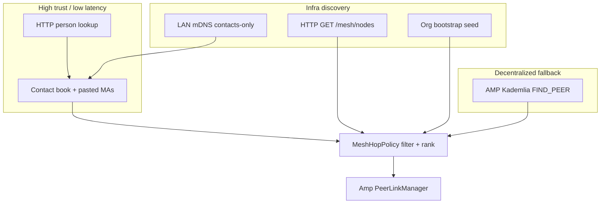

# Mesh discovery roadmap — directory first, then AMP DHT

**Status:** Draft work plan  
**Date:** 2026-09-01  
**Amends:** N015 (delivery order), N027 (mesh directory), n2 in [PHASES.md](PHASES.md)  
**Related:** [MESH_DIRECTORY.md](MESH_DIRECTORY.md), [media-hop-reachability L5](../media-hop-reachability/PHASES.md#l5--directory--dht-later), [platform-integration](../../pp-ledger/docs/platform-integration.md) (pp-ledger DHT retired)

## Context

pp-ledger removed BitTorrent DHT in favor of **curated ADP multiaddrs** for fleet nodes (beacon/relay/miner). That is intentional: org-operated infrastructure does not need open peer discovery.

pp-browser mesh still needs decentralized **PeerId → multiaddr** lookup when contacts and HTTP directory are insufficient. That belongs here (phase **n2**), not in pp-ledger.

**Principle:** finish **directory-backed discovery** before building Kademlia. DHT feeds candidates; **MeshHopPolicy** (N014/N020/N023) still decides who you dial or hop through.



## Tracks and sequencing

| Track | ID | Depends on | Outcome |
|-------|-----|------------|---------|
| **Directory consumers** | **n-dir** | N027 API (mostly landed) | Directory-resolved mesh nodes in hop/dial policy |
| **Discovery ADR + records** | **n2-spec** | n-dir sketch | Frozen wire format + N028 ADR |
| **DHT v1 FIND_PEER** | **n2-core** | n2-spec, reachability (nr) | Node-only opt-in peer routing |
| **Capability ads** | **n2-caps** | n2-core | Signed relay capability in DHT records |
| **Hardening** | **n2-hard** | n2-caps, N020 long | Rate limits, reputation hooks |

Do **not** start n2-core until n-dir is wired and stable in hop policy.

---

## Track n-dir — Wire mesh directory into consumers

**Goal:** Use `GET /v1/mesh/nodes` as L1 infra discovery; keep org seed as L0 cold-start fallback.

### Current state

| Piece | State |
|-------|-------|
| Brief `GET /v1/mesh/nodes` | Shipped (www) |
| `HttpDirectoryClient::ListMeshNodes()` | Shipped |
| pp-node `mesh_node` register/renew | Shipped (`NodeMeshPublish`) |
| Consumer calls `ListMeshNodes` | **Not wired** |
| Hop policy directory affinity | **Missing** |

### Work items

#### n-dir-1 — Mesh node cache + refresh

- Add `MeshDirectoryCache` (or extend existing directory client usage) under `src/base/mesh/discovery/`:
  - Periodic refresh from configured directory provider(s) (same order as `directory.providers[]`).
  - TTL + backoff on failure; stale cache OK short-term.
  - Parse `MeshNodeHit` → `{ peer_id, endpoints[], capabilities, expires_at }`.
- Trigger refresh from `MessagingHub::TickMesh` (or `ReachabilityService` tick) when Node enabled or when circuit/media hop selection runs.
- Unit tests: parse fixtures, TTL expiry, provider failover.

#### n-dir-2 — Hop policy integration

- Extend `MeshHopAffinity` with **`DirectoryNode`** (between `OrgSeed` and `Other`) in `MeshHopPolicy.h`.
- Add `CollectDirectoryHopCandidates(const MeshDirectoryCache&)`:
  - One candidate per mesh node PeerId; prefer first dialable ADP endpoint.
  - Tag affinity `DirectoryNode`; carry `capabilities` for downstream filters.
- Update ordering helpers:
  - `OrderCircuitHops`: contacts → directory → seed (directory before seed when both exist).
  - `RankMediaHops` / `RankMediaHopsEscalating`: directory nodes eligible as **OrgSeed-class** infra (not contacts); still closed-set until N020 mid opens wider scopes.
- Wire in `MessagingHub`, `CallStack`, `CallTopologyController` alongside existing `CollectSeedHopCandidates`.

#### n-dir-3 — Endpoint registration

- On cache refresh, call `MeshMessagingService::RegisterPeerDirectEndpoint` for each mesh node endpoint (same as contact endpoint upsert today).
- Do **not** add mesh nodes to the contact book UI — infra only.

#### n-dir-4 — Bridge score + docs

- ns: when `seed_dial_ok == false`, prefer directory-resolved nodes before giving up (bridge score partial — pairs with [PHASES ns](PHASES.md#ns--relay-scope--domain-bridging-n023)).
- Update [MESH_DIRECTORY.md](MESH_DIRECTORY.md) Phase E acceptance checkboxes; [CURRENT_STATE.md](CURRENT_STATE.md) “Still not done”.
- Smoke: local pp-node registers → pp-browser lists nodes → circuit/media hop can pick directory node.

### Acceptance (n-dir)

- [x] Desktop Node refreshes mesh directory on a sane interval (`MeshDirectoryCache`, 5m TTL via `TickMesh`)
- [x] Directory nodes appear in circuit hop ordering after contacts, before/alongside seed (`BuildCircuitHopList`)
- [x] Media hop rank can select directory `mesh_node` with `media_relay` when contacts fail (`FilterHopsByMediaRelayAds`)
- [x] pp-browser still does **not** auto-publish as `mesh_node`.
- [x] Org seed remains in defaults when directory fetch fails; seeds omitted when `seed_dial_ok == false`

### Estimated touchpoints

- `src/base/people/MeshHopPolicy.{h,cpp}`
- `src/feature/messaging/MessagingHub.cpp`
- `src/feature/messaging/CallStack.cpp`, `CallTopologyController.cpp`
- `src/base/net/ServiceClients*`
- New: `src/base/mesh/discovery/MeshDirectoryCache.{h,cpp}`
- Tests: `mesh_hop_policy_test`, new `mesh_directory_cache_test`

---

## Track n2-spec — ADR + record format (freeze before code)

**Goal:** Spec AMP-native DHT without reviving libp2p Kademlia or pp-ledger BitTorrent DHT.

### n2-spec-1 — ADR N028 (draft in DECISIONS.md)

Decisions to lock:

1. **Transport:** AMP association on UDP; dedicated `/pp-mesh/dht/1.0.0` message types (or reuse a single mesh control channel — pick one in ADR).
2. **Record types v1:** `peer_routing` only (`PeerId`, `multiaddrs[]`, `seq`, `ttl`, `signature`).
3. **Identity:** Sign with mesh ML-DSA-65 key → existing PeerId derivation.
4. **Participation:** `Node && capabilities.dht && reachability != Blocked`; never Client/mobile.
5. **Bootstrap:** `bootstrap_peers` ∪ cached directory mesh nodes (n-dir output).
6. **Policy:** DHT results enter candidate pool as `MeshHopAffinity::Other` or new `DhtDiscovered`; **always** filtered by `MeshHopPolicy` / relay scope — never bypass contact-first rules for media.
7. **Non-goals v1:** content routing, pubsub, ledger fleet discovery.

### n2-spec-2 — Wire doc

- Add `docs/contracts/MESH_DHT.md` (record CBOR/JSON shape, Kademlia bucket constants, FIND_PEER / STORE / PING).
- Cross-link pp-ledger note: fleet uses curated AMP multiaddrs; no shared DHT with pp-ledger.

### Acceptance (n2-spec)

- [x] N028 merged in DECISIONS.md.
- [x] `MESH_DHT.md` wire contract (review with mesh + calls owners when opening n2-core PR).
- [x] Config schema stub: `mesh.capabilities.dht`, `mesh.dht.*` in Config.h + CONFIGURATION.md + `config.json.example`.

---

## Track n2-core — DHT v1 (FIND_PEER only)

**Goal:** Minimal Kademlia peer routing on AMP; default **off**.

### n2-core-1 — Module skeleton

- `src/base/mesh/dht/`:
  - `DhtNode` — bucket table, routing table, bootstrap.
  - `DhtRecordStore` — local signed records for self when publishing.
  - `DhtClient` — FIND_PEER for consumers (MessagingHub / reachability).
- Integrate with `MeshHost` lifecycle: start/stop with Node role; no second UDP stack beyond AMP.

### n2-core-2 — Publish path

- When `capabilities.dht` and Node reachable:
  - Publish **self** record with advertised ADP multiaddrs (same source as reachability / mDNS).
  - Refresh before TTL/2; stop publishing when Node off or blocked.
- Gate publish on reachability status (nr) — do not advertise undialable addrs.

### n2-core-3 — Consume path

- `FindPeer(peer_id)` → multiaddrs[], merge into `PeerAddressBook` / `RegisterPeerDirectEndpoint`.
- Use when:
  - Contact has PeerId but no fresh endpoint (optional prefetch).
  - Bridge / partition escape after directory + seed fail (media-hop L5).
- Timeout + negative cache; do not block UI thread.

### n2-core-4 — UI + config

- Me → Network: **DHT** checkbox (Node only); same phase as working protocol (N008 — no inert checkbox).
- `config.json.example`: `"dht": false`.

### Acceptance (n2-core)

- [x] v1 `AmpDhtService` on `/pp-mesh/dht/1.0.0` — self STORE + bootstrap FIND_PEER fan-out
- [x] `MeshHost` + `MessagingHub` wiring; Me → Network DHT checkbox (Node only, default off)
- [x] Unit tests: `dht_record_codec_test`, `amp_dht_service_test`
- [ ] Two desktop Nodes with DHT enabled discover each other’s ADP addrs without Brief HTTP (lab network — manual smoke)
- [x] Mobile Client never runs DHT (`ResolveMeshRole` gate)
- [x] Default off; enabling DHT does not auto-open public relay scope

### Estimated touchpoints

- New: `src/base/mesh/dht/*`
- `src/base/mesh/host/MeshHost.{h,cpp}`
- `src/base/data/Config.h`, config merge
- `src/feature/settings/` Network UI
- Tests: `dht_routing_test`, two-host mesh test

---

## Track n2-caps — Signed capability records

**Goal:** DHT advertises relay capabilities for infra nodes (pp-node, volunteer desktop Node).

### Work

- Extend record payload: `{ circuit_relay, media_relay, … }` + same signature envelope.
- pp-node optional: publish caps matching `mesh_node` directory registration.
- Consumer: map caps into hop filters (same fields as directory `capabilities`).
- **Still** subject to N020/N023 eligibility — DHT does not grant trust.

### Acceptance (n2-caps)

- [ ] FIND_PEER result includes caps; media hop filter respects them.
- [ ] Directory and DHT records use compatible capability vocabulary.

---

## Track n2-hard — Hardening (can trail v1)

- Rate limit FIND_PEER / STORE per peer.
- Reject records with bad signature, expired TTL, or seq regression.
- Optional soft reputation (N020 long): deprioritize peers that serve stale routes.
- Metrics / debug: Me → Network or `pp-node --status` DHT bucket summary (ops).

---

## Dependencies

```text
nr (reachability) ──┐
n3/n4 (circuit/media) ──┼──► n-dir ──► n2-spec ──► n2-core ──► n2-caps ──► n2-hard
N027 (directory API) ──┘
ns bridge score ────────► n-dir-4 (partial; can parallel n2-spec)
```

**Parallel safe:** n2-spec doc work while n-dir implements; do not merge n2-core until n-dir acceptance passes.

**Out of scope for this roadmap**

- pp-ledger BitTorrent DHT revival or shared DHT with fleet binaries.
- libp2p Kademlia import (fork retired; AMP-only path).
- Open public relay market via DHT (N020 mid).
- Content / blob DHT (relay-blob uses HTTP + peer fetch ladder today).
- Second directory transport (libp2p directory protocol).

---

## Suggested PR sequence

| PR | Track | Summary |
|----|-------|---------|
| 1 | n-dir-1,2 | `MeshDirectoryCache` + `CollectDirectoryHopCandidates` + tests |
| 2 | n-dir-3,4 | MessagingHub wiring, bridge score hook, docs |
| 3 | n2-spec | N028 + `MESH_DHT.md` + config schema |
| 4 | n2-core-1,2 | DHT module + self-publish |
| 5 | n2-core-3,4 | FIND_PEER consumer + UI checkbox |
| 6 | n2-caps | Capability records |
| 7 | n2-hard | Rate limits + reputation hooks (as needed) |

---

## Phase tracker cross-reference

Update [PHASES.md](PHASES.md):

- Insert **n-dir** before **n2**.
- Split **n2** into n2-spec / n2-core / n2-caps / n2-hard checklists (or link here).

Update [CURRENT_STATE.md](CURRENT_STATE.md) when n-dir lands.
