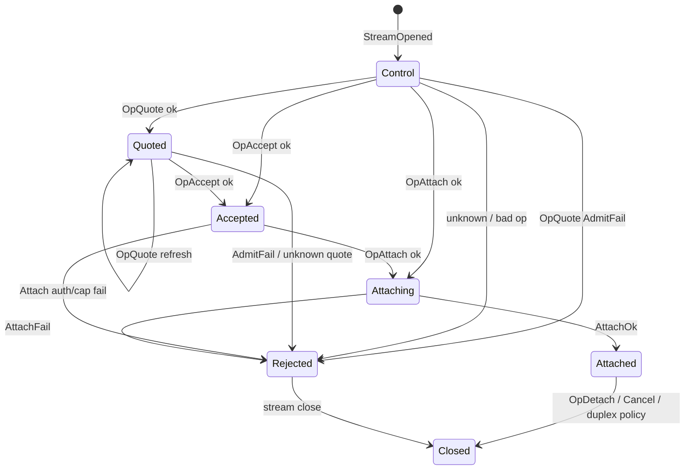

# media_relay attach session machine

**Tier:** project (design)  
**Status:** **s3a+s3b done** — inbound `MediaRelayAttachPhase` + client `MediaRelayClientPhase`; SoftMigrate / PreferLocal dogfood next  

**ADR:** [N026](DECISIONS.md#n026--media_relay-per-stream-attach-state-machine)  
**Calls overview:** [SESSION_MACHINES.md](../p2p-av-calls/SESSION_MACHINES.md) (V033)  
**Admit / QoS:** [HOST_RECEIVE_POLICY.md](../p2p-av-calls/HOST_RECEIVE_POLICY.md) · [V032](../p2p-av-calls/DECISIONS.md#v032--media-qos-enforcement-playout-sfu-e2e)  
**Framing:** [N021](DECISIONS.md#n021--generic-media_relay-framing-qos-channel-types)  
**Code today:** [`MediaRelayService`](../../src/libp2p/integration/host/MediaRelayService.cpp)

Design for the **inbound control handshake** (`quote` → `accept` → `attach`) and how it relates to `HostSession` / participant duplex — without turning fan-out QoS into a giant state machine.

---

## Problem

Inbound media-relay handling is an implicit machine:

```text
while (!session) {
  read JSON op
  if quote → … 
  else if accept → …
  else if attach → create/join HostSession …
}
// then StartParticipantAsync + duplex fan-out
```

Plus maps (`quotes_by_id`, `sessions_by_call`, `sessions_by_token`), `settled` atomics on client attach, and duplex cancel flags. Ordering bugs show up as attach races, half-open participants, and SoftMigrate reattach fragility.

---

## Goals

1. Explicit phases for **one inbound control stream** until Attached or Rejected/Closed.
2. Keep **HostSession** as a session **object** (participants, meters, fan-out) — not one hierarchical SM for the whole call.
3. Encode [HOST_RECEIVE_POLICY](../p2p-av-calls/HOST_RECEIVE_POLICY.md) admit rows as transition guards.
4. Same style as call-media / `CallLifecycle`: flat enum + `Apply(event)` (V033).
5. Behavior-preserving migration after call-media SM (preferred order — SMs share threading lessons).

## Non-goals

| Non-goal | Why |
|----------|-----|
| SM for every fan-out frame | Hot path; keep meters + drop policy |
| Merging with CallLifecycle / call-media SM | Different lifetime and cardinality |
| Changing N021 framing or quote wire fields | Lifecycle refactor ≠ protocol bump |
| Hop eligibility / pricing in the SM | N020 / N023 / RELAY_SCOPE stay policy |

---

## Cardinality

| Object | Count | Machine? |
|--------|-------|----------|
| Inbound control stream | Many | **Yes — this doc** |
| `HostSession` per `call_id` | ≤ 4 concurrent (V032) | Object + maps; phase optional (`Open`/`Closing`) later |
| Participant duplex | ≤ 8 per session | Start/cancel/cleanup helpers; small sub-lifecycle OK |
| Client outbound attach (phone→hop) | Per local call | Separate small SM or shared event set (s3 decides) |

---

## Per-inbound-stream phases

| Phase | Meaning |
|-------|---------|
| `Control` | Stream accepted; waiting for first/next control op |
| `Quoted` | Issued `quote_id`; waiting for `accept` (or new quote) |
| `Accepted` | Quote consumed; waiting for `attach` |
| `Attaching` | Creating/joining HostSession + binding peer |
| `Attached` | Participant duplex started (or local-hop equivalent); control stream may close or stay for detach |
| `Rejected` | Sent error; closing |
| `Closed` | Terminal |

Wire today allows multi-message on one stream before session exists (`while (!session)`). The SM models that as **events on one instance**, not a new SM per op.

### Events

| Event | Source |
|-------|--------|
| `StreamOpened` | Protocol handler |
| `OpQuote` / `OpAccept` / `OpAttach` | Inbound JSON |
| `OpSubscribe` / `OpUnsub` / `OpDetach` | Post-attach control (may be same or later stream — match code) |
| `AdmitFail` | Contact/scope / max sessions / max participants |
| `AttachOk` / `AttachFail` | HostSession bind + duplex start |
| `ParticipantDuplexLost` | Read EOF / cancel |
| `Cancel` / `ServiceStop` | Hub teardown |

### State diagram



### Guards (policy → transition)

| Policy (HOST_RECEIVE_POLICY / V032) | Guard |
|-------------------------------------|-------|
| First dialer for `call_id`: contact/scope | `OpQuote` / first open → AdmitFail if stranger and no session |
| Max 4 HostSessions | Refuse new session creation |
| `accept` known quote | Unknown `quote_id` → Rejected |
| `attach` auth stub `auth == call_id` | Fail → Rejected |
| Max 8 participants | Fail → Rejected |
| Call-scoped strangers after session exists | Admit further dialers for same `call_id` |

Do not duplicate full budget tables here — link HOST_RECEIVE_POLICY for A↑/A↓ / ceiling (enforced on fan-out, not as attach phases).

---

## HostSession vs stream SM

```text
InboundStreamSM (per stream)
  └─ on AttachOk → HostSession (by call_id / token)
                      ├─ participants[]
                      ├─ meters / token buckets
                      └─ DuplexFrameSession per peer (io thread)
```

| Concern | Home |
|---------|------|
| quote/accept/attach ordering | InboundStreamSM |
| Fan-out, A↑/A↓, corrupt-frame skip | HostSession methods (unchanged architecture) |
| Guest reattach after duplex loss | Topology + client attach path; stream SM may restart at Control on new stream |
| PreferLocal local hop | HostSession without remote dial — not forced through quote SM |

---

## Client attach path (phone → hop)

`AcceptAndAttach` uses **`MediaRelayClientPhase`**: `Idle → Dialing → Accepting → Attaching → Attached` (Detach → Idle). Transitions go through **`ApplyClientLocked(event)`**; inbound control uses per-stream **`AttachSm::Apply`**. Waiter is owned by the service so **Detach aborts** in-flight attach (Leave / SoftMigrate). Late workers must not install `client_stream` after timeout/Detach settled.

`RequestQuote` remains a short one-shot RPC (separate stream).

---

## Threading

Same as [SESSION_MACHINES.md](../p2p-av-calls/SESSION_MACHINES.md) / V033:

- Handler on io → Post **Normal** for control JSON.
- `Apply` on one service strand.
- Participant duplex on host **io** (`write_preferred`); never BlockingWrite for fan-out on the pool.
- Failed peer write must not remove uplink (existing policy) — not an attach-phase concern.

---

## Code layout (modularization)

| File | Owns |
|------|------|
| `MediaRelayService.cpp` | Facade + `Impl` orchestration (fanout, duplex, inbound control loop, AcceptAndAttach) |
| `MediaRelayAttachSm.*` | Per-stream inbound attach phase SM (`Apply` / `SetPhase`) |
| `MediaRelayLogic.*` | Pure client-phase table, auth stub, lossy drop, call-scoped admit, session/participant caps |
| `MediaRelayFrames.*` | N021 encode/decode + wire constants |

HostSession remains a map object inside `Impl` (not a hierarchical SM). Further TU splits for fanout/duplex need an internal `Impl` header — follow-up.

## Golden scenarios (s3 gate)

1. quote → accept → attach → Attached; fan-out audio both ways. — **loopback:** `QuoteAcceptAttachFanout`
2. attach without quote when policy allows join-on-existing session (call-scoped stranger). — **unit:** `MediaRelayAttachSmTest.AttachFromControlWithoutQuote` + call-scoped admit loopbacks
3. Over max HostSessions / participants → Rejected with error JSON. — **unit:** `MediaRelayLogicTest.CallScopedAdmitAndCaps` (`MediaRelayCanOpenHostSession` / `CanAddParticipant`)
4. SoftMigrate guest reattach after duplex loss → new stream Control→Attached; capture stays up. *(loopback: `GuestDetachThenReattachFanout`, `PreferLocalGuestDetachThenReattachFanout`)*
5. Service Stop cancels inflight control and active participants without hang.
6. Corrupt control/media frame → skip; do not tear down Attached session.

---

## Migration notes

- Prefer landing **call-media SM first** (V033 s2) so threading/waiter patterns are proven.
- Strangler: replace `while (!session)` with event dispatch into phase enum; keep HostSession maps.
- No N021 wire change required for success.
- Update [CALLS.md](../../docs/architecture/CALLS.md) critical races when attach races gain phase homes.
