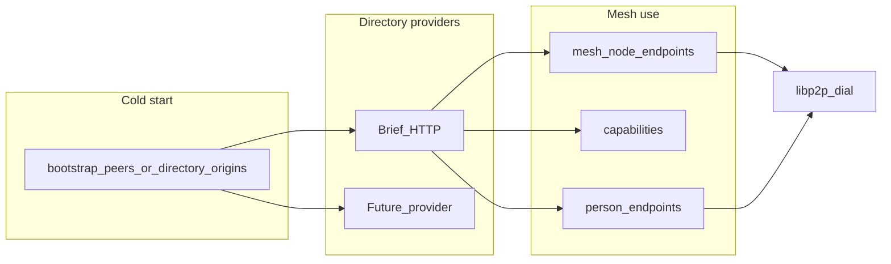

# Mesh directory — design + delivery plan

**Status:** Accepted for implementation  
**Date:** 2026-08-30  
**Repos:** www (`web2/www`), pp-browser (`web3/pp-browser`), app-support DirectoryClient touch-up  
**Related:** N002/N006/N011, M011/M017, SERVICE_ENDPOINTS.md  
**North star:** [NAME_DIRECTORY_NORTH_STAR.md](NAME_DIRECTORY_NORTH_STAR.md) / [N029](DECISIONS.md#n029--name-directory-north-star-chain-later-http-now) — HTTP directory is the **interim phone book**; chain names are the final authority. Keep this delivery’s schemas aligned with that port.

## Goals

1. Customers resolve org/`pp-node` hosts by **Account ID / org handle**, not hardcoded Peer ID.
2. Stable Peer ID / Account ID across container redeploys via **durable data volume + PIN**, or optional **`PP_NODE_IDENTITY_SEED`** (HKDF → device/account keys; fail-closed vs existing `identity.enc`).
3. Directory is **pluggable** (Brief HTTP default; other providers later).
4. **`mesh_node` publish** is for persistent infra (`pp-node`); **pp-browser does not** auto-list as mesh service.
5. **Bootstrap** evolves toward **finding directory providers**; mesh services come from directory (keep L0 seed fallback).
6. **Absorb ops patterns:** app-support boot register/renew (like pp-node); pp-node optional master identity seed (like app-support).

## Architecture

| Kind | Entrypoint | People search | Mesh list | Auto publish |
|------|------------|---------------|-----------|--------------|
| `person` | pp-browser | Yes | No | Device `endpoints[]` via normal register/renew |
| `mesh_node` | pp-node | No (default) | Yes `GET /mesh/nodes` | Advertise multiaddrs + caps on start/renew |

## API contract (Brief = first provider)

### Register / renew

- Optional `entity_kind`: `"person"` (default) | `"mesh_node"`.
- Optional `capabilities` when `mesh_node`: `{ "circuit_relay": bool, "media_relay": bool }` (extensible).
- Finish still upserts `endpoints[]` by `peer_id` (M017).
- Missing `entity_kind` on existing docs ⇒ treat as `person`.

### Lookup

- `GET /v1/search?q=` — exclude `mesh_node` by default (`entity_kind` ∈ `{person, null}`).
- `GET /v1/users/by-account/:id` and `GET /v1/users/:relay_user_id` — return doc including `entity_kind` + `capabilities` (exact lookup OK).
- **New** `GET /v1/mesh/nodes` — non-expired `entity_kind=mesh_node`; return account_id, nickname, endpoints, capabilities, expires_at.

### Client config

- `directory.providers[]` (ordered) or keep single `directory.base_url` as provider[0] with `transport` (transitional).
- `libp2p.advertise_multiaddrs[]` — public multiaddrs for publish (never bind `0.0.0.0`).
- `PP_NODE_ADVERTISE_MULTIADDRS`, `PP_NODE_MESH_PUBLISH=1` (default on for pp-node when advertise set).
- pp-browser: `mesh_publish` default **false**; person register unchanged.

### Bootstrap (transitional)

- Keep N002 hardcoded seed as L0 fallback.
- Docs + hop policy: prefer directory-resolved mesh nodes when available; bootstrap remains cold-start / emergency dial.
- Later: bootstrap entries may be directory origins only.

## Delivery phases

### Phase A — Docs / ADR freeze (pp-browser)

- New ADR **N027** in `projects/p2p-mesh/DECISIONS.md` (entity_kind, pluggable directory, publish policy, bootstrap reframing).
- Amend M011/M017 notes in multi-device-account (mesh_node exclusion).
- Update `docs/contracts/SERVICE_ENDPOINTS.md`, `docs/ops/CONFIGURATION.md`, `CURRENT_STATE.md` / `PHASES.md`.

### Phase B — Brief www

- Mongo `RelayUser`: `entity_kind`, `capabilities`.
- Schemas + `RelayRegistrationAgent` persist kind/caps.
- Search filter excludes mesh_node.
- `GET /mesh/nodes` in `r_relay.ts`.
- Serializers + tests (`RelayDirectory`, registration, lookup, new mesh route).

### Phase C — pp-browser / pp-node

- Extend `IRegistrationClient` / HTTP client with `entity_kind` + `capabilities`.
- Extend `IDirectoryClient` with `ListMeshNodes` (HTTP).
- Route `MessagingHub` through `CreateServiceClients` (live pluggability).
- Config: `advertise_multiaddrs`; NodeEnvOverlay env.
- **pp-node:** thin register/renew loop (no MessagingHub) using advertise + local caps; `entity_kind=mesh_node`.
- **pp-browser:** do not mesh-publish; keep person register/auto-renew; Identify advertise policy documented (org seed via pp-node).
- Fix auto-renew to pass advertise/listen multiaddrs when renewing person endpoints.
- Unit tests for overlay, registration util, directory list parsing.

### Phase D — Consumers

- `app-support` `DirectoryClient`: tolerate `entity_kind` on lookups; no mesh list required for support ingest.
- messenger/web: no change unless they call people search (none found).

### Phase E — Integration smoke

- Local: register pp-node against www (or mock), `GET /mesh/nodes` shows caps + endpoints; people search hides it.
- Volume restart keeps Peer ID; renew updates multiaddrs.

## Non-goals (this delivery)

- Second directory transport (libp2p directory protocol). *(Deferred to N029 Phase B — Amp directory mirror behind the same name-directory port.)*
- On-chain name registry. *(N029 Phase D — not first release.)*
- Open public relay market / reputation.
- Removing N002 seed from client defaults.
- Home Node GUI opt-in mesh publish UI (config flag only if needed later).

## Acceptance

- [x] www: `GET /v1/mesh/nodes` returns JSON `{nodes:[…]}` (prod + QA probed 2026-09-02; currently empty listings). Search endpoint answers; exclusion of `mesh_node` still needs a live published node to prove.
- [ ] pp-node: with PIN + data volume + advertise env, registers/renews as mesh_node against www (ops smoke; not run against prod from lab).
- [x] pp-browser: Node on does **not** create mesh_node listings (default `mesh_publish=false`; only pp-node / explicit advertise path).
- [x] Lab: Amp directory twin two-node query + HTTP failover (`AmpDirectory*` tests); MeshHost regression via `scripts/pp_node_dht_smoke.sh`.
- [ ] Customers can resolve org node by Account ID → endpoints without baking Peer ID (needs a published person/mesh listing in the target env).
- [x] Docs describe bootstrap → directory → mesh layering (MESH_DIRECTORY + N029 / PRE_CHAIN).
