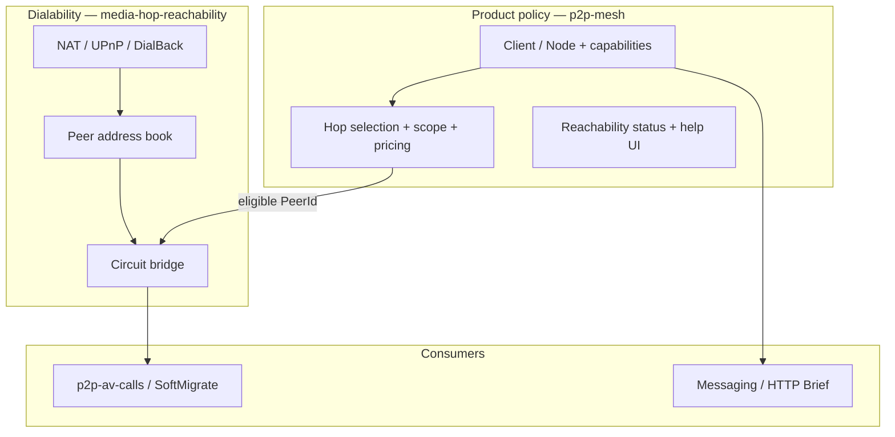

# P2P mesh

**Status:** Core mesh shipped (role, reachability, circuit, contact-first, media relay). Next: libp2p deepen, call consumer (a4), DHT, peer message_relay, paid UI.  
**Formerly:** `projects/libp2p-node-roles/` (renamed; ADRs remain N001+)  
**Owner:** Hongwei + agents  

**Stable refs:** [NETWORKING.md](../../docs/architecture/NETWORKING.md), [P2P_MESSAGING.md](../../docs/architecture/P2P_MESSAGING.md), [CONFIGURATION.md](../../docs/ops/CONFIGURATION.md), [PLATFORMS.md](../../docs/architecture/PLATFORMS.md), [LIBP2P_UPSTREAM.md](../../docs/architecture/LIBP2P_UPSTREAM.md)  
**Related:** [media-hop-reachability](../media-hop-reachability/) (dial-by-PeerId in Amp mesh), [p2p-av-calls](../p2p-av-calls/) (V026), [push-notifications](../push-notifications/), messaging under `src/feature/conversations/`

## One-line goal

GUI **Client/Node** mesh with capabilities and optional paid relays; **`pp-node`** for org seeds; **reachability** (IPv6/UPnP + guides); **contact-first** relay preference with **scope escalation**; mobile **call-scoped listen on Wi‑Fi** (N025). HTTP settle preferred; chain settle backup. Billable relays may settle on chain.

## How the pieces fit

Read [DESIGN.md](DESIGN.md) for the full spec. At a glance:



| Question | Where to read |
|----------|----------------|
| How does the mesh work? | [DESIGN.md](DESIGN.md) |
| Name directory / chain-later phone book | [NAME_DIRECTORY_NORTH_STAR.md](NAME_DIRECTORY_NORTH_STAR.md) (N029) |
| Pre-chain engineering plan (A–C) | [PRE_CHAIN_PLAN.md](PRE_CHAIN_PLAN.md) |
| Scope tags and bridge score | [RELAY_SCOPE.md](RELAY_SCOPE.md) |
| Can we dial this hop PeerId? | [media-hop-reachability](../media-hop-reachability/DESIGN.md) |
| How should `media_relay` attach be stated as a SM? | [MEDIA_RELAY_ATTACH.md](MEDIA_RELAY_ATTACH.md) (N026) |
| What's in the repo today? | [CURRENT_STATE.md](CURRENT_STATE.md) |
| What to build next, in what order? | [PHASES.md](PHASES.md) |
| Why we chose X | [DECISIONS.md](DECISIONS.md) |
| L4 protocol kinds (no new id per feature) | [L4_PROTOCOL_KINDS.md](../../docs/contracts/L4_PROTOCOL_KINDS.md) (A028 / N030) |

## Seed (locked)

```
/ip4/3.208.41.58/tcp/443/p2p/12D3KooWCmqCKgBL47m25WzUgiAPayf3GqKiRosmPvAqp2MQUFYR
```

Operated via **`pp-node`**. Desktop Node preferred listen: `/ip4/0.0.0.0/tcp/18517` (busy → fallback range + persist).

## Documents

| File | Purpose |
|------|---------|
| [DESIGN.md](DESIGN.md) | **Authoritative spec** — roles, capabilities, services, reachability, relay policy, config, packaging |
| [NAME_DIRECTORY_NORTH_STAR.md](NAME_DIRECTORY_NORTH_STAR.md) | Phone book north star: HTTP now, chain later; pp-node as edge router (N029) |
| [PRE_CHAIN_PLAN.md](PRE_CHAIN_PLAN.md) | Engineering plan for N029 Phases A–C (before on-chain names) |
| [MESH_DIRECTORY.md](MESH_DIRECTORY.md) | N027 HTTP `mesh_node` directory delivery |
| [DISCOVERY_ROADMAP.md](DISCOVERY_ROADMAP.md) | Directory consumers → DHT tracks |
| [RELAY_SCOPE.md](RELAY_SCOPE.md) | Connectivity domains, scope escalation, bridge score |
| [MEDIA_RELAY_ATTACH.md](MEDIA_RELAY_ATTACH.md) | Per-stream attach SM design (N026) — docs before code |
| [MULTI_HOP_CIRCUIT.md](../media-hop-reachability/MULTI_HOP_CIRCUIT.md) | Multi-hop circuit plan — today single-hop |
| [HOLE_PUNCH.md](../media-hop-reachability/HOLE_PUNCH.md) | Amp Coordinated Punch plan — not implemented |
| [CURRENT_STATE.md](CURRENT_STATE.md) | Codebase today |
| [PHASES.md](PHASES.md) | Checklists and delivery order |
| [DECISIONS.md](DECISIONS.md) | ADRs (N001+) |
