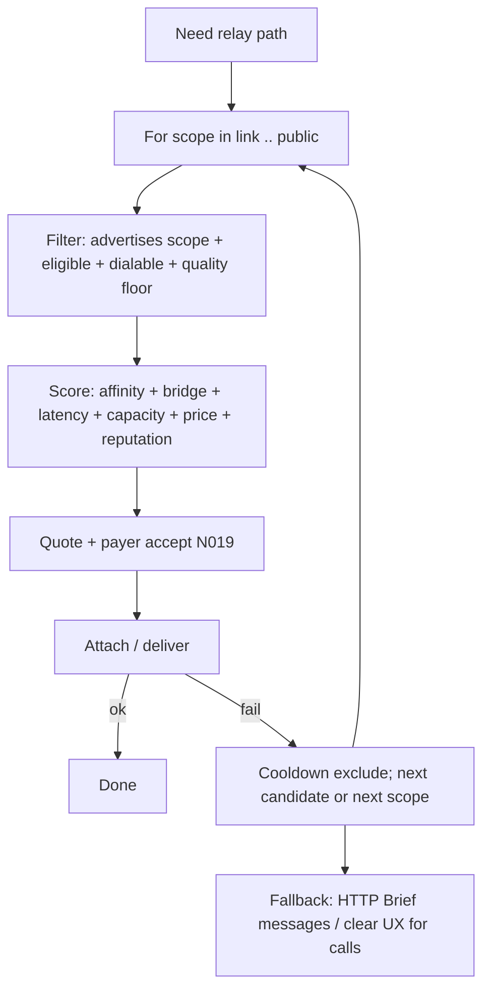

# Relay scope & domain bridging

**Project:** [p2p-mesh](README.md)  
**ADRs:** [N023](DECISIONS.md#n023--relay-scope-and-domain-bridging-not-geography-tiers) (scope model), [N014/N020](DECISIONS.md) (pick + incentives)  
**Stack dialability:** [media-hop-reachability](../media-hop-reachability/) (in-libp2p; **not** this doc)  
**Networking:** [NETWORKING.md](../../docs/architecture/NETWORKING.md)

## One-line goal

Clients **maximize delivery** by escalating relay choice across **nested connectivity domains** (link → site → social → org → public), with **minimal user input** — scope is inferred from reachability signals and the contact graph, not chosen as “local vs global tier.”

## Problem statement

Peers are not on one flat network. They sit in **nested partitions**:

| Partition (human name) | Technical cause | Symptom |
|------------------------|-----------------|---------|
| **Link / site** | LAN, Bluetooth island, office gateway | Low RTT subset; many peers `OutboundOnly` |
| **Egress / country** | Firewall, ISP filter, captive portal | Seed or global peers unreachable (`Blocked`, `seed_dial_ok == false`) |
| **Global** | Public internet | Org seed, curated directory, paid overflow |

A relay’s value is **how many useful partition boundaries it crosses**, not map geography.

**Sub-problems:**

1. **Partitioning** — Who can dial whom directly?
2. **Bridging** — Who connects two partitions (gateway, seed, in-domain super-peer)?
3. **Selection** — Which hop/store/bridge for this message or call, without sybil/min-price failure?

Relay types differ by delivery semantics ([DESIGN.md](DESIGN.md)):

| Service | Semantics | Scope relevance |
|---------|-----------|-----------------|
| **Circuit relay** | Live stream bridge | Prefer narrow scope (same site) before org seed |
| **Media relay** | Live blind fan-out | Same; N019 quote + N020 scorer |
| **Message relay** (peer, later) | Store-and-forward | Island/gateway queues; HTTP Brief remains durability anchor |
| **HTTP Brief relay** | Org inbox | Global/org backstop for messages |

## Solution model

### Relay scope (narrow → wide)

Scopes are **machine tags** on relay advertisements — inferred automatically; users set policy only at capability + pricing level (N009/N010).

| Scope | Meaning | Typical inference |
|-------|---------|-------------------|
| **`link`** | Same L2/L3 neighborhood | mDNS, same /24, Bluetooth pairing |
| **`site`** | Same household/org LAN behind one gateway | RFC1918 peers + shared household tag |
| **`social`** | Contacts / trusted graph | `MeshHopAffinity::Contact` |
| **`org`** | Brief seed + curated directory | Bootstrap peers, signed directory entries |
| **`public`** | Strangers (paid / regulated) | Reachable public IP + rate card + opt-in |

**Not geo tiers:** “Country” is modeled as an **egress partition** — peers who share bootstrap failure but can still reach each other. Selection uses **bridge score**, not country IP databases.

### Topology roles (emergent, not user job titles)

| Role | Behavior | Who becomes one |
|------|----------|-----------------|
| **Participant relay** | Helps known peers | Default desktop Node (volunteer) |
| **Gateway relay** | Bridges site → wider internet | `Reachable` node with `OutboundOnly` LAN neighbors |
| **Infrastructure relay** | Stable org capacity | `pp-node` on `:443` |
| **Island store** | Queue until gateway syncs | Bluetooth/LAN store-and-forward (future) |

### Consumer algorithm: escalate scope

Generalizes N020 **filter → score → quote → attach → re-pick** for all relay kinds:



**Rules:**

- Prefer **narrowest scope that works** — same-LAN contact before org seed.
- On partition (`Blocked` / seed unreachable), boost **bridge score** within `social` before widening to `org`.
- Never pure `min(price)` (N020).
- Messages: HTTP Brief inbox remains final durability fallback (N017).

### Provider algorithm: auto-cap scope

Minimal UX: **Help the network** + capability checkboxes + nested pricing (N009/N010). Scope caps derive from signals:

| Signal | Provider cap (default volunteer) |
|--------|----------------------------------|
| `node_enabled == false` | Advertise nothing |
| Always (Node) | `social` |
| Same-LAN peers detected | Also `link` / `site` |
| `Reachability == Reachable` | May offer `org` (ops profile); `public` only if paid + opt-in |
| `Reachability == OutboundOnly` | Refuse strangers; serve `social` / `link` aggressively |
| `Reachability == Blocked` | Do not promise wide scope; island queue only if implemented |

Extend admission policies (`CircuitRelayAdmissionPolicy`, `MediaRelayAdmissionPolicy`) from boolean **prefer_contacts_only** toward a **scope mask** over time.

### Bridge score (partition escape)

When global path fails, rank candidates by:

```text
bridge_score = dialable_from_me
             × (dialable_to_target ∨ seed_dial_ok_from_candidate)
             × recent_bridge_success
             × affinity_bonus
```

No user selects “country tier.” The client discovers: *seed unreachable; contact Alice still bridges.*

### Ecosystem health by scope

| Scope | Supply | Abuse risk | Regulation |
|-------|--------|------------|------------|
| `link` / `site` | Mutual aid, low cost | Low | Volunteer default |
| `social` | Reciprocity | Medium | Contact admission + quality floor |
| `org` | Ops / mission | Medium | Seed SLAs; optional paid overflow |
| `public` | Revenue potential | High | Paid + bonds + anti-dumping + concentration penalty (N020 mid/long) |

**Healthy defaults:** volunteer Node serves `link + social`, not `public`. Wider scope unlocks with reachable hardware + paid rate card (or org `pp-node`).

## Ownership (do not blur)

| Layer | Owns |
|-------|------|
| **[media-hop-reachability](../media-hop-reachability/)** | In-stack **dialability**: peerstore, Identify, UPnP/dial-back, circuit evolution, `IsPeerDialable` |
| **This doc / p2p-mesh policy** | **Who** may relay, **which scope**, bridge score, escalate order, admission, quotes, settle |
| **p2p-av-calls** | SoftMigrate **consumes** ranked hops + dialability |
| **HTTP Brief** | Message inbox durability (global/org backstop) |

Do **not** expand media-hop-reachability to cover scope routing or incentives — that splits ownership locked in [H001](../media-hop-reachability/DECISIONS.md#h001--separate-project-implementation-in-libp2p).

## Code anchors (today → target)

| Today | Target |
|-------|--------|
| `MeshHopAffinity` (Contact / OrgSeed / Other) | Add scope tags; map Contact → `social`, OrgSeed → `org` |
| `RankMediaHops` / `OrderCircuitHops` | Scope-aware escalate + bridge score |
| `ReachabilitySignals` / `ClassifyReachability` | Feed provider scope caps |
| `CircuitRelayAdmissionPolicy.prefer_contacts_only` | Generalize to scope mask |
| `MeshHopCandidate.residual_capacity` | Unchanged; still input to scorer |

Implementation lives in `src/base/people/MeshHopPolicy.*` and relay admission in `src/libp2p/integration/host/*RelayService.*` — not in the libp2p fork unless dialability requires it.

## Optional advanced setting (not required for v1)

Single Me → Network control maps to scope mask:

| Label | Mask |
|-------|------|
| Contacts only (default auto) | `link \| site \| social` |
| My network | + `site` emphasis |
| Wider network | + `org`; `public` only with paid |

Default is **auto** from reachability + capabilities.

## Phasing

See [PHASES.md § ns](PHASES.md#ns--relay-scope-and-domain-bridging-n023). Depends on **nr/nu** signals and **nf/n4-media** scorer; does not block [media-hop-reachability L1–L3](../media-hop-reachability/PHASES.md).

## Related

- [DESIGN.md § Relay path preference](DESIGN.md#relay-path-preference-n014--n020)
- [DECISIONS.md N023](DECISIONS.md#n023--relay-scope-and-domain-bridging-not-geography-tiers)
- [P2P_MESSAGING.md](../../docs/architecture/P2P_MESSAGING.md) — HTTP Brief fallback
