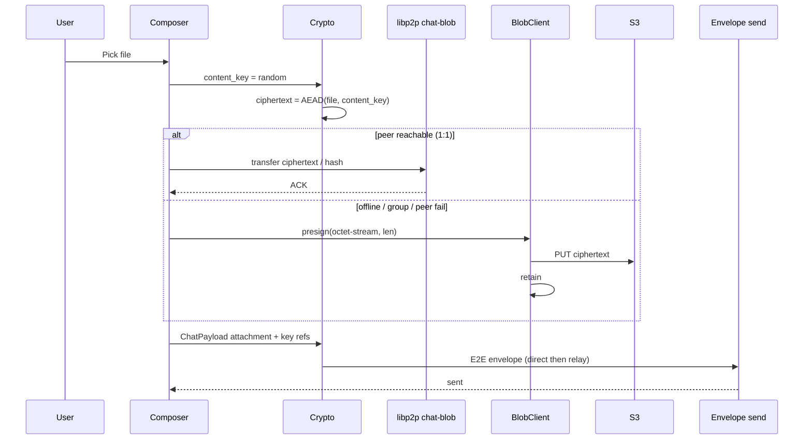

# Relay blob upload — design

**Status:** a1–a6 + a5 landed (icons, attachments, peer-first, DEK-wrap, video poster).  
**Server spec:** [www relay blob design](../../../web2/www/Plans/2026-08-24-relay-blob-upload-design.md)  
**HTTP contract:** [SERVICE_ENDPOINTS.md](../../docs/contracts/SERVICE_ENDPOINTS.md) (relay blobs section).

---

## 1. Problem

Brief www exposes relay blob upload (presigned S3 PUT, retain, profile icon attach). pp-browser has **no** blob client, **no** profile icon UX, and **no** chat attachment type. Users need public profile photos and E2E file sharing without treating relay as durable storage.

---

## 2. Goals

| Goal | Track |
|------|-------|
| Upload and display **profile icons** (plaintext) | Icons i1–i3 |
| Send/receive **any file type** in chat (E2E) | Attachments a1–a6 |
| Image + video preview in chat v1 | a3 |
| Peer-first blob heal (like history sync) | a6 / R019 |
| Size-tiered download policy | a6 / R021 |
| Relay blind to file semantics | R006 |
| Local cache is authoritative after fetch | R002, R008 |

## Non-goals (v1)

- In-app PDF/HTML preview registry (later)
- Auto relay delete after local verify (R009 — confirm pop only)
- Per-recipient download tracking on relay
- `account_id` on blob authz (www deferred; M006 binding sufficient)
- Inline RML video element

---

## 3. Server API (client consumption)

Base: `{registration.base_url}` → `https://www.brief.global/api/relay/v1`

| Endpoint | Purpose |
|----------|---------|
| `POST /blobs/presign` | Mint `blob_id`, `upload_url`, `public_url`, tier |
| `POST /blobs/retain` | Mark blob retained after PUT |
| `POST /blobs/delete` | Free quota / pop older |
| `POST /blobs/list` | Usage + blob inventory (quota UX) |
| `POST /profile/icon` | Attach hosted blob or clear; external https optional |

Auth: Ed25519/ML-DSA signature per domain (see www plan § Wire signing). Owner = `relay_user_id` from signature.

**Client uses `public_url` as returned** — no locale-specific CDN pick.

### Quotas (defaults)

| Limit | Default |
|-------|---------|
| Small tier | ≤ 4 MiB, max 100 objects |
| Large tier | ≤ 256 MiB, 2 GiB included |
| Icon | ≤ 512 KiB |
| Pending TTL | 48h |
| Retained GC | 90d (except current profile icon) |

On **429 / quota**, show confirm dialog → delete oldest **remote** blobs via `blobs/delete` — **local files untouched** (R009).

---

## 4. Client architecture

### 4.1 Shared blob stack (i1)

| Layer | Location (proposed) | Notes |
|-------|---------------------|-------|
| Sign bytes | `src/base/net/RelayBlobSignPayload.*` (or extend `RegistrationSignPayload`) | Domains: presign, retain, delete, list, profile-icon |
| HTTP PUT | `HttpClient::Put` | Binary body + Content-Type + Content-Length must match presign |
| Blob client | `src/base/net/IBlobClient` + `HttpBlobClient` | JSON POST + PUT orchestration |
| Factory | `ServiceClientFactory` | Same base_url as registration |

Sign domain field order matches www `SignatureVerifier.ts` (length-prefixed UTF-8, BE integers).

### 4.2 Profile icons (i2–i3)

**Upload flow (Me → Profile):**

1. Native pick → client resize/compress (≤ icon cap).
2. `presign` with `purpose: icon`, image `content_type` (R003).
3. PUT bytes to `upload_url`.
4. `POST /profile/icon` with `blob_id`, `kind` (e.g. `image/jpeg`).
5. Download `public_url` → profile-local icon cache.

**Local icon cache (per contact / self):**

```
{profile}/cache/icons/{relay_user_id or account_id}/
  meta.json   # { url, blob_id, kind, fetched_at }
  icon.webp   # normalized display file
```

**Refresh:** On directory/contacts reload, if `icon.url` or `icon.blob_id` ≠ cached meta → re-download (R011).

**Display surfaces:**

- Me → Profile (self)
- Contacts list + detail
- Contact card bubbles (`avatar_url` snapshot + live directory icon)
- Call chrome peer avatar placeholder

RmlUi: `` from local path only (R012).

### 4.3 Chat attachments (a1–a6)

**Two layers** (do not conflate):

| Layer | What | Transport |
|-------|------|-----------|
| **Envelope** | Small `ChatPayload` (url, mime, hash, content key…) | Same as text: **direct first, relay fallback** (already) |
| **File bytes** | Encrypted blob | **Peer-direct first, CDN second** ([R019](DECISIONS.md#r019--peer-first-blob-transfer-cdn-secondary)) |

**Send flow (target — a6 completes peer path; a2 = CDN-only today):**



Do not emit the envelope until the chosen blob path succeeds ([R015](DECISIONS.md#r015--blob-ready-before-send-for-attachments)). Sender keeps a local plaintext cache copy on success.

**Receive / heal flow:**

1. Decrypt envelope → `ChatPayload` attachment fields.
2. If hash is **suppressed** ([R020](DECISIONS.md#r020--deletion-suppresses-re-fetch)) → skip auto fetch.
3. Else apply download policy ([R021](DECISIONS.md#r021--attachment-download-policy-smart-default) / [R008](DECISIONS.md#r008--size-tiered-fetch-on-receive-amended)):
   - Smart: auto if `byte_length ≤ 4 MiB`, else placeholder until tap
   - Always auto / On demand / one-shot backlog as prefs
4. Fetch order: local hit → **peer-direct by `content_hash`** → CDN GET `url` → failed UI.
5. Decrypt / verify hash → write `{thread_id}/blobs/{plaintext_hash}` ([R016](DECISIONS.md#r016--content-addressed-local-blob-paths-d075)).
6. Render by mime (image inline, video thumbnail + OS open, else filename row).

**Group:** One CDN object per attachment when CDN path is used; N pairwise envelopes only for the small payload ([R005](DECISIONS.md#r005--group-attachments-one-blob-ciphertext-pairwise-key-envelopes)). Opportunistic peer-direct to online members is optional, not a substitute for the shared CDN object when members are offline.

**Private multi-device:** Same as text — sibling device without PSK sees envelope, cannot decrypt ([R010](DECISIONS.md#r010--multi-device-same-rules-as-private-text)).

**Deletion:** Clear history / delete files remove local blobs and suppress re-fetch ([R020](DECISIONS.md#r020--deletion-suppresses-re-fetch)).
### 4.4 Wire: `ChatContentType::Attachment`

Add to `ChatPayloadTypes.h` / codec / validator / WIRE_SCHEMAS (promote on ship).

Proposed logical tail (v1 — exact layout in codec PR):

| Field | Type | Notes |
|-------|------|-------|
| `url` | LenUtf8 | CDN `public_url` |
| `mime` | LenUtf8 | e.g. `image/png`, `application/pdf` |
| `filename` | LenUtf8 | Original name |
| `byte_length` | u64 | Plaintext size |
| `content_hash` | LenBytes(32) | BLAKE2b-256 plaintext |
| `key_b64` or raw key | LenBytes | Content key (or KEM-wrapped — match tier) |
| `nonce` | LenBytes | AEAD nonce for file blob |

Exact key packaging should mirror how small secrets are already carried in payloads for each tier; document in codec + MESSAGE_ENCRYPTION cross-link on ship.

Bump `payload_version` only if breaking; prefer additive tail with new `content_type` enum value.

### 4.5 Local disk layout

Per [DATA_LAYOUT.md](../../docs/contracts/DATA_LAYOUT.md) + D075:

```
{thread_id}/blobs/{hash}[.ext]   # decrypted plaintext (R016)
# plus profile-level suppression tombstones for deleted hashes (R020) — exact store TBD in a6
```

**Follow-up (a5):** encrypt cached attachment bytes under profile DEK where transcript at-rest policy requires (align with D102).
### 4.6 Directory integration

Extend `DirectoryHit` / `HttpDirectoryClient` parsing:

```json
"icon": { "url": "...", "kind": "image/jpeg", "blob_id": "..." }
```

From `GET /v1/users/:relay_user_id` and search hits.

---

## 5. UI spec (v1)

### Profile (i2)

- Avatar circle on Me → Profile; tap → pick image / clear
- Progress during upload; error toast on failure

### Composer (a2)

- Attach button → native file picker (any type)
- Draft attachment chip with upload progress
- Send disabled until upload completes (R015)

### Bubbles (a3+)

| Mime | Behavior |
|------|----------|
| `image/*` | Inline image from local cache (after auto/tap download) |
| `video/*` | Poster/thumbnail + tap → OS player |
| Other | Icon + filename + size; tap → confirm → OS open |

| Download state | Behavior |
|----------------|----------|
| Auto pending (≤ 4 MiB Smart) | “Downloading…” |
| Large / On-demand | Placeholder + **Download** |
| Failed | Retry; if CDN gone try peer heal (a6) |
| Ready | Mime-specific render above |

### Download prefs (a6 / R021)

- Me → Chat/Media: **Smart** (default) / **Always auto** / **On demand**
- Session: **Download pending media…** (one-shot backlog)

### Quota (a4)

- On presign 429: dialog “Relay upload space full” → list oldest remote blobs (from `blobs/list`) → confirm delete selected/oldest N
- Copy: frees **cloud** space only; chat history on device unchanged

---

## 6. Compatibility

- **R018:** Soft-skip unknown `content_type` before or with attachment ship.
- Old clients: placeholder bubble “Update to view attachment”.
- Promote blob HTTP routes to [SERVICE_ENDPOINTS.md](../../docs/contracts/SERVICE_ENDPOINTS.md) when i1 lands.

---

## 7. Testing

| Area | Tests |
|------|-------|
| Sign bytes | Unit vectors vs www `RelayApiAuthVerifier.test.ts` shapes |
| Blob client | Mock HTTP: presign → PUT → retain sequence |
| Icon resize | Cap enforcement |
| Attachment codec | Round-trip encode/decode |
| Quota pop | Mock 429 → delete oldest remote only |

---

## 8. Code map (starting points)

| Concern | Today | Change |
|---------|-------|--------|
| HTTP | `HttpClient` GET/POST only | Add PUT |
| Registration sign | `RegistrationSignPayload.*` | Pattern for blob domains |
| Profile UI | `settings_section_profile.rml` | Avatar pick/upload |
| Directory | `HttpDirectoryClient` | Parse `icon` |
| Contact card | `InboxController::BuildContactCardRml` | `` + `avatar_url` |
| Payload | `ChatPayloadTypes.h` | `Attachment` type |
| Composer | `composer.rml` | Attach button |
| Local blobs | D075 placeholder | Implement store + GC hooks |

---

## 9. Open follow-ups (not blocking a4)

- **a6:** Peer blob protocol + Smart download policy + deletion suppression (R019–R021)
- DEK-wrap local attachment files (a5)
- [x] Thumbnail generation for video on receive (a5 — `VideoPosterExtractor` + `EnsureAttachmentPoster`)
- Thread storage settings: delete local blobs by thread/age (wires R020 UI)
- Wi‑Fi-only auto for large (optional after a6)
- Promote attachment wire tables to `docs/contracts/WIRE_SCHEMAS.md` on a1 ship (done with a1)