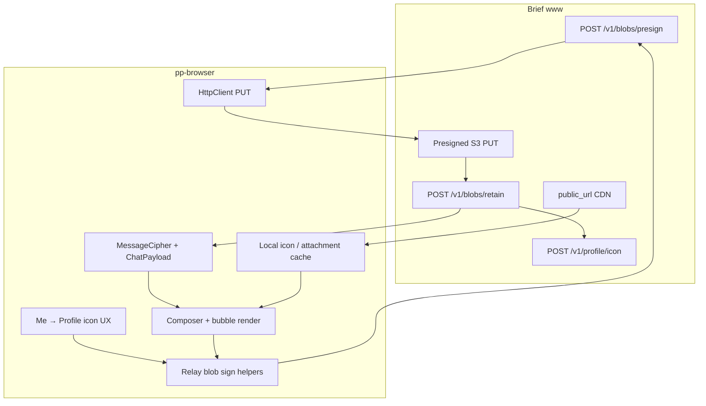

# Relay blob upload (profile icons + chat attachments)

**Status:** **i1 landed** — **i2** profile icon UX next  
**Owner:** Hongwei + agents  

**Server contract (www):** [`web2/www/Plans/2026-08-24-relay-blob-upload-design.md`](../../../web2/www/Plans/2026-08-24-relay-blob-upload-design.md)  
**Stable refs (client):** [SERVICE_ENDPOINTS.md](../../docs/contracts/SERVICE_ENDPOINTS.md), [WIRE_SCHEMAS.md](../../docs/contracts/WIRE_SCHEMAS.md), [MESSAGE_ENCRYPTION.md](../../docs/contracts/MESSAGE_ENCRYPTION.md), [DATA_LAYOUT.md](../../docs/contracts/DATA_LAYOUT.md), [COMPATIBILITY.md](../../docs/contracts/COMPATIBILITY.md)  
**Related:** [multi-device-account](../multi-device-account/) (M006 one relay per account), [e2e-message-crypto](../e2e-message-crypto/) (tier keys), [chat-storage-and-memory](../chat-storage-and-memory/) (D075 blobs layout), [at-rest-crypto](../at-rest-crypto/) (DEK-wrapped disk)

## One-line goal

Wire pp-browser to Brief **relay blob upload** for **public profile icons** first, then **E2E chat attachments** (any file type; image/video preview in v1). Relay is a **delivery aid** only — local storage is the source of truth after receive.

## Delivery order

| Track | Phases | Summary |
|-------|--------|---------|
| **Icons** | **i1 → i3** | Sign/PUT client, Me → Profile upload, directory + local cache + render |
| **Attachments** | **a1 → a5** | `attachment` content type, upload-before-send, eager local fetch, quota pop-older |

Shared foundation: **i1** blob HTTP client (presign / PUT / retain / delete / list / profile icon).

## Locked product shape

| Topic | Decision |
|-------|----------|
| Relay role | Best-effort delivery; **do not rely** on CDN/GC for long-term storage |
| Icons | **Plaintext** public images; client resize ≤ server cap |
| Chat files | **Client encrypt** file bytes; presign always **`application/octet-stream`** |
| Chat wire | One **`attachment`** content type; mime/filename/size/key in E2E `ChatPayload` |
| Group media | **Encrypt blob once**; pairwise envelopes carry key material only (call-style) |
| Multi-device private | Same as private text — no PSK → no decrypt on sibling device |
| Quota full | User **confirm → pop oldest on relay only**; **never delete local** |
| UI v1 | Inline **image**; **video** via OS player; other types saved + filename bubble |
| Icon refresh | User-triggered (reload / directory refresh); stamp `url`/`blob_id` for update detection |

## Documents

| File | Purpose |
|------|---------|
| [DESIGN.md](DESIGN.md) | Authoritative product + technical spec |
| [DECISIONS.md](DECISIONS.md) | ADRs R001–R018 |
| [PHASES.md](PHASES.md) | i1–i3 + a1–a5 delivery order |
| [CURRENT_STATE.md](CURRENT_STATE.md) | What ships today vs gaps |

## How pieces fit

